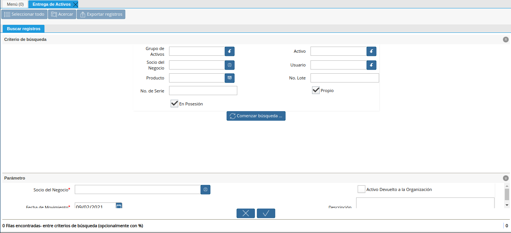
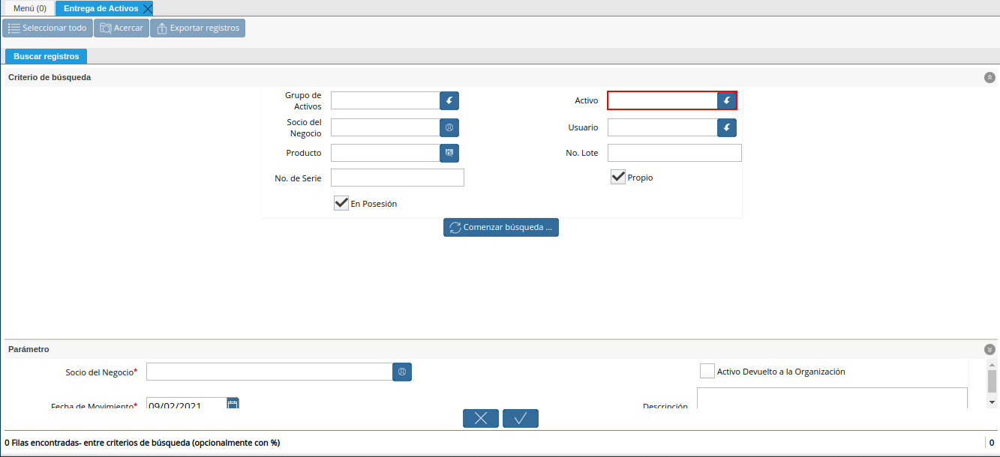
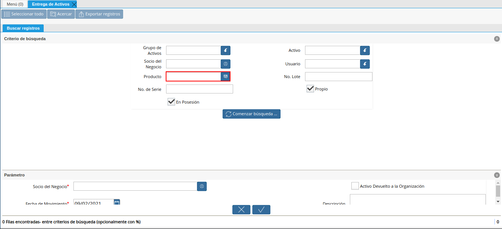
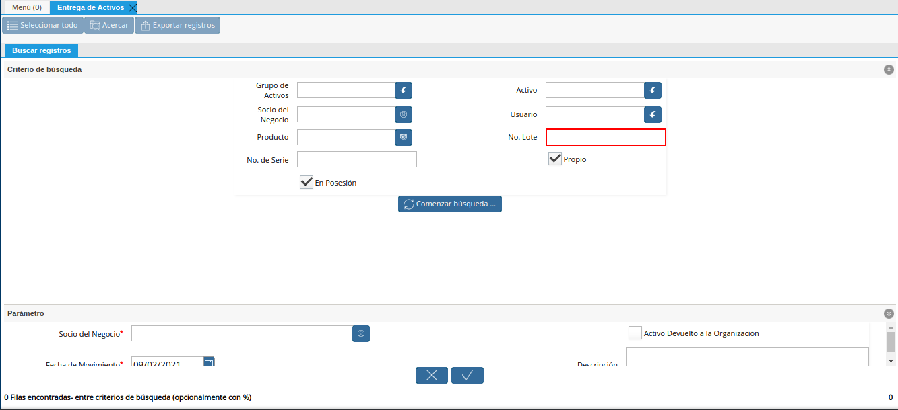
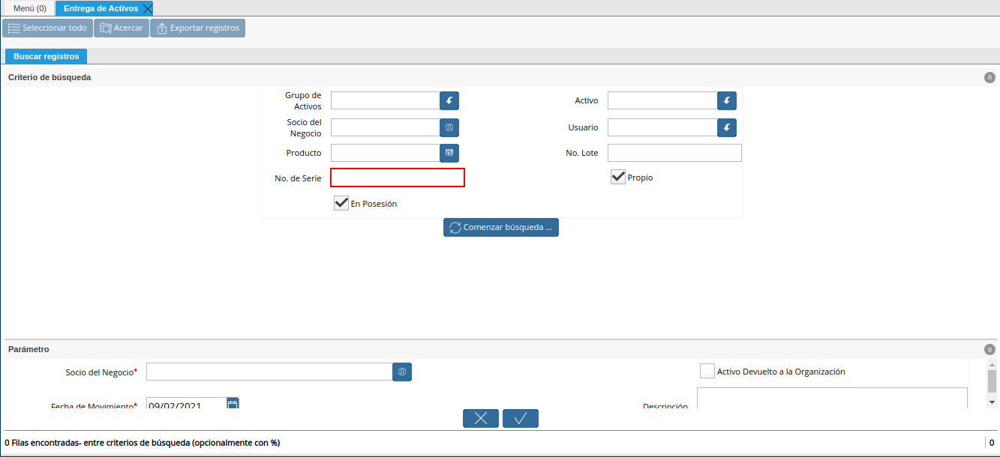
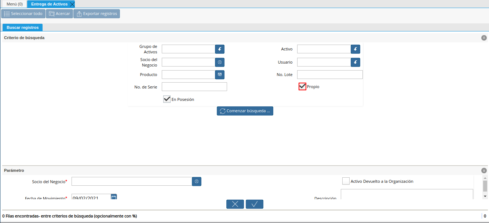
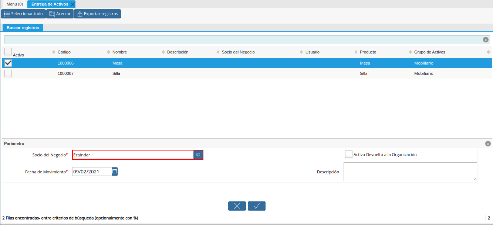
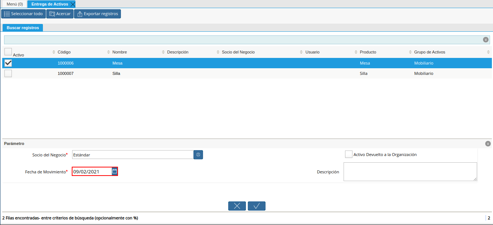
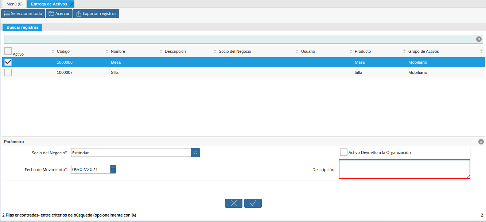

.. |menú entrega de activos| image:: resources/asset-delivery-menu.png

.. |campo grupo de activos de la ventana entrega de activos| image:: resources/asset-group-field-of-the-asset-delivery-window.png

.. |campo socio del negocio de la ventana entrega de activos| image:: resources/business-partner-field-of-the-asset-delivery-window.png

.. |check en posesión de la ventana entrega de activos| image:: resources/check-in-possession-of-the-asset-delivery-window.png

.. |resultados de la búsqueda de la ventana entrega de activos| image:: resources/asset-delivery-window-search-results.png
.. |selección del activo a entregar| image:: resources/selection-of-the-asset-to-be-delivered.png

.. |opción ok de la ventana entrega de activos| image:: resources/ok-option-of-the-asset-delivery-window.png

.. _documento/entrega-de-activos:

**Entrega de Activos**
======================

#. Ubique y seleccione en el menú de ADempiere, la carpeta "**Gestón de Activos**", luego seleccione la carpeta "**Transacciones de Activos Fijos**", por último seleccione la ventana de búsqueda inteligente (Smart Browser) "**Entrega de Activos**".

    |menú entrega de activos|

    Imagen 1. Menú de ADempiere

#. Podrá visualizar la ventana de búsqueda inteligente "**Entrega de Activos**", con diferentes campos que permiten filtrar la búsqueda en base a lo requerido por el usuario.

    |ventana entrega de activos|

    Imagen 2. Ventana Entrega de Activos

    #. Seleccione en el campo "**Grupo de Activos**", el grupo de activos por el cual requiere filtrar la información.

        |campo grupo de activos de la ventana entrega de activos|

        Imagen 3. Campo Grupo de Activos

    #. Seleccione en el campo "**Activo**", el activo por el cual requiere filtrar la información.

        |campo activo de la ventana entrega de activos|

        Imagen 4. Campo Activo

    #. Seleccione en el campo "**Socio del Negocio**", el socio del negocio por el cual requiere filtrar la información.

        |campo socio del negocio de la ventana entrega de activos|

        Imagen 5. Campo Socio del Negocio

    #. Seleccione en el campo "**Usuario**", el usuario por el cual requiere filtrar la información.

        |campo usuario de la ventana entrega de activos|

        Imagen 6. Campo Usuario

    #. Seleccione en el campo "**Producto**", el producto por el cual requiere filtrar la información.

        |campo producto de la ventana entrega de activos|

        Imagen 7. Campo Producto

    #. Ingrese en el campo "**No. Lote**", el número de lote por el cual requiere filtrar la información.

        |campo número de lote de la ventana entrega de activos|

        Imagen 8. Campo No Lote

    #. Ingrese en el campo "**No. de Serie**", el número de serie por el cual requiere filtrar la información.

        |campo número de serie de la ventana entrega de activos|

        Imagen 9. Campo No. de Serie

    #. El check "**Propio**", permite filtrar por los activos de la organización.

        |campo propio de la ventana entrega de activos|

        Imagen 10. Campo Propio

    #. El check "**En Posesión**", permite filtrar por los activos que se encuentran en posesión de la organización.

        |check en posesión de la ventana entrega de activos|

        Imagen 11. Check En Posesión

    #. Seleccione en el campo "**Comenzar Búsqueda**", para filtrar la información en base a lo seleccionado en los campos indicados anteriormente.

        |opción comenzar búsqueda de la ventana entrega de activos|

        Imagen 12. Opción Comenzar Búsqueda

    #. Podrá visualizar los resultados de la búsqueda de la siguiente manera.

        |resultados de la búsqueda de la ventana entrega de activos|

        Imagen 13. Resultados de la Búsqueda

    #. Seleccione el activo a entregar al socio del negocio.

        |selección del activo a entregar|

        Imagen 14. Selección del Activo

    #. Seleccione en el campo "**Socio del Negocio**", el socio del negocio al cual se le esta realizando la entrega del activo.

        |campo socio del negocio a entregar de la ventana entrega de activos|

        Imagen 15. Campo Socio del Negocio

    #. Seleccione en el campo "**Fecha del Movimiento** la fecha en la cual se encuentra realizando la entrega.

        |campo fecha del movimiento de la ventana entrega de activos|

        Imagen 16. Campo Entrega de Activo

    #. Ingrese en el campo "**Descripción**", una breve descripción de la entrega que se encuentra realizando.

        |campo descripción de la ventana entrega de activos|

        Imagen 17. Campo Descripción

    #. Seleccione la opción "**OK**", para ejecutar el proceso.

        |opción ok de la ventana entrega de activos|

        Imagen 18. Opción OK

.. _documento/devolución-de-activos:

**Devolución de Activos**
======================

#. Para devolver el activo a la organización debe realizar el mismo procedimiento explicado en el proceso :ref:`documento/entrega-de-activos`, destildando el check "**En Posesión**", para filtrar por los activos que no se encuentran en posesión de la organización.

    |destildar check en posesión de la ventana entrega de activos|

    Imagen 19. Check En Posesión

#. Adicional a ello, debe tildar el check "**Activo Devuelto a la Organización**".

    |check activo devuelto a la organización|

    Imagen 20. Check Activo Devuelto a la Organización

#. Finalmente puede proceder a culminar el proceso.