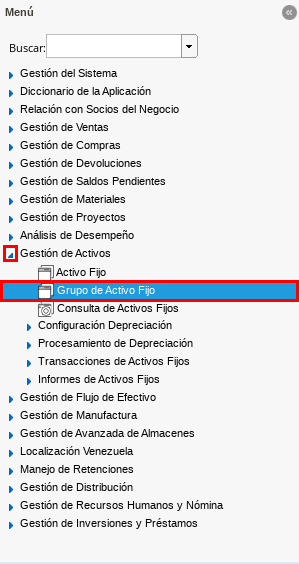
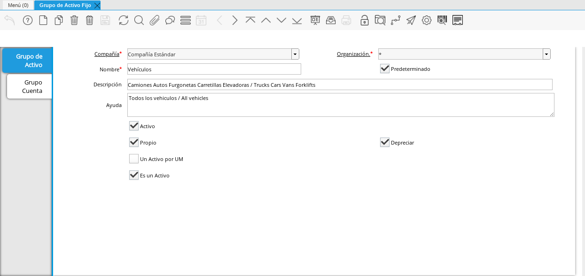
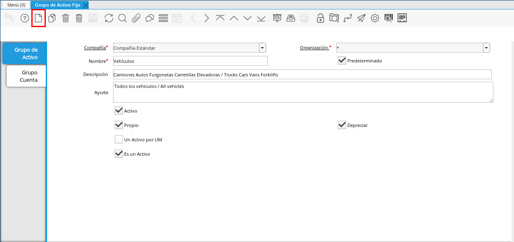
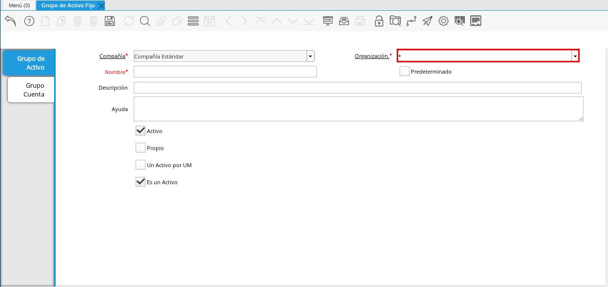
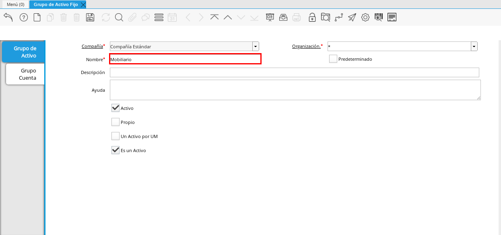
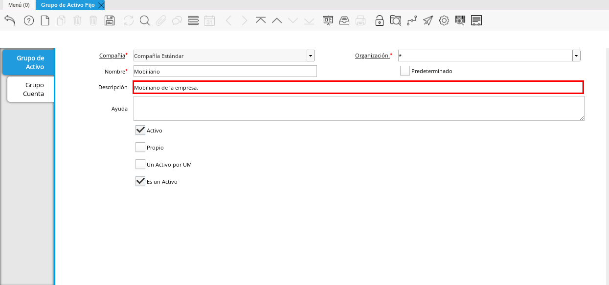
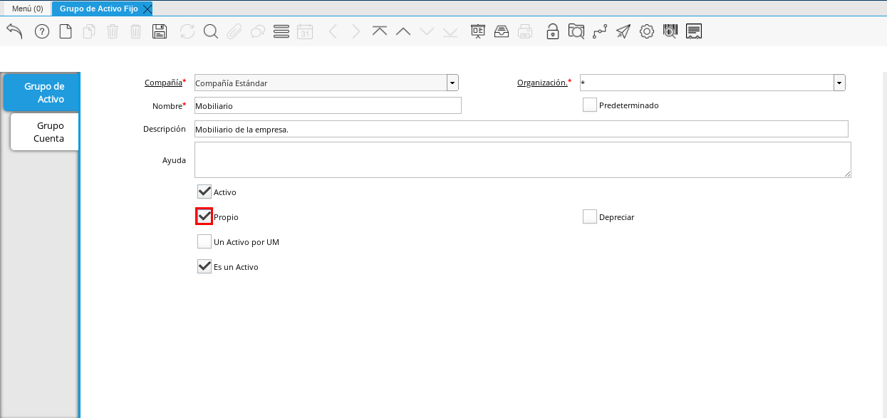
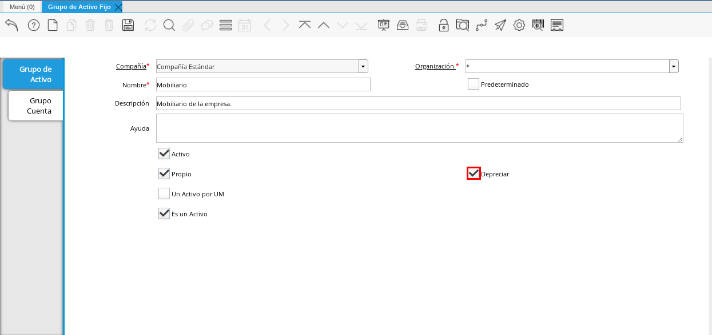
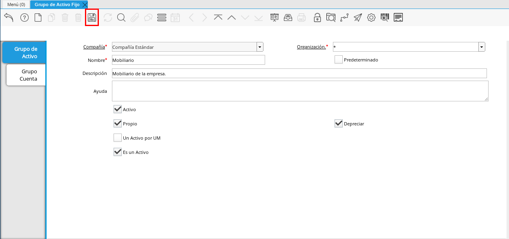
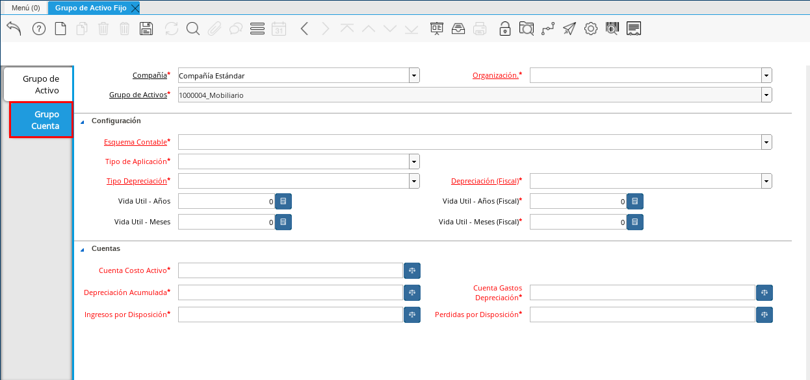
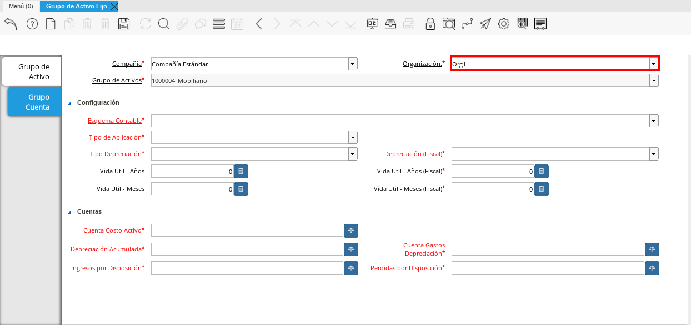
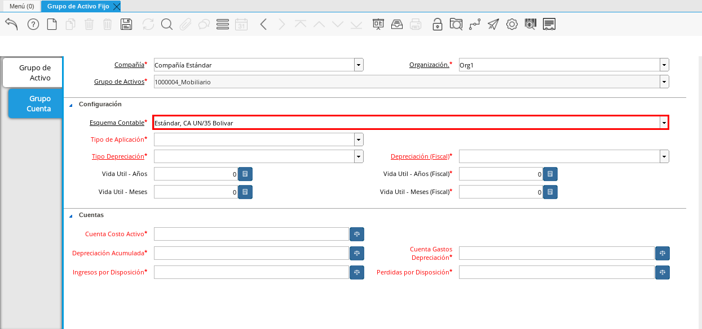

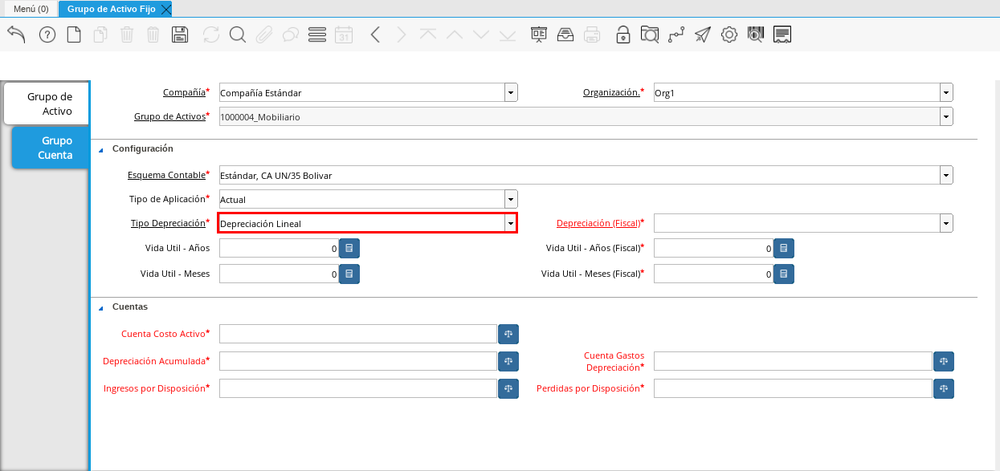
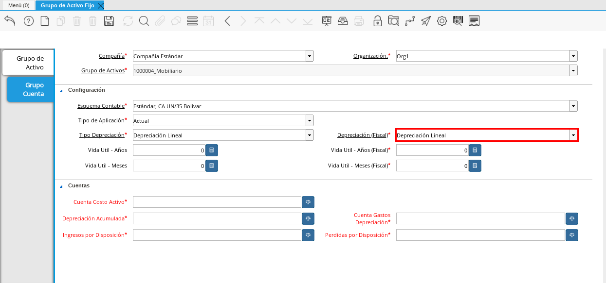
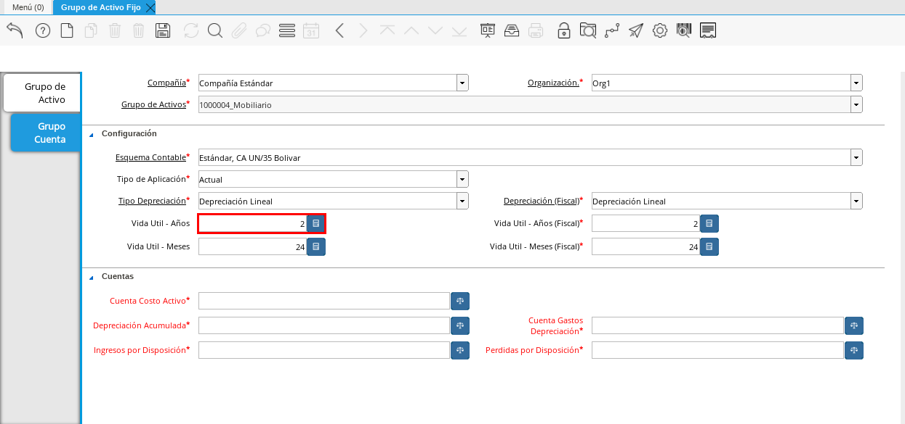
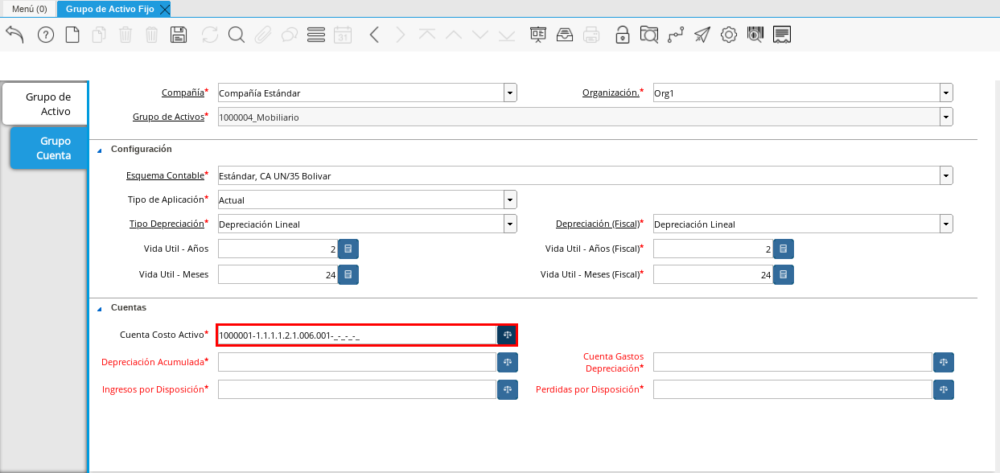

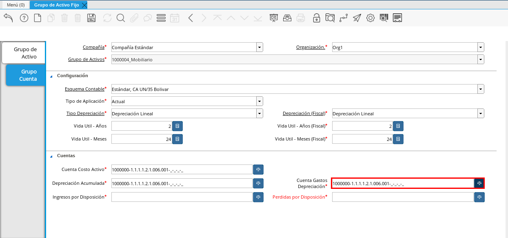
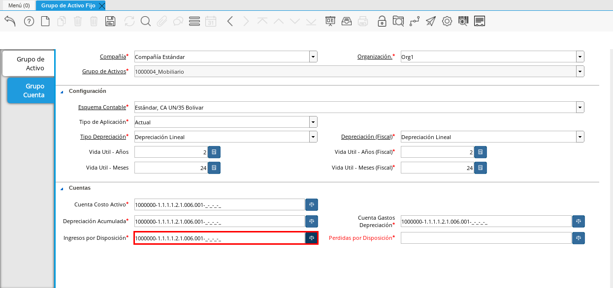
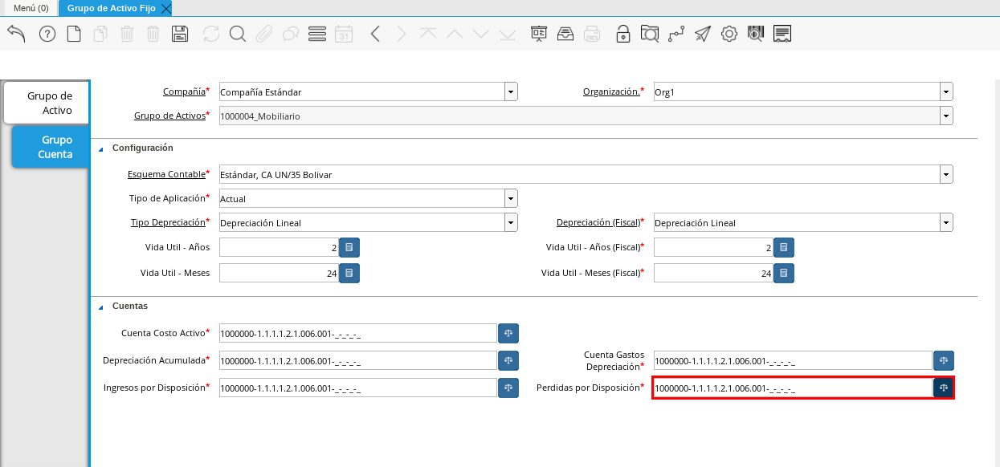

.. _documento/activo-fijo:

==========================
**Grupo de Activos Fijos**
==========================

El grupo de activo permite calificar a los productos como activos y definir su forma de contabilizar asociando el grupo a la categoria de productos, en este sentido podría tener varias categorias de productos asociadas a un grupo.
Esto implicaría de igual manera, que al crear un producto cuya categoría esté asociado a un grupo de activo, este evento generará una transacción de activo, en este caso una adición de activo, que a su vez genera un hecho contable en la cuenta contable correspondiente.

**Grupo de Activos Fijos**
---------------------------

Ubique y seleccione en el menú de ADempiere, la carpeta "**Gestión de Activos**", luego seleccione la ventana "**Grupo de Activo Fijo**". 

    |Menú de ADempiere|

    Imagen 1. Menú de ADempiere

Podrá visualizar la ventana "**Grupo de Activo**", con el registro de los grupos de activos que la empresa posee en ADempiere. 

    |Ventana Principal Grupo de Activo|

    Imagen 2. Ventana Principal Grupo de Activo

Seleccione el icono "**Registro Nuevo**", ubicado en la barra de herramientas de ADempiere.

    |Icono Registro Nuevo|

    Imagen 3. Icono Registro Nuevo

    Seleccione en el campo "**Organización**", la organización para la cual esta realizando el registro de grupo de activo fijo.

        |Campo Organización|

        Imagen 4. Campo Organización

    Introduzca en el campo "**Nombre**", el nombre correspondiente al grupo de activo fijo que esta registrando. Para ejemplificar el registro es utilizado el grupo de activo fijo "**Mobiliario**".

        |Campo Nombre|

        Imagen 5. Campo Nombre

    Introduzca en el campo "**Descripción**", una breve descripción referente al grupo de activo fijo que esta registrando.

        |Campo Descripción|

        Imagen 6. Campo Descripción

    Tilde el checklist "**Propio**", si el grupo de activo fijo que esta registrando pertenece a la organización seleccionada.

        |Checklist Propio|

        Imagen 7. Checklist Propio

    Tilde el checklist "**Depreciar**" para que ADempiere realice la depreciación del grupo de activos fijos que esta registrando.

        |Checklist Depreciar|

        Imagen 8. Checklist Depreciar

Para guardar el registro de los campos, seleccione el icono "**Guardar Cambios** "ubicado en la barra de herramientas de ADempiere.

    |Icono Guardar Cambios|

    Imagen 9. Icono Guardar Cambios

**Grupo Cuenta**
****************

Seleccione la pestaña "**Grupo Cuenta**" y proceda al llenado de los campos correspondientes.

    |Pestaña Grupo Cuenta|

    Imagen 10. Grupo Cuenta

Seleccione en el campo "**Organización**", la organización para la cual esta realizando la configuración contable del grupo de activo fijo.

    |Campo Organización de la Pestaña|

    Imagen 11. Campo Organización de la Pestaña

    .. note::

        ADempiere permite que una compañía que posee más de una organización, registre la configuración contable del grupo de activo fijo por organización. El registro podría ser:

            - Grupo Activo Fijo "**Mobiliario**" de la Empresa Estándar con Organización (*):

                - Configuaración contable del grupo "**Mobiliario**", con organización Estándar.

                - Configuración contable del grupo "**Mobiliario**", con organización Org1.

Seleccione en el campo "**Esquema Contable**", el esquema a utilizar para la configuración contable del grupo activo.

    |Campo Esquema Contable|

    Imagen 12. Esquema Contable

Seleccione en el campo "**Tipo de Aplicación**", generalmente actual, ver el documento "**Tipo de Aplicación**", para tener una visión más clara.

    |Campo Tipo de Aplicación|

    Imagen 13. Campo Tipo de Aplicación

Seleccione en el campo "**Tipo de Depreciación**" Línea recta, este tipo de depreciación supone una cuota constante e invariable en función de la vida útil del activo objeto de depreciación., 

    |Campo Tipo de Depreciación|

    Imagen 14. Campo Tipo de Depreciación

Seleccione en el campo "**Depreciación (Fiscal)**" Línea recta, este tipo de depreciación supone una cuota constante e invariable en función de la vida útil del activo objeto de depreciación. 

    |Campo Depreciación (Fiscal)|

    Imagen 15. Campo Depreciación (Fiscal)

Introduzca en el campo "**Vida Útil - Años**", la cantidad de años de vida útil del grupo de activos fijos que esta registrando.

    |Campo Vida Útil - Años|

    Imagen 16. Campo Vida Útil - Años

    .. note::

        Al ingresar un valor en el campo "**Vida Útil - Años**", ADempiere refleja en los campos "**Vida Útil - Años (Fiscal)**", "**Vida Útil - Meses**" y "**Vida Útil - Meses (Fiscal)**", el equivalente al campo correspondiente.

Seleccione en el campo "**Cuenta Costo Activo**", se refiere a la cuenta de activo del plan de cuentas en la que desea reflejar el costo del activo fijo.

    |Campo Cuenta Costo Activo|

    Imagen 17. Campo Cuenta Costo Activo

Seleccione en el campo "**Depreciación Acumulada**", se refiere a la cuenta compensatoria que reduce o disminuye la cuenta activos fijos.

    |Campo Depreciación Acumulada|

    Imagen 18. Campo Depreciación Acumulada
    
Seleccione en el campo "**Cuenta Gastos Depreciación**", se refiere a una cuenta de gasto por concepto de desgaste resultante del uso o el deterioro físico del activo fijo.

    |Campo Cuenta Gastos Depreciación|

    Imagen 19. Campo Cuenta Gastos Depreciación

Seleccione en el campo "**Ingresos por Disposición**", se refiere a la cuenta de ingreso por concepto de disposición del activo o venta del mismo.

    |Campo Ingresos por Disposición|
    
    Imagen 20. Campo Ingresos por Disposición

Seleccione en el campo "**Perdidas por Disposición**", se refiere a la cuenta de gasto o perdida por concepto de disposición del activo o dar de baja.

    |Campo Perdidas por Disposición|

    Imagen 21. Campo Perdidas por Disposición
    
**Categoría de Producto**
*************************

Ubique o cree de manera regular la categoría de producto a la que desea asociar el grupo de activo fijo, de esta manera podrá con los productos bajo esta categoría realizar operaciones de activo fijo, y seleccione en el campo "**Grupo de Activo Fijos**", el grupo de activo previamente configurado.

.. note::

        Al ingresar un valor en el campo "**Grupo de Activo Fijos**", ADempiere generará un activo fijo al crear una recepción de un producto asociado a esta categoría.

**Producto**
************

Ubique o cree de manera regular el producto al que desea asociar la categoría previamente configurado. 
