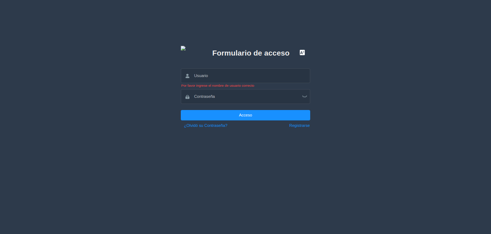
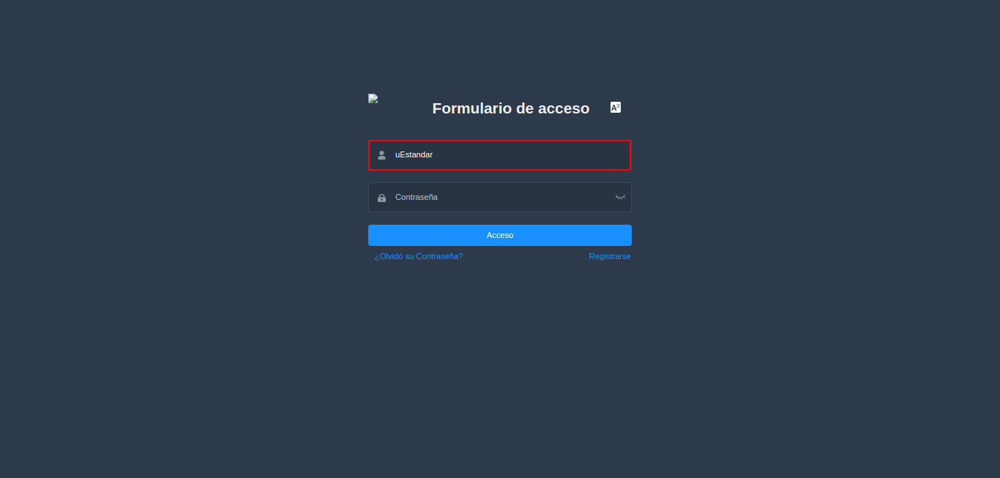
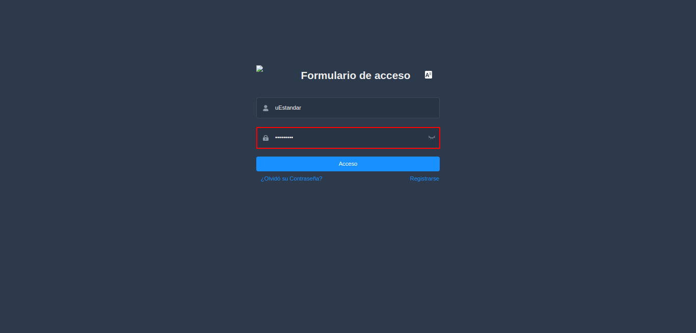
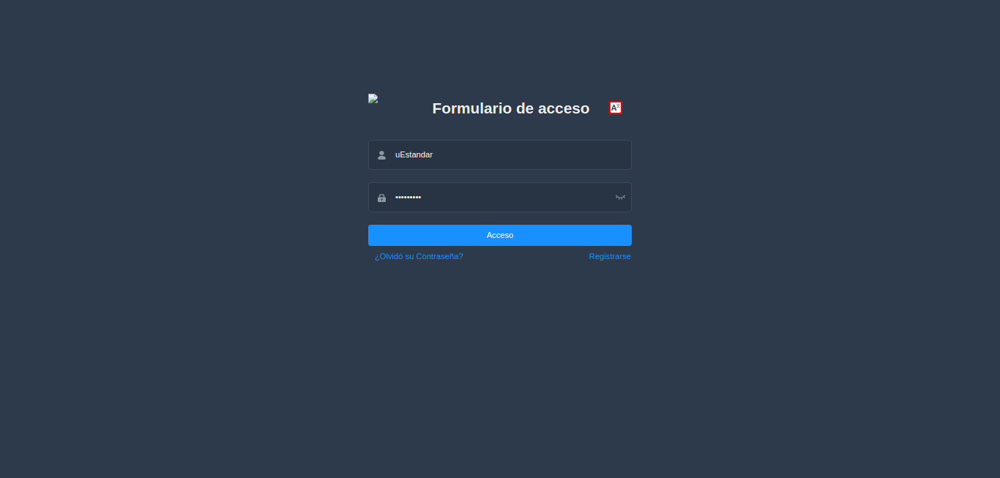
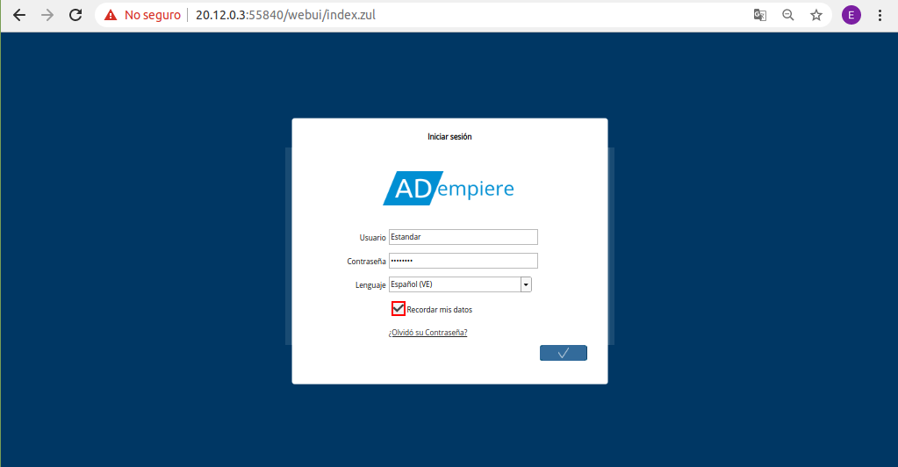
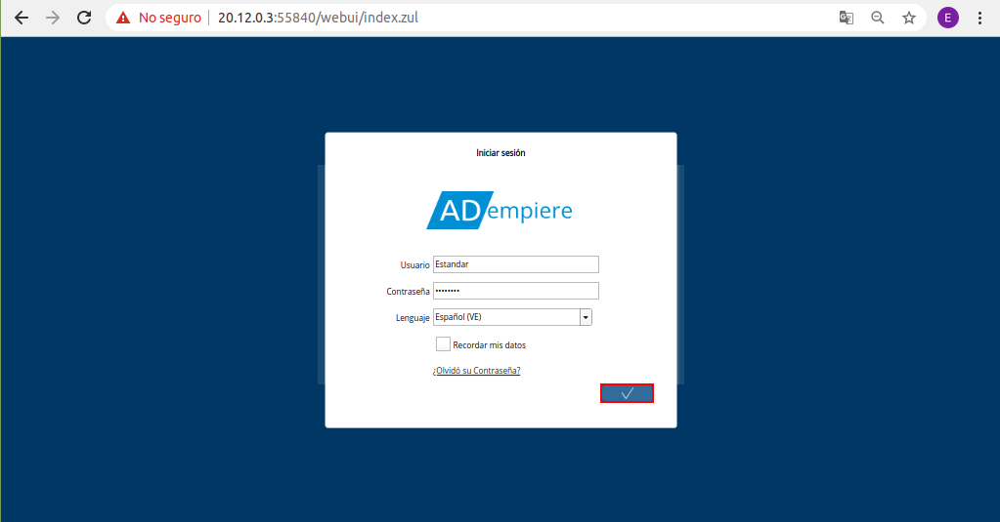
.. |Ventana Login o Iniciar Sesión en ADempiere con Rol del Usuario| image:: resources/login-window-or-login-in-adempiere-with-user-role.png
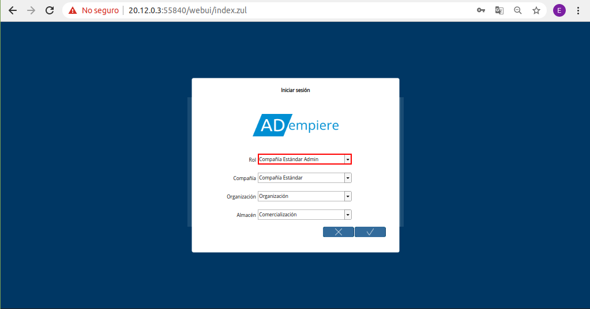
.. |Campo Compañía| image:: resources/company-field.png
.. |Campo Organización| image:: resources/organization-field.png
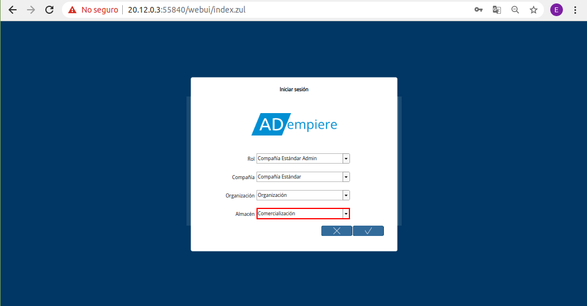
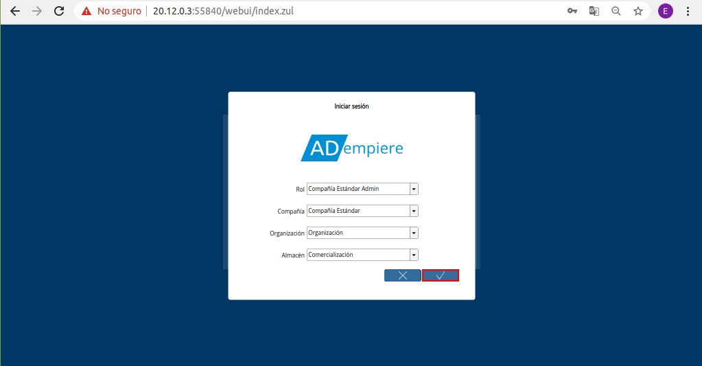
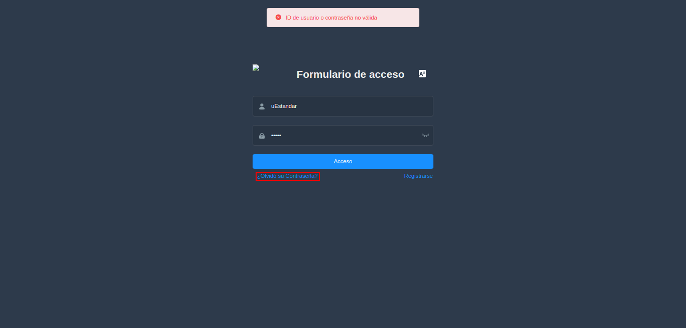
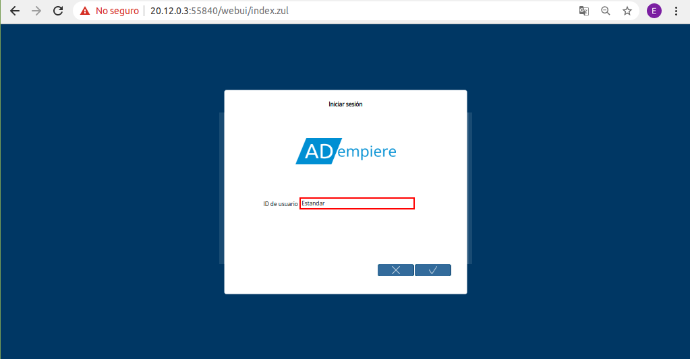
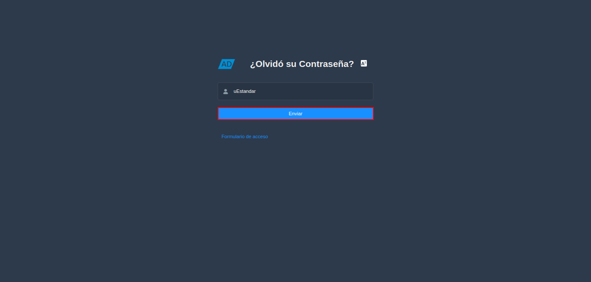
.. |Correo Recibido de ADempiere| image:: resources/mail-received-from-adempiere.png
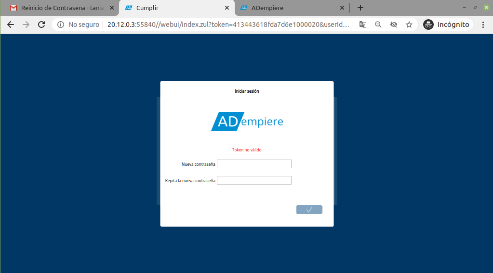
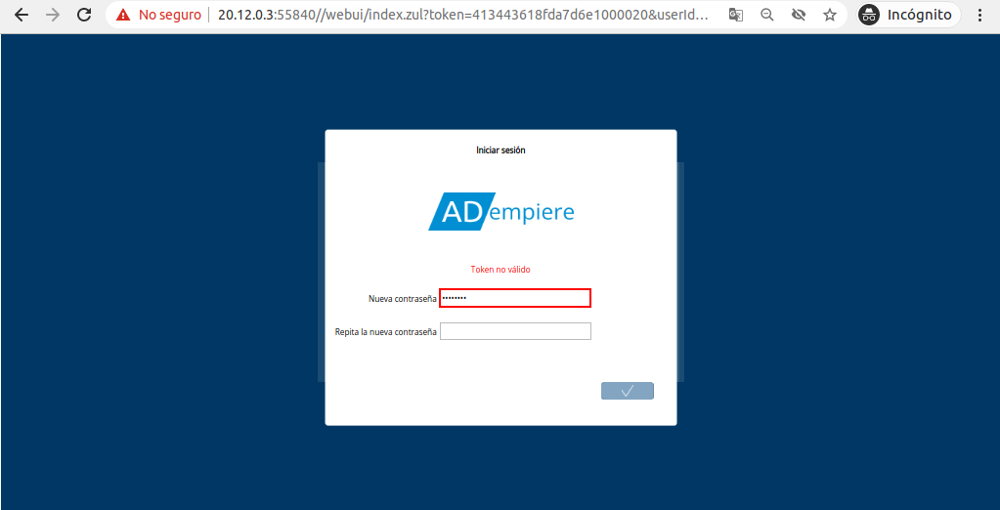
.. |Campo Repita la Nueva Contraseña| image:: resources/field-repeat-new-password.png
.. |Opción Ok para Guardar la Contraseña| image:: resources/ok-option-to-save-password.png

.. _documento/inicio-de-sesión-en-adempiere:

**Inicio de Sesión**
====================

En ADempiere el login es el proceso que permite el acceso de forma segura utilizando la identificación de un usuario único y su contraseña, a continuación se explicará el procedimiento.

Para acceder o iniciar sesión en ADempiere, el usuario requiere lo siguiente:

- Servicio de ADempiere (URL del Servicio)

- Credenciales de acceso (Facilitadas por un consultor de ERPyA)

    - Usuario: Estandar

    - Clave: Estandar

- Rol asignado al usuario creado por ERPyA

Al ingresar a la url del servicio de ADempiere facilitada por un consultor de ERPyA, podrá visualizar la ventana "**Login**" o "**Iniciar Sesión**", la cual cuenta con los campos necesarios para iniciar sesión en el idioma que el usuario lo requiera.

    |Ventana Login o Iniciar Sesión en ADempiere con Credenciales de Acceso|

    Imagen 1. Ventana Login o Iniciar Sesión en ADempiere

Introduzca en el campo "**Usuario**", el usuario previamente facilitado por el consultor de ERPyA.

    |Campo Usuario|

    Imagen 2. Usuario

Introduzca en el campo "**Contraseña**", la contraseña del usuario previamente facilitada por el consultor de ERPyA.

    |Campo Contraseña del Usuario|

    Imagen 3. Campo Contraseña del Usuario

Seleccione en el campo "**Lenguaje**", el idioma con el cual requiere ingresar al servicio de ADempiere.

    |Campo Lenguaje para Acceso|

    Imagen 4. Campo Lenguaje para Acceso

De igual manera, la ventana cuenta con el checklist "**Recordar mis datos**", que al tildar el mismo serán recordadas las credenciales de acceso del usuario.

    |Checklist Recuérdame|

    Imagen 5. Checklist Recordar mis datos

Seleccione la opción "**OK**", para cargar las credenciales de acceso y proceder a detallar el rol, la organización, compañía y almacén para ingresar a ADempiere.

    |Opción OK para Iniciar Sesión|

    Imagen 6. Opción OK para Cargar las Credenciales

Podrá visualizar la ventana "**Login**" o "**Iniciar Sesión**", con los campos competentes al rol del usuario.

    |Ventana Login o Iniciar Sesión en ADempiere con Rol del Usuario|

    Imagen 7. Ventana Login o Iniciar Sesión en ADempiere con Rol del Usuario

Seleccione en el campo "**Rol**", el rol que cumple el usuario dentro de la organización.

    |Campo Rol del Usuario|

    Imagen 8. Campo Rol del Usuario

Seleccione en el campo "**Compañía**", la compañía para la cual trabaja el usuario.

    |Campo Compañía|

    Imagen 9. Campo Compañía

Seleccione en el campo "**Organización**", la organización para la cual trabaja el usuario.

    |Campo Organización|

    Imagen 10. Campo Organización

Seleccione en el campo "**Almacén**", el almacén para el requiere acceder el usuario. 

    |Campo Almacén|

    Imagen 11. Campo Almacén

Por último, para iniciar sesión en el servicio de ADempiere, debe seleccionar la opción "**OK**".

    |Opción OK|

    Imagen 12. Opción OK para acceder a ADempiere

**Recuperar Contraseña**
------------------------

Si el usuario no recuerda la contraseña para iniciar sesión puede recuperarla seleccionando la interrogante **¿Se te olvidó tu contraseña?**.

    |Interrogante se te olvidó tu contraseña|

    Imagen 13. Interrogante ¿Se te Olvidó tu Contraseña?

Podrá visualizar la ventana "**Login**" o "**Iniciar Sesión**", con el campo "**ID de usuario**", donde debe ingresar el usuario de acceso al servicio de ADempiere.

    |Ventana Login o Iniciar Sesión en ADempiere para Recuperar Contraseña|

    Imagen 14. Ventana Login o Iniciar Sesión en ADempiere para Recuperar Contraseña

Seleccione la opción "**OK**", para que ADempiere envie por correo electrónico, la verificación de usuario y la URL para cambiar la contraseña.

    |Opción OK para Recuperar Contraseña|

    Imagen 15. Opción OK para Recuperar Contraseña

Ubique el nuevo mensaje recibido en su correo electrónico y seleccione la opción "**Verify Token**".

    |Correo Recibido de ADempiere|

    Imagen 16. Correo Recibido de ADempiere

Automáticamente se cargará una pestaña en el navegador, con la url indicada en el correo recibido. En dicha pestaña podrá visualizar la ventana "**Login**" o "**Iniciar Sesión**" con los campos necesarios para crear una nueva contraseña.

    |Pestaña Cargada Automáticamente|

    Imagen 17. Pestaña Cargada Automáticamente

Introduzca en el campo "**Nueva Contraseña**", la contraseña para iniciar sesión en ADempiere.

    |Campo Nueva Contraseña|

    Imagen 18. Campo Nueva Contraseña

Introduzca en el campo "**Repita la Nueva Contraseña**", la contraseña ingresada en el campo "**Nueva Contraseña**", para iniciar sesión en ADempiere.

    |Campo Repita la Nueva Contraseña|

    Imagen 19. Campo Repita la Nueva Contraseña

Seleccione la opción "**OK**", para guardar la nueva contraseña ingresada.

    |Opción Ok para Guardar la Contraseña|

    Imagen 20. Opción Ok para Guardar la Contraseña