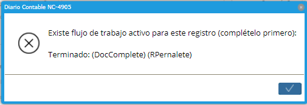
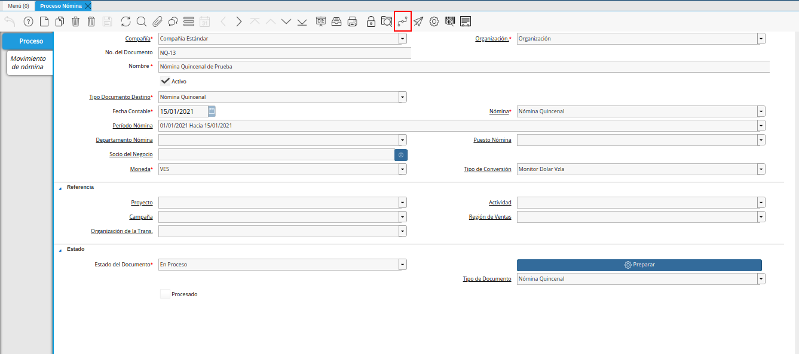
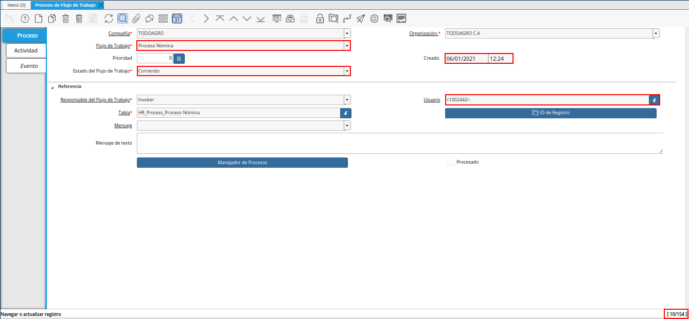
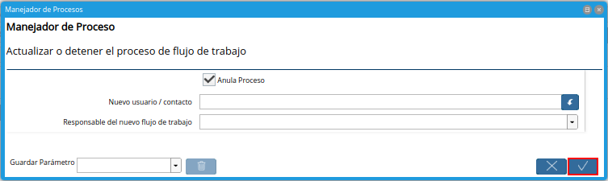
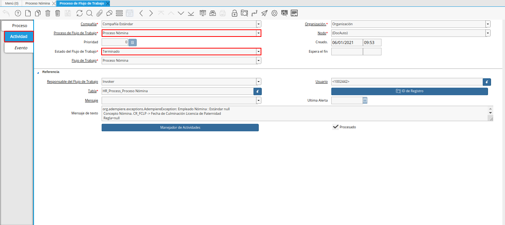
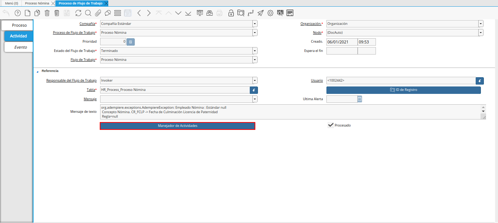
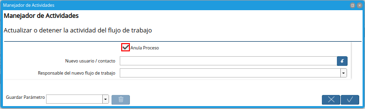
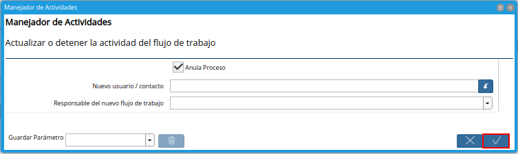

.. |Buscar| image:: resources/look-for.png
.. |Calculadora| image:: resources/calculator.png
.. |Reiniciar Cache| image:: resources/reset-cache.png
.. |Reiniciar Contraseña| image:: resources/reset-password.png

.. |opción manejador de procesos| image:: resources/process-handler-option.png
.. |ventana manejador de procesos| image:: resources/process-manager-window.png
.. |check anular proceso| image:: resources/check-abort-process.png

.. |ventana manejador de actividades| image:: resources/activity-manager-window.png

.. _documento/utilería-de-adempiere:

**Utilería**
============

En ADempiere la utilería no es más que un conjunto de instrumentos o herramientas que tienen algún tipo de utilidad, es decir, que sirven para un fin en específico, a continuación se definen cada uno de ellos.

**Buscar:** Le permitirá realizar una búsqueda de un documento en específico.

    |Buscar|

    Imagen 1. Buscar

**Calculadora:** En ADempiere contamos con una herramienta básica que le permitirá realizar una operación matemática dentro de un campo.

    |Calculadora|

    Imagen 2. Calculadora

**Reinicia Cache:** Permitirá cerrar todas las ventanas,	para reiniciar cache ingrese reinicia caché en el buscador rápido del menú explicado anteriormente y reinicie.

    |Reiniciar Cache|

    Imagen 3. Reiniciar Cache

**Reinicia Contraseña:** Permitirá cambiar la contraseña del usuario, para reiniciar contraseña ingrese reinicia contraseña en el buscador rápido del menú explicado anteriormente y reinicie.

    |Reiniciar Contraseña|

    Imagen 4. Reiniciar Contraseña

**Flujo de Trabajo Activo:** Cuando se genera el siguiente mensaje como consecuencia de un flujo de trabajo activo en ADempiere.

    |Flujo de Trabajo Activo|

    Imagen 5. Flujo de Trabajo Activo

    Es necesario anular dicho flujo de trabajo. Para ello se debe realizar el siguiente procedimiento.

    Seleccione el icono "**Flujos de Trabajos Activos**", ubicado en la barra de herramientas de la ventana en la cual fue presentado el mensaje de flujo de trabajo activo.

        |icono flujo de trabajo activo|

        Imagen 6. Icono Flujo de Trabajo Activo

        .. note::

            En ADempiere, el flujo de trabajo activo es aquel que en el campo "**Estado de Flujo de Trabajo**", de la ventana "**Proceso de Flujo de Trabajo**", se encuentra la opción "**Corriendo**".

    Podrá visualizar la ventana "**Proceso de Flujo de Trabajo**", con el registro del flujo de trabajo activo.

        |ubicar registro a anular|

        Imagen 7. Flujo de Trabajo a anular

    Luego de haber ubicado el flujo de trabajo activo, debe seleccionar la opción "**Manejador de Procesos**".

        |opción manejador de procesos|

        Imagen 8. Opción Manejador de Procesos

    Podrá visualizar la ventana "**Manejador de Procesos**", que se utiliza para actualizar o detener el proceso de flujo de trabajo.

        |ventana manejador de procesos|

        Imagen 9. Ventana Manejador de Procesos

    Seleccione el check "**Anular Proceso**", para anular el flujo de trabajo.

        |check anular proceso|

        Imagen 10. Check Anular Proceso

    Finalmente, seleccione la opción "**OK**", para ejecutar la acción requerida de acuerdo a lo indicado en la ventana "**Manejador de Procesos**".

        |opción ok|

        Imagen 11. Opción OK

En el caso de que continue el mismo mensaje de flujo de trabajo activo, ubique nuevamente el registro de flujo de trabajo, con la ayuda del icono "**Flujos de Trabajos Activos**", desde la ventana en la cual fue presentado dicho mensaje. Posteriormente podrá visualizar la ventana "**Proceso de Flujo de Trabajo**", con el registro del flujo de trabajo activo.

    |ubicar registro a anular|

    Imagen 12. Flujo de Trabajo a anular

    Seleccione la pestaña "**Actividad**", para visualizar el registro que se encuentra en estado "**Terminado**".

        |flujo de trabajo terminado|

        Imagen 13. Flujo de Trabajo 

    Luego seleccione la opción "**Manejador de Actividades**".

        |opción manejador de actividades|

        Imagen 14. Opción Manejador de Actividades

    Podrá visualizar la ventana "**Manejador de Actividades**", que se utiliza para actualizar o detener la actividad del flujo de trabajo.

        |ventana manejador de actividades|

        Imagen 15. Ventana Manejador de Actividades

    Seleccione el check "**Anular Proceso**", para anular el flujo de trabajo.

        |check anular proceso de actividades|

        Imagen 16. Check Anular Proceso

    Finalmente, seleccione la opción "**OK**", para ejecutar la acción requerida de acuerdo a lo indicado en la ventana "**Manejador de Actividades**".

        |opción ok de actividades|

        Imagen 16. Opción OK