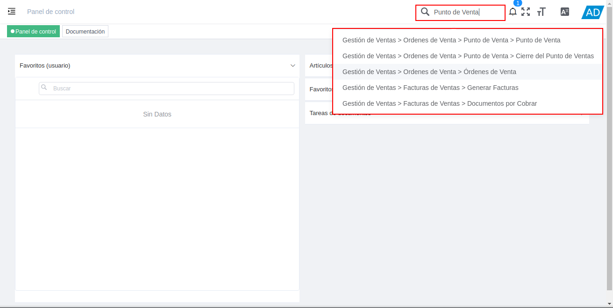
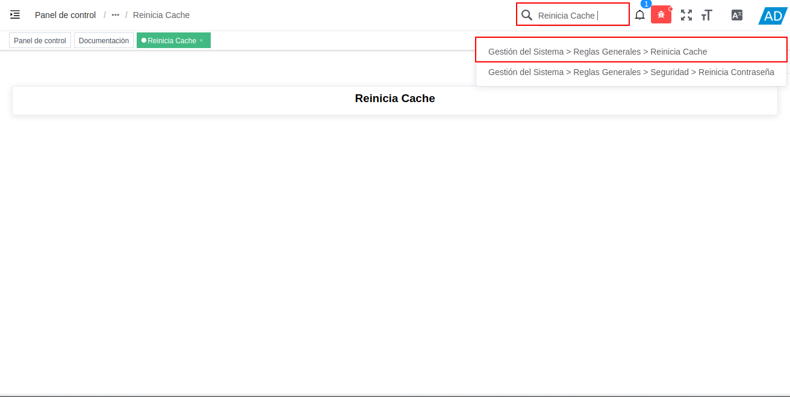

.. |Calculadora| image:: resources/calculator.png

.. |Reiniciar Contraseña| image:: resources/reset-password.png

.. _documento/utilería-de-adempiere:

**Utilería**
============

En ADempiere la utilería no es más que un conjunto de instrumentos o herramientas que tienen algún tipo de utilidad, es decir, que sirven para un fin en específico, a continuación se definen cada uno de ellos.

#. **Buscar:** Le permitirá realizar una búsqueda de un documento en específico.

    |Buscar|

    Imagen 1. Buscar

#. **Calculadora:** En ADempiere contamos con una herramienta básica que le permitirá realizar una operación matemática dentro de un campo.

    |Calculadora|

    Imagen 3. Calculadora

#. **Reinicia Cache:** Permitirá cerrar todas las ventanas,	para reiniciar cache ingrese reinicia caché en el buscador rápido del menú explicado anteriormente y reinicie.

    |Reiniciar Cache|

    Imagen 4. Reiniciar Cache

#. **Reinicia Contraseña:** Permitirá cambiar la contraseña del usuario, para reiniciar contraseña ingrese reinicia contraseña en el buscador rápido del menú explicado anteriormente y reinicie.

    |Reiniciar Contraseña|

    Imagen 5. Reiniciar Contraseña