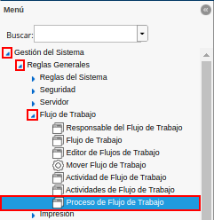
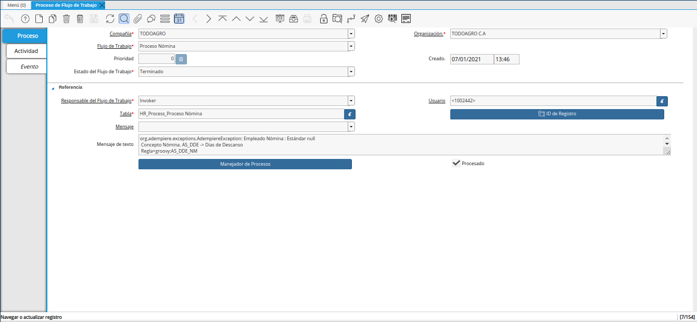

.. |Buscar| image:: resources/look-for.png
.. |Calculadora| image:: resources/calculator.png
.. |Reiniciar Cache| image:: resources/reset-cache.png
.. |Reiniciar Contraseña| image:: resources/reset-password.png
.. |Flujo de Trabajo Activo| image:: resources/active-workflows.png

.. |ubicar registro a anular| image:: resources/locate-record-to-be-canceled.png
.. |opción manejador de procesos| image:: resources/process-handler-option.png
.. |ventana manejador de procesos| image:: resources/process-manager-window.png
.. |check anular proceso| image:: resources/check-abort-process.png
.. |opción ok| image:: resources/ok-option-to-cancel-active-workflow.png

.. _documento/utilería-de-adempiere:

**Utilería**
============

En ADempiere la utilería no es más que un conjunto de instrumentos o herramientas que tienen algún tipo de utilidad, es decir, que sirven para un fin en específico, a continuación se definen cada uno de ellos.

#. **Buscar:** Le permitirá realizar una búsqueda de un documento en específico.

    |Buscar|

    Imagen 1. Buscar

#. **Calculadora:** En ADempiere contamos con una herramienta básica que le permitirá realizar una operación matemática dentro de un campo.

    |Calculadora|

    Imagen 3. Calculadora

#. **Reinicia Cache:** Permitirá cerrar todas las ventanas,	para reiniciar cache ingrese reinicia caché en el buscador rápido del menú explicado anteriormente y reinicie.

    |Reiniciar Cache|

    Imagen 4. Reiniciar Cache

#. **Reinicia Contraseña:** Permitirá cambiar la contraseña del usuario, para reiniciar contraseña ingrese reinicia contraseña en el buscador rápido del menú explicado anteriormente y reinicie.

    |Reiniciar Contraseña|

    Imagen 5. Reiniciar Contraseña

#. **Flujo de Trabajo Activo:** En ADempiere, el flujo de trabajo activo es aquel que en el campo "**Estado de Flujo de Trabajo**", de la ventana "**Proceso de Flujo de Trabajo**", se encuentra la opción "**Corriendo**".

    |Flujo de Trabajo Activo|

    Imagen 6. Flujo de Trabajo Activo

    Para anular un flujo de trabajo activo se debe realizar el siguiente procedimiento.

    #. Ubique en el menú de ADempiere la carpeta "**Gestión del Sistema**", luego seleccione la carpeta "**Reglas Generales**", por último seleccione la carpeta "**Flujo de Trabajo**" y finalmente seleccione la ventana "**Proceso de Flujo de Trabajo**".

        |menú de flujo de trabajo|

        Imagen 7. Menú de ADempiere

    #. Podrá visualizar la ventana "**Proceso de Flujo de Trabajo**", con los diferentes registros de flujos de trabajo que se encuentran en estado "**Anulado**", "**Completo**", "**Corriendo**", "**No Iniciado**", "**Suspendido**" y "**Terminado**".

        |ventana proceso de flujo de trabajo|

        Imagen 8. Ventana Proceso de Flujo de Trabajo

    #. Para anular un flujo de trabajo activo, debe ubicar el registro del mismo. Dicho registro debe decir "**Corriendo**", en el campo "**Estado de Flujo de Trabajo**".

        |ubicar registro a anular|

        Imagen 9. Flujo de Trabajo a anular

    #. Luego de haber ubicado el flujo de trabajo activo, debe seleccionar la opción "**Manejador de Procesos**".

        |opción manejador de procesos|

        Imagen 10. Opción Manejador de Procesos

        #. Podrá visualizar la ventana "**Manejador de Procesos**", que se utiliza para actualizar o detener el proceso de flujo de trabajo.

            |ventana manejador de procesos|

            Imagen 11. Ventana Manejador de Procesos

        #. Seleccione el check "**Anular Proceso**", para anular el flujo de trabajo.

            |check anular proceso|

            Imagen 12. Check Anular Proceso

        #. Finalmente, seleccione la opción "**OK**", para ejecutar la acción requerida de acuerdo a lo indicado en la ventana "**Manejador de Procesos**".

            |opción ok|

            Imagen 13. Opción OK