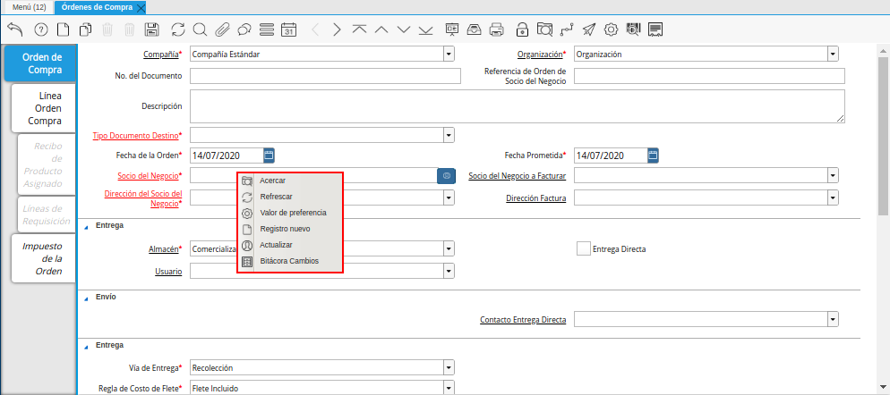
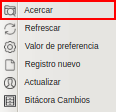
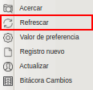
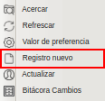
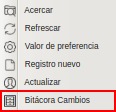

.. |Valor de Preferencia| image:: resources/preference-value.png

.. |Actualizar| image:: resources/upgrade-option.png

.. _documento/accesos-rápidos:

**Accesos Rápidos**
===================

En ADempiere contamos con una serie de accesos rápidos que le permitirá al usuario realizar una determinada función de forma rápida y sencilla.
   
   |Accesos Rápidos|

   Imagen 1. Accesos Rápidos de ADempiere

A continuación se definen los distintos tipos de accesos rápidos que este posee.

**Acercar:** Le permitirá realizar una búsqueda rápida de un registro.

   |Acercar|

   Imagen 2. Opción Acercar

**Refrescar:** Le permitirá actualizar el campo donde se encuentra ubicado.

    |Refrescar|

    Imagen 3. Opción Refrescar

**Valor de Preferencia:** Permitirá darle un valor preferencial al campo.

   |Valor de Preferencia|

   Imagen 4. Opción Valor de Preferencia

**Registro Nuevo:** Permitirá realizar un registro nuevo referente al campo donde se encuentra ubicado.

    |Registro Nuevo|

    Imagen 5. Opción Registro Nuevo

**Actualizar:** Permitirá realizar modificaciones al registro del campo donde se encuentra ubicado.

   |Actualizar|

   Imagen 6. Opción Actualizar

**Bitácora Cambios:** Permitirá visualizar los cambios que se le ha realizado al campo donde se encuentra ubicad.
      
    |Bitácora Cambios|

    Imagen 7. Opción Bitácora de Cambios

**Accesos Rápidos del Teclado:** Le permitirá realizar diferentes operaciones desde accesos rápido en las siguientes teclas.

    +-----------------+---------------------------------------------------------------------------------------------+
    |    **Tecla**    |                                      **Función**                                            |
    +=================+=============================================================================================+
    |    **F1**       |Le permitirá acceder a la ayuda en la ventana donde se encuentra ubicado.                    |
    +-----------------+---------------------------------------------------------------------------------------------+
    |    **F2**       |Le permitirá crear un registro nuevo.                                                        |
    +-----------------+---------------------------------------------------------------------------------------------+
    |    **F3**       |Le permitirá eliminar el registro actual donde se encuentre ubicado.                         |
    +-----------------+---------------------------------------------------------------------------------------------+
    |    **F4**       |Le permitirá guardar un registro.                                                            |
    +-----------------+---------------------------------------------------------------------------------------------+
    |    **F5**       |Le permitirá actualizar el registro actual donde se encuentre ubicado.                       |
    +-----------------+---------------------------------------------------------------------------------------------+
    |    **F6**       |Le permitirá buscar un registro.                                                             |
    +-----------------+---------------------------------------------------------------------------------------------+
    |    **F7**       |Le permitirá adjuntar un documento o imagen en el registro actual donde se encuentre ubicado.|
    +-----------------+---------------------------------------------------------------------------------------------+
    |    **F8**       |Le permitirá cambiar el tipo de vista de mono vista a multivista.                            |
    +-----------------+---------------------------------------------------------------------------------------------+
    |    **F9**       |Le permitirá ver los registros históricos.                                                   |
    +-----------------+---------------------------------------------------------------------------------------------+
    |    **F10**      |Le permitirá ir de forma rápida al archivo (Swing)                                           |
    +-----------------+---------------------------------------------------------------------------------------------+
    |    **F11**      |Le permitirá visualizar el reporte del documento actual donde se encuentre ubicado.          |
    +-----------------+---------------------------------------------------------------------------------------------+
    |    **F12**      |Le permitirá imprimir el documento actual donde se encuentre ubicado.                        |
    +-----------------+---------------------------------------------------------------------------------------------+
    |    **Ctrl + D** |Le permitirá eliminar el registro actual donde se encuentre ubicado.                         |
    +-----------------+---------------------------------------------------------------------------------------------+
    |    **Alt + X**  |Le permitirá cerrar la ventana.                                                              |
    +-----------------+---------------------------------------------------------------------------------------------+
    |    **Ctrl + I** |Le permitirá visualizar la información del producto.                                         |
    +-----------------+---------------------------------------------------------------------------------------------+
    |    **Alt +Der** |Le permitirá visualizar la pestaña siguiente.                                                |
    +-----------------+---------------------------------------------------------------------------------------------+
    |   **Alt + Izq** |Le permitirá visualizar la pestaña anterior.                                                 |
    +-----------------+---------------------------------------------------------------------------------------------+
    |   **Alt + Arr** |Le permitirá visualizar el registro anterior.                                                |
    +-----------------+---------------------------------------------------------------------------------------------+
    |  **Alt + Aba**  |Le permitirá visualizar el registro siguiente.                                               |
    +-----------------+---------------------------------------------------------------------------------------------+
