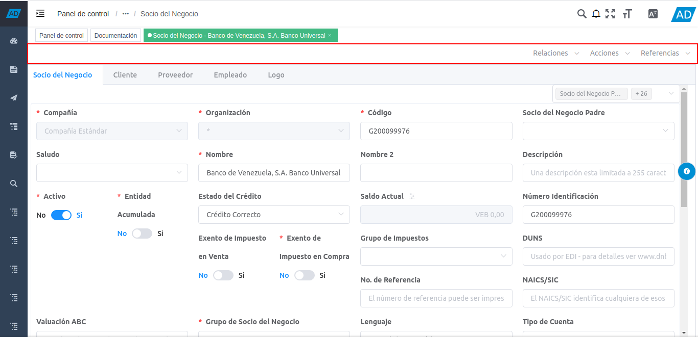
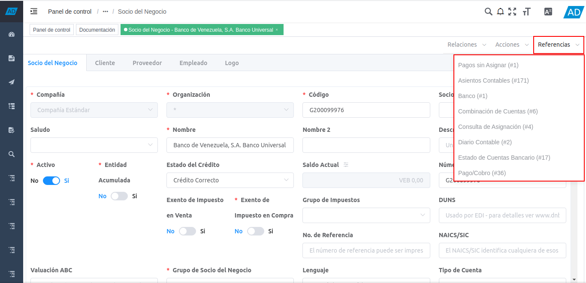

.. |opción relaciones| image:: resources/relationship-option.png
.. |opción acciones| image:: resources/stock-option.png

.. _documento/menú-de-contexto:

**Menú de Contexto**
====================

La versión 4.0.0 de ADempiere, cuenta con un menú de contexto, el cual contiene tres (3) opciones que a su vez contienen diferentes opciones, según sea el proceso, reporte, smart browser o ventana en la que se encuentre realizando determinadas funciones. A continuación se define el menú de contexto de ADempiere y su operatividad.

    |menú de contexto de adempiere|

    Imagen 1. Barra de Herramientas de ADempiere en Ventana Estándar

**Relaciones**
--------------

Dentro de la opción "**Relaciones**", se encuentran las diferentes ventanas, reportes, procesos y smart browser que tienen relación con la ventana, reporte, proceso o smart browser en el que se encuentra posicionado. Al seleccionar cualquiera de las opciones presentadas dentro de la opción "**Relaciones**", ADempiere abre la ventana, reporte, proceso o smart browser correspondiente a dicha opción.

    |opción relaciones|

    Imagen 2. Opción Relaciones

**Acciones**
------------

Dentro de la opción "**Acciones**", se pueden visualizar las posibles opciones a aplicar al documento en el que se encuentra posicionado y se ejecutan al seleccionar cualquiera de ellas.

    |opción acciones|

    Imagen 3. Opción Acciones

**Referencias**
----------------

Dentro de la opción "**Referencias**", se pueden visualizar los diferentes documentos donde es utilizado el documento o registro en el que se encuentra posicionado. Al seleccionar cualquiera de las opciones presentadas dentro de la opción "**Referencias**", ADempiere abre la ventana correspondiente a la opción, ubica y acerca el registro en el cual es utilizado el documento.

    |opción referencias|

    Imagen 4. Opción Referencias