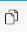
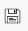
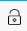

.. |Barra de Herramientas de ADempiere en Ventana Estándar| image:: resources/adempiere-toolbar-in-standard-window.png

.. |Registro nuevo| image:: resources/new-record.png

.. |Encontrar registro| image:: resources/find-record.png

.. |Cambiar mono multi| image:: resources/change-mono-multi.png
.. |Registros históricos| image:: resources/historical-records.png

.. |Registro detallado| image:: resources/detailed-records.png

.. |Registro anterior| image:: resources/previous-record.png

.. |Informe| image:: resources/report.png

.. |Flujos de trabajo| image:: resources/workflows.png

.. |Entrada Rápida| image:: resources/quick-entry.png

.. _documento/barra-de-herramientas:

**Barra de Herramientas**
=========================

En ADempiere contamos con una barra de herramientas la cual contiene una serie de iconos que realizan determinadas funciones. La barra de herramientas que a continuación será definida se encuentra ubicada en la ventana estándar de ADempiere.

    |Barra de Herramientas de ADempiere en Ventana Estándar|

    Imagen 1. Barra de Herramientas de ADempiere en Ventana Estándar

A continuación se define la operatividad de dicha barra de herramientas.

    |Barra de Herramientas de ADempiere|

    Imagen 2. Barra de Herramientas de ADempiere

+-----------------------+--------------------------------+-------------------------------------------------------------------------------------------------------------------------------------------+
|    **Icono**          |          **Nombre**            |    **Descripción**                                                                                                                        |
+=======================+================================+===========================================================================================================================================+
|    |Ignorar cambios|  |       Ignorar Cambios          |Le permitirá ignorar los cambios realizados, ya sea por error o por falta de información.                                                  |
+-----------------------+--------------------------------+-------------------------------------------------------------------------------------------------------------------------------------------+
|     |Ayuda|           |             Ayuda              |Contiene información para el usuario acerca de la ventana donde se encuentra.                                                              |
+-----------------------+--------------------------------+-------------------------------------------------------------------------------------------------------------------------------------------+
|    |Registro nuevo|   |          Registro Nuevo        |Le permitirá realizar un registro nuevo.                                                                                                   |
+-----------------------+--------------------------------+-------------------------------------------------------------------------------------------------------------------------------------------+
|   |Copiar registro|   |         Copiar Registro        |Le permitirá copiar un registro existente.                                                                                                 |
+-----------------------+--------------------------------+-------------------------------------------------------------------------------------------------------------------------------------------+
| |Eliminar registro|   |        Eliminar Registro       |Permitirá borrar un registro existente.                                                                                                    |
+-----------------------+--------------------------------+-------------------------------------------------------------------------------------------------------------------------------------------+
|   |Borrar artículos|  | Borrar Artículos Seleccionados |Permitirá eliminar un registro en específico o varios registros.                                                                           |
+-----------------------+--------------------------------+-------------------------------------------------------------------------------------------------------------------------------------------+
|    |Guardar cambios|  |        Guardar cambios         |Permitirá guardar el registro.                                                                                                             |
+-----------------------+--------------------------------+-------------------------------------------------------------------------------------------------------------------------------------------+
|    |Refrescar|        |           Refrescar            |Permitirá actualizar la ventana donde se encuentra ubicado.                                                                                |
+-----------------------+--------------------------------+-------------------------------------------------------------------------------------------------------------------------------------------+
| |Encontrar registro|  |       Encontrar Registro       |Permitirá hacer la búsqueda de un registro existente.                                                                                      |
+-----------------------+--------------------------------+-------------------------------------------------------------------------------------------------------------------------------------------+
|      |Anexo|          |             Anexo              |Adjuntará un documento o imagen.                                                                                                           |
+-----------------------+--------------------------------+-------------------------------------------------------------------------------------------------------------------------------------------+
|    |Comentario|       |           Comentario           |Permitirá hacer un comentario sobre el documento.                                                                                          |
+-----------------------+--------------------------------+-------------------------------------------------------------------------------------------------------------------------------------------+
| |Cambiar mono multi|  |   Cambiar Mono/Multi Registro  |Permitirá cambiar la vista de los registros, es decir, en mono podrá ver un solo registro mientras que en multi podrá ver varios registros.|
+-----------------------+--------------------------------+-------------------------------------------------------------------------------------------------------------------------------------------+
||Registros históricos| |      Registros Históricos      |Permitirá ver los registros dependiendo de ciertos parámetros.                                                                             |
+-----------------------+--------------------------------+-------------------------------------------------------------------------------------------------------------------------------------------+
|   |Registros padre|   |       Registro Padre           |Mostrará la pestaña anterior.                                                                                                              |
+-----------------------+--------------------------------+-------------------------------------------------------------------------------------------------------------------------------------------+
|  |Registro detallado| |       Registro Detallado       |Mostrará la pestaña siguiente.                                                                                                             |
+-----------------------+--------------------------------+-------------------------------------------------------------------------------------------------------------------------------------------+
|    |Primer registro|  |       Primer Registro          |Permitirá ver el primer registro.                                                                                                          |
+-----------------------+--------------------------------+-------------------------------------------------------------------------------------------------------------------------------------------+
|  |Registro anterior|  |       Registro Anterior        |Permitirá ver el registro anterior.                                                                                                        |
+-----------------------+--------------------------------+-------------------------------------------------------------------------------------------------------------------------------------------+
|  |Próximo registro|   |       Próximo Registro         |Permitirá ver el siguiente registro.                                                                                                       |
+-----------------------+--------------------------------+-------------------------------------------------------------------------------------------------------------------------------------------+
|   |Último registro|   |       Último Registro          |Permitirá ver el último registro.                                                                                                          |
+-----------------------+--------------------------------+-------------------------------------------------------------------------------------------------------------------------------------------+
|    |Informe|          |            Informe             |Permitirá ver un reporte de alguna transacción.                                                                                            |
+-----------------------+--------------------------------+-------------------------------------------------------------------------------------------------------------------------------------------+
||Documentos e informes||Documentos e Informes Archivados|Mostrará los documentos e informes que se encuentran archivados.                                                                           |
+-----------------------+--------------------------------+-------------------------------------------------------------------------------------------------------------------------------------------+
|    |Imprimir|         |            Imprimir            |Permitirá imprimir un documento.                                                                                                           |
+-----------------------+--------------------------------+-------------------------------------------------------------------------------------------------------------------------------------------+
|   |Bloquea Registro|  | Bloquea Registro Privado       |Permite bloquear el registro.                                                                                                              |
+-----------------------+--------------------------------+-------------------------------------------------------------------------------------------------------------------------------------------+
| |Visualiza detalle|   |       Visualiza detalle        |Permitirá ver donde está siendo usado el documento.                                                                                        |
+-----------------------+--------------------------------+-------------------------------------------------------------------------------------------------------------------------------------------+
|  |Flujos de trabajo|  |       Flujos de trabajo        |Permitirá ver los flujos de trabajos activos pendientes por ejecutar.(Completar, Procesar, entre otros).                                   |
+-----------------------+--------------------------------+-------------------------------------------------------------------------------------------------------------------------------------------+
| |Chequee solicitudes| |       Chequee Solicitudes      |Permitirá ver solicitudes realizadas.                                                                                                      |
+-----------------------+--------------------------------+-------------------------------------------------------------------------------------------------------------------------------------------+
||Información producto| |   Información de Producto      |Permitirá buscar información sobre un producto en específico.                                                                              |
+-----------------------+--------------------------------+-------------------------------------------------------------------------------------------------------------------------------------------+
|       |Proceso|       |           Proceso              |Permite realizar diferentes procesos según el tipo de ventana.                                                                             |
+-----------------------+--------------------------------+-------------------------------------------------------------------------------------------------------------------------------------------+
|   |Entrada Rápida|    |         Entrada Rápida         |Permite crear un registro en la ventana de forma rápida.                                                                                   |
+-----------------------+--------------------------------+-------------------------------------------------------------------------------------------------------------------------------------------+