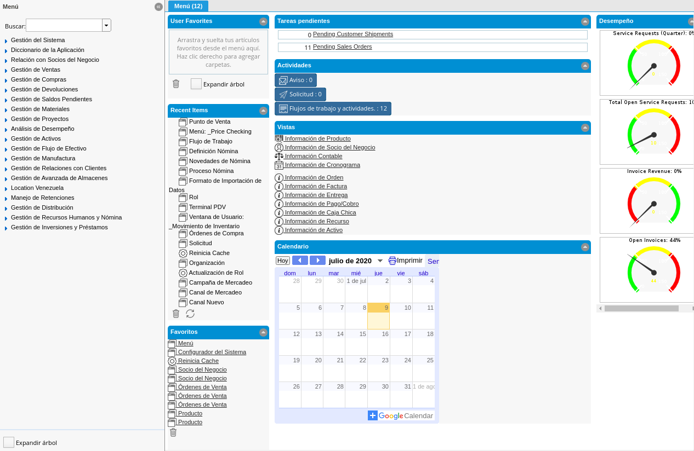
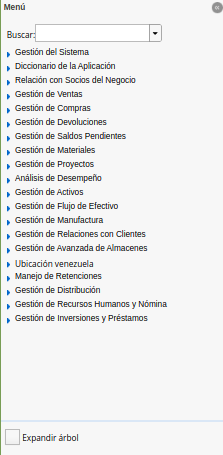
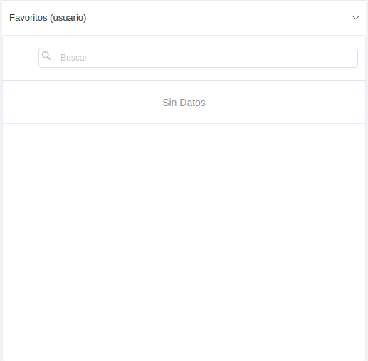
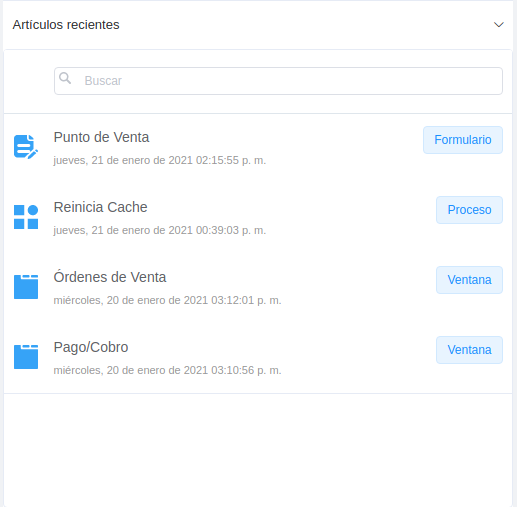
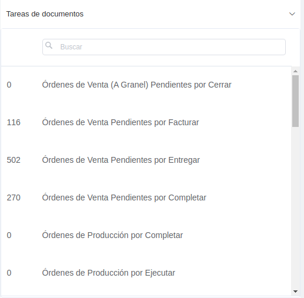
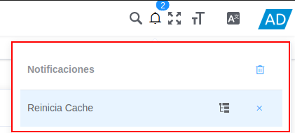
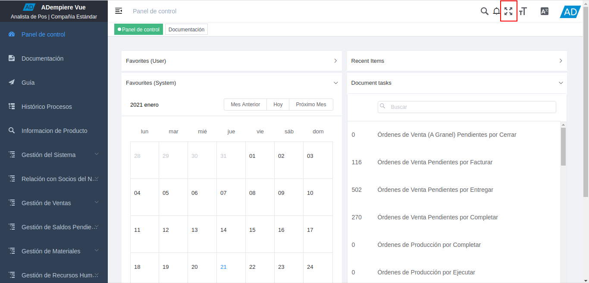
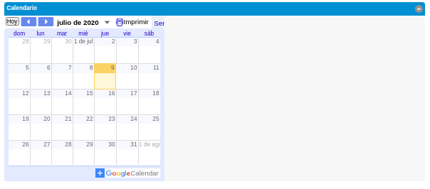

.. _documento/interfaz-de-usuario:

**Interfaz de Usuario**
=======================

La interfaz de usuario es el medio por el cual el usuario podrá comunicarse con ADempiere, comprende todos los puntos de contacto entre el usuario y ADempiere. Su objetivo principal es que el usuario se familiarice con ADempiere a través de ciertos elementos, la interfaz cuenta con una serie de elementos los cuales se describen a continuación.

    |Interfaz del Usuario|

    Imagen 1. Interfaz del Usuario

**Menú de ADempiere**
---------------------

Se encuentra conformado por una serie de carpetas que contienen sub-carpetas, ventanas, procesos, reportes y smart browser (ventana de búsqueda inteligente), que el usuario puede elegir para realizar determinadas tareas.

    |Menú de ADempiere|

    Imagen 2 Menú de ADempiere

**Favoritos del Usuario**
-------------------------

Muestra las ventanas, procesos, reportes y smart browser establecidas como favoritos por el usuario. Para agregar dichos elementos a esta sección se debe arrastrar y sueltar aquí, los elementos desde el menú. Otra forma de agregar los elementos es haciendo clic derecho para agregar carpetas.

    |Favoritos del Usuario|

    Imagen 3. Favoritos del Usuario

**Artículos Recientes**
-----------------------

Muestra los artículos recientemente abiertos y modificados, puede hacer clic en cualquiera de los elementos para abrirlos. El listado de esta sección se actualiza periódicamente.

    |Artículos Recientes|

    Imagen 4. Artículos Recientes

**Tareas Pendientes**
---------------------

Muestra todos los procesos o documentos que el usuario tiene pendientes por finalizar.

    |Tareas Pendientes|

    Imagen 5. Tareas Pendientes

**Notificaciones**
******************

    |Aviso|

    Imagen 6. Notificaciones

    Luego de ejecutar un algún proceso, podrá visualizar el mismo de la siguiente manera

    |proceso culminado|

    Imagem 7. Proceso Culminado

**Pantalla Completa**
*********************

    |Solicitud|

    Imagen 8. Pantalla Completa

    .. note::

        Seleccione la tecla "**ESC**", para salir de la pantalla completa.

**Calendarios**
---------------

Se visualiza el calendario con intervalos de días, meses y años.

    |Calendarios|

    Imagen 9. Calendarios
