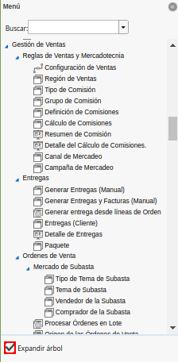
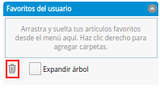
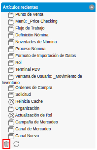
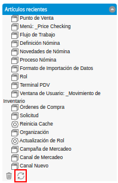
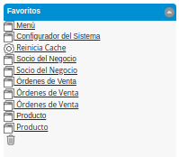
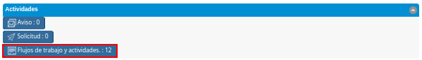
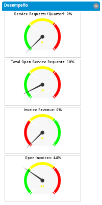

.. |Interfaz del Usuario| image:: resources/user-interface.png
.. |Menú de ADempiere| image:: resources/adempiere-menu.png
.. |Buscador del Menú| image:: resources/menu-finder.png

.. |Favoritos del Usuario| image:: resources/user-favorites.png
.. |Checklist Expandir Árbol de la Sección Favoritos del Usuario| image:: resources/checklist-expand-user-favorites-section-tree.png

.. |Artículos Recientes| image:: resources/recent-articles.png

.. |Icono Eliminar de la Sección Favoritos| image:: resources/remove-icon-from-favorites-section.png
.. |Tareas Pendientes| image:: resources/pending-tasks.png
.. |Actividades| image:: resources/activities.png
.. |Aviso| image:: resources/notice.png
.. |Solicitud| image:: resources/request.png

.. |Vistas| image:: resources/views.png
.. |Calendarios| image:: resources/calendar.png

.. _documento/interfaz-de-usuario:

**Interfaz de Usuario**
=======================

La interfaz de usuario es el medio por el cual el usuario podrá comunicarse con ADempiere, comprende todos los puntos de contacto entre el usuario y ADempiere. Su objetivo principal es que el usuario se familiarice con ADempiere a través de ciertos elementos, la interfaz cuenta con una serie de elementos los cuales se describen a continuación.

    |Interfaz del Usuario|

    Imagen 1. Interfaz del Usuario

**Menú de ADempiere**
---------------------

Se encuentra conformado por una serie de carpetas que contienen sub-carpetas, ventanas, procesos, reportes y smart browser (ventana de búsqueda inteligente), que el usuario puede elegir para realizar determinadas tareas.

    |Menú de ADempiere|

    Imagen 2 Menú de ADempiere

**Buscador del Menú**
*********************

Permite realizar una búsqueda de las ventanas, procesos, reportes y smart browser que contiene el menú.

    |Buscador del Menú|

    Imagen 3. Buscador del Menú

**Checklist Expandir Arbol**
****************************

Permite expandir todo el menú para que puedan se visualizadas todas las carpetas, sub-carpetas, ventanas, procesos, reportes y smart browser que contiene el menú.

    |Checklist Expandir Árbol|

    Imagen 4. Checklist Expandir Árbol

**Favoritos del Usuario**
-------------------------

Muestra las ventanas, procesos, reportes y smart browser establecidas como favoritos por el usuario. Para agregar dichos elementos a esta sección se debe arrastrar y sueltar aquí, los elementos desde el menú. Otra forma de agregar los elementos es haciendo clic derecho para agregar carpetas.

    |Favoritos del Usuario|

    Imagen 5. Favoritos del Usuario

**Checklist Expandir Arbol de la Sección Favoritos del Usuario**
****************************************************************

Permite expandir todo el árbol de favoritos del usuario para que puedan se visualizadas todas las carpetas, sub-carpetas, ventanas, procesos, reportes y smart browser que contiene el menú.

    |Checklist Expandir Árbol de la Sección Favoritos del Usuario|

    Imagen 6. Checklist Expandir Árbol de la Sección Favoritos del Usuario

**Icono Eliminar de la Sección Favoritos del Usuario**
******************************************************

Para eliminar un elemento de la sección favoritos del usuario, se debe arrastrar el elemento de los favoritos del usuario y soltarlo en el icono para eliminarlo.

    |Icono Eliminar de la Sección Favoritos del Usuario|

    Imagen 7. Icono Eliminar de la Sección Favoritos del Usuario

**Artículos Recientes**
-----------------------

Muestra los artículos recientemente abiertos y modificados, puede hacer clic en cualquiera de los elementos para abrirlos. El listado de esta sección se actualiza periódicamente.

    |Artículos Recientes|

    Imagen 8. Artículos Recientes

**Icono Eliminar de la Sección Artículos Recientes**
****************************************************

Para eliminar un elemento de la sección artículos recientes, se debe arrastrar el elemento de los artículos recientes y soltarlo en el icono para eliminarlo.

    |Icono Eliminar de la Sección Artículos Recientes|

    Imagen 9. Icono Eliminar de la Sección Artículos Recientes

**Icono Actualizar de la Sección Artículos Recientes**
******************************************************

Para actualizar la lista de los elementos en la sección artículos recientes, se debe hacer clic en el icono actualizar.

    |Icono Actualizar de la Sección Artículos Recientes|

    Imagen 10. Icono Actualizar de la Sección Artículos Recientes

**Favoritos**
-------------

Los favoritos sirven para guardar de una manera rápida y sencilla, los documentos que son visitados frecuentemente.

    |Favoritos|

    Imagen 11. Favoritos

**Icono Eliminar de la Sección Favoritos**
******************************************

Para eliminar un elemento de la sección favoritos, se debe arrastrar el elemento de los favoritos y soltarlo en el icono para eliminarlo.

    |Icono Eliminar de la Sección Favoritos|

    Imagen 12. Icono Eliminar de la Sección Favoritos

**Tareas Pendientes**
---------------------

Muestra todos los procesos o documentos que el usuario tiene pendientes por finalizar.

    |Tareas Pendientes|

    Imagen 13. Tareas Pendientes

**Actividades**
---------------

Indica los documentos que se encuentran en estado pendiente, es decir un documento que se ha realizado pero que por algún motivo no ha podido ser completado.

    |Actividades|

    Imagen 14. Actividades

**Aviso**
*********

    |Aviso|

    Imagen 15. Aviso

**Solicitud**
*************

    |Solicitud|

    Imagen 16. Solicitud

**Flujos de Trabajo y Actividades**
***********************************

    |Flujos de Trabajo y Actividades|

    Imagen 17. Flujos de Trabajo y Actividades

**Vistas**
----------

Se visualizan las diferentes ventanas de información para consultas rápidas que posee ADempiere.

    |Vistas|

    Imagen 18. Vistas

**Calendarios**
---------------

Se visualiza el calendario con intervalos de días, meses y años.

    |Calendarios|

    Imagen 19. Calendarios

**Desempeño**
-------------

Señalará la cantidad de documentos (según su estado) que existen a través de gráficos.

    |Desempeño|

    Imagen 20. Desempeño