.. |menu de adempiere| image:: resources/visit-planning-menu.png
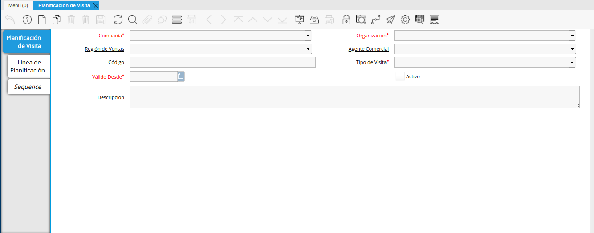
.. |campo organización| image:: resources/field-organization-of-the-visit-planning-window.png
.. |campo región de ventas| image:: resources/field-sales-region-of-the-visit-planning-window.png
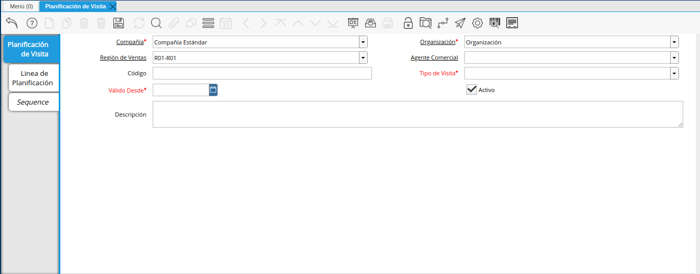
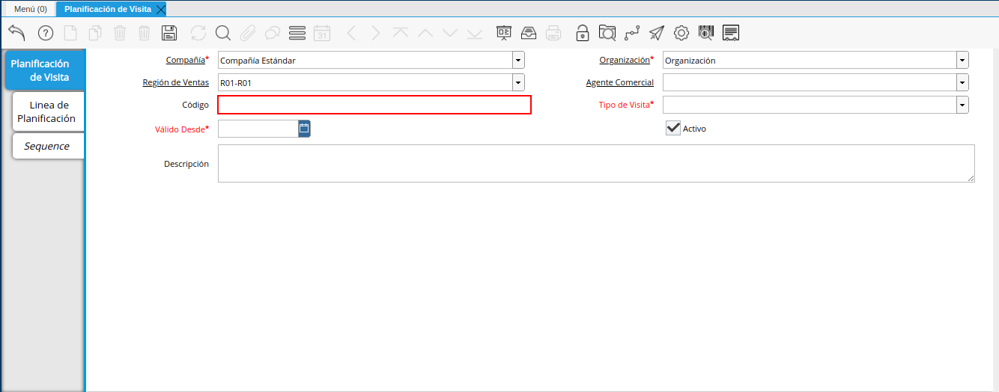
.. |campo tipo de visita| image:: resources/visit-type-field-of-the-visit-planning-window.png
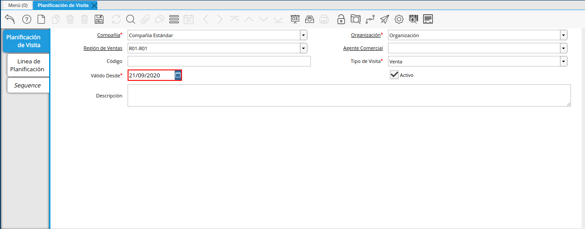

.. |campo planificación de visita| image:: resources/visits-planning-field-of-the-planning-line-tab.png
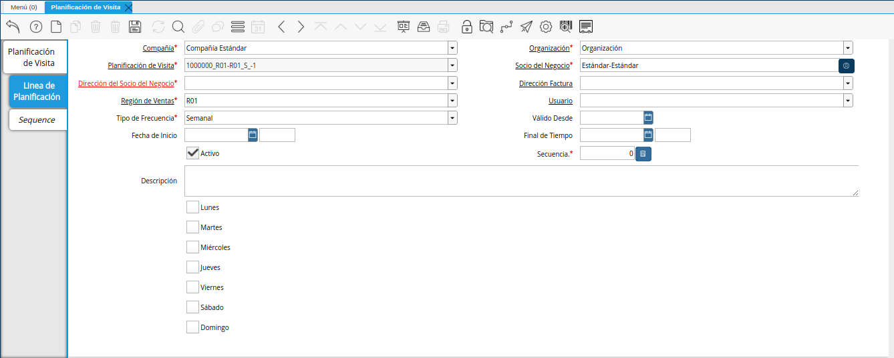
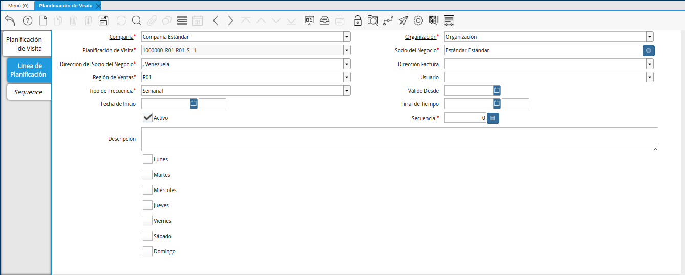

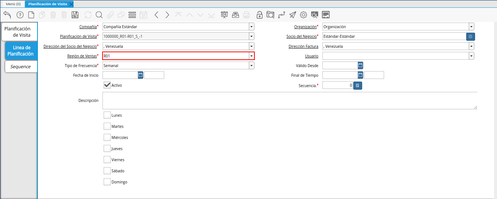
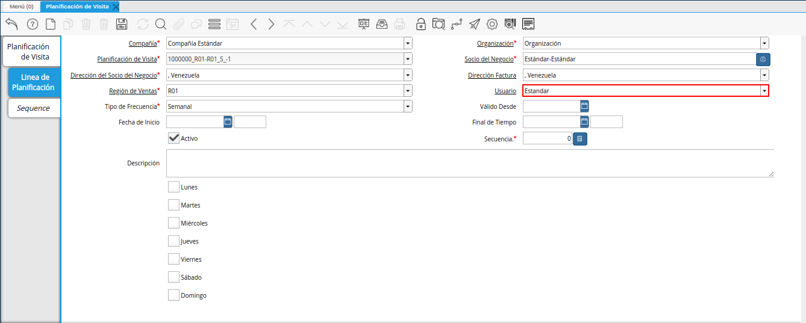

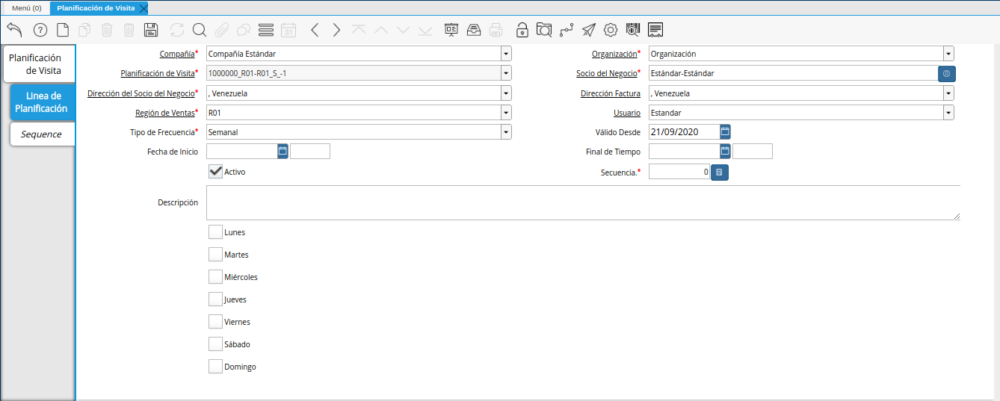

.. |campo final de tiempo| image:: resources/end-time-field-of-planning-line-tab.png
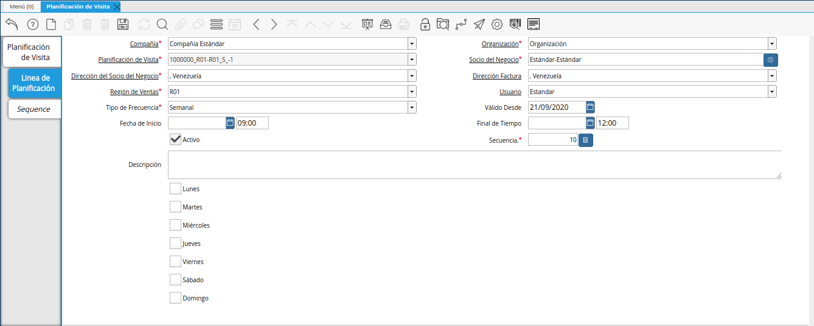
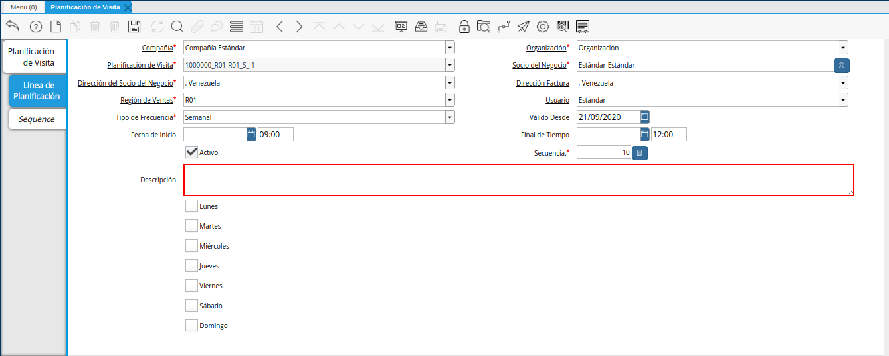

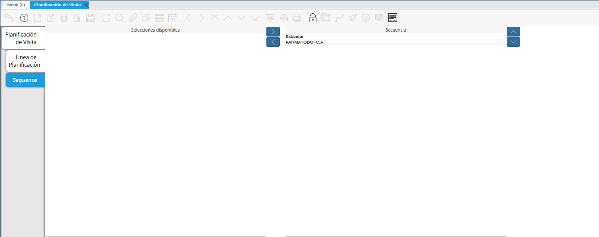

.. _documento/planificacion-de-visitas:

**Planificación de Visitas**
============================

 Ubique y seleccione en el menú de ADempiere, la carpeta "**Gestión de Relaciones con Clientes**", luego seleccione la ventana "**Planificación de Visita**".

    |menu de adempiere|

    Imagen 1. Menú de ADempiere

 Podrá visualizar la ventana "**Planificación de Visita**", con los diferentes registros de planificación de visitas en ADempiere. Donde debe seleccionar el icono "**Registro Nuevo**", ubicado en la barra de herramientas de ADempiere, para crear un nuevo registro de planificación.

    |icono registro nuevo|

    Imagen 2. Icono Registro Nuevo

 Seleccione en el campo "**Organización**", la organización para la cual se encuentra realizando la planificación de visitas.

    |campo organización|

    Imagen 3. Campo Organización

 Seleccione en el campo "**Región de Ventas**", la región de ventas a la cual se le esta realizando la planificación de visitas.

    |campo región de ventas|

    Imagen 4. Campo Región de Ventas

 Seleccione en el campo "**Agente Comercial**", el socio del negocio vendedor al cual se le esta realizando la planificación de visitas.

    |campo agente comercial|

    Imagen 5. Campo Agente Comercial

 Introduzca en el campo "**Código**", el código para el registro de planificación que se encuentra realizando.

    |campo código|

    Imagen 6. Campo Código

 Seleccione en el campo "**Tipo de Visita**", el tipo de visita que se encuentra planificando.

    |campo tipo de visita|

    Imagen 7. Campo Tipo de Visita

 Seleccione en el campo "**Válido Desde**", la fecha de inicio de la planificación de visitas que se encuentra realizando.

    |campo válido desde|

    Imagen 8. Campo Válido Desde

 Introduzca en el campo "**Descripción**", una breve descripción que explique de forma clara y general, la planificación que se encuentra realizando.

    |campo descripción|

    Imagen 9. Campo Descripción

    .. note::

        Recuerde seleccionar el icono "**Guardar Cambios**", ubicada en la barra de herramientas de ADempiere, para guardar el registro de los campos de la ventana "**Planificación de Visita**".

 Seleccione la pestaña "**Línea de Planificación**", para crear los diferentes registros de planificación de visitas correspondiente al tipo de visita seleccionada en el campo "**Tipo de Visita**".

    |pestaña línea de planificación|

    Imagen 10. Pestaña línea de planificación

 Podrá visualizar el campo "**Planificación de Visita**", el registro en el que se encuentra creando la planificación de visitas.

    |campo planificación de visita|

    Imagen 11. Campo Planificación de Visita

 Seleccione en el campo "**Socio del Negocio**", el socio del negocio cliente al cual se le encuentra planificando la visita.

    |campo socio del negocio cliente de la pestaña|

    Imagen 12. Campo Socio del Negocio

 Seleccione en el campo "**Dirección del Socio del Negocio**", la dirección de ubicación del socio del negocio seleccionado en el campo "**Socio del Negocio**".

    |campo dirección del socio del negocio|
    
    Imagen 13. Campo Dirección del Socio del Negocio

 Seleccione en el campo "**Dirección Factura**", la dirección a la cual se va a realizar la visita que se encuentra planificando.

    |campo dirección factura|

    Imagen 14. Campo Dirección Factura

 Seleccione en el campo "**Región de Ventas**", la región de ventas de la localización a la cual se va a realizar la visita que se encuentra planificando.

    |campo región de ventas de la pestaña|

    Imagen 15. Campo Región de Ventas

 Seleccione en el campo "**Usuario**", el socio del negocio vendedor que va a realizar la visita que se encuentra planificando.

    |campo usuario|

    Imagen 16. Campo Usuario

 Seleccione en el campo "**Tipo de Frecuencia**", la frecuencia con la cual se va a realizar la visita que se encuentra planificando.

    |campo tipo de frecuencia|

    Imagen 17. Campo Tipo de Frecuencia

 Seleccione en el campo "**Válido Desde**", la fecha de inicio de la planificación de visitas que se encuentra realizando.

    |campo válido desde de la pestaña|

    Imagen 18. Campo Válido Desde

 Introduzca en el recuadro ubicado del lado derecho del campo "**Fecha de Inicio**", la hora de inicio de la visita que se encuentra planificando.

    |campo fecha de inicio|

    Imagen 19. Campo Fecha de Inicio

 Introduzca en el recuadro ubicado del lado derecho del campo "**Final de Tiempo**", la hora de finalización de la visita que se encuentra planificando.

    |campo final de tiempo|

    Imagen 20. Campo Final de Tiempo

 Introduzca en el campo "**Secuencia**", la secuencia en la cual se va a realizar la visita al socio del negocio cliente seleccionado en el campo "**Socio del Negocio**".

    |campo secuencia|

    Imagen 21. Campo Secuencia

    .. note::

        La secuencia indica el orden en el que se van a realizar las visitas a los socios del negocio involucrados en la planificación que se encuentra realizando.

 Introduzca en el campo "**Descripción**", una breve descripción que explique de forma clara y específica, la planificación que se encuentra realizando.

    |campo descripción de la pestaña|

    Imagen 22. Campo Descripción

 Por último, podrá visualizar el grupo de checklist de la semana, donde debe tildar los días en los cuales se va a realizar la visita al socio del negocio cliente seleccionado en el campo "**Socio del Negocio**".

    |grupo de checklist de la semana|

    Imagen 23. Grupo de Checklist

    .. note::

        Recuerde seleccionar el icono "**Guardar Cambios**", ubicada en la barra de herramientas de ADempiere, para guardar el registro de los campos de la ventana "**Planificación de Visita**".

 Seleccione la pestaña "**Secuencia**", para visualizar la secuencia de los diferentes registros de planificación de visitas correspondiente al tipo de visita seleccionada en el campo "**Tipo de Visita**".

    |pestaña secuencia|

    Imagen 24. Pestaña Secuencia
