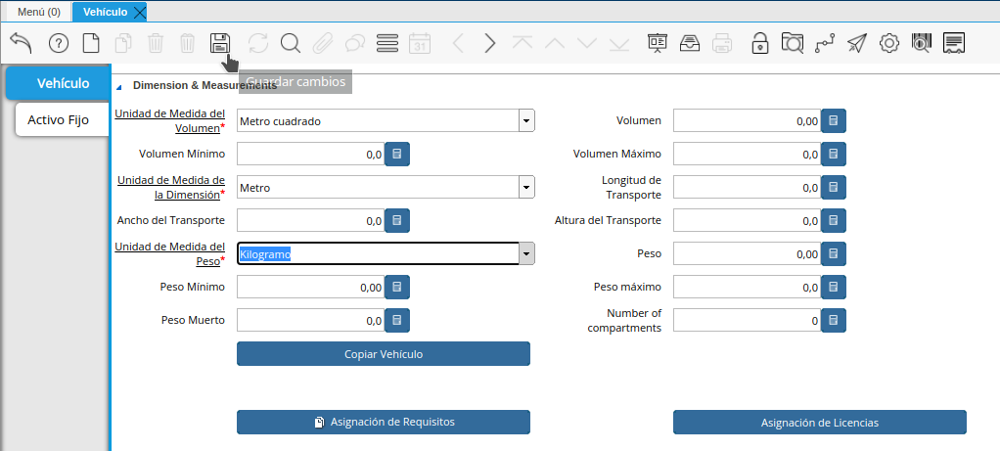

.. |Vehículo| image:: resources/New_vehicle.png

.. _documento/Creación-de-vehículo:

**Creación de Vehículo**
########################

En la Gestión de Distibución de mercancía o productos, en ADempiere, debe existir el registro de los Vehículos,
en los cuales será trasladada dicha mercancia.Para ello Ubique en el árbol del menú  de ADempire la Carpeta:
Gestión de Distibución/ Gestión de Flota de Transporte/ Creacion de Vehículo.

**Registro de Vehículo:**

Al seleccionar la Ventana de Registro de vehiculo se habilita la siguiente ventana, en la cual deberá ingresar la información correspondiente a las caracteristicas del vehículo.
Seleccione, nuevo registro para ingresar la información: 
observe que tiene campos Identificados con el nombre en color rojo, seguido de un *, lo que indica que son campos obligatorios, para poder guardar el registro. 
Para iniciar el Registro del vehiculo, seleccione la organización. 
Introduzca en el campo Nombre: La placa del Vehículo, seguidamente en el campo Tipo de Vehículo selecciones que tipo d vehiculo esta registrando
por ultimo seleccione el estatus del Vehículo.
.. figure:: resources/New_vehicle.png

Sección de Dimensiones y Medidas:
=================================

En la seccion o agrupación de los datos, relacionados a Dimensiones y Medidas del Vehículo debe imgresar los siguientes Datos:
