.. _ERPyA: http://erpya.com
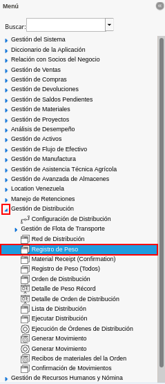
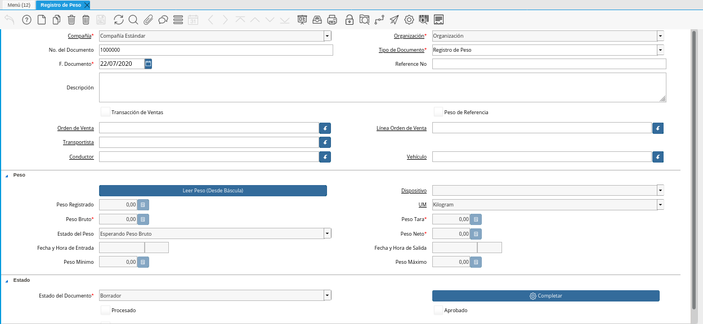
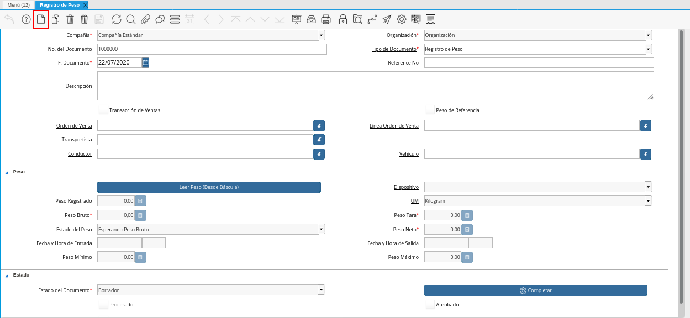
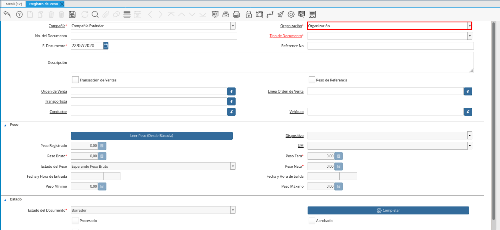
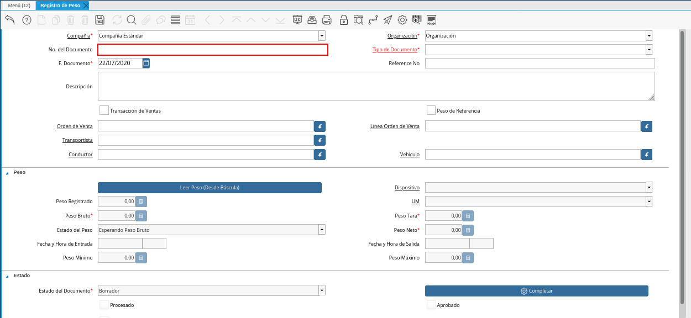
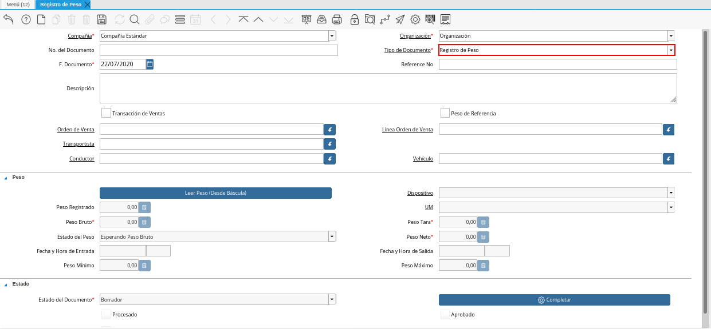
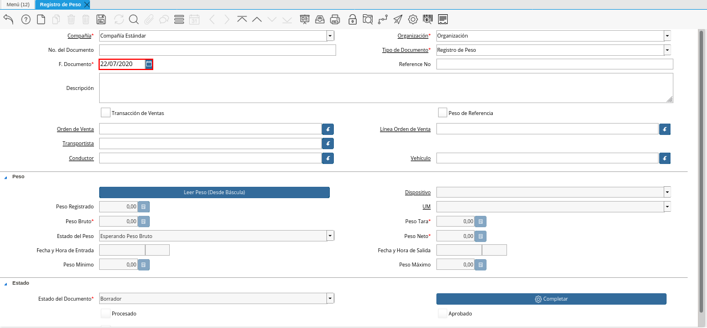
.. |Campo No. Referencia de la Vantana Registro de Peso| image:: resources/field-no-weight-record-window-reference.png
.. |Campo Descripción de la Vantana Registro de Peso| image:: resources/description-field-of-weight-record-window.png
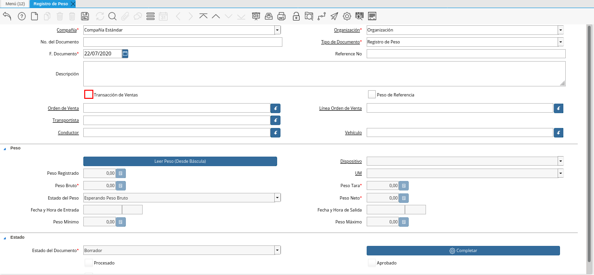
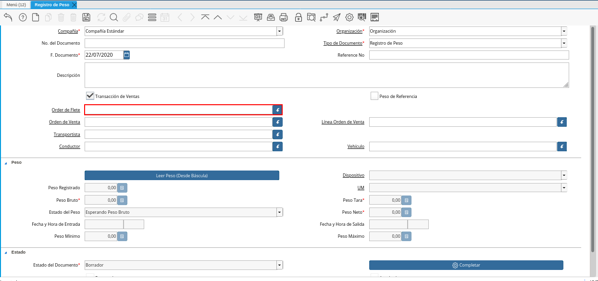

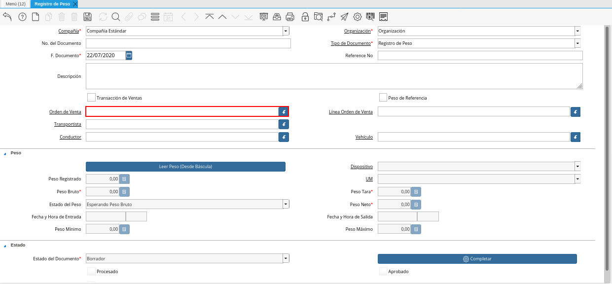
.. |Campo Almacén de la Vantana Registro de Peso| image:: resources/warehouse-field-of-weight-record-window.png
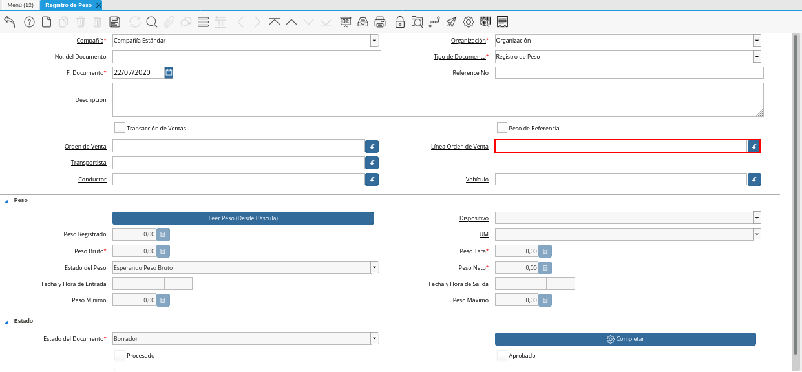
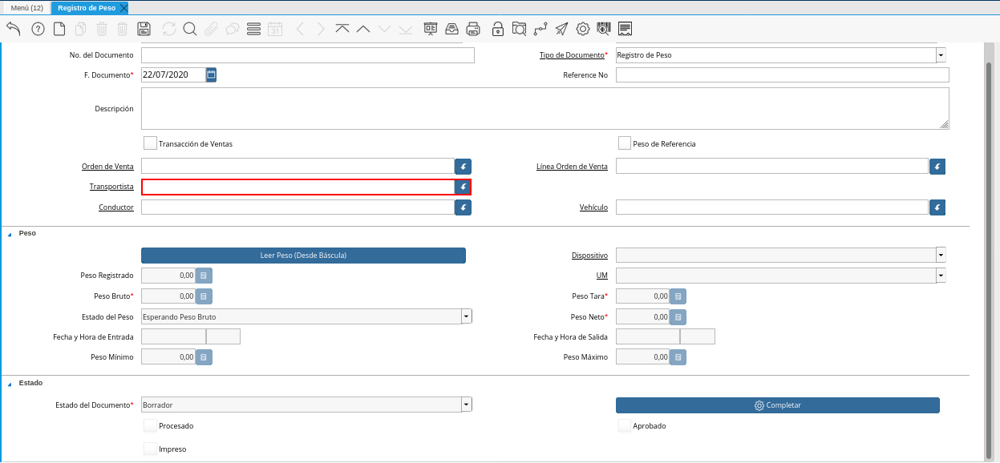
.. |Campo Conductor de la Vantana Registro de Peso| image:: resources/conductor-field-of-the-weight-record-window.png
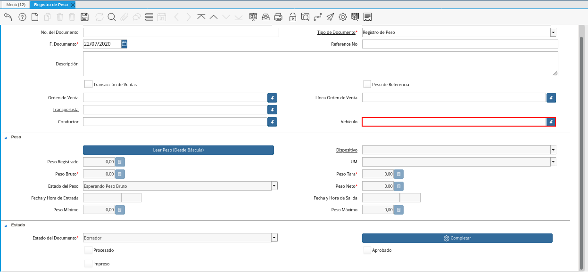
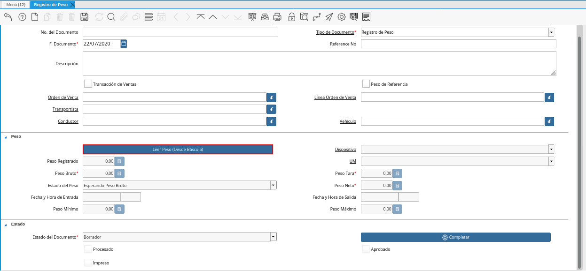
.. |Icono Guardar Cambios de la Ventana Registro de Peso| image:: resources/save-changes-icon-in-weight-log-window.png
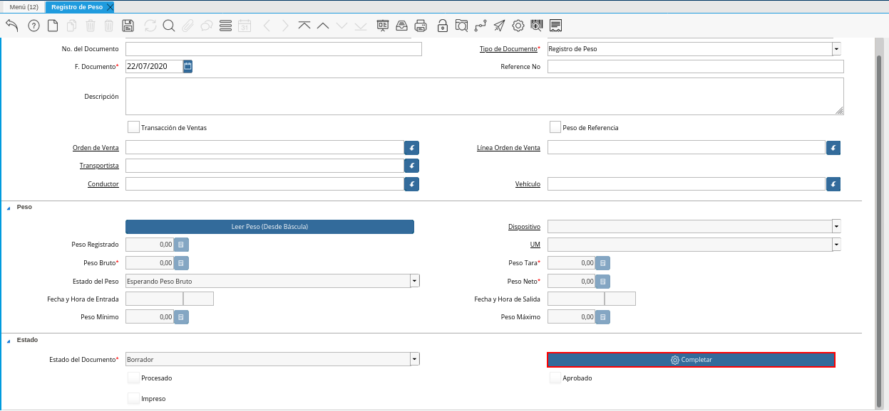
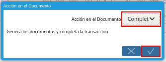

.. _documento/registro-de-peso:

**Registro de Peso**
====================

- Ubique y seleccione en el menú de ADempiere, la carpeta "**Gestión de Distribución**", luego seleccione la ventana "**Registro de Peso**".

    |Menú de ADempiere|

    Imagen 1. Menú de ADempiere

- Podrá visualizar la ventana "**Registro de Peso**", con los registros de la ventana.

    |Ventana Registro de Peso|

    Imagen 2. Ventana Registro de Peso

- Seleccione el icono "**Registro Nuevo**", ubicado en la barra de herramientas de ADempiere, para crear un uevo registro en la ventana "**Registro de Peso**".

    |Icono Registro Nuevo de la Ventana Registro de Peso|

    Imagen 3. Icono Registro Nuevo de la Ventana Registro de Peso

- Seleccione en el campo "**Organización**", la organización para la cual se encuentra realizando el documento.

    |Campo Organización de la Vantana Registro de Peso|

    Imagen 4. Campo Organización de la Ventana Registro de Peso

- Introduzca en el campo "**No. del Documento**", el número de identificación del documento que se encuentra realizando.

    |Campo No del Documento de la Vantana Registro de Peso|

    Imagen 5. Campo No. del Documento de la Vantana Registro de Peso

- Seleccione el tipo de documento a generar en el campo "**Tipo de Documento**", la selección de este define el comportamiento del documento que se esta elaborando, dicho comportamiento se encuentra explicado en el documento **Tipo de Documento** elaborado por `ERPyA`_.

    |Campo Tipo de Documento de la Vantana Registro de Peso|

    Imagen 6. Campo Tipo de Documento de la Vantana Registro de Peso

- Introduzca en el campo "**F. Documento**", la fecha en la cual se encuentra realizando el documento.

    |Campo F Documento de la Vantana Registro de Peso|

    Imagen 7. Campo F. Documento de la Vantana Registro de Peso

- Introduzca en el campo "**No. Referencia**", el número de referencia correspondiente al registro que se encuentra realizando.

    |Campo No. Referencia de la Vantana Registro de Peso|

    Imagen 8. Campo No. Referencia de la Vantana Registro de Peso

- Introduzca en el campo "**Descripción**", una breve descripción del registro que se encuentra realizando.

    |Campo Descripción de la Vantana Registro de Peso|

    Imagen 9. Campo Descripción de la Vantana Registro de Peso

- Al tildar el checklist "**Transacción de Ventas**", se indica que el registro que se encuentra realizando esta asociado a una transacción de ventas de ADempiere.

    |Checklist Transacción de Ventas de la Vantana Registro de Peso|

    Imagen 10. Checklist Transacción de Ventas de la Vantana Registro de Peso

    - Al tildar el checklist "**Transacción de Ventas**", es habilitado el campo "**Orden de Flete**", para seleccionar la orden de flete correspondiente al registro que se encuentra realizando.

        |Campo Orden de Flete de la Ventana Registro de Peso|

        Imagen 11. Campo Orden de Flete de la Ventana Registro de Peso

- El checklist "**Peso de Referencia**", indica si un peso es únicamente de referencia.

    |Checklist Peso de Referencia de la Vantana Registro de Peso|

    Imagen 12. Checklist Peso de Referencia de la Vantana Registro de Peso

    .. note::

        Al seleccionar el checklist "**Peso de Referencia**", son deshabilitados los campos "**Orden de Venta**" y "**Línea Orden de Venta**".

- Seleccione en el campo "**Orden de Venta**", la orden de venta asociada al registro de peso que se encuentra realizando.

    |Campo Orden de Venta de la Vantana Registro de Peso|

    Imagen 13. Campo Orden de Venta de la Vantana Registro de Peso

    - Al seleccionar una orden de compra en el campo "**Orden de Venta**", es habilitado el campo "**Almacén**", donde debe seleccionar el almacén donde se encuentra ubicado el producto asociado a la orden seleccionada.

        |Campo Almacén de la Vantana Registro de Peso|

        Imagen 14. Campo Almacén de la Vantana Registro de Peso

- Seleccione en el campo "**Línea Orden de Venta**", la línea de la orden de venta seleccionada.

    |Campo Línea Orden de Venta de la Vantana Registro de Peso|

    Imagen 15. Campo Línea Orden de Venta de la Vantana Registro de Peso

- Seleccione en el campo "**Transportista**", la empresa de transporte asociada al registro de peso que se encuentra realizando.

    |Campo Transportista de la Vantana Registro de Peso|

    Imagen 16. Campo Transportista de la Vantana Registro de Peso

- Seleccione en el campo "**Conductor**", el conductor asociado al registro de peso que se encuentra realizando.

    |Campo Conductor de la Vantana Registro de Peso|

    Imagen 17. Campo Conductor de la Vantana Registro de Peso

- Seleccione en el campo "**Vehículo**", el vehículo asociado al registro de peso que se encuentra realizando.

    |Campo Vehículo de la Vantana Registro de Peso|

    Imagen 18. Campo Vehículo de la Vantana Registro de Peso

- Seleccione la opción "**Leer Peso (Desde Báscula)**", para cargar la información del peso del producto suministrada por la báscula.

    |Opción Leer Peso Desde Báscula de la Vantana Registro de Peso|

    Imagen 19. Opción Leer Peso Desde Báscula de la Vantana Registro de Peso

- Seleccione el icono "**Guardar Cambios**", ubicado en la barra de herramientas de ADempiere, para guardar el registro de los campos de la ventana "**Registro de Peso**".

    |Icono Guardar Cambios de la Ventana Registro de Peso|

    Imagen 20. Icono Guardar Cambios de la Ventana Registro de Peso

- Seleccione la opción "**Completar**", ubicada en la parte inferior de la ventana "**Registro de Peso**".

    |Opción Completar de la Ventana Registro de Peso|

    Imagen 21. Opción Completar de la Ventana Registro de Peso

- Seleccione la acción "**Completar**" y la opción "**OK**", para completar el documento "**Registro de Peso**".

    |Acción Completar y Opción OK de la Ventana Registro de Peso|

    Imagen 22. Acción Completar y Opción OK de la Ventana Registro de Peso