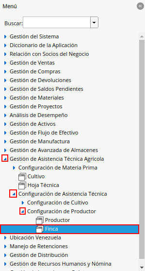
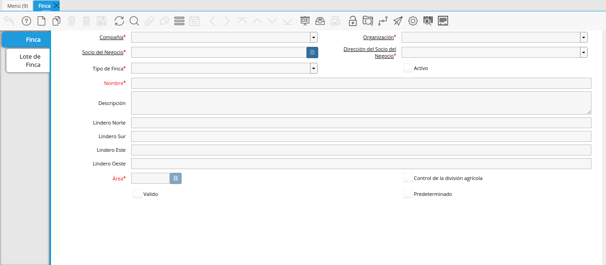
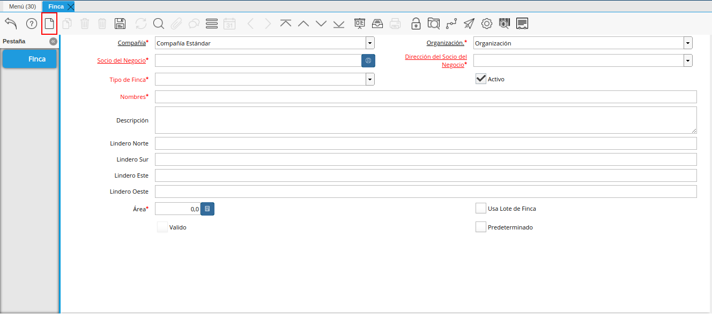
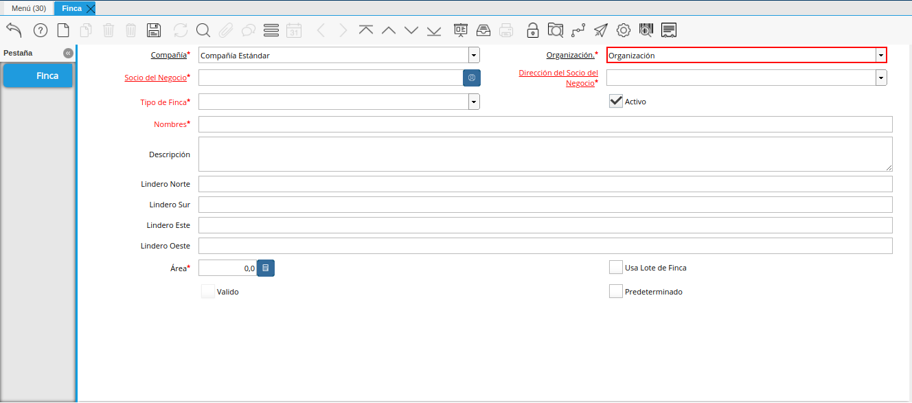
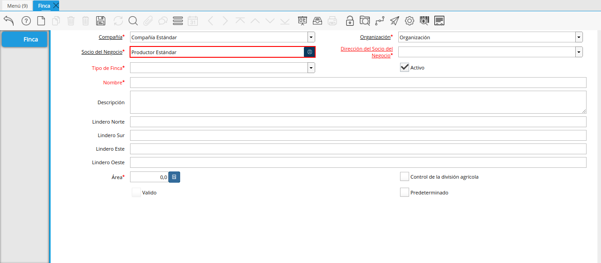
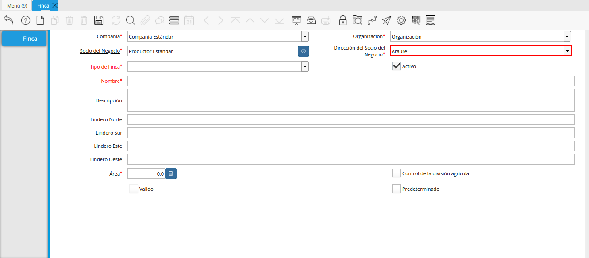
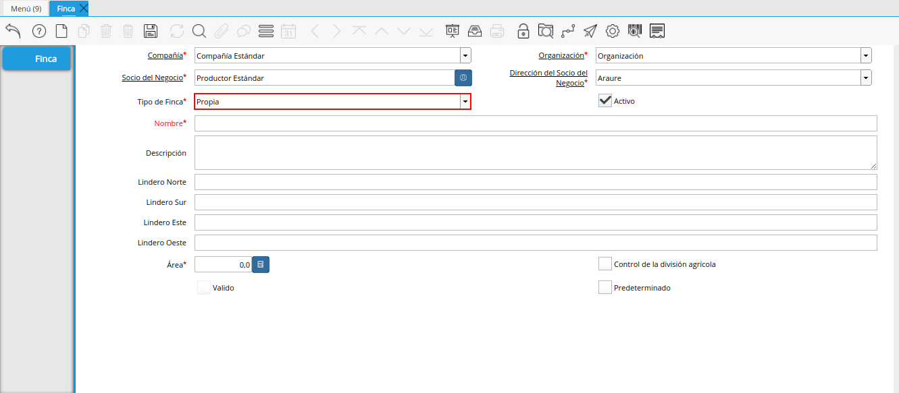
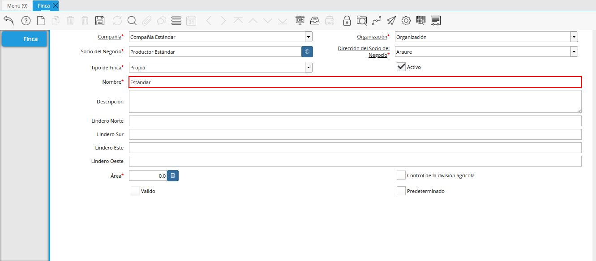
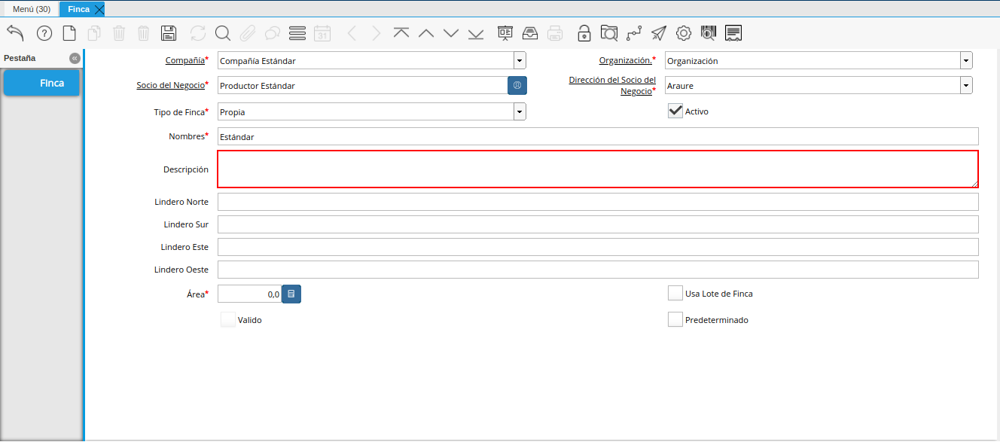
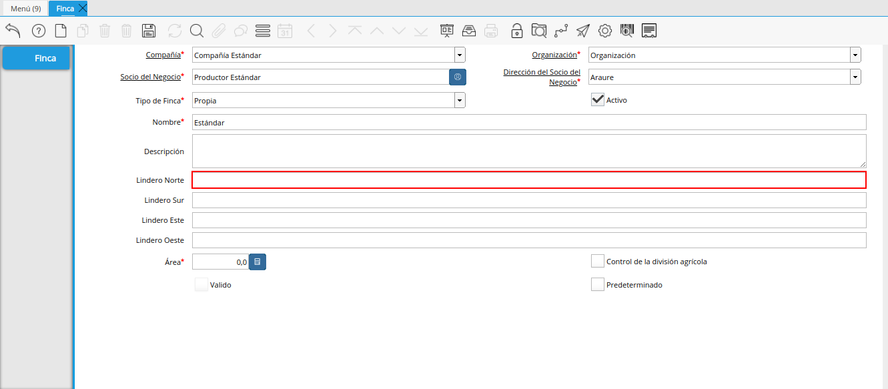
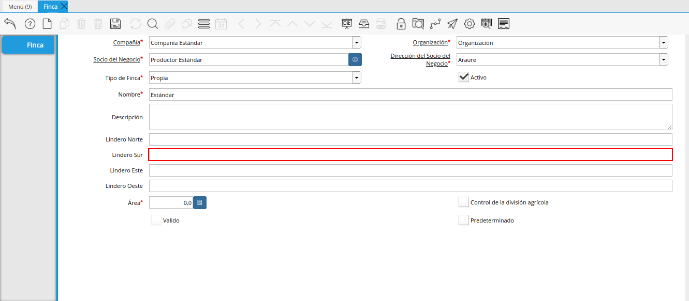
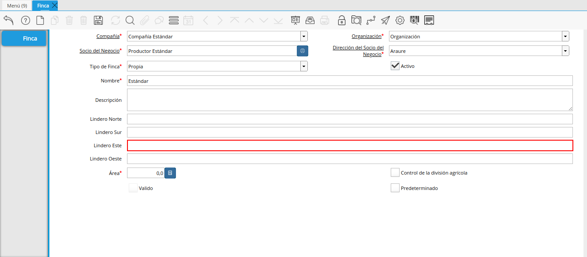
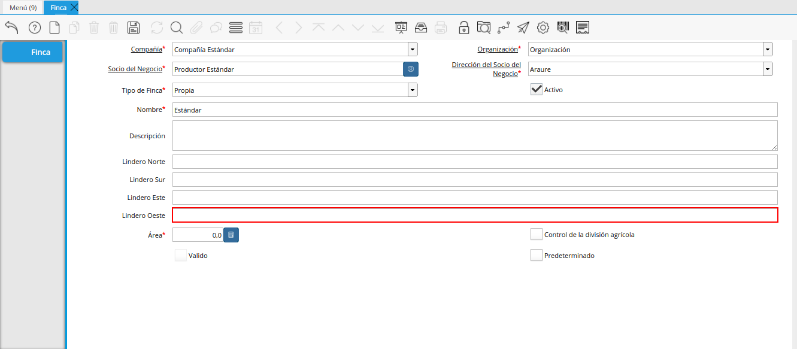
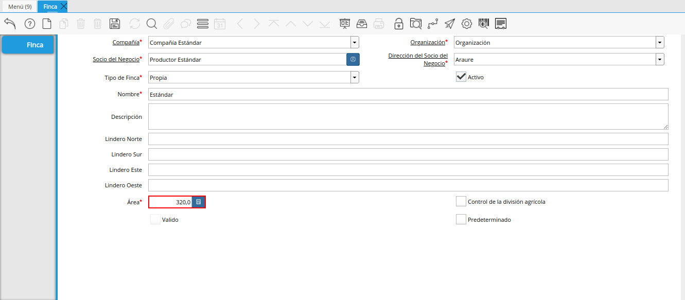

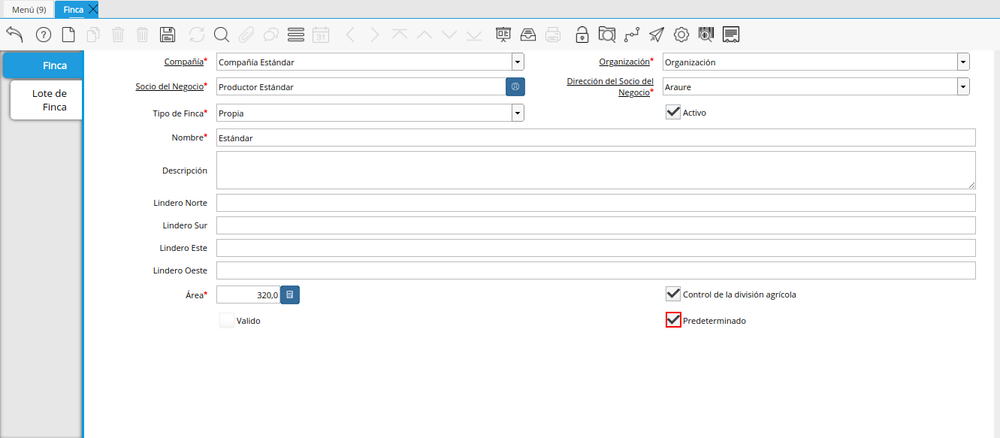

.. |icono guardar cambios de la ventana finca| image:: resources/icon-save-changes-of-the-farm-window.png
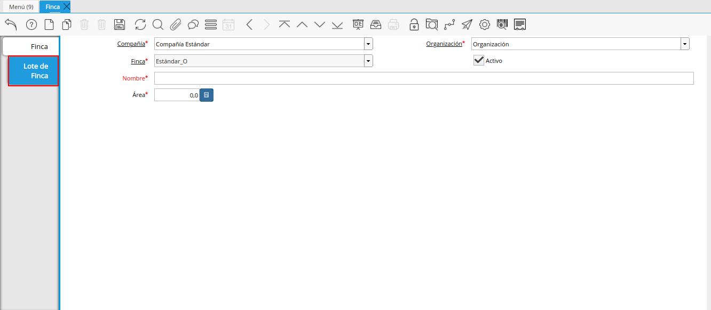
.. |campo nombre de la pestaña lote de finca| image:: resources/field-name-of-the-farm-lot-tab.png
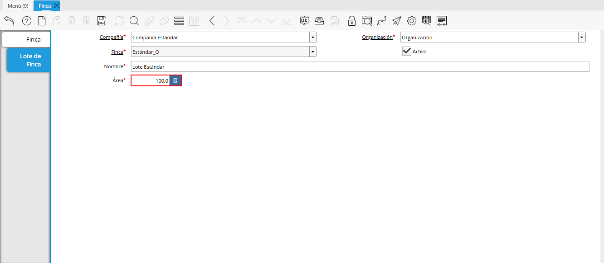
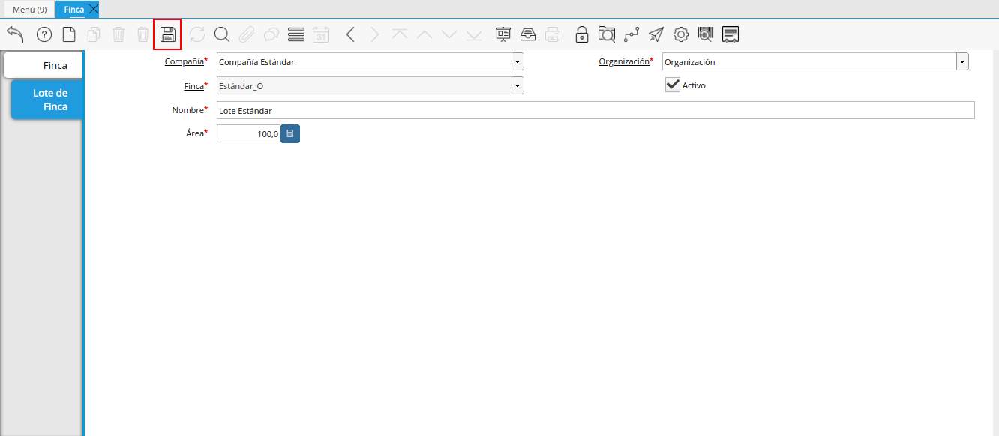

.. _documento/finca:

**Registro de Finca**
=====================

- Ubique y seleccione en el menú de ADempiere, la carpeta "**Gestión de Asistencia Técnica Agricola**", luego seleccione la carpeta "**Configuración de Asistencia Técnica**", por último seleccione la carpeta "**Configuración de Productor**". Finalmente, seleccione la ventana "**Finca**".

    |Menú de Finca|

    Imagen 1. Menú de ADempiere

- Podrá visualizar la ventana "**Finca**", con los diferentes registros de fincas que contiene ADempiere.

    En esta ventana se registran los datos principales que la empresa requiere de la finca. Cada uno de los campos con el símbolo (*) son obligatorios para el registro.

    |ventana finca|

    Imagen 2. Ventana Finca

- Seleccione el icono "**Registro Nuevo**", ubicado en la barra de herramientas de ADempiere, para registrar una nueva finca.

    |icono registros nuevo de la ventana finca|

    Imagen 3. Icono Registro Nuevo de la Ventana Finca

    - Seleccione en el campo "**Organización**", la organización para la cual se encuentra realizando el registro de la finca.

        |campo organización de la ventana finca|

        Imagen 4. Campo Organización de la Ventana Finca

    - Seleccione en el campo "**Socio del Negocio**", el productor relacionado a la finca que se encuentra registrando.

        |campo socio del negocio de la ventana finca|

        Imagen 5. Campo Socio del Negocio de la Ventana Finca

    - Seleccione en el campo "**Dirección del Socio del Negocio**", la dirección de localización del productor seleccionado en el campo "**Socio del Negocio**".

        |campo dirección del socio del negocio de la ventana finca|

        Imagen 6. Campo Dirección del Socio del Negocio de la Ventana Finca

    - Seleccione en el campo "**Tipo de Finca**", el tipo de finca que se encuentra registrando. 

        |campo tipo de finca de la ventana finca|

        Imagen 7. Campo Tipo de Finca de la Ventana Finca

    - Introduzca en el campo "**Nombre**", el nombre de la finca que se encuentra registrando.

        |campo nombre de la ventana finca|

        Imagen 8. Campo Nombre de la Ventana Finca

    - Seleccione en el campo "**Descripción**", una breve descripción relacionada con la finca que se encuentra registrando.

        |campo descripción de la ventana finca|

        Imagen 9. Campo Descripción de la Ventana Finca

    - Introduzca en el campo "**Lindero Norte**", el lindero norte de la finca que se encuentra registrando.

        |campo lindero norte de la ventana finca|

        Imagen 10. Campo Lindero Norte de la Ventana Finca

    - Introduzca en el campo "**Lindero Sur**", el lindero sur de la finca que se encuentra registrando.

        |campo lindero sur de la ventana finca|

        Imagen 11. Campo Lindero Sur de la Ventana Finca

    - Introduzca en el campo "**Lindero Este**", el lindero este de la finca que se encuentra registrando.

        |campo lindero este de la ventana finca|

        Imagen 12. Campo Lindero Este de la Ventana Finca

    - Introduzca en el campo "**Lindero Oeste**", el lindero oeste de la finca que se encuentra registrando.

        |campo lindero oeste de la ventana finca|

        Imagen 13. Campo Lindero Oeste de la Ventana Finca

    - Introduzca en el campo "**Área**", el área de la finca que se encuentra registrando.

        |campo área de la ventana finca|

        Imagen 14. Campo Área de la Ventana Finca

        .. note::

            El valor de este campo debe ser diferente de cero (0), corresponde al área de la finca que se encuentra registrando y es utilizado como requerimiento de ADempiere al momento de reflejar la finca a seleccionar en los documentos de "**Cultivo**" y "**Hoja Técnica**".

    - Tilde el checklist "**Control de la División Agrícola**", para indicar que el registro de la finca contiene lotes o sub-divisiones.

        |checklist control de la división agrícola de la ventana finca|

        Imagen 15. Checklist Control de la División Agrícola de la Ventana Finca

        .. note:: 
        
            Al tildar el checklist "**Control de la División Agrícola**", se habilita la pestaña "**Lote de Finca**".

    - Tilde el checklist "**Predeterminado**", para indicar el registro como predeterminado.

        |checklist predeterminado de la ventana finca|

        Imagen 16. Checklist Predeterminado de la Ventana Finca

    - El checklist "**Válido**", indica que es valido el registro de la finca.

        |checklist valido de la ventana finca|

        Imagen 17. Checklist Válido de la Ventana Finca

- Seleccione el icono "**Guardar Cambios**", ubicado en la barra de herramientas de ADempiere, para guardar el registro de los campos de la ventana "**Finca**".

    |icono guardar cambios de la ventana finca|

    Imagen 18. Icono Guardar Cambios de la Ventana Finca

**Pestaña Lote de Finca**
-------------------------

- Seleccione la pestaña "**Lote de Finca**" y proceda al llenado de los campos correspondientes.

    |pestaña lote de finca de la ventana finca|

    Imagen 19. Pestaña Lote de Finca de la Ventana Finca

    - Introduzca en el campo "**Nombre**", el nombre correspondientes al lote que se encuentra registrando.

        |campo nombre de la pestaña lote de finca|

        Imagen 20. Campo Nombre de la Pestaña Lote de Finca

    - Introduzca en el campo "**Área**", el área del lote que se encuentra registrando.

        |campo área de la pestaña lote de finca|

        Imagen 21. Campo Área de la Pestaña Lote de Finca

- Seleccione el icono "**Guardar Cambios**", ubicado en la barra de herramientas de ADempiere, para guardar el registro de los campos de la pestaña "**Lote de Finca**".

    |icono guardar cambios de la pestaña lote de finca|

    Imagen 22. Icono Guardar Cambios de la Pestaña Lote de Finca