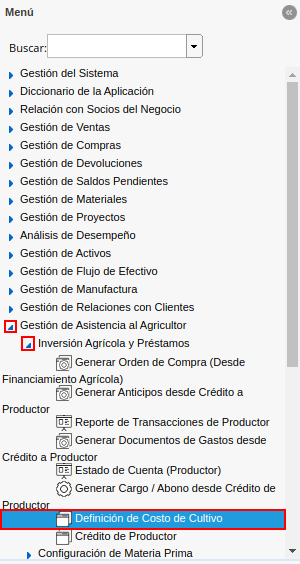

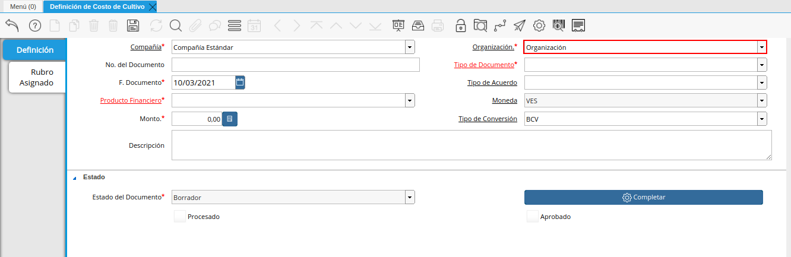
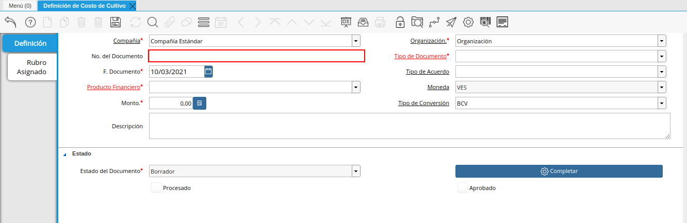
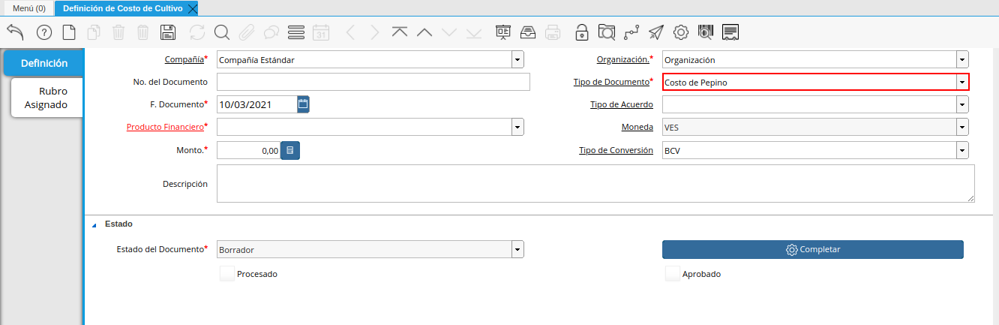
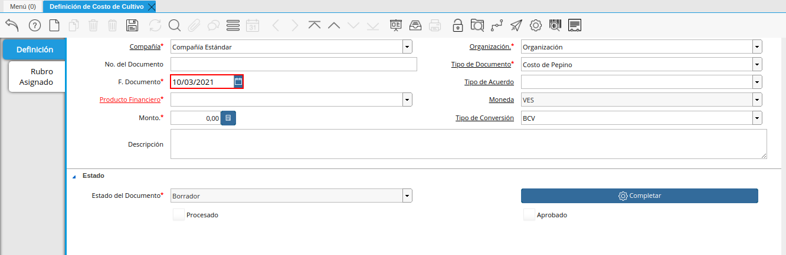
.. |campo tipo de acuerdo de la ventana definición de costo de cultivo| image:: resources/agreement-type-field-of-the-crop-cost-definition-window.png
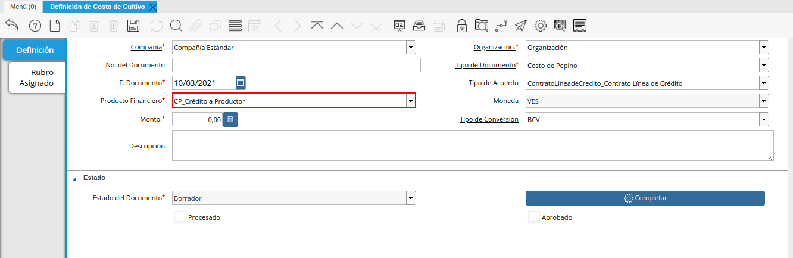
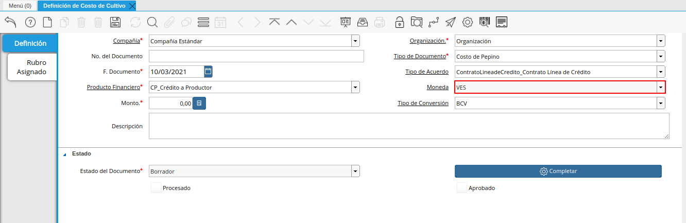
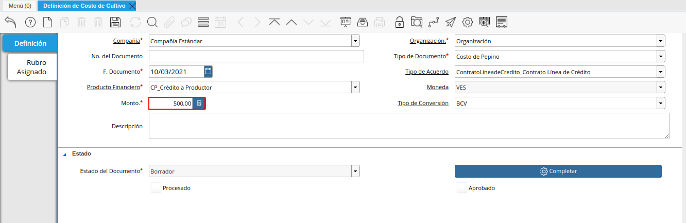
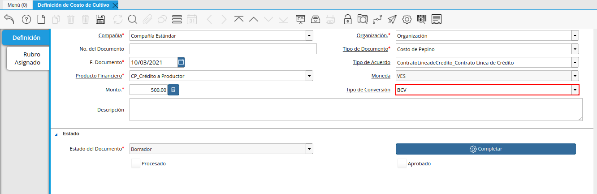
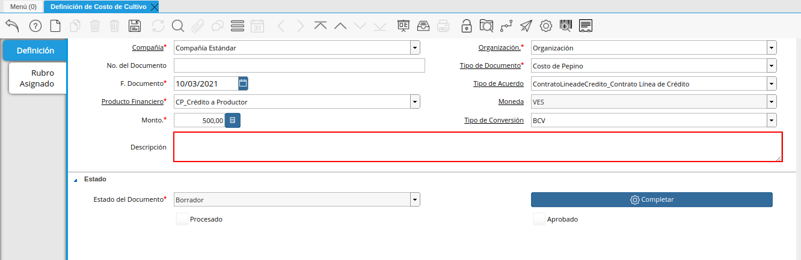
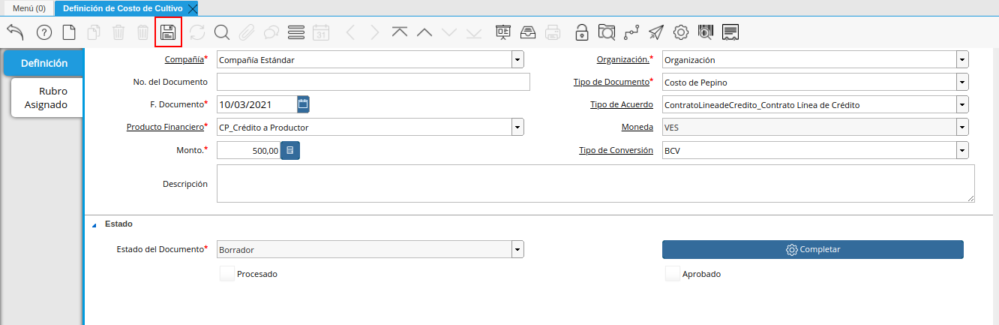
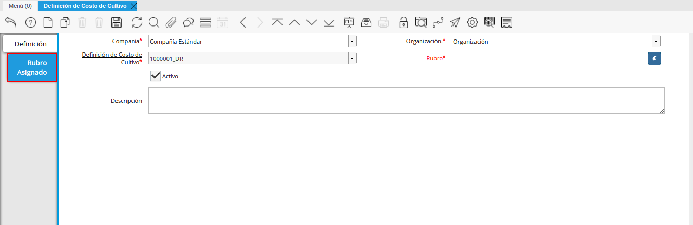
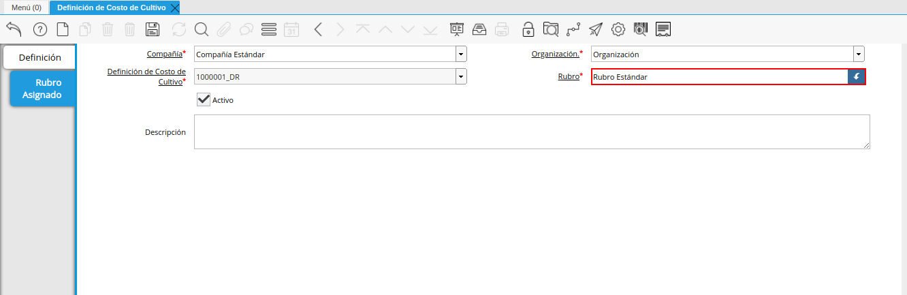
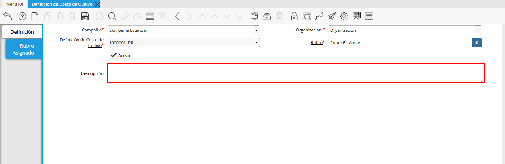
.. |icono guardar cambios de la pestaña rubro asignado de la ventana definición de costo de cultivo| image:: resources/save-changes-icon-on-the-assigned-item-tab-of-the-crop-cost-definition-window.png
.. |pestaña principal definición y opción completar| image:: resources/main-tab-definition-and-option-complete.png
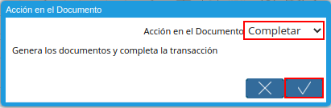

.. _ERPyA: http://erpya.com

.. _documento/definición-de-costo-de-cultivo:

**Definición de Costo de Cultivo**
==================================

- Ubique y seleccione en el menú de ADempiere, la carpeta "**Gestión de Asistencia al Agricultor**", luego seleccione la carpeta "**Inversión Agrícola y Préstamos**", por último seleccione la ventana "**Definición de Costo de Cultivo**".

    |menú de definición de costo de cultivo|

    Imagen 1. Menú de ADempiere

- Podrá visualizar la ventana "**Definición de Costo de Cultivo**", con los diferentes registros de definiciones de costos de cultivo.

    |ventana definición de costo de cultivo|

    Imagen 2. Ventana Definición de Costo de Cultivo

- Seleccione el icono "**Registro Nuevo**", ubicado en la barra de herramientas de ADempiere.

    |icono registro nuevo de la ventana definición de costo de cultivo|

    Imagen 3. Icono Registro Nuevo

- Seleccione en el campo "**Organización**", la organización para la cual se encuentra realizando el registro.

    |campo organización de la ventana definición de costo de cultivo|

    Imagen 4. Campo Organización

- Introduzca en el campo "**No. del Documento**", el número de documento correspondiente al registro que se encuentra realizando.

    |campo número del documento de la ventana definición de costo de cultivo|

    Imagen 5. Campo No. del Documento

- Seleccione el tipo de documento a generar en el campo "**Tipo de Documento**", la selección de este define el comportamiento del documento que se esta elaborando, dicho comportamiento se encuentra explicado en el documento **Tipo de Documento** elaborado por `ERPyA`_.

    |campo tipo de documento de la ventana definición de costo de cultivo|

    Imagen 6. Campo Tipo de Documento

- Seleccione en el campo "**F. Documento**", la fecha en la que se encuentra realizando el registro.

    |campo fecha del documento de la ventana definición de costo de cultivo|

    Imagen 7. Campo F. Documento

- Seleccione en el campo "**Tipo de Acuerdo**", el tipo de acuerdo correspondiente al registro que se encuentra realizando.

    |campo tipo de acuerdo de la ventana definición de costo de cultivo|

    Imagen 8. Campo Tipo de Acuerdo

- Seleccione en el campo "**Producto Financiero**", el producto financiero correspondiente al registro que se encuentra realizando.

    |campo producto financiero de la ventana definición de costo de cultivo|

    Imagen 9. Campo Poducto Financiero

- Podrá visualizar en el campo "**Moneda**", la moneda en la que se encuentra definida para la compañía.

    |campo moneda de la ventana definición de costo de cultivo|

    Imagen 10. Campo Moneda

    .. note::

        El valor de este campo cambia de manera automática, al guardar el registro de los campos de la ventana "**Definición de Costo de Cultivo**", tomando la moneda definida en el producto financiero seleccionado.

- Introduzca en el campo "**Monto**", el monto del costo del cultivo en la moneda definida en el producto financiero seleccionado.

    |campo monto de la ventana definición de costo de cultivo|

    Imagen 11. Campo Monto 

- Seleccione en el campo "**Tipo de Conversión**", el tipo de conversión correspondiente al registro que se encuentra realizando.

    |campo tipo de conversión de la ventana definición de costo de cultivo|

    Imagen 12. Campo Tipo de Conversión

- Introduzca en el campo "**Descripción**", una breve descripción referente al registro que se encuentra realizando.

    |campo descripción de la ventana definición de costo de cultivo|

    Imagen 13. Campo Descripción

- Seleccione el icono "**Guardar Cambios**", ubicado en la barra de herramientas de ADempiere.

    |icono guardar cambios de la ventana definición de costo de cultivo|

    Imagen 14. Icono Guardar Cambios

- Seleccione la pestaña "**Rubro Asignado**" y proceda al llenado de los campos correspondientes.

    |pestaña rubro asignado de la ventana definición de costo de cultivo|

    Imagen 15. Pestaña Rubro Asignado 

- Seleccione en el campo "**Rubro**", el rubro correspondiente al registro que se encuentra realizando.

    |campo rubro de la pestaña rubro asignado de la ventana definición de costo de cultivo|

    Imagen 16. Campo Rubro

- Introduzca en el campo "**Descripción**", una breve descripción referente al registro que se encuentra realizando.

    |campo descripción de la pestaña rubro asignado de la ventana definición de costo de cultivo|

    Imagen 17. Campo Descripción

- Seleccione el icono "**Guardar Cambios**", ubicado en la barra de herramientas de ADempiere.

    |icono guardar cambios de la pestaña rubro asignado de la ventana definición de costo de cultivo|

    Imagen 18. Icono Guardar Cambios

- Seleccione la pestaña principal "**Definición**" y luego seleccione la opción "**Completar**".

    |pestaña principal definición y opción completar|

    Imagen 19. Pestaña Principal Definición y Opción Completar

- Seleccione la acción "**Completar**" y la opción "**Ok**".

    |acción completar y opción ok|

    Imagen 20. Acción Completar y Opción OK