.. |menú de generar anticipos desde crédito al productor| image:: resources/menu-to-generate-advances-from-producer-credit.png
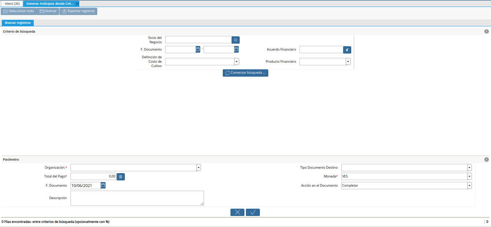
.. |campo socio del negocio del generar anticipos desde crédito al productor| image:: resources/business-partner-field-of-generating-advances-from-producer-credit.png
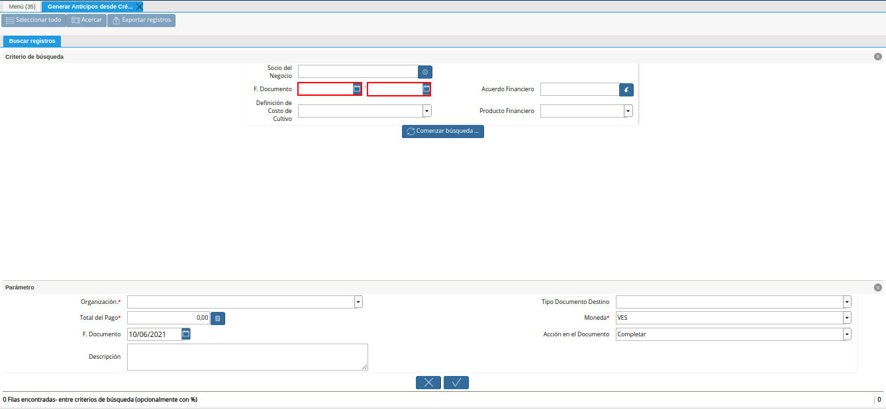
.. |campo acuerdo financiero del generar anticipos desde crédito al productor| image:: resources/field-financial-agreement-to-generate-credit-advances-to-the-producer.png
.. |campo definición de costo de cultivo del generar anticipos desde crédito al productor| image:: resources/field-definition-of-cultivation-cost-of-generating-advances-from-producer-credit.png
.. |campo producto financiero del generar anticipos desde crédito al productor| image:: resources/financial-product-field-of-generating-credit-advances-to-the-producer.png
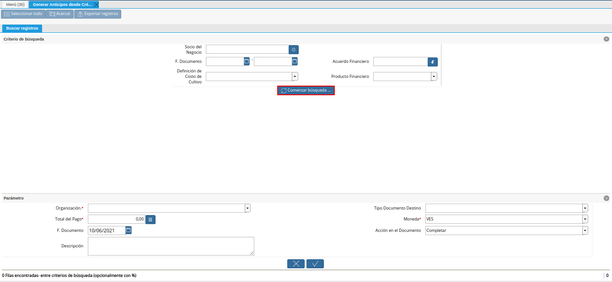
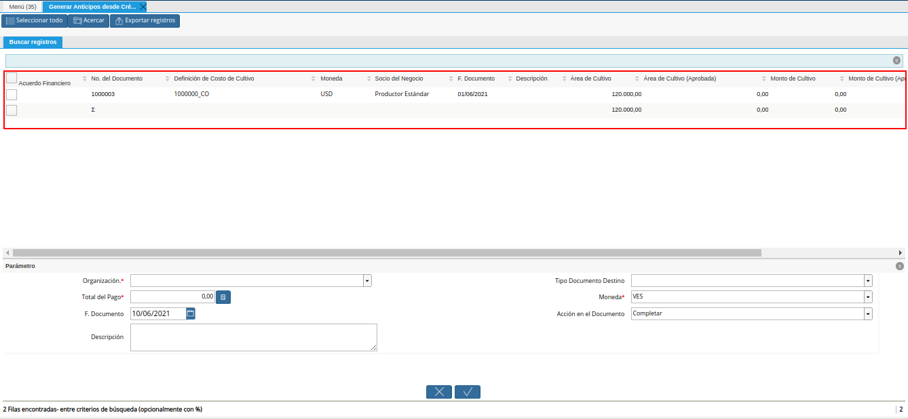
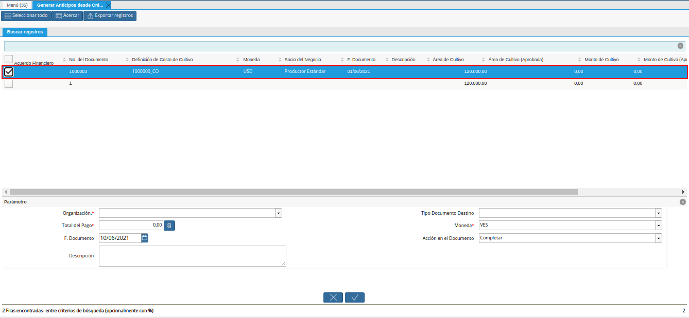
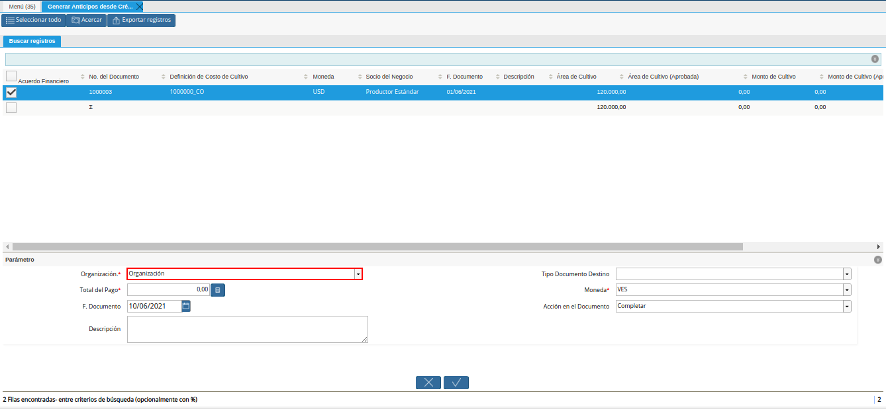
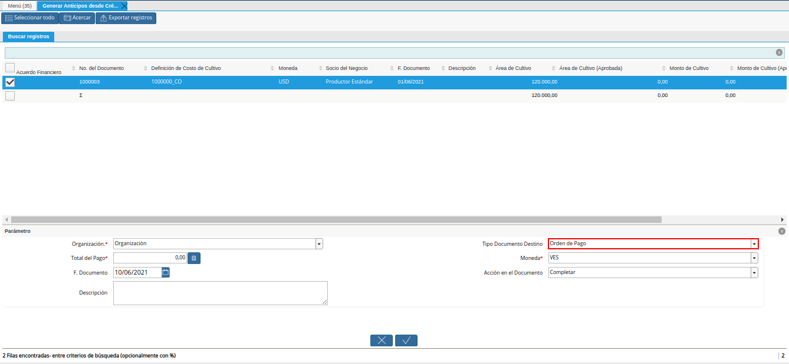
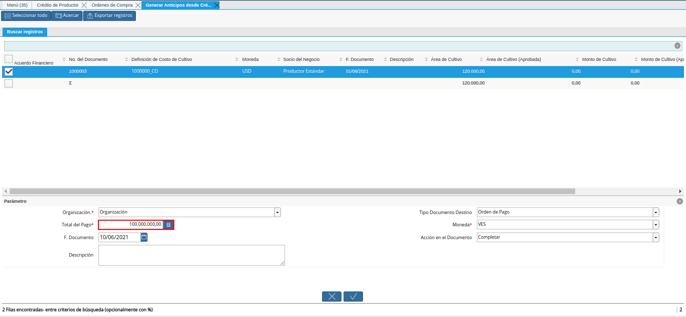
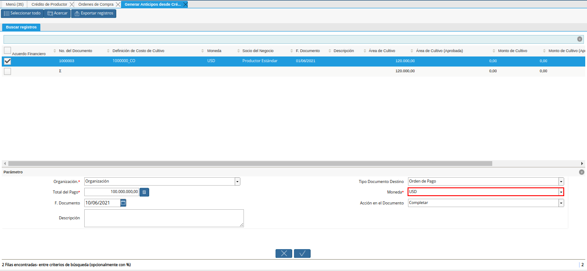
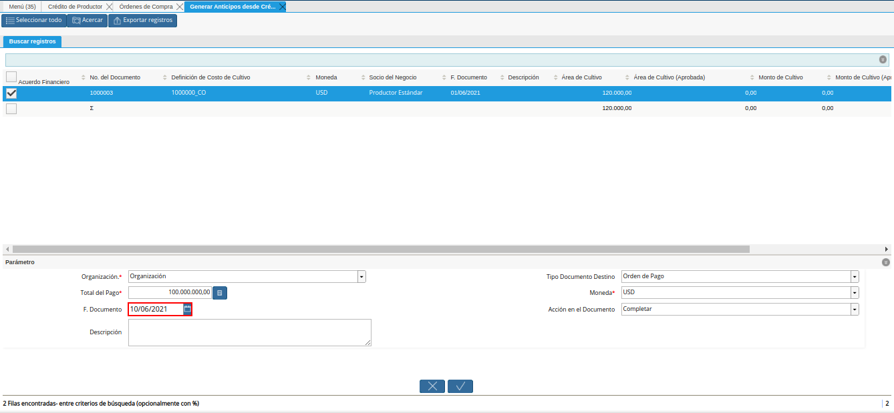
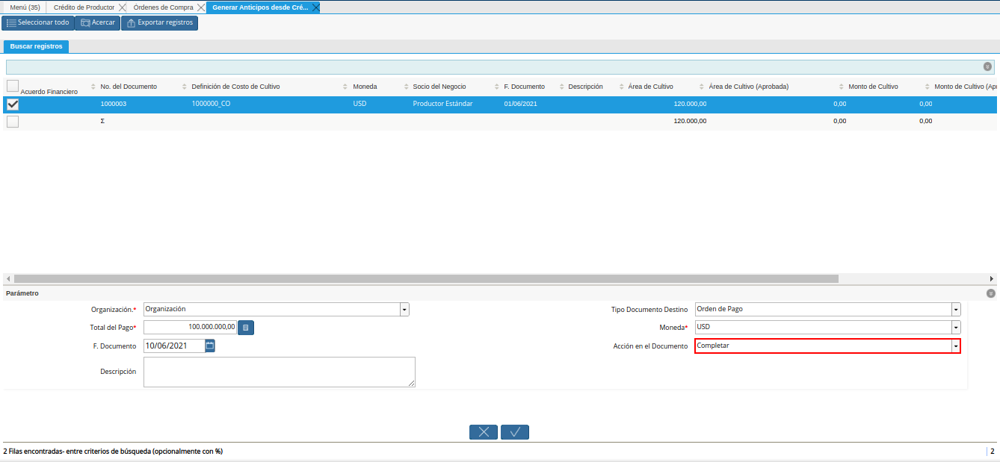
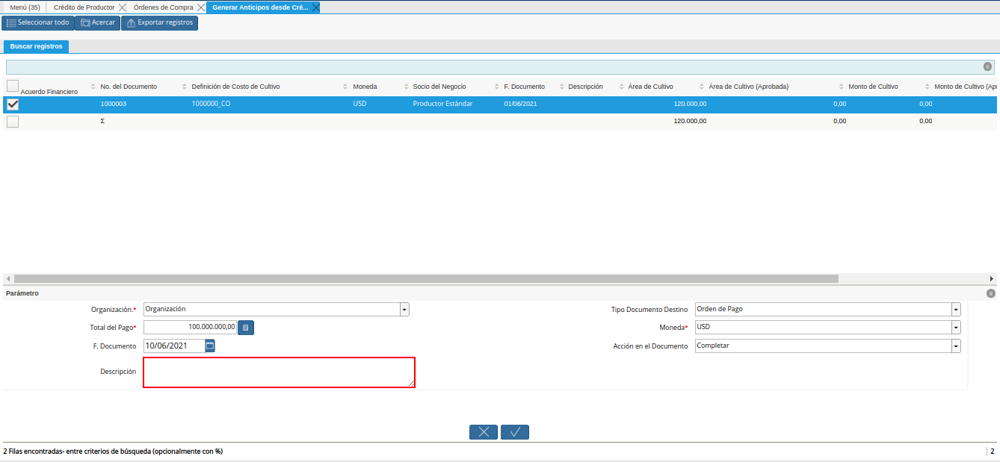
.. |opción ok del generar anticipos desde crédito al productor| image:: resources/ok-option-to-generate-advances-from-producer-credit.png
.. |documento generado desde crédito al productor| image:: resources/document-generated-from-producer-credit.png
.. |pestaña del documento generado| image:: resources/generated-document-tab.png

.. _documento/generar-anticipos-desde-crédito-al-productor:

**Generar Anticipos desde Crédito al Productor**
================================================

Ubique y seleccione en el menú de ADempiere, la carpeta "**Gestión de Asistencia al Agricultor**", luego seleccione la carpeta "**Inversión Agrícola y Préstamos**". Por último seleccione la ventana de búsqueda inteligente "**Generar Anticipos desde Crédito al Productor**".

    |menú de generar anticipos desde crédito al productor|

    Imagen 1. Menú de ADempiere

Podrá visualizar la ventana de búsqueda inteligente (smart browser) "**Generar Anticipos desde Crédito al Productor**", con diferentes campos que permite filtrar la información para generar el documento enm base a lo requerido por el usuario.

    |ventana de búsqueda inteligente generar anticipos desde crédito al productor|

    Imagen 2. Ventana del Smart Browser

Seleccione en el campo "**Socio del Negocio**", el socio del negocio por el cual requiere filtrar la información.

    |campo socio del negocio del generar anticipos desde crédito al productor|

    Imagen 3. Campo Socio del Negocio

Seleccione en el campo "**F. Documento**", el rango de fecha del documento por el cual requiere filtrar la información.

    |campo fecha del documento del generar anticipos desde crédito al productor|

    Imagen 4. Campo F. Documento

Seleccione en el campo "**Acuerdo Financiero**", el acuerdo financiero o crédito de productor por el cual requiere filtrar la información.

    |campo acuerdo financiero del generar anticipos desde crédito al productor|

    Imagen 5. Campo Acuerdo Financiero

Seleccione en el campo "**Definición de Costo de Cultivo**", la definición de costo de cultivo por la cual requiere filtrar la información.

    |campo definición de costo de cultivo del generar anticipos desde crédito al productor|

    Imagen 6. Campo Definición de Costo de Cultivo

Seleccione en el campo "**Producto Financiero**", el producto financiero por el cual requiere filtrar la información.

    |campo producto financiero del generar anticipos desde crédito al productor|

    Imagen 7. Campo Producto Financiero

Seleccione la opción "**Comenzar Búsqueda**", para realizar la búsqueda de información en base a lo seleccionado en los campos indicados anteriormente.

    |opción comenzar búsqueda del generar anticipos desde crédito al productor|

    Imagen 8. Opción Comenzar Búsqueda

Podrá visualizar los resultados de la búsqueda, filtrados según lo seleccionado previamente.

    |resultados de la búsqueda del generar anticipos desde crédito al productor|

    Imagen 9. Resultados de la Búsqueda

Seleccione el registro de crédito de productor por el cual requiere generar el anticipo.

    |selección de registro del generar anticipos desde crédito al productor|

    Imagen 10. Selección de Registro

Seleccione en el campo "**Organización**", la organización para la cual requiere generar el documento de anticipo.

    |campo organización del generar anticipos desde crédito al productor|

    Imagen 11. Campo Organización

Seleccione en el campo "**Tipo de Documento Destino**", el tipo de documento con el cual requiere que se genere el registro.

    |campo tipo de documento destino del generar anticipos desde crédito al productor|

    Imagen 12. Campo Tipo de Documento

Seleccione en el campo "**Total del Pago**", el monto total del anticipo.

    |campo total del pago del generar anticipos desde crédito al productor|

    Imagen 13. Campo Total del Pago

Seleccione en el campo "**Moneda**", la moneda del monto total del anticipo.

    |campo moneda del generar anticipos desde crédito al productor|

    Imagen 14. Campo Moneda 

Seleccione en el campo "**F. Documento**", la fecha con la cual requiere generar el documento.

    |campo fecha del documento para generar anticipos desde crédito al productor|

    Imagen 15. Campo F. Documento

Seleccione en el campo "**Acción del Documento**", la acción del documento con la cual requiere que se genere el documento.

    |campo acción del documento del generar anticipos desde crédito al productor|

    Imagen 16. Campo Acción del Documento

Introduzca en el campo "**Descripción**", una breve descripción referente al documento que requiere generar.

    |campo descripción del generar anticipos desde crédito al productor|

    Imagen 17. Campo Descripción

Seleccione la opción "**OK**", para ejecutar el proceso y generar el documento en base a lo indicado en el smart browser "**Generar Anticipos desde Crédito al Productor**".

    |opción ok del generar anticipos desde crédito al productor|

    Imagen 18. Opción OK

Luego de ejecutar el proceso, podrá visualizar de la siguiente manera el registro del documento generado desde el crédito de productor.

    |documento generado desde crédito al productor|

    Imagen 19. Documento Generado

Adicionalmente, podrá visualizar de la siguiente manera el detalle del documento al seleccionar la pestaña "**Línea de Selección de Pago**", la misma contiene lo siguiente.

    - Socio del Negocio: El nombre del productor asociado al crédito de productor.

    - Orden de Compra: La orden de compra asociada al crédito de productor.

    - Regla de Pago: La regla de pago definida para el productor asociado al crédito de productor.

    - Importe Fuente: El monto total de la orden de compra asociada al crédito de productor.

    - Tipo de Conversión: El tipo de conversión asociado a la orden de compra.

    - Total del Pago: Monto total del anticipo, ingresado en el campo "**Total del Pago**", del smart browser "**Generar Anticipos desde Crédito al Productor**".

    - Total Abierto: Monto total abierto del productor asociado al crédito de productor.

    |pestaña del documento generado|

    Imagen 20. Detalle de Documento Generado