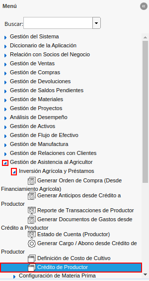
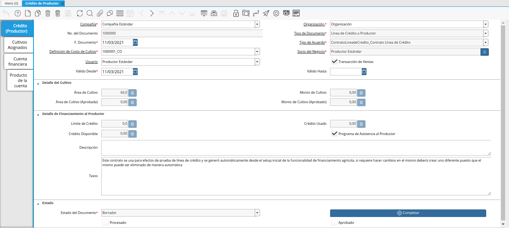
.. |icono registro nuevo de la ventana crédito del productor| image:: resources/new-record-icon-of-the-producer-credit-window.png
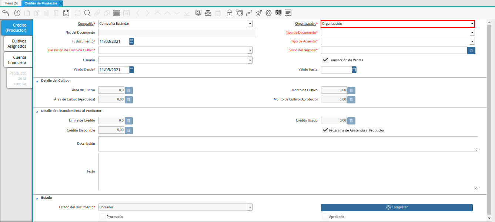
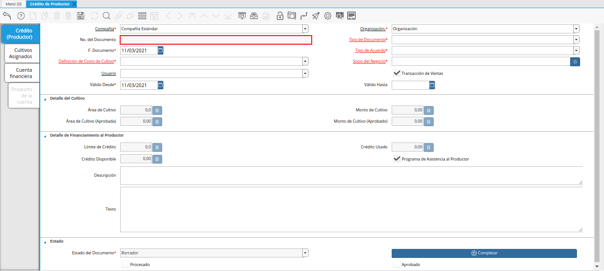
.. |campo tipo de documento de la ventana crédito del productor| image:: resources/document-type-field-of-the-producer-credit-window.png
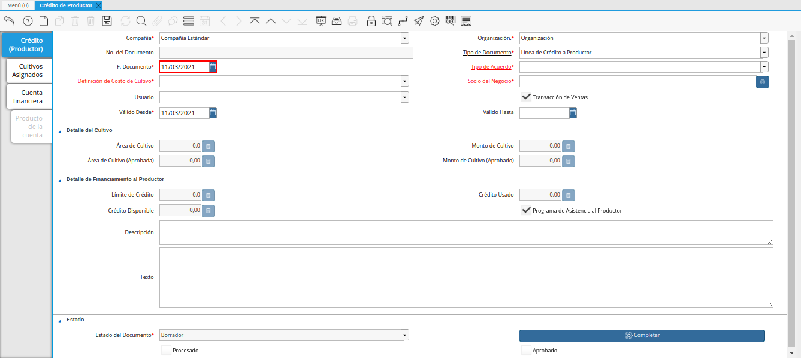
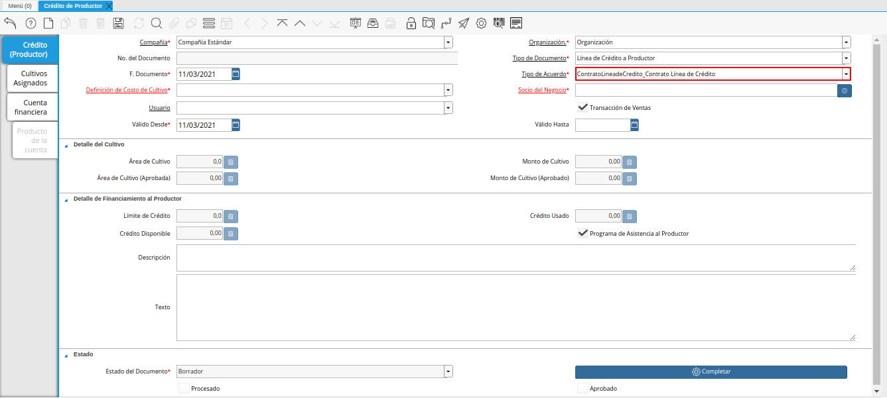
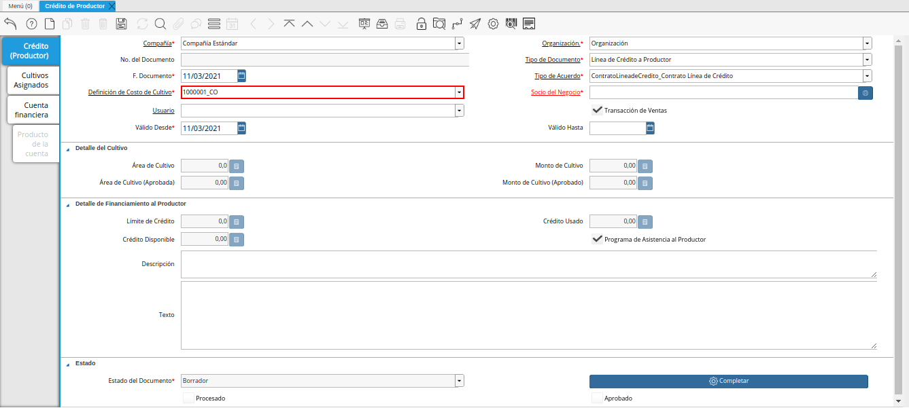
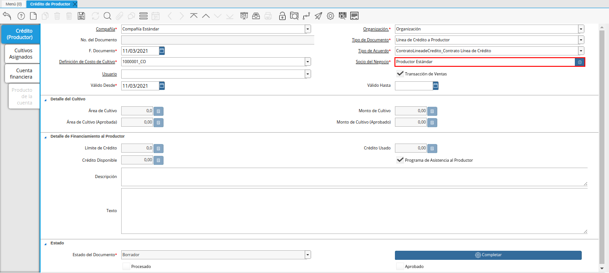
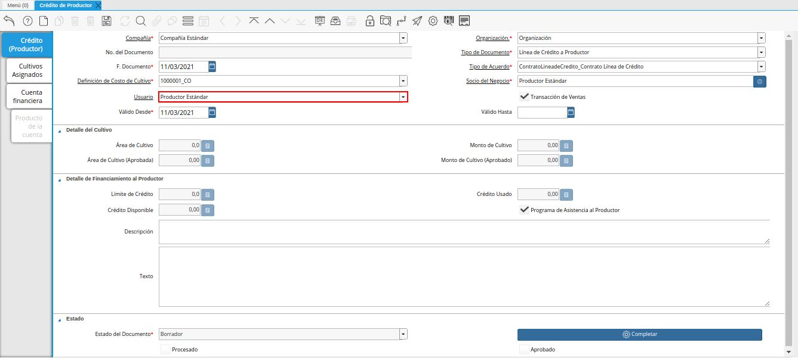
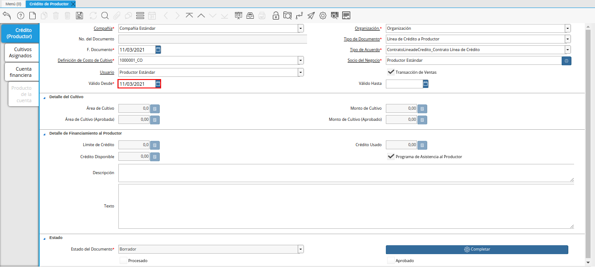
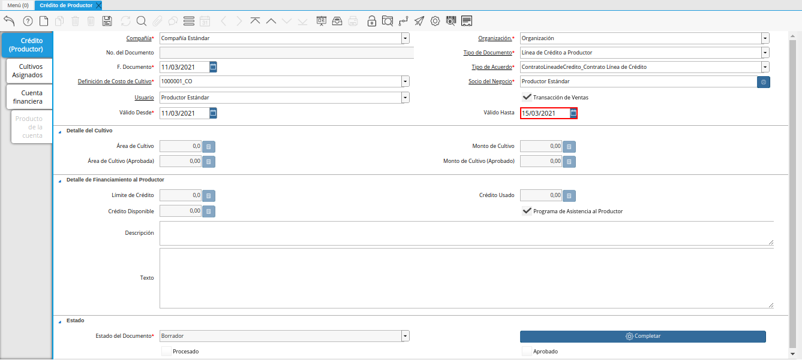
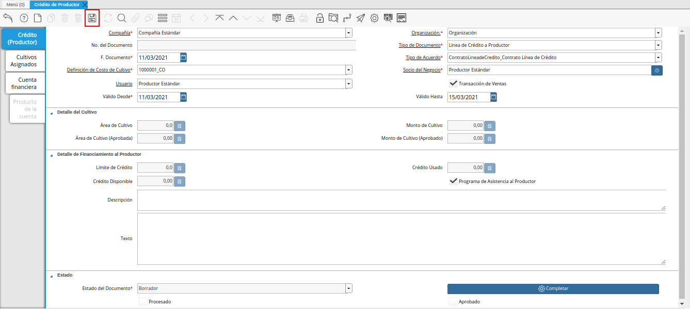
.. |pestaña cultivos asignados de la ventana crédito del productor| image:: resources/assigned-crop-tab-of-the-producer-credit-window.png
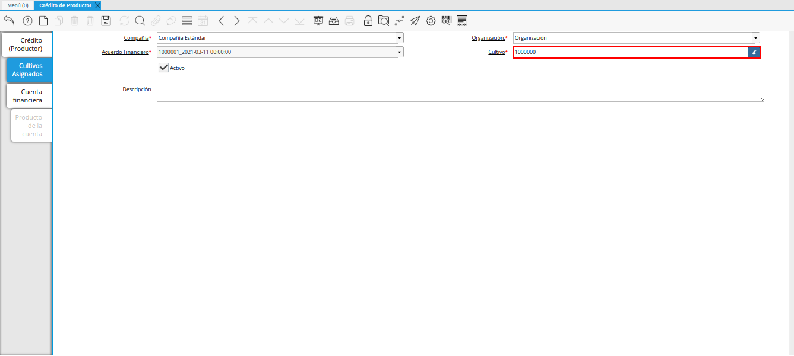
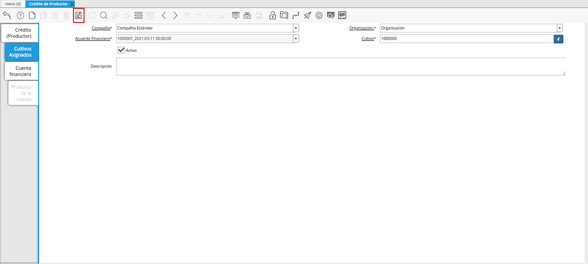
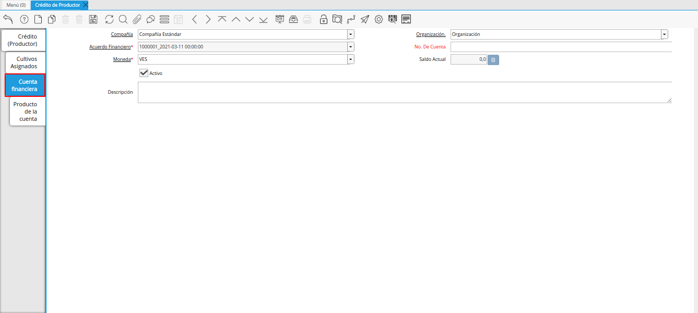
.. |campo número de cuenta de la pestaña cuenta financiera de la ventana crédito del productor| image:: resources/account-number-field-of-the-financial-account-tab-of-the-producer-credit-window.png
.. |campo moneda de la pestaña cuenta financiera de la ventana crédito del productor| image:: resources/currency-field-of-the-financial-account-tab-of-the-producer-credit-window.png
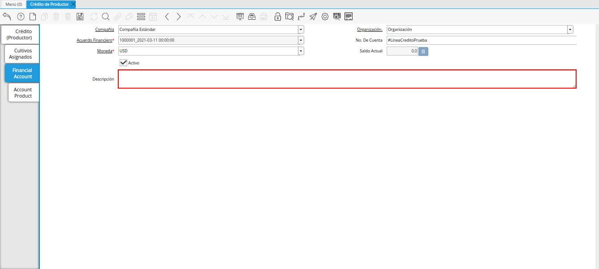
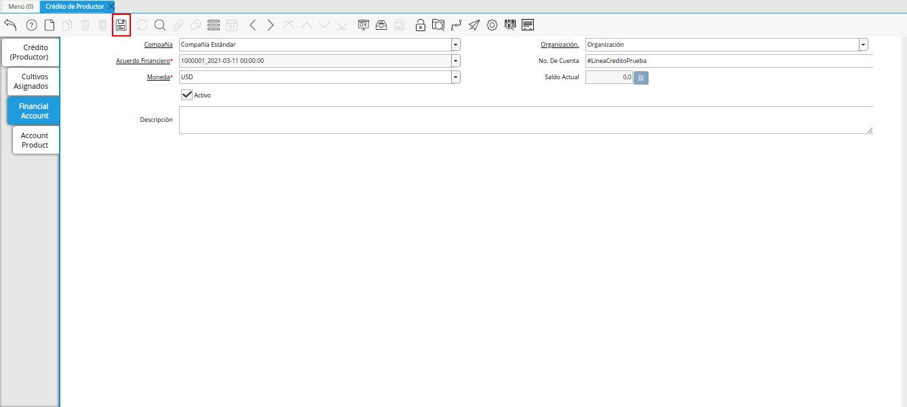
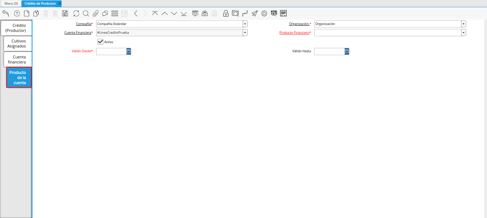
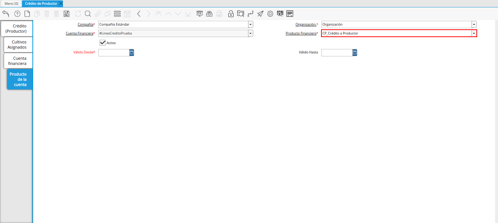
.. |campo válido desde de la pestaña producto de la cuenta de la ventana crédito del productor| image:: resources/valid-field-from-the-account-products-tab-of-the-producer-credit-window.png
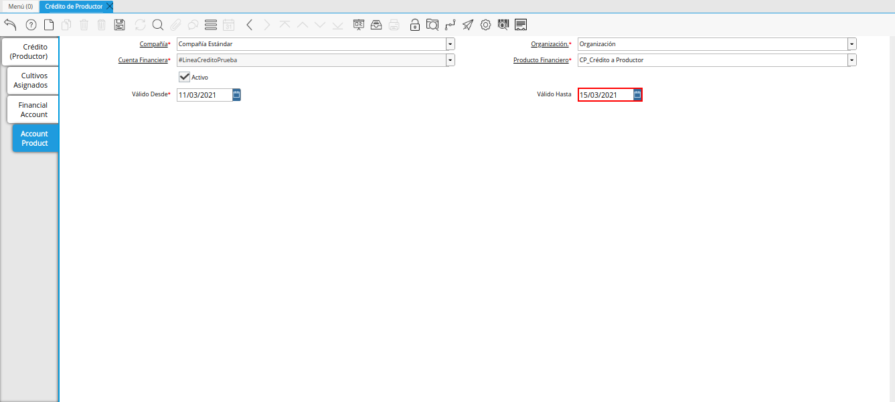
.. |icono guardar cambios de la pestaña producto de la cuenta de la ventana crédito del productor| image:: resources/save-changes-icon-from-the-account-products-tab-of-the-producer-credit-window.png
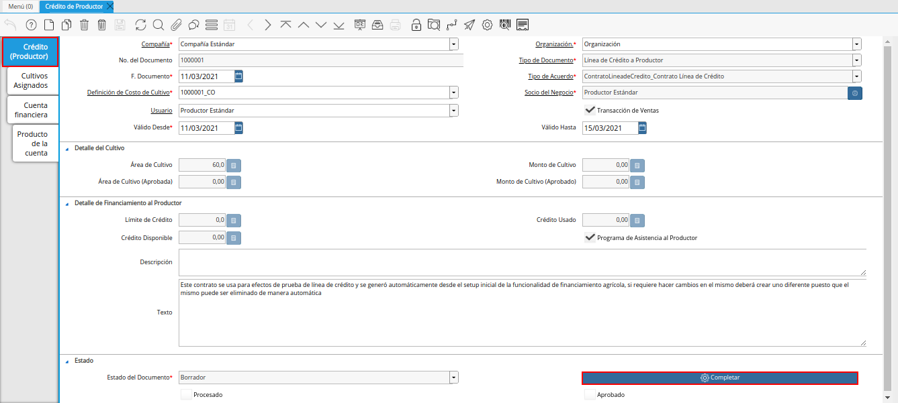
.. |acción completar y opción ok| image:: resources/action-complete-and-option-ok.png

.. _ERPyA: http://erpya.com

.. _documento/crédito-del-productor:

**Crédito del Productor**
=========================

 Ubique y seleccione en el menú de ADempiere, la carpeta "**Gestión de Asistencia al Agricultor**", luego seleccione la carpeta "**Inversión Agrícola y Préstamos**", por último seleccione la ventana "**Crédito del Productor**".

    |menú de crédito del productor|

    Imagen 1. Menú de ADempiere

 Podrá visualizar la ventana "**Crédito del Productor**", con los diferentes registros de créditos de productores.

    |ventana crédito del productor|

    Imagen 2. Ventana Crédito del Productor

 Seleccione el icono "**Registro Nuevo**", ubicado en la barra de herramientas de ADempiere.

    |icono registro nuevo de la ventana crédito del productor|

    Imagen 3. Icono Registro Nuevo 

 Seleccione en el campo "**Organización**", la organización para la cual se encuentra realizando el registro.

    |campo organización de la ventana crédito del productor|

    Imagen 4. Campo Organización

 Al guardar el registro de la ventana "**Crédito de Productor**", podrá visualizar en el campo "**No. del Documento**", el número de documento correspondiente a la secuencia del registro que se encuentra realizando.

    |campo número del documento de la ventana crédito del productor|

    Imagen 5. Campo No. del Documento

 Seleccione el tipo de documento a generar en el campo "**Tipo de Documento**", la selección de este define el comportamiento del documento que se esta elaborando, dicho comportamiento se encuentra explicado en el documento **Tipo de Documento** elaborado por `ERPyA`_.

    |campo tipo de documento de la ventana crédito del productor|

    Imagen 6. Campo Tipo de Documento

 Seleccione en el campo "**F. Documento**", la fecha en la que se encuentra realizando el documento.

    |campo fecha del documento de la ventana crédito del productor|

    Imagen 7. Campo F. Documento

 Seleccione en el campo "**Tipo de Acuerdo**", el tipo de acuerdo correspondiente al registro que se encuentra realizando.

    |campo tipo de acuerdo de la ventana crédito del productor|

    Imagen 8. Campo Tipo de Acuerdo

 Seleccione en el campo "**Definición de Costo de Cultivo**", la definición de costo de cultivo correspondiente al registro que se encuentra realizando.

    |campo definición de costo de cultivo de la ventana crédito del productor|

    Imagen 9. Campo Definición de Costo de Cultivo

 Seleccione en el campo "**Socio del Negocio**", el socio del negocio correspondiente al registro que se encuentra realizando.

    |campo socio del negocio de la ventana crédito del productor|

    Imagen 10. Campo Socio del Negocio

 Seleccione en el campo "**Usuario**", el usuario correspondiente al registro que se encuentra realizando.

    |campo usuario de la ventana crédito del productor|

    Imagen 11. Campo Usuario

 Seleccione en el campo "**Válido Desde**", la fecha de inicio del rango o periodo de validez del registro que se encuentra realizando.

    |campo válido desde de la ventana crédito del productor|

    Imagen 12. Campo Válido Desde

 Seleccione en el campo "**Válido Hasta**", la fecha final del rango o periodo de validez del registro que se encuentra realizando.

    |campo válido hasta de la ventana crédito del productor|

    Imagen 13. Campo Válido Hasta

 Seleccione el icono "**Guardar Cambios**", ubicado en la barra de herramientas de ADempiere.

    |icono guardar cambios de la ventana crédito del productor|

    Imagen 14. Icono Guardar Cambios

 Seleccione la pestaña "**Cultivos Asignados**" y proceda al llenado de los campos correspondientes.

    |pestaña cultivos asignados de la ventana crédito del productor|

    Imagen 15. Pestaña Cultivos Asignados

 Seleccione en el campo "**Cultivo**", el cultivo correspondiente al registro que se encuentra realizando.

    |campo cultivo de la pestaña cultivos asignados de la ventana crédito del productor|

    Imagen 16. Campo Cultivo

 Seleccione el icono "**Guardar Cambios**", ubicado en la barra de herramientas de ADempiere.

    |icono guardar cambios de la pestaña cultivos asignados de la ventana crédito del productor|

    Imagen 17. Icono Guardar Cambios

 Seleccione la pestaña "**Cuenta Financiera**" y proceda al llenado de los campos correspondientes.

    |pestaña cuenta financiera de la ventana crédito del productor|

    Imagen 18. Pestaña Cuenta Financiera

 Introduzca en el campo "**No. De Cuenta**", el número de cuenta correspondiente al registro que se encuentra realizando.

    |campo número de cuenta de la pestaña cuenta financiera de la ventana crédito del productor|

    Imagen 19. Campo No. De Cuenta

 Seleccione en el campo "**Moneda**", la moneda correspondiente al registro que se encuentra realizando.

    |campo moneda de la pestaña cuenta financiera de la ventana crédito del productor|

    Imagen 20. Campo Moneda

 Introduzca en el campo "**Descripción**", una breve descripción correspondiente al registro que se encuentra realizando.

    |campo descripción de la pestaña cuenta financiera de la ventana crédito del productor|

    Imagen 21. Campo Descripción

 Seleccione el icono "**Guardar Cambios**", ubicado en la barra de herramientas de ADempiere.

    |icono guardar cambios de la pestaña cuenta financiera de la ventana crédito del productor|

    Imagen 22. Icono Guardar Cambios

 Seleccione la pestaña "**Producto de la Cuenta**" y proceda al llenado de los campos correspondientes.

    |pestaña producto de la cuenta de la ventana crédito del productor|

    Imagen 23. Pestaña Producto de la Cuenta

 Seleccione en el campo "**Producto Financiero**", el producto financiero correspondiente al registro que se encuentra realizando.

    |campo producto financiero de la pestaña producto de la cuenta de la ventana crédito del productor|

    Imagen 24. Campo Producto Financiero

 Seleccione en el campo "**Válido Desde**", la fecha de inicio del rango o periodo de validez del registro que se encuentra realizando.

    |campo válido desde de la pestaña producto de la cuenta de la ventana crédito del productor|

    Imagen 25. Campo Válido Desde

 Seleccione en el campo "**Válido Hasta**", la fecha final del rango o periodo de validez del registro que se encuentra realizando.

    |campo válido hasta de la pestaña producto de la cuenta de la ventana crédito del productor|

    Imagen 26. Campo Válido Hasta

 Seleccione el icono "**Guardar Cambios**", ubicado en la barra de herramientas de ADempiere.

    |icono guardar cambios de la pestaña producto de la cuenta de la ventana crédito del productor|

    Imagen 27. Icono Guardar Cambios

 Seleccione la pestaña principal "**Crédito (Productor)**" y la opción "**Completar**".

    |pestaña principal crédito productor y opción completar|

    Imagen 28. Pestaña Principal Crédito Productor  y Opción Completar

 Seleccione la acción "**Completar**" y la opción "**OK**".

    |acción completar y opción ok|

    Imagen 29. Acción Completar y Opción OK