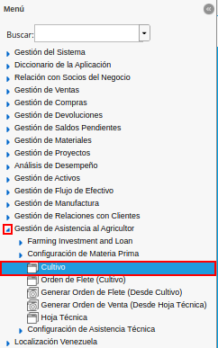

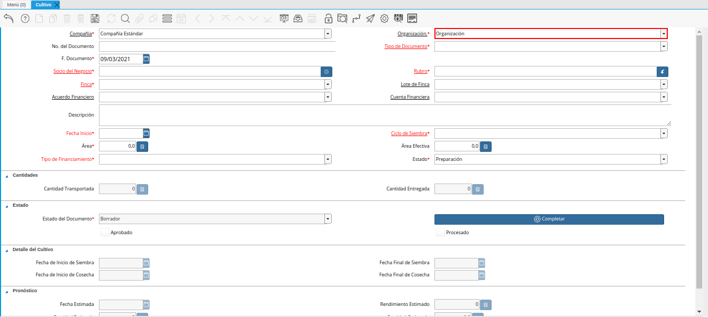

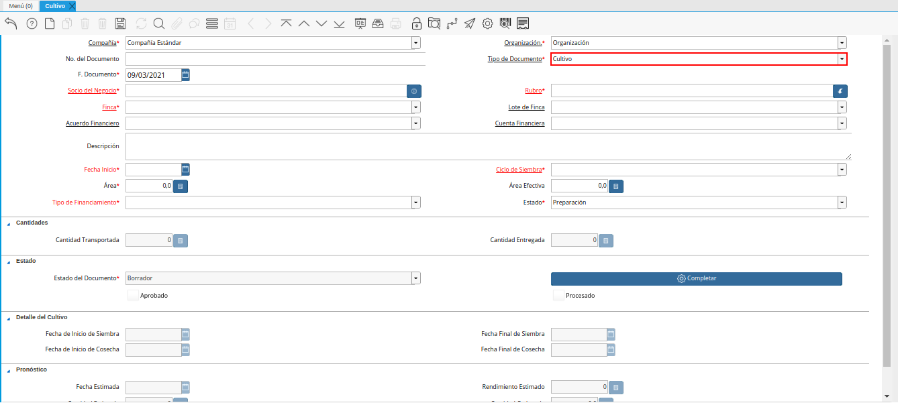

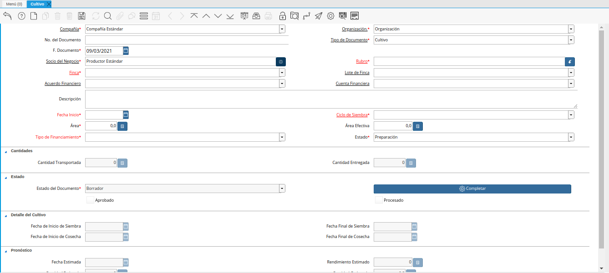
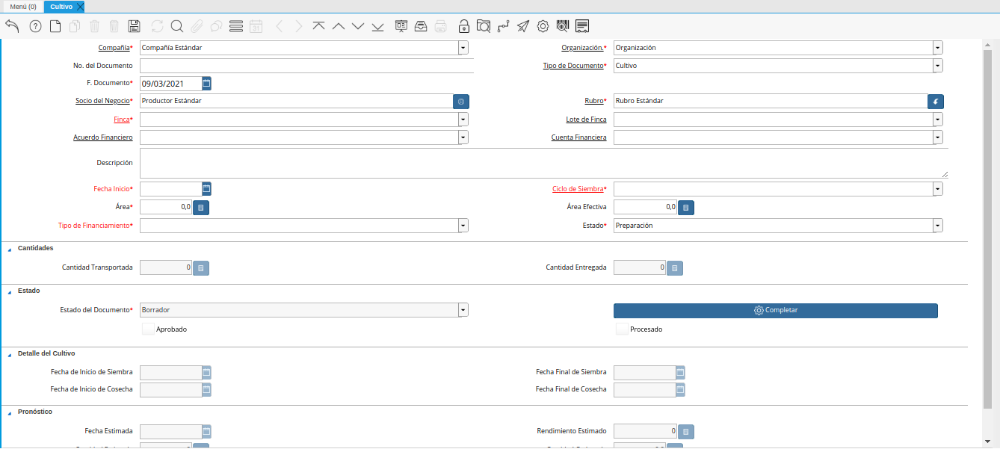
.. |campo finca de la ventana cultivo| image:: resources/field-window-farm-cultivation.png
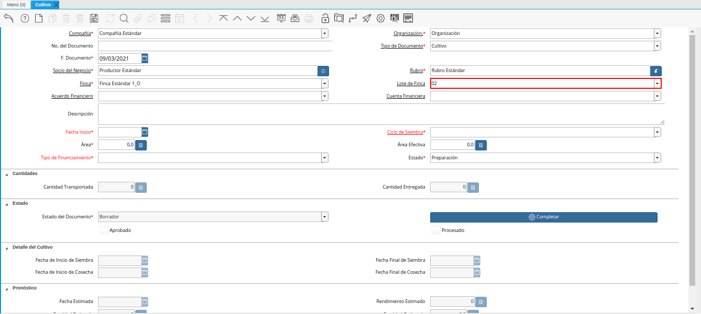

.. |campo cuenta financiera de la ventana cultivo| image:: resources/field-financial-account-window-cultivation.png
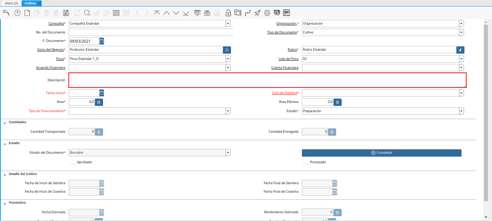

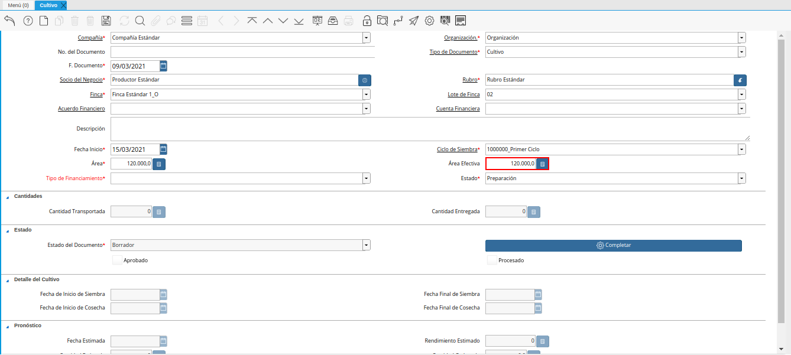
.. |campo tipo de financiamiento de la ventana cultivo| image:: resources/field-window-financing-type-cultivation.png
.. |campo estado de la ventana cultivo| image:: resources/crop-window-status-field.png
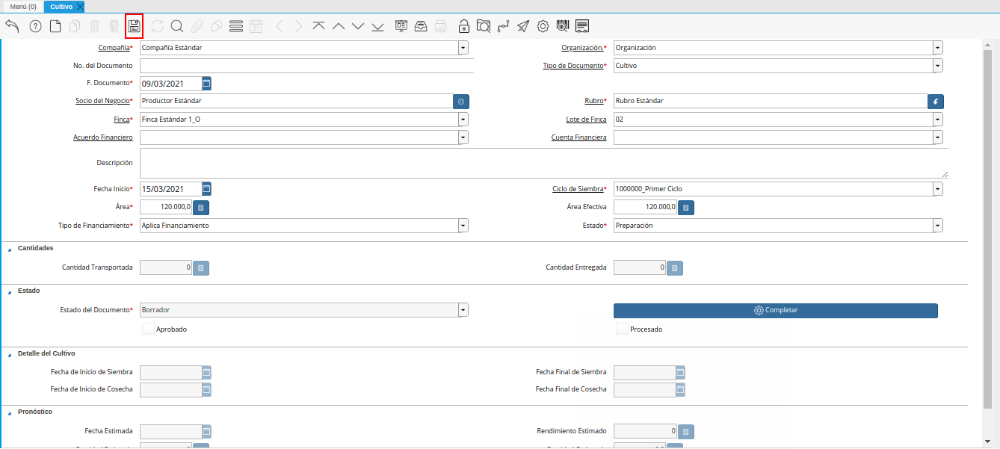
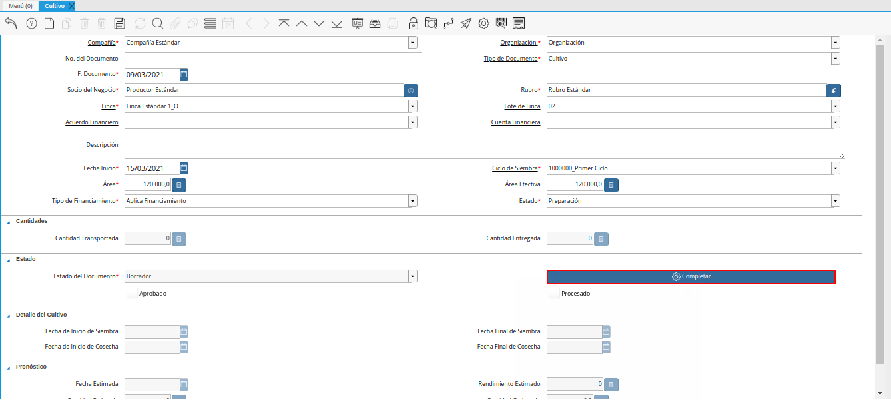
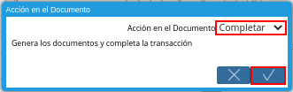

.. _ERPyA: http://erpya.com

.. _documento/cultivo:

**Cultivo**
===========

 Ubique y seleccione en el menú de ADempiere, la carpeta "**Gestión de Asistencia al Agricultor**", luego seleccione la ventana "**Cultivo**".

    |menú de cultivo|

    Imagen 1. Menú de ADempiere

 Podrá visualizar la ventana "**Cultivo**", con los diferentes registros de cultivos.

    |ventana cultivo|

    Imagen 2. Ventana Cultivo

 Seleccione el icono "**Registro Nuevo**", ubicado en la barra de herramientas de ADempiere.

    |icono registro nuevo de la ventana cultivo|

    Imagen 3. Icono Registro Nuevo

 Seleccione en el campo "**Organización**", la organizazción para la cual se encuentra realizando el registro de cultivo.

    |campo organización de la ventana cultivo|

    Imagen 4. Campo Organización

 Introduzca en el campo "**No. del Documento**", el número de documento correspondiente al registro que se encuentra realizando.

    |campo número del documento de la ventana cultivo|

    Imagen 5. Campo No. del Documento

 Seleccione el tipo de documento a generar en el campo "**Tipo de Documento Destino**", la selección de este define el comportamiento del documento que se esta elaborando, dicho comportamiento se encuentra explicado en el documento **Tipo de Documento** elaborado por `ERPyA`_.

    |campo tipo de documento de la ventana cultivo|

    Imagen 6. Campo Tipo de Documento

 Seleccione en el campo "**F. Documento**", la fecha en la que se encuentra realizando el registro de cultivo.

    |campo fecha de documento de la ventana cultivo|

    Imagen 7. Campo Fecha de Documento

 Seleccione en el campo "**Socio del Negocio**", el socio del negocio correspondiente al registro que se encuentra realizando.

    |campo socio del negocio de la ventana cultivo|

    Imagen 8. Campo Socio del Negocio

 Seleccione en el campo "**Rubro**", el rubro correspondiente al registro que se encuentra realizando.

    |campo rubro de la ventana cultivo|

    Imagen 9. Campo Rubro

 Seleccione en el campo "**Finca**", la finca correspondiente al registro que se encuentra realizando.

    |campo finca de la ventana cultivo|

    Imagen 10. Campo Finca

 Seleccione en el campo "**Lote de Finca**", el lote de finca correspondiente al registro que se encuentra realizando.

    |campo lote de finca de la ventana cultivo|

    Imagen 11. Campo Lote de Finca

 Seleccione en el campo "**Acuerdo Financiero**", el acuerdo financiero correspondiente al registro que se encuentra realizando.

    |acuerdo financiero de la ventana cultivo|

    Imagen 12. Acuerdo Financiero 

 Seleccione en el campo "**Cuenta Financiera**", la cuenta financiera correspondiente al registro que se encuentra realizando.

    |campo cuenta financiera de la ventana cultivo|

    Imagen 13. Campo Cuenta Financiera

 Introduzca en el campo "**Descripción**", una breve descripción referente al registro que se encuentra realizando.

    |campo descripción de la ventana cultivo|

    Imagen 14. Campo Descripción

 Seleccione en el campo "**Fecha de Inicio**", la fecha de inicio del cultivo correspondiente al registro que se encuentra realizando.

    |campo fecha de inicio de la ventana cultivo|

    Imagen 15. Campo Fecha de Inicio 

 Seleccione en el campo "**Ciclo de Siembra**", el ciclo de siembra correspondiente al registro que se encuentra realizando.

    |campo ciclo de siembra de la ventana cultivo|

    Imagen 16. Campo Ciclo de Siembra

 Seleccione en el campo "**Área**", el área correspondiente al registro que se encuentra realizando.

    |campo área de la ventana cultivo|

    Imagen 17. Campo Área

 Seleccione en el campo "**Área Efectiva**", el área efectiva correspondiente al registro que se encuentra realizando.

    |campo área efectiva de la ventana cultivo|

    Imagen 18. Campo Área Efectiva

 Seleccione en el campo "**Tipo de Financiamiento**", el tipo de financiamiento correspondiente al registro que se encuentra realizando.

    |campo tipo de financiamiento de la ventana cultivo|

    Imagen 19. Campo Tipo de Financiamiento

 Seleccione en el campo "**Estado**", el estado del cultivo correspondiente al registro que se encuentra realizando.

    |campo estado de la ventana cultivo|

    Imagen 20. Campo Estado

 Seleccione el icono "**Guardar Cambios**", ubicado en la barra de herramientas de ADempiere.

    |icono guardar cambios de la ventana cultivo|

    Imagen 21. Icono Guardar Cambios

 Seleccione la opción "**Completar**", para completar el registgro de cultivo que se encuentra realizando.

    |opción completar de la ventana cultivo|

    Imagen 22. Opción Completar

 Seleccione la acción "**Completar**" y la opción "**OK**".

    |acción completar y opción ok de la ventana cultivo|

    Imagen 23. Acción Completar y Opción OK