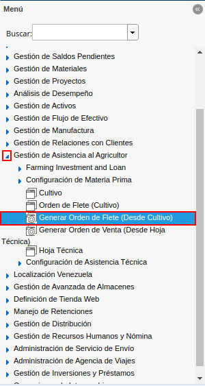

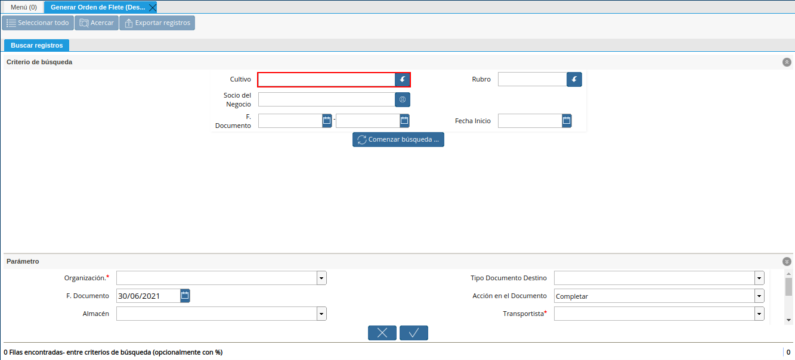
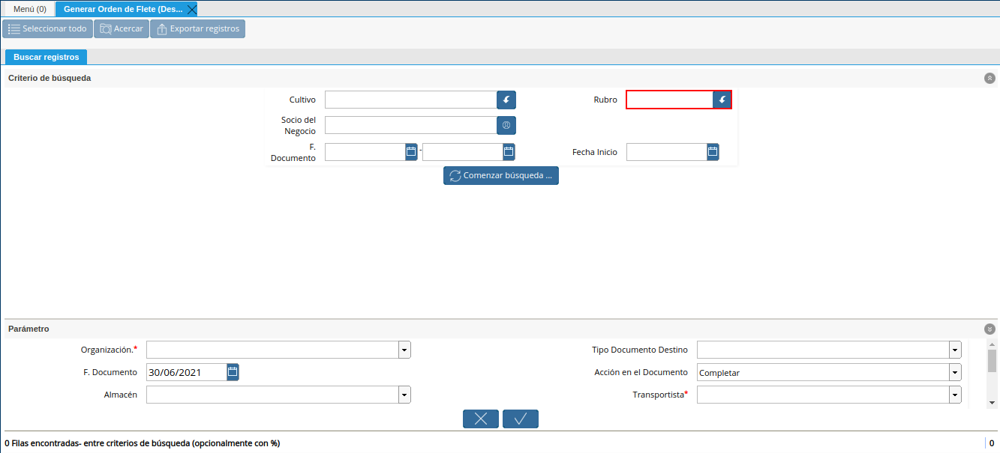
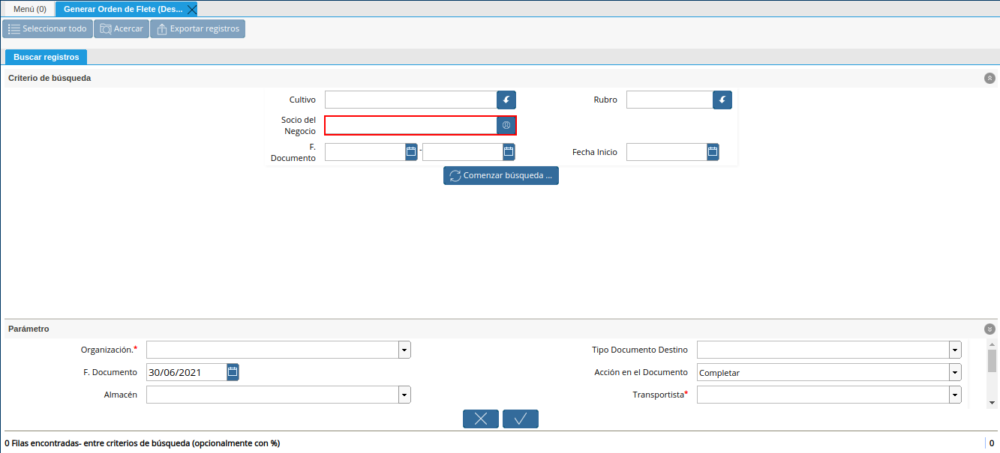
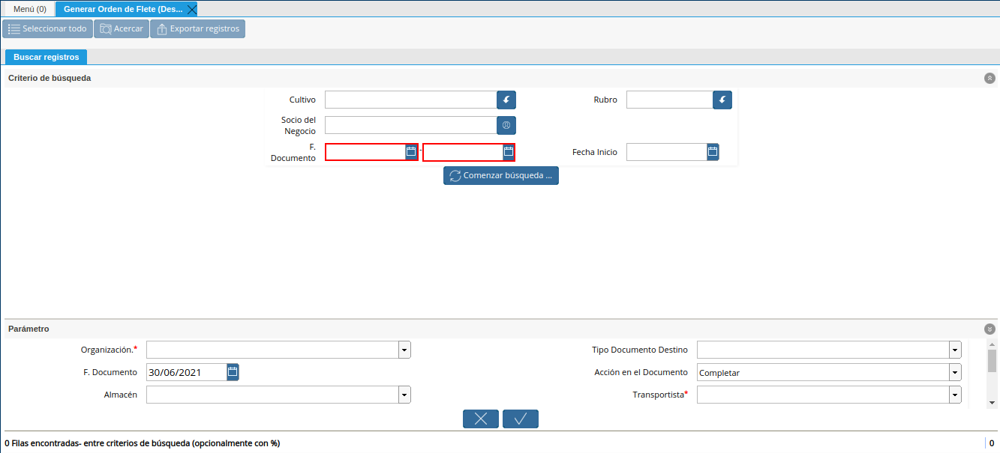
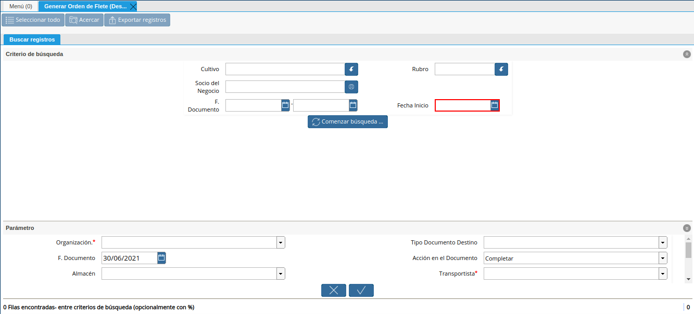
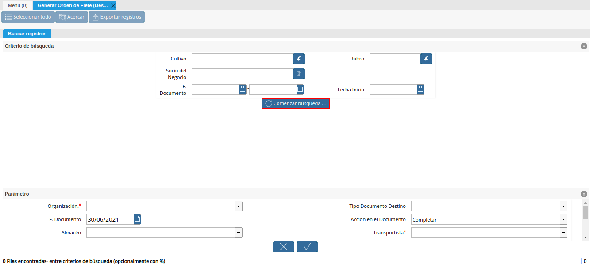
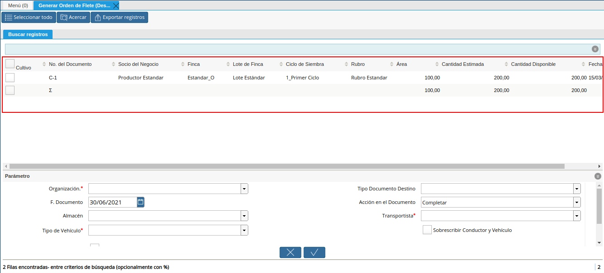
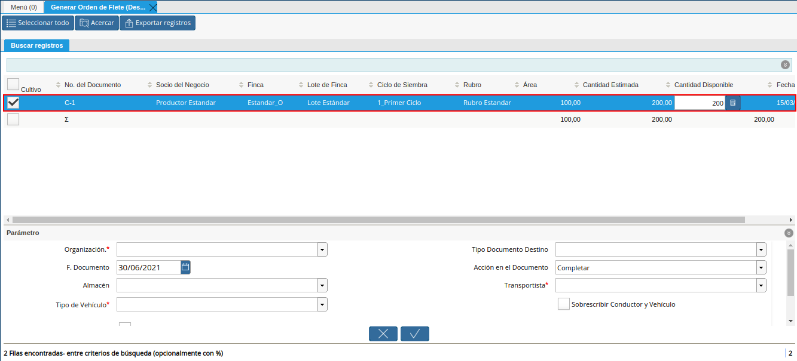
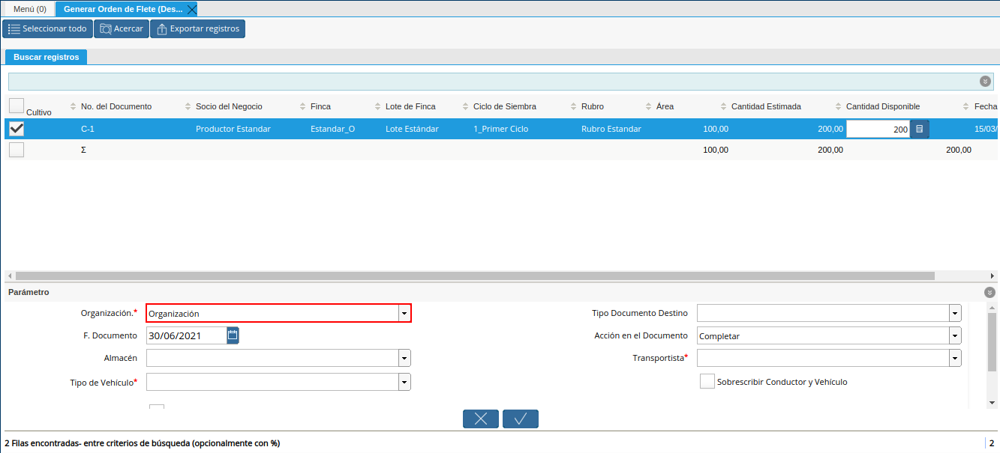

.. |campo fecha de documento a generar orden de flete desde cultivo| image:: resources/document-date-field-to-generate-freight-order-from-cultivation.png

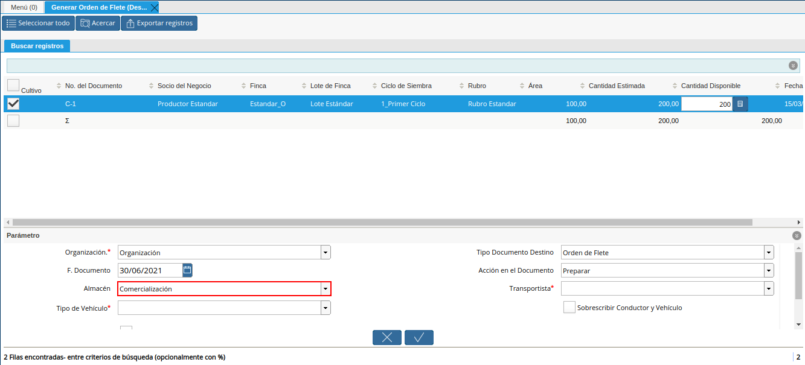
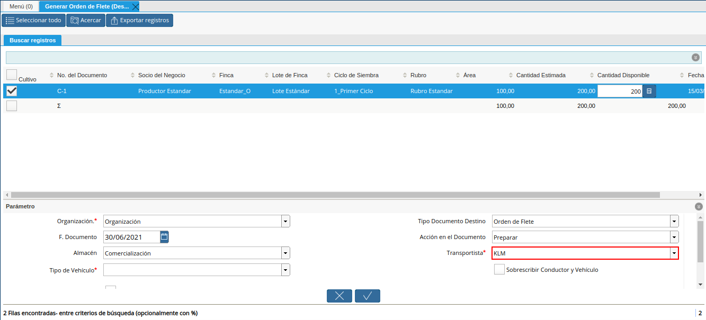

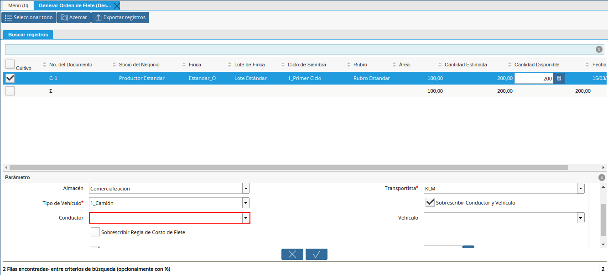

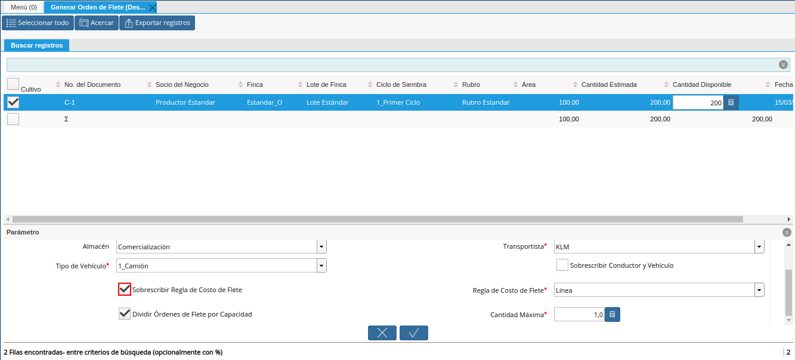
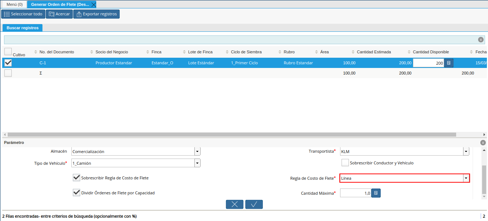

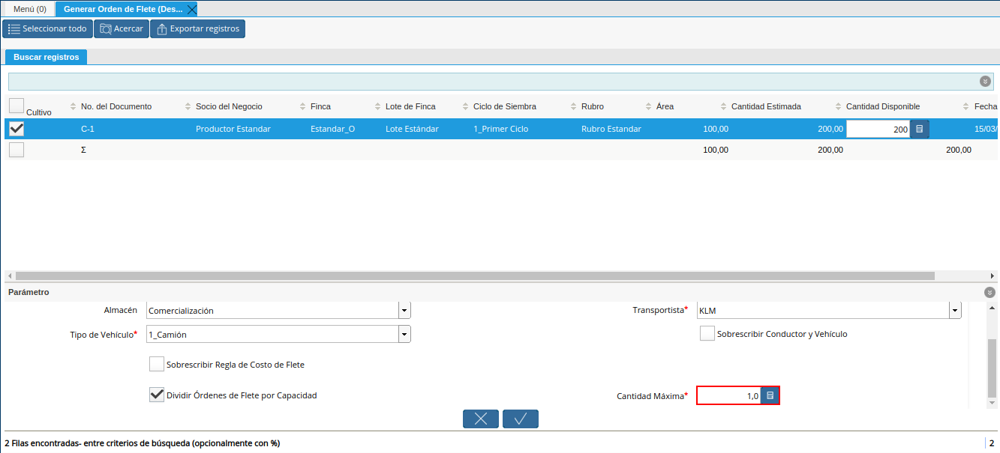
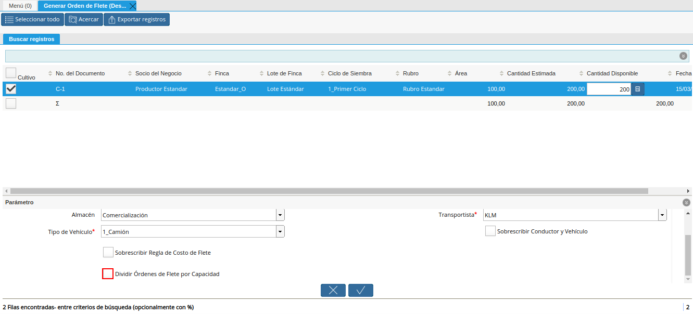
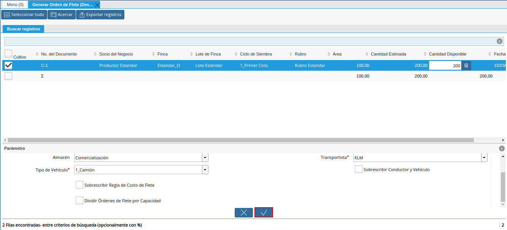
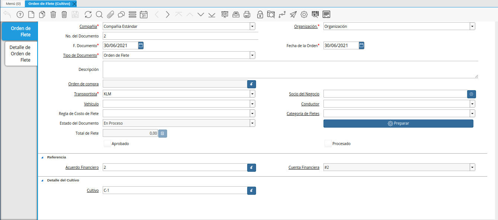

.. _documento/generar-orden-de-flete-desde-cultivo:

**Generar Orden de Flete desde Cultivo**
========================================

Para generar una orden de flete desde un cultivo, es obligatorio que el documento "**Cultivo**" se encuentre en estado "**Completo**". A continuación, se explica el procedimiento para generar una orden de flete desde un cultivo.

Ubique y seleccione en el menú de ADempiere, la carpeta "**Gestión de Asistencia al Agricultor**", luego seleccione la ventana de búsqueda inteligente (smart browser) "**Generar Orden de Flete (Desde Cultivo)**".

    |menú de generar orden de flete desde cultivo|

    Imagen 1. Menú de ADempiere

Podrá visualizar la ventana del smart browser "**Generar Orden de Flete (Desde Cultivo)**", con diferentes campos que permiten filtrar la información para generar el documento "**Orden de Flete**", en base a lo requerido por el usuario.

    |ventana de generar orden de flete desde cultivo|

    Imagen 2. Ventana del Smart Browser Generar Orden de Flete (Desde Cultivo)

Seleccione en el campo "**Cultivo**", el cultivo por el cual requiere filtrar la información.

    |campo cultivo de generar orden de flete desde cultivo|

    Imagen 3. Campo Cultivo

Seleccione en el campo "**Rubro**", el rubro por el cual requiere filtrar la información.

    |campo rubro de generar orden de flete desde cultivo|

    Imagen 4. Campo Rubro

Seleccione en el campo "**Socio del Negocio**", el socio del negocio por el cual requiere filtrar la información.

    |campo socio del negocio de generar orden de flete desde cultivo|

    Imagen 5. Campo Socio del Negocio

Seleccione en el campo "**F. Documento**", la fecha del documento por la cual requiere filtrar la información.

    |campo fecha del documento de generar orden de flete desde cultivo|

    Imagen 6. Campo F. Documento 

Seleccione en el campo "**Fecha Inicio**", la fecha de inicio por la cual requiere filtrar la información.

    |campo fecha de inicio de generar orden de flete desde cultivo|

    Imagen 7. Campo Fecha Inicio

Seleccione la opción "**Comenzar Búsqueda**", para filtrar la información en base a lo seleccionado en los campos indicados anteriormente.

    |opción comenzar búsqueda de generar orden de flete desde cultivo|

    Imagen 8. Opción Comenzar Búsqueda

Podrá visualizar los registros de cultivos que se encuentran en ADempiere en estado "**Completo**".

    |resultado de cultivos de generar orden de flete desde cultivo|

    Imagen 9. Resultado de Cultivos

Seleccione el registro de cultivo por el cual requiere generar el documento "**Orden de Flete**".

    |selección de registro de generar orden de flete desde cultivo|

    Imagen 10. Selección de Registro de Cultivo

Seleccione en el campo "**Organización**", la organización para la cual requiere generar el documento.

    |campo organización de generar orden de flete desde cultivo|

    Imagen 11. Campo Organización

Seleccione en el campo "**Tipo de Documento Destino**", el tipo de documento con el cual requiere que se genere el documento.

    |campo tipo de documento destino de generar orden de flete desde cultivo|

    Imagen 12. Campo Tipo de Documento Destino

Indique en el campo "**F. Documento**", la fecha con la cual requiere que se genere el documento.

    |campo fecha de documento a generar orden de flete desde cultivo|

    Imagen 13. Campo F. Documento

Seleccione en el campo "**Acción en el Documento**", la acción de documento con la cual requiere que se genere el documento.

    |campo acción en el documento de generar orden de flete desde cultivo|

    Imagen 14. Campo Acción en el Documento

Seleccione en el campo "**Almacén**", el almacén con el cual requiere que se genere el documento.

    |campo almacén de generar orden de flete desde cultivo|

    Imagen 15. Campo Almacén

Seleccione en el campo "**Transportista**", el transportista con el cual requiere que se genere el documento.

    |campo transportista de generar orden de flete desde cultivo|

    Imagen 16. Campo Transportista

Seleccione en el campo "**Tipo de Vehículo**", el tipo de vehículo con el cual requiere que se genere el documento.

    |campo tipo de vehículo de generar orden de flete desde cultivo|

    Imagen 17. Campo Tipo de Vehículo

Seleccione el check "**Sobrescribir Conductor y Vehículo**", para seleccionar un conductor y vehículo en específico.

    |check sobrescribir conductor y vehículo de generar orden de flete desde cultivo|

    Imagen 18. Check Sobrescribir Conductor y Vehículo

    Al tildar el check se visualiza el campo "**Conductor**", donde se debe seleccionar el conductor específico para el documento que requiere generar.

        |campo conductor de generar orden de flete desde cultivo|

        Imagen 19. Campo Conductor

    Adicional a ello, se visualiza el campo "**Vehículo**", donde se debe seleccionar el vehículo específico para el documento que requiere generar.

        |campo vehículo de generar orden de flete desde cultivo|

        Imagen 20. Campo Vehículo

Seleccione el check "**Sobrescribir Regla de Costo de Flete**", para seleccionar la regla de costo de flete del documento que requiere generar.

    |check sobrescribir regla de costo de flete de generar orden de flete desde cultivo|

    Imagen 21. Check Sobrescribir Regla de Costo de Flete

    Al tildar el check se visualiza el campo "**Regla de Costo de Flete**", donde se debe seleccionar la regla de costo de flete con la cual requiere generar el documento.

        |campo regla de costo de flete de generar orden de flete desde cultivo|

        Imagen 22. Campo Regla de Costo de Flete

El check "**Dividir Órdenes de Flete por Capacidad**", permite dividir las órdenes de flete por la capacidad del vehículo.

    |check dividir órdenes de flete por capacidad de generar orden de flete desde cultivo|

    Imagen 23. Check Dividir Órdenes de Flete por Capacidad

En el campo "**Cantidad Máxima**", se debe indicar la cantidad máxima por vehículo.

    |campo cantidad máxima de generar orden de flete desde cultivo|

    Imagen 24. Campo Cantidad Máxima

Al destildar el check "**Dividir Órdenes de Flete por Capacidad**", se deja de visualizar el campo "**Cantidad Máxima**".

    |destildar check dividir órdenes de flete por capacidad de generar orden de flete desde cultivo|

    Imagen 25. Destildar Check Dividir Órdenes de Flete por Capacidad

Seleccione la opción "**OK**", para ejecutar el proceso y generar la orden de flete en base a lo indicado en los campos explicados anteriormente.

    |opción ok de generar orden de flete desde cultivo|

    Imagen 26. Opción OK

Podrá visualizar de la siguiente manera el registro del documento generado en la ventana "**Orden de Flete (Cultivo)**".

    |resultado en la ventana orden de flete cultivo|

    Imagen 27. Orden de Flete Generada