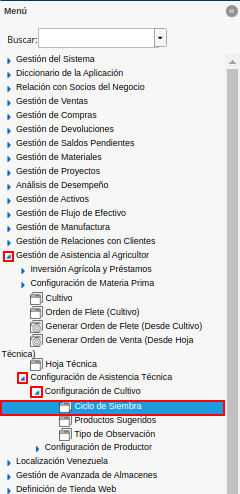
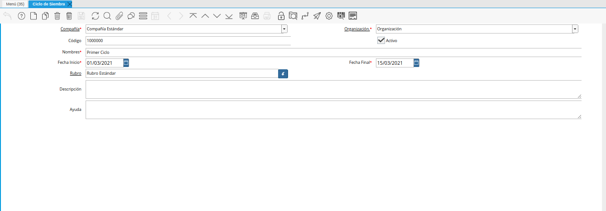
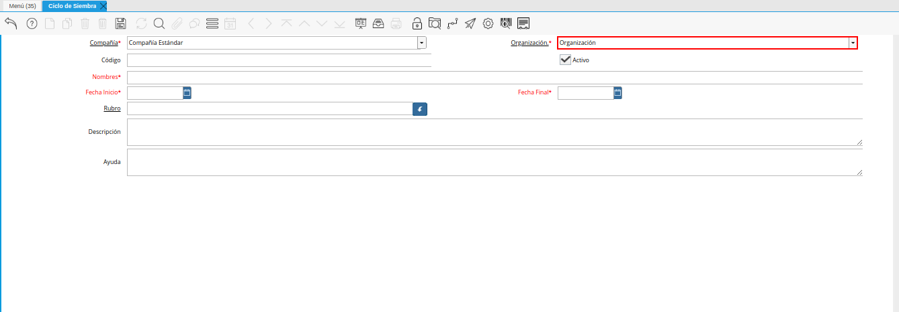
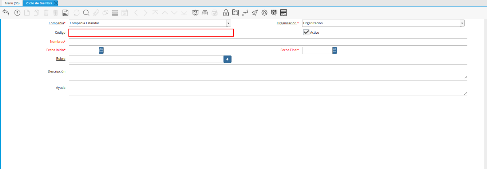
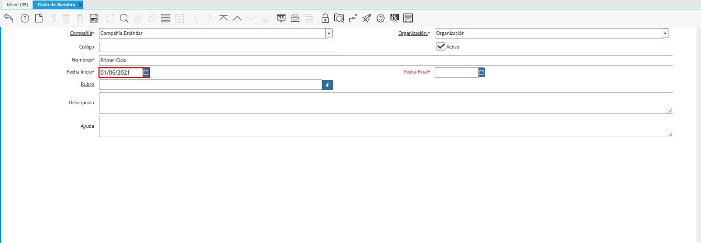
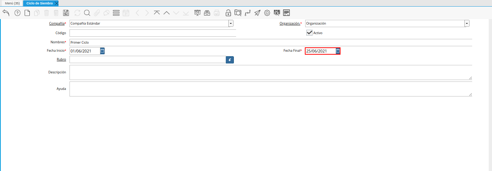
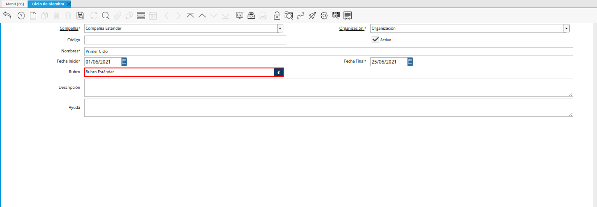
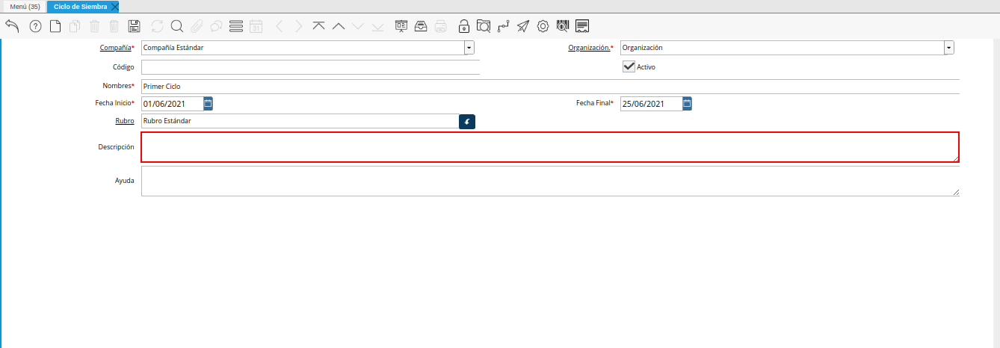

.. |icono registro nuevo de la ventana ciclo de siembra| image:: resources/new-record-icon-in-the-sowing-cycle-window.png

.. |campo nombre de la ventana ciclo de siembra| image:: resources/field-name-of-the-window-seeding-cycle.png

.. _documento/ciclo-de-siembra:

**Ciclo de Siembra**
====================

Ubique y seleccione en el menú de ADempiere, la carpeta "**Gestión de Asistencia al Agricultor**", luego seleccione la carpeta "**Configuración de Asistencia Técnica**", por último seleccione la carpeta "**Configuración de Cultivo**". Finalmente seleccione la ventana "**Ciclo de Siembra**".

    |menú de ciclo de siembra|

    Imagen 1. Menú de ADempiere

Podrá visualizar la ventana "**Ciclo de Siembra**", con los diferentes registros que posee la misma de los ciclos de siembra registrados en ADempiere.

    |ventana ciclo de siembra|

    Imagen 2. Ciclo de Siembra

Seleccione el icono "**Registro Nuevo**", ubicado en la barra de herramientas de ADempiere.

    |icono registro nuevo de la ventana ciclo de siembra|

    Imagen 3. Icono Registro Nuevo 

Seleccione en el campo "**Organización**", la organización para la cual se encuentra realizando el registro.

    |campo organización de la ventana ciclo de siembra|

    Imagen 4. Campo Organización

Introduzca en el campo "**Código**", el código correspondiente al registro que se encuentra realizando. De no ingresar ningún valor en el campo, ADempiere establece de manera automática el código del registro.

    |campo código de la ventana ciclo de siembra|

    Imagen 5. Campo Código

Introduzca en el campo "**Nombre**", el nombre del ciclo de siembra correspondiente al registro que se encuentra realizando.

    |campo nombre de la ventana ciclo de siembra|

    Imagen 6. Campo Nombre

Seleccione en el campo "**Fecha de Inicio**", la fecha de inicio del ciclo de siembra que se encuentra realizando.

    |campo fecha de inicio de la ventana ciclo de siembra|

    Imagen 7. Campo Fecha de Inicio

Seleccione en el campo "**Fecha Final**", la fecha final del ciclo de siembra que se encuentra realizando.

    |campo fecha final de la ventana ciclo de siembra|

    Imagen 8. Campo Fecha Final

Seleccione en el campo "**Rubro**", el rubro correspondiente al ciclo de siembra que se encuentra realizando.

    |campo rubro de la ventana ciclo de siembra|

    Imagen 9. Campo Rubro

Introduzca en el campo "**Descripción**", una breve descripción referente al registro del ciclo de siembra que se encuentra realizando.

    |campo descripción de la ventana ciclo de siembra|

    Imagen 10. Campo Descripción

.. note::

    Recuerde guardar el registro de los campos, al seleccionar el icono "**Guardar Cambios**" ubicado en la barra de herramientas de ADempiere.