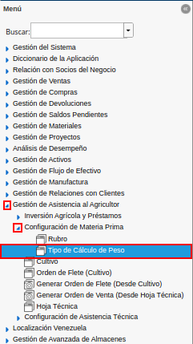
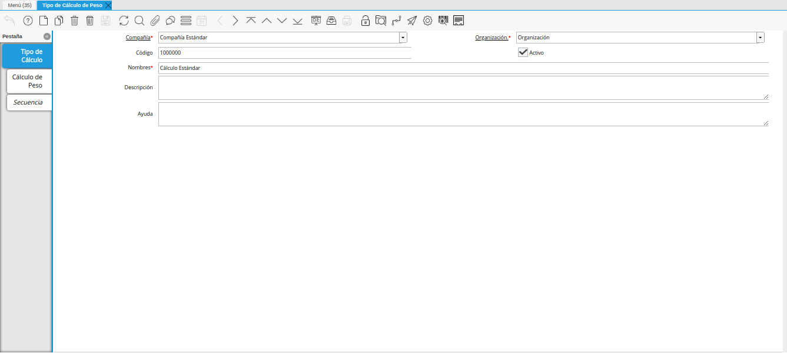
.. |icono registro nuevo de la ventana tipo de cálculo de peso| image:: resources/new-record-icon-of-the-weight-calculation-type-window.png
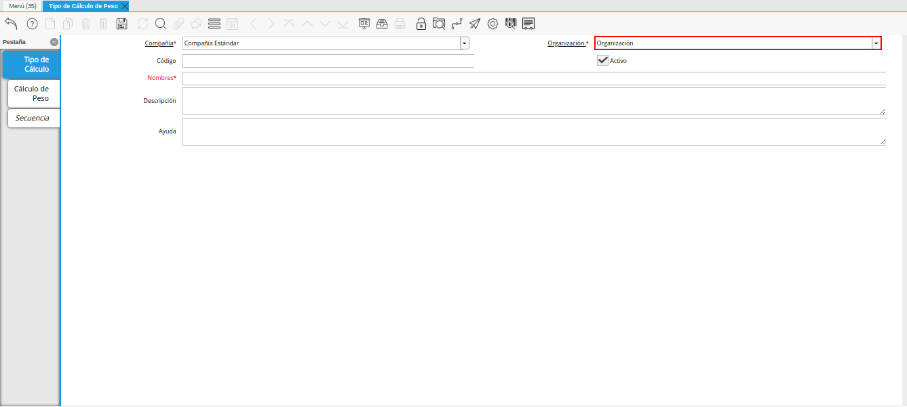
.. |campo código de la ventana tipo de cálculo de peso| image:: resources/code-field-of-the-window-type-of-weight-calculation.png
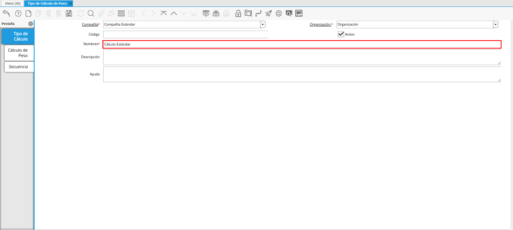
.. |campo descripción de la ventana tipo de cálculo de peso| image:: resources/field-description-of-the-window-type-of-weight-calculation.png
.. |icono guardar cambios de la ventana tipo de cálculo de peso| image:: resources/save-changes-icon-of-the-weight-calculation-type-window.png
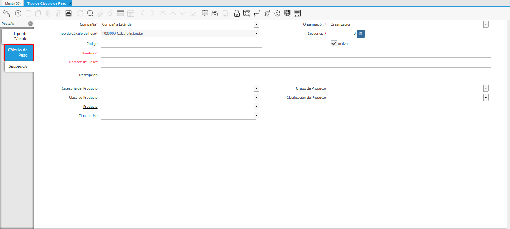
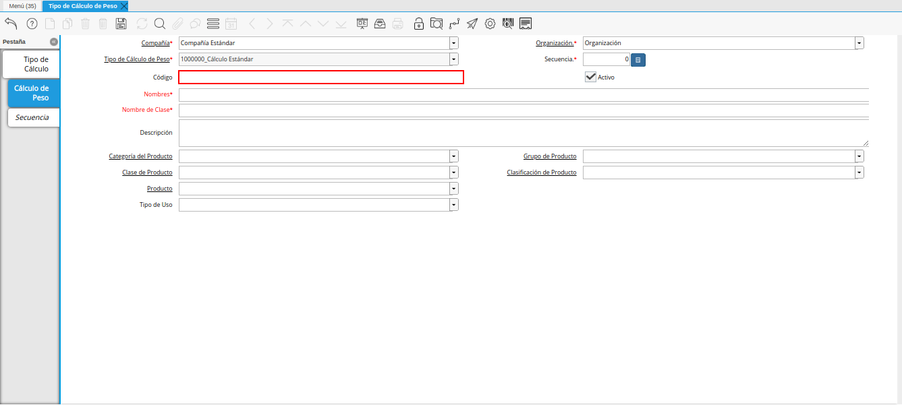
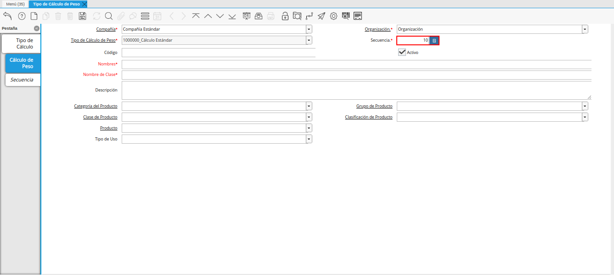
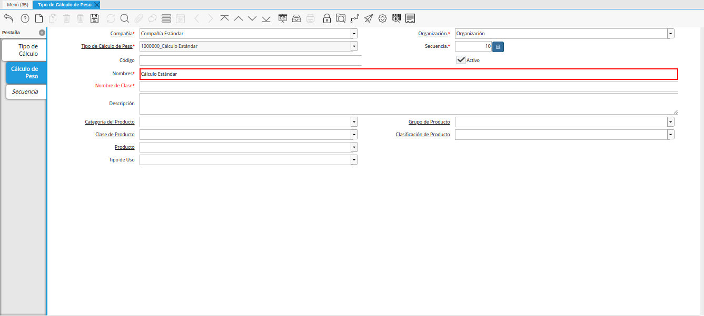
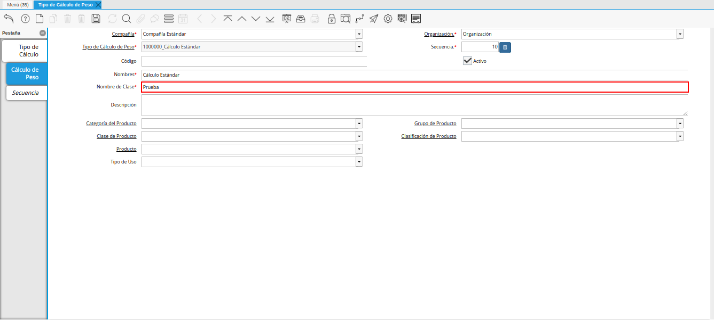
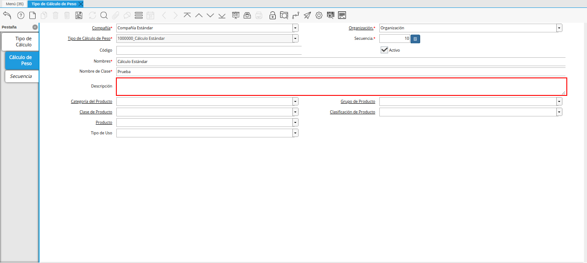
.. |campo categoría del producto de la ventana tipo de cálculo de peso| image:: resources/product-category-field-of-the-weight-calculation-type-window.png
.. |campo grupo de producto de la ventana tipo de cálculo de peso| image:: resources/product-group-field-of-the-weight-calculation-type-window.png
.. |campo clase de producto de la ventana tipo de cálculo de peso| image:: resources/product-class-field-of-the-weight-calculation-type-window.png
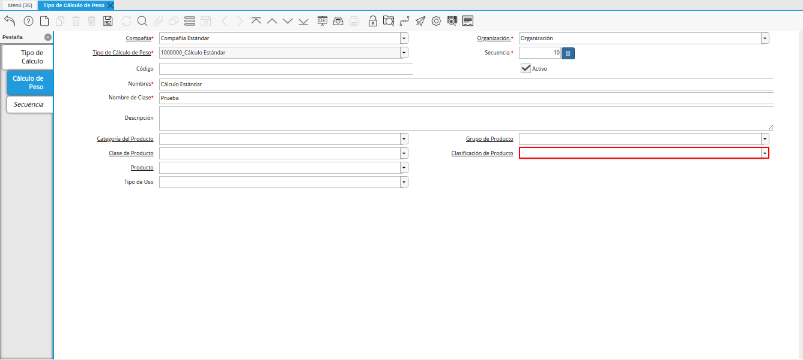
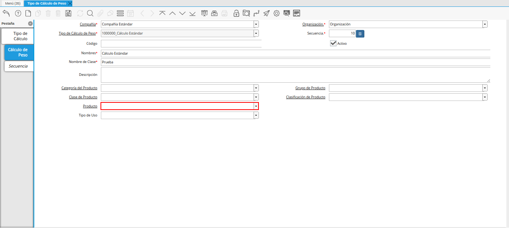
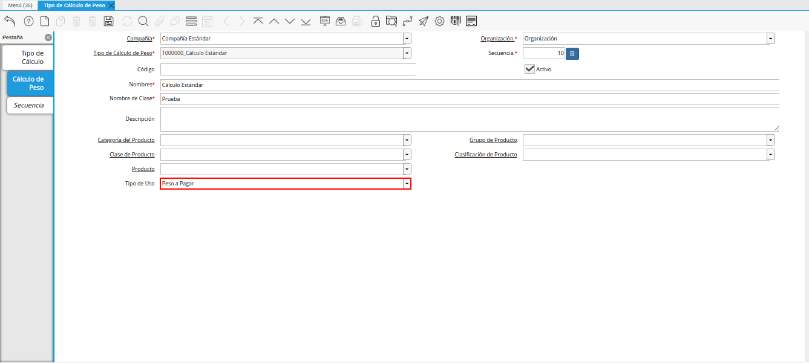
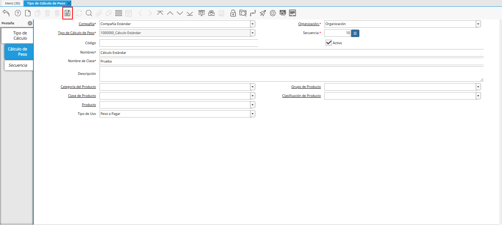

.. _documento/tipo-de-cálculo-de-peso:

**Tipo de Cálculo de Peso**
===========================

Ubique y seleccione en el menú de ADempiere, la carpeta "**Gestión de Asistencia al Agricultor**", luego seleccione la carpeta "**Configuración de Materia Prima**", por último seleccione la ventana "**Tipo de Cálculo de Peso**".

    |menú de tipo de cálculo de peso|

    Imagen 1. Menú de ADempiere

Podrá visualizar la ventana "**Tipo de Cálculo de Peso**", con los diferentes registros de cálculo de peso.

    |ventana tipo de cálculo de peso|

    Imagen 2. Ventana Tipo de Cálculo de Peso

Seleccione el icono "**Registro Nuevo**", ubicado en la barra de herramientas de ADempiere.

    |icono registro nuevo de la ventana tipo de cálculo de peso|

    Imagen 3. Icono Registro Nuevo 

Seleccione en el campo "**Organización**", la organización para la cual se encuentra realizando el registro.

    |campo organización de la ventana tipo de cálculo de peso|

    Imagen 4. Campo Organización

Introduzca en el campo "**Código**", el código para el registro que se encuentra realizando.

    |campo código de la ventana tipo de cálculo de peso|

    Imagen 5. Campo Código

Introduzca en el campo "**Nombre**", el nombre correspondiente al tipo de cálculo de peso que se encuentra registrando.

    |campo nombre de la ventana tipo de cálculo de peso|

    Imagen 6. Campo Nombre

Introduzca en el campo "**Descripción**", una breve descripción referente al registro que se encuentra realizando.

    |campo descripción de la ventana tipo de cálculo de peso|

    Imagen 7. Campo Descripción

Seleccione el icono "**Guardar Cambios**", ubicado en la barra de herramientas de ADempiere.

    |icono guardar cambios de la ventana tipo de cálculo de peso|

    Imagen 8. Icono Guardar Cambios

Seleccione la pestaña "**Cálculo de Peso**" y proceda al llenado de los campos.

    |pestaña cálculo de peso de la ventana tipo de cálculo de peso|

    Imagen 9. Pestaña Cálculo de Peso

Introduzca en el campo "**Código**", el código correspondiente al registro que se encuentra realizando.

    |campo código de la pestaña cálculo de peso de la ventana tipo de cálculo de peso|

    Imagen 10. Campo Código 

    .. note::

        El código para el registro en el formato requerido; debe ser único. Un código le permite a usted un método rápido de encontrar un registro en particular.

Seleccione en el campo "**Secuencia**", la secuencia correspondiente al registro que se encuentra realizando.

    |campo secuencia de la pestaña cálculo de peso de la ventana tipo de cálculo de peso|

    Imagen 11. Campo Secuencia

Introduzca en el campo "**Nombre**", el nombre correspondiente al registro que se encuentra realizando.

    |campo nombre de la pestaña cálculo de peso de la ventana tipo de cálculo de peso|

    Imagen 12. Campo Nombre

Introduzca en el campo "**Nombre de Clase**", el nombre clase correspondiente al registro que se encuentra realizando.

    |campo nombre de clase de la pestaña cálculo de peso de la ventana tipo de cálculo de peso|

    Imagen 13. Campo Nombre de Clase

    .. note::

        El nombre de clase identifica el nombre de la clase Java usada por este proceso.

Introduzca en el campo "**Descripción**", una breve descripción correspondiente al registro que se encuentra realizando.

    |campo descripción de la pestaña cálculo de peso de la ventana tipo de cálculo de peso|

    Imagen 14. Campo Descripción

Seleccione en el campo "**Categoría del Producto**", la categoría del producto a la cual pertenece el registro que se encuentra realizando.

    |campo categoría del producto de la ventana tipo de cálculo de peso|

    Imagen 15. Campo Categoría del Producto

Seleccione en el campo "**Grupo de Producto**", el grupo de producto al cual pertenece el registro que se encuentra realizando.

    |campo grupo de producto de la ventana tipo de cálculo de peso|

    Imagen 16. Campo Grupo de Producto

Seleccione en el campo "**Clase de Producto**", la clase de producto al cual pertenece el registro que se encuentra realizando.

    |campo clase de producto de la ventana tipo de cálculo de peso|

    Imagen 17. Campo Clase de Producto

Seleccione en el campo "**Clasificación de Producto**", la clasificación de producto correspondiente al registro que se encuentra realizando.

    |campo clasificación de producto de la ventana tipo de cálculo de peso|

    Imagen 18. Campo Clasificación de Producto

Seleccione en el campo "**Producto**", el producto correspondiente al registro que se encuentra realizando.

    |campo producto de la ventana tipo de cálculo de peso|

    Imagen 19. Campo Producto

Seleccione en el campo "**Tipo de Uso**", el tipo de uso para el cálculo de peso correspondiente al registro que se encuentra realizando.

    |campo tipo de uso de la pestaña cálculo de peso de la ventana tipo de cálculo de peso|

    Imagen 20. Campo Tipo de Uso

Seleccione el icono "**Guardar Cambios**" en la barra de herramientas de ADempiere.

    |icono guardar cambios de la pestaña cálculo de peso de la ventana tipo de cálculo de peso|

    Imagen 21. Icono Guardar Cambios
