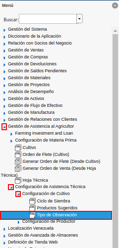
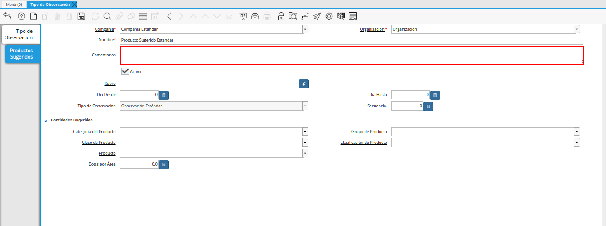

.. |ventana tipo de observación| image:: resources/observation-type-window.png
.. |icono registro nuevo de la ventana tipo de observación| image:: resources/new-record-icon-of-the-observation-type-window.png
.. |campo organización de la ventana tipo de observación| image:: resources/field-window-organization-type-of-observation.png
.. |campo código de la ventana tipo de observación| image:: resources/observation-type-window-code-field.png
.. |campo nombre de la ventana tipo de observación| image:: resources/field-name-of-the-observation-type-window.png
.. |campo descripción de la ventana tipo de observación| image:: resources/field-description-of-the-observation-type-window.png
.. |icono guardar cambios de la ventana tipo de observación| image:: resources/save-changes-icon-of-the-observation-type-window.png
.. |pestaña productos sugeridos de la ventana tipo de observación| image:: resources/suggested-products-tab-of-the-observation-type-window.png
.. |campo nombre de la pestaña productos sugeridos de la ventana tipo de observación| image:: resources/name-field-of-the-suggested-products-tab-of-the-observation-type-window.png

.. |campo rubro de la pestaña productos sugeridos de la ventana tipo de observación| image:: resources/heading-field-of-the-suggested-products-tab-of-the-observation-type-window.png
.. |campo etapa del cultivo de la pestaña productos sugeridos de la ventana tipo de observación| image:: resources/field-crop-stage-of-the-tab-suggested-products-of-the-window-type-of-observation.png
.. |campo día desde de la pestaña productos sugeridos de la ventana tipo de observación| image:: resources/day-from-field-of-the-suggested-products-tab-of-the-observation-type-window.png
.. |campo día hasta de la pestaña productos sugeridos de la ventana tipo de observación| image:: resources/day-to-field-of-the-suggested-products-tab-of-the-observation-type-window.png
.. |campo tipo de observación de la pestaña productos sugeridos de la ventana tipo de observación| image:: resources/observation-type-field-of-the-suggested-products-tab-of-the-observation-type-window.png
.. |campo secuencia de la pestaña productos sugeridos de la ventana tipo de observación| image:: resources/sequence-field-of-the-suggested-products-tab-of-the-observation-type-window.png
.. |campo categoría del producto de la pestaña productos sugeridos de la ventana tipo de observación| image:: resources/product-category-field-of-the-suggested-products-tab-of-the-observation-type-window.png
.. |campo grupo de producto de la pestaña productos sugeridos de la ventana tipo de observación| image:: resources/product-group-field-of-the-suggested-products-tab-of-the-observation-type-window.png
.. |campo clase de producto de la pestaña productos sugeridos de la ventana tipo de observación| image:: resources/product-class-field-of-the-suggested-products-tab-of-the-observation-type-window.png
.. |campo clasificación de producto de la pestaña productos sugeridos de la ventana tipo de observación| image:: resources/product-classification-field-of-the-suggested-products-tab-of-the-observation-type-window.png
.. |campo producto de la pestaña productos sugeridos de la ventana tipo de observación| image:: resources/product-field-of-the-suggested-products-tab-of-the-observation-type-window.png
.. |campo dosis por área de la pestaña productos sugeridos de la ventana tipo de observación| image:: resources/dose-by-area-field-of-the-suggested-products-tab-of-the-observation-type-window.png
.. |icono guardar cambios de la pestaña productos sugeridos de la ventana tipo de observación| image:: resources/save-changes-icon-on-the-suggested-products-tab-of-the-observation-type-window.png

.. _documento/tipo-de-observación:

**Tipo de Observación**
=======================

Un tipo de observación puede ser creado para indicar o realizar una sugerencia de un producto a un rubro determinado, en cual se indica la cantidad o dosis a aplicar a dicho rubro. Un ejemplo de ello puede ser, una observación que se realiza para que sea aplicado un insecticida a un rubro como maíz blanco u otro.

A continuación, se explica el procedimiento que se debe realizar para generar de manera correcta, un tipo de observación en ADempiere.

#. Ubique y seleccione en el menú de ADempiere, la carpeta "**Gestión de Asistencia al Agricultor**", luego seleccione la carpeta "**Configuración de Asistencia Técnica**", por último seleccione la carpeta "**Configuración de Cultivo**". Finalmente, seleccione la ventana "**Tipo de Observación**".

    |menú de tipo de observación|

    Imagen 1. Tipo de Observación

#. Podrá visualizar la ventana "**Tipo de Observación**", con los diferentes registros de tipos de observación.

    |ventana tipo de observación|

    Imagen 2. Ventana Tipo de Observación

#. Seleccione el icono "**Registro Nuevo**", ubicado en la barra de herramientas de ADempiere y proceda al llenado de los campos correspondientes.

    |icono registro nuevo de la ventana tipo de observación|

    Imagen 3. Icono Registro Nuevo

#. Seleccione en el campo "**Organización**", la organización para la cual requiere generar el registro de tipo de observación.

    |campo organización de la ventana tipo de observación|

    Imagen 3. Campo Organización

#. Introduzca en el campo "**Código**", el código correspondiente al registro de tipo de observación que se encuentra realizando.

    Si no es ingresado ningún valor en el presente campo, al guargar el registro ADempiere establece de manera automática un correlativo correspondiente a la secuencia de documento que se encuentra realizando.

    |campo código de la ventana tipo de observación|

    Imagen 4. Campo Código

#. Introduzca en el campo "**Nombre**", el nombre correspondiente al registro de tipo de observación que se encuentra realizando.

    |campo nombre de la ventana tipo de observación|

    Imagen 5. Campo Nombre

#. Introduzca en el campo "**Descripción**", una breve descripción referente al registro de tipo de observación que se encuentra realizando.

    |campo descripción de la ventana tipo de observación|

    Imagen 6. Campo Descripción

#. Seleccione el icono "**Guardar Cambios**", ubicado en la barra de herramientas de ADempiere.

    |icono guardar cambios de la ventana tipo de observación|

    Imagen 7. Icono Guardar Cambios

**Productos Sugeridos**
=======================

#. Seleccione la pestaña "**Productos Sugeridos**" y proceda al llenado de los campos correspondientes.

    |pestaña productos sugeridos de la ventana tipo de observación|

    Imagen 8. Pestaña Productos Sugeridos

#. Introduzca en el campo "**Nombre**", el nombre correspondiente al producto sugerido que se encuentra registrando.

    |campo nombre de la pestaña productos sugeridos de la ventana tipo de observación|

    Imagen 9. Campo Nombre

#. Introduzca en el campo "**Comentarios**", el comentario que requiere agregar al registro de producto sugerido que se encuentra realizando.

    |campo comentario de la pestaña productos sugeridos de la ventana tipo de observación|

    Imagen 10. Campo Comentarios

#. Seleccione en el campo "**Rubro**", el rubro correspondiente al producto sugerido que se encuentra registrando.

    |campo rubro de la pestaña productos sugeridos de la ventana tipo de observación|

    Imagen 11. Campo Rubro

    #. Al seleccionar un rubro en el campo "**Rubro**", se habilita el campo "**Etapa del Cultivo**".

        Si el rubro seleccionado posee información en la pestaña "**Etapa del Cultivo**" correspondiente a su registro, la información puede ser seleccionada en el campo "**Etapa del Cultivo**".

        |campo etapa del cultivo de la pestaña productos sugeridos de la ventana tipo de observación|

        Imagen 12. Campo Etapa del Cultivo

        .. note::

            Al seleccionar la etapa del cultivo en el campo "**Etapa del Cultivo**", se inhabilitan los campos "**Día Desde**" y "**Día Hasta**" porque los mismos se encuentran configurados en la etapa previamente seleccionadae.

#. Introduzca en el campo "**Día Desde**", el día desde para el registro del producto sugerido que se encuentra realizando.

    |campo día desde de la pestaña productos sugeridos de la ventana tipo de observación|

    Imagen 14. Campo Día Desde

#. Introduzca en el campo "**Día Hasta**", el día hasta para el registro del producto sugerido que se encuentra realizando.

    |campo día hasta de la pestaña productos sugeridos de la ventana tipo de observación|

    Imagen 15. Campo Día Hasta

#. Seleccione en el campo "**Tipo de Observación**", el tipo de observación para el registro de producto sugerido que se encuentra realizando.

    |campo tipo de observación de la pestaña productos sugeridos de la ventana tipo de observación|

    Imagen 16. Campo Tipo de Observación

#. Introduzca en el campo "**Secuencia**", la secuencia correspondiente al registro de producto sugerido que se encuentra realizando.

    |campo secuencia de la pestaña productos sugeridos de la ventana tipo de observación|

    Imagen 17. Campo Secuencia

#. Seleccione en el campo "**Categoría del Producto**", la categoría del producto correspondiente al registro de producto sugerido que se encuentra realizando.

    |campo categoría del producto de la pestaña productos sugeridos de la ventana tipo de observación|

    Imagen 18. Campo Categoría del Producto

    .. note::

        Al seleccionar algún valor en este campo, se inhabilita el campo "**Producto**".

#. Seleccione en el campo "**Grupo de Producto**", el grupo del producto correspondiente al registro de producto sugerido que se encuentra realizando.

    |campo grupo de producto de la pestaña productos sugeridos de la ventana tipo de observación|

    Imagen 19. Campo Grupo de Producto

    .. note::

        Al seleccionar algún valor en este campo, se inhabilita el campo "**Producto**".

#. Seleccione en el campo "**Clase de Producto**", la clase de producto correspondiente al registro de producto sugerido que se encuentra realizando.

    |campo clase de producto de la pestaña productos sugeridos de la ventana tipo de observación|

    Imagen 20. Camp Clase de Producto

    .. note::

        Al seleccionar algún valor en este campo, se inhabilita el campo "**Producto**".

#. Seleccione en el campo "**Clasificación de Producto**", la clasificación de producto correspondiente al registro de producto sugerido que se encuentra realizando.

    |campo clasificación de producto de la pestaña productos sugeridos de la ventana tipo de observación|

    Imagen 21. Campo Clasificación de Producto

    .. note::

        Al seleccionar algún valor en este campo, se inhabilita el campo "**Producto**".

#. Seleccione en el campo "**Producto**", el producto correspondiente al registro de producto sugerido que se encuentra realizando.

    |campo producto de la pestaña productos sugeridos de la ventana tipo de observación|

    Imagen 22. Campo Producto

    .. note::

        En un caso de que se tenga un rubro como "**Maíz Blanco**", un ejemplo de producto a seleccionar en el presente campo puede ser un insecticida para maíz como "**Herbicida Agrícola Limpia Maiz Glifosan Gramoxone Potreron**".

#. Introduzca en el campo "**Dosis por Área**", la cantidad de dosis por área de cultivo recomendada.

    La cantidad ingresada va a depender de la unidad de medida del producto seleccionado en el campo "**Producto**".

    |campo dosis por área de la pestaña productos sugeridos de la ventana tipo de observación|

    Imagen 23. Campo Dosis por Área

#. Seleccione el icono "**Guardar Cambios**", ubicado en la barra de herramientas de ADempiere para guardar el registro de los campos de la ventana "**Productos Sugeridos**".

    |icono guardar cambios de la pestaña productos sugeridos de la ventana tipo de observación|

    Imagen 24. Icono Guardar Cambios