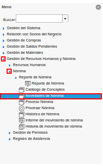
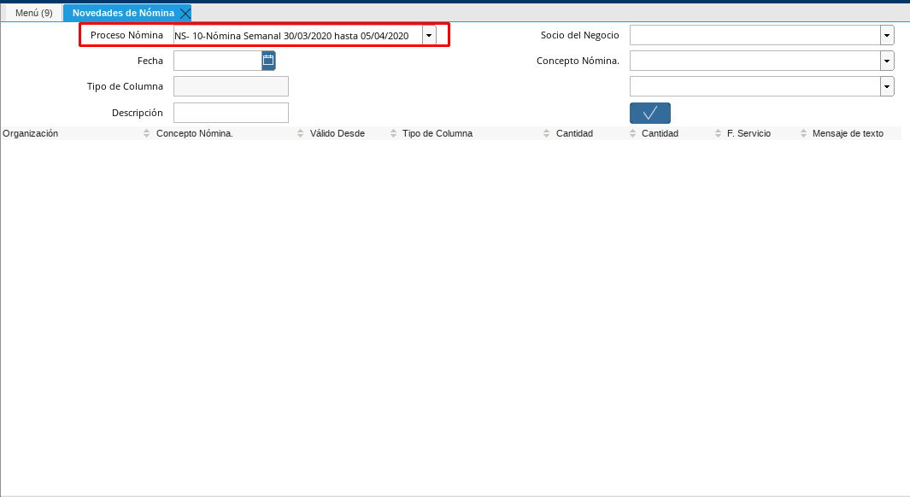
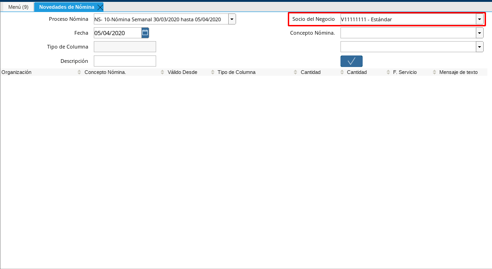
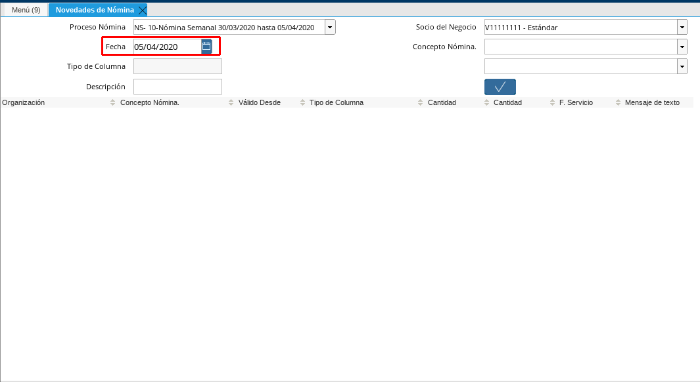
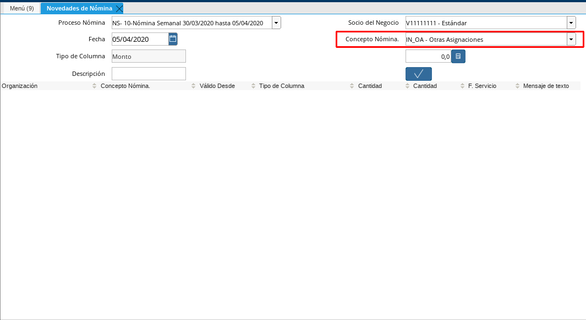
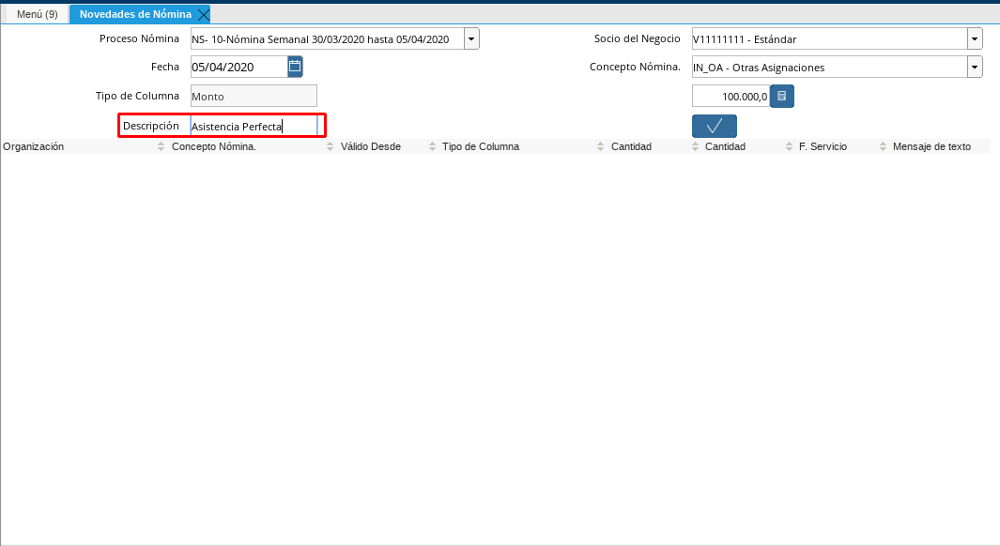
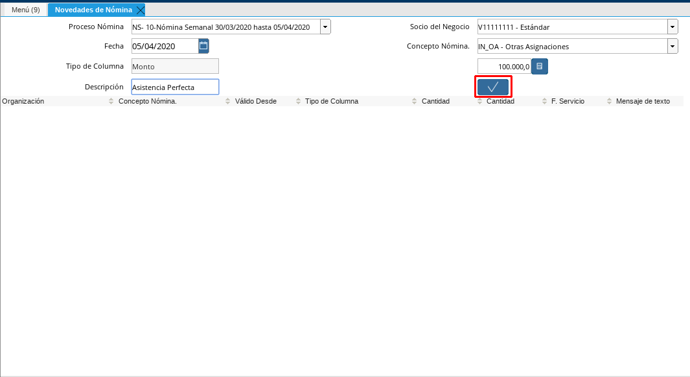
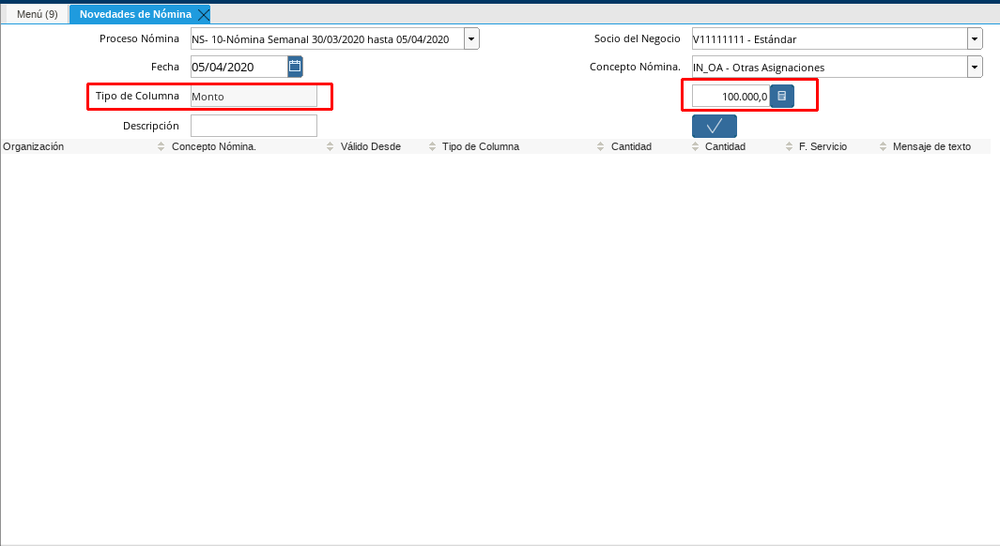
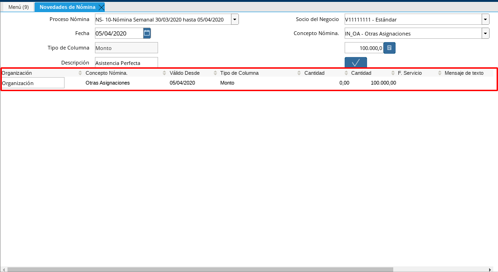

.. _ERPyA: http://erpya.com

.. _documento/novedades-de-nómina:

**Registro de Incidencias**
===========================

 Seleccione en el menú de ADempiere, la carpeta "**Gestión de Recursos Humanos y Nómina**", luego seleccione la carpeta "**Nómina**", por último seleccione la ventana "**Novedades de Nómina**".

    |Menú de ADempiere|

    Imagen 1. Menú de ADempiere

 Seleccione en el campo "**Proceso Nómina**", el proceso de nómina actual al cual le cargará las incidencias de los empleados. Dicho proceso se encuentra explicado en el documento :ref:`documento/procedimiento-para-procesar-nómina` elaborado por `ERPyA`_.

    |Campo Proceso de Nómina|

    Imagen 2. Campo Proceso Nómina

 Seleccione en el campo "**Socio del Negocio**", el socio del negocio empleado al cual se le cargará la incidencia.

    |Campo Socio del Negocio|

    Imagen 3. Campo Socio del Negocio

    .. note::

        En este campo encontrará todos los socios de negocios que tengan registrado la nómina que se está procesando, tome especial atención el empleado que seleccionará para que proceda a cargar su incidencia

 Seleccione en el campo "**Fecha**", la fecha en la que se le cargará la incidencia al socio del negocio empleado seleccionado.

    |Campo Fecha|

    Imagen 4. Campo Fecha

 Seleccione en el campo "**Concepto Nómina**", la incidencia que se le cargará al socio de negocio empleado seleccionado.

    |Campo Conceptos de Tipo Incidencias|

    Imagen 5. Campo Conceptos de Tipo Incidencias

    .. note::

        En este campo se muestran todas las incidencias, sin importar el tipo de nómina con el que fue generado el documento proceso de nómina seleccionado.

 Introduzca el valor de la incidencia que seleccionó en el campo que aparece a continuación.

    |Campo Monto Incidencias|

    Imagen 6. Campo Monto Incidencias

    .. note::

        Este campo se habilita para agregar valor de la incidencia que seleccionó. Existen incidencias cuyo valor es de tipo "**Monto**", otras que son de tipo "**Cantidad**" y otras incidencias que de tipo "**Fecha**" en el campo que dice "**Tipo de Columna**" le indica el valor de la incidencia que seleccionó

 Introduzca en el campo "**Descripción**", una breve descripción de la incidencia que se le cargará al socio del negocio empleado.

    |Campo Descripción|

    Imagen 7. Campo Descripción

 Seleccione la opción "**OK**", para que la incidencia sea cargada a la incidencia al proceso de nómina seleccionado.

    |Opción OK|

    Imagen 8. Opción OK

 Por último podrá visualizar la forma como queda generada la Incidencia lista para que sea procesada durante la nómina.

    |Campo Incidencia Generada|

    Imagen 9. Incidencia Generada
