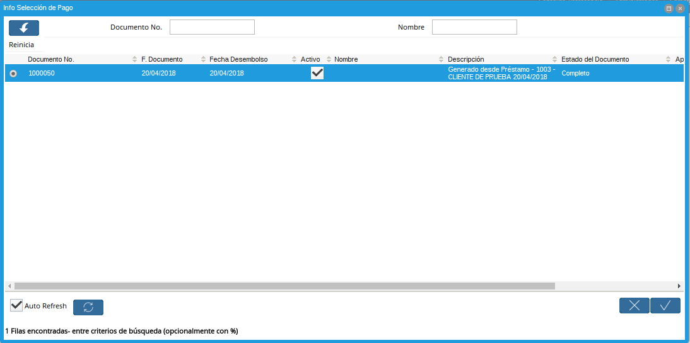
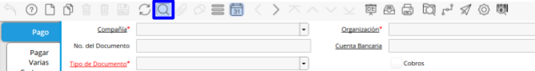

.. |Búsqueda de Selección de Pagos| image:: resources/payment-pay-print-find.png

.. _documento/generar-pagos:

**Generar Pagos de Préstamo**
=============================

Una vez generada la selección de pago, podrá generar los pagos de los préstamos (Desembolso), el pago generado como se explicó anteriormente, hereda el cargo seleccionado en la definición del producto financiero **(Vea Configuración de Producto Financiero (Préstamo))**.

Vaya a la ventana de Imprimir/Exporta Pago (Adjunto Imagen)

 |Menú de Pagos|

 Imagen 1. Menú de Pagos

A continuación se desplegará la siguiente ventana (Adjunto Imagen)

 |Imprimir y Exportar Pagos|

 Imagen 2. Imprimir y Exportar Pagos

Ingrese la selección de pagos generada en la sección

:ref:`documento/generar-selección-pagos`, seleccionando la opción de búsqueda |selección|

 |Búsqueda de Selección de Pagos|

 Imagen 3. Búsqueda de Selección de Pagos

A continuación se desplegará la siguiente ventana (Adjunto Imagen)

 |Búsqueda de Pagos|

 Imagen 4. Búsqueda de Pagos

Seleccione la Selección de pago generada en la sección :ref:`documento/generar-selección-pagos`

 |Generar Selección de Pagos|

 Imagen 5. Generar Selección de Pagos

Seleccione la opción imprimir |text|

 |Imprimir Pago|

 Imagen 6. Imprimir Pago

A Continuación ADempiere habrá generado el pago y usted verá el siguiente reporte (Adjunto Imagen)

 |Reporte de Impresión de Pago|

 Imagen 7. Reporte de Impresión de Pago

**Consulta de Pagos de Préstamo**
=================================

Existen dos posibles formas de consultar los pagos generados asociadas a un préstamo, a continuación serán explicadas.

Ventanas en Menú

Pago/Cobro

Si el pago generado desde el proceso :ref:`documento/generar-selección-pagos` es generado con una cuenta bancaria podrá consultar con esta opción.

Vaya a la ventana **"Pago/Cobro"** (Adjunto Imagen)

 |Menú de Pago|

 Imagen 8. Menú de Pago

A continuación se desplegará la siguiente ventana (Adjunto Imagen).

 |Ventana de Pago|

 Imagen 9. Ventana de Pago

Busque el registro desde la opción “**Encontrar Registro**” ubicada en la barra de herramientas.

 |Búsqueda de Pago|

 Imagen 10. Búsqueda de Pago

A continuación se desplegará el siguiente dialogo

 |Ventana de Búsqueda de Pago|

 Imagen 11. Ventana de Búsqueda de Pago

Ingrese el número de la selección generada en el proceso :ref:`documento/generar-selección-pagos` Caja Si el pago generado desde el proceso :ref:`documento/generar-selección-pagos` es generado con una cuenta de caja podrá consultar con esta opción.

Vaya a la ventana Caja (Adjunto Imagen)

 |Menú de Caja|

 Imagen 12. Menú de Caja

A continuación se desplegará la siguiente ventana (Adjunto Imagen).

 |Ventana de Caja|

 Imagen 13. Ventana de Caja

Busque el registro desde la opción “**Encontrar Registro**” ubicada en la barra de herramientas.

 |Ventana de Caja|

 Imagen 14. Ventana de Caja

A continuación se desplegará el siguiente dialogo

 |Búsqueda de Caja|

 Imagen 15. Búsqueda de Caja

Ingrese el número de la selección generada en el proceso :ref:`documento/generar-selección-pagos`

**Ventana de Préstamo:**
========================

Una vez en la ventana de Préstamo

Vaya a la opción “**Visualiza Detalle(Donde es Usado)**” ubicada en la barra de herramientas.

 |Búsqueda de Referencia de Préstamo|

 Imagen 16. Búsqueda de Referencia de Préstamo

A continuación se desplegará el siguiente dialogo

 |Referencia de Préstamo|

 Imagen 17. Referencia de Préstamo

Seleccione la opción “**Pagos de Préstamos**”

 |Referencia de Préstamo Seleccionada|

 Imagen 18. Referencia de Préstamo Seleccionada

Esta opción lo llevará automáticamente a los pagos asociados a este préstamo.

**Contabilidad del Proceso**
============================

ADempiere contabilizará el préstamo dependiendo de la contabilidad configurada en el cargo heredado desde la definición del producto financiero (**Vea Configuración de Producto Financiero (Préstamo)**) .

.. raw:: html

   <table>

.. raw:: html

   <tr>

.. raw:: html

   <td>

Cuenta

.. raw:: html

   </td>

.. raw:: html

   <td>

Débito Contabilizado

.. raw:: html

   </td>

.. raw:: html

   <td>

Crédito Contabilizado

.. raw:: html

   </td>

.. raw:: html

   </tr>

.. raw:: html

   <tr>

.. raw:: html

   <td>

12410 - Prestamos por Cobrar

.. raw:: html

   </td>

.. raw:: html

   <td>

.. raw:: html

   

20.000,00

.. raw:: html

   

.. raw:: html

   </td>

.. raw:: html

   <td>

.. raw:: html

   

0,00

.. raw:: html

   

.. raw:: html

   </td>

.. raw:: html

   </tr>

.. raw:: html

   <tr>

.. raw:: html

   <td>

89900 - Cheques y Depósito en Circulación

.. raw:: html

   </td>

.. raw:: html

   <td>

.. raw:: html

   

0,00

.. raw:: html

   

.. raw:: html

   </td>

.. raw:: html

   <td>

.. raw:: html

   

20.000,00

.. raw:: html

   

.. raw:: html

   </td>

.. raw:: html

   </tr>

.. raw:: html

   <tr>

.. raw:: html

   <td>

Total

.. raw:: html

   </td>

.. raw:: html

   <td>

.. raw:: html

   

20.000,00

.. raw:: html

   

.. raw:: html

   </td>

.. raw:: html

   <td>

.. raw:: html

   

20.000,00

.. raw:: html

   

.. raw:: html

   </td>

.. raw:: html

   </tr>

.. raw:: html

   </table>

