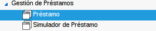
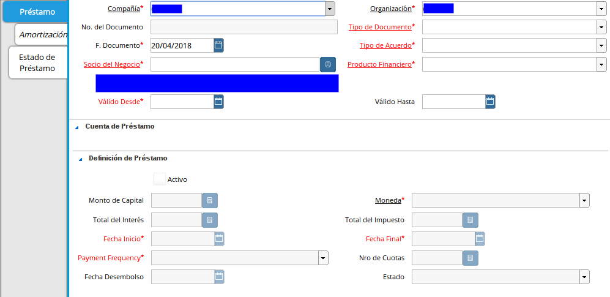
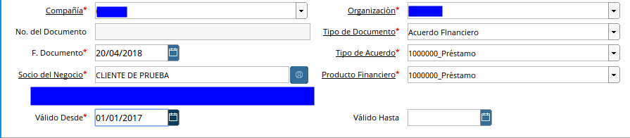
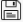
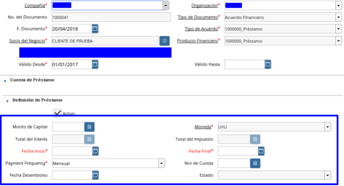
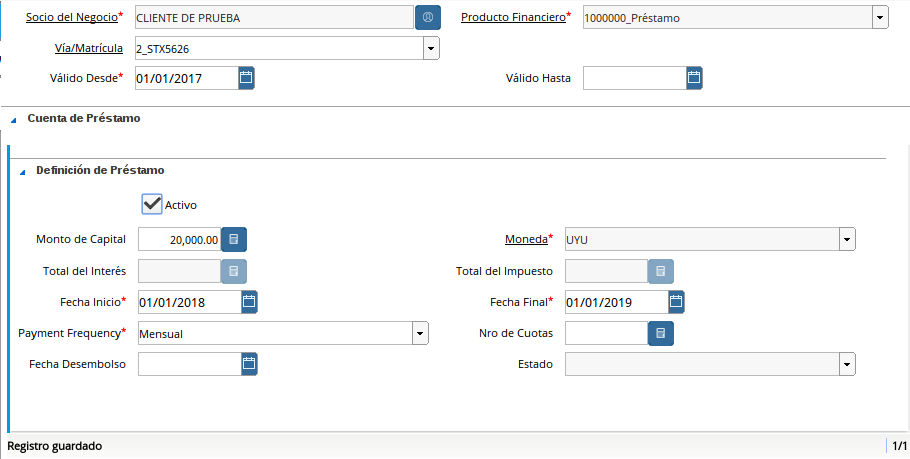

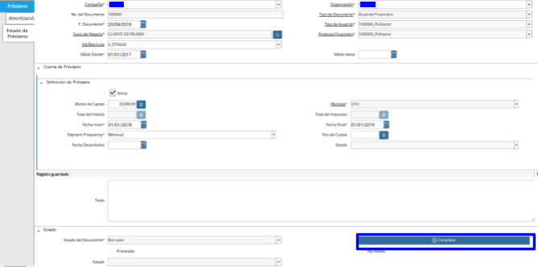
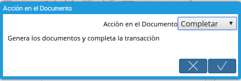

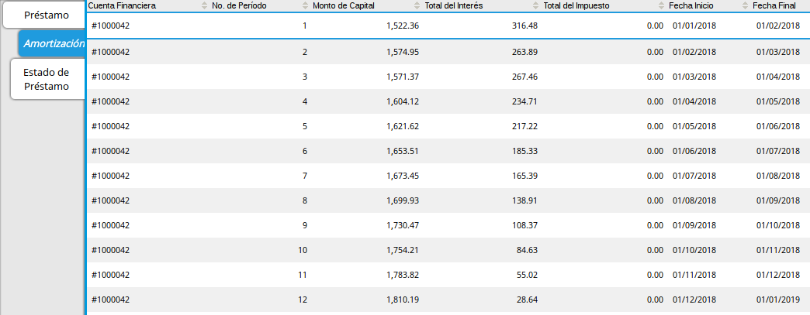
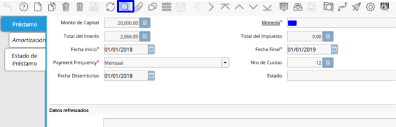
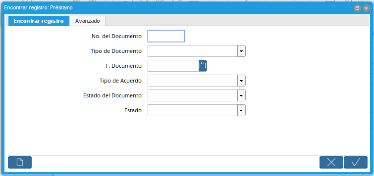
 
.. _documento/préstamo:
 
**Préstamo**
============

El préstamo en ADempiere pueden ser generados de dos formas, en la definición del proceso anterior se explicó cómo generar el préstamo desde la simulación, ahora aprenderá cómo crear un préstamo en la ventana de préstamo.

- Vaya a la ventana de Préstamo(Adjunto Imagen)

    |Menú de Préstamo|

    Imagen 1. Menú de Préstamo

- A continuación se desplegará la siguiente ventana (Adjunto Imagen)

    |Ventana de Préstamo|

    Imagen 2. Ventana de Préstamo

- Proceda a crear el préstamo con las siguientes características puntuales:

    - **Tipo de Documento:** Seleccione el tipo de documento previamente configurado (Vea *Configuraciones Esenciales para el Proceso de Préstamo*).

    - **Tipo de Acuerdo:** Seleccione el tipo de acuerdo de su preferencia.

    - **Socio de Negocio:** Indique el socio del negocio solicitante previamente configurado (Vea *Configuraciones Esenciales para el Proceso de Préstamo*).

    - **Producto Financiero:** Seleccione el producto financiero o préstamo a aplicar previamente configurado (*Vea Configuración de Producto Financiero (Préstamo)*), este parámetro posee una validación, los préstamos disponibles en esta lista dependerá de el grupo de socio de negocio al cual pertenezca el socio de negocio seleccionado y la configuración del producto financiero en aplicación de producto.

    - **Válido Desde:** Indique la fecha de inicio del préstamo.

        |Válido Desde|

        Imagen 3. Válido Desde

    - Guarde el registro 

        |Botón Guardar|

        Imagen 4. Botón Guardar

- Al guardar el registro el sistema crea un registro como cuenta de
préstamo.

    |Guardar Registro|

    Imagen 5. Guardar Registro

- Proceda a crear el préstamo con las siguientes características puntuales:

    - **Monto de Capital:** Indique el monto del préstamo solicitado.

    - **Frecuencia de Pago:** ADempiere establece por herencia la frecuencia configurada en el producto financiero seleccionado, sin embargo puede modificarlo.

    - **Fecha Inicio:** Indique la fecha de inicio del préstamo.

    - **Fecha Final:** ADempiere calcula y establece la fecha basada en la frecuencia y la fecha de inicio, sin embargo puede modificarlo.

    - **Nro de Cuotas:** ADempiere establece por herencia el Nro de cuotas basadas en la cantidad mínima de cuotas configurada en el producto financiero seleccionado, sin embargo puede modificarlo.

    - **Moneda:** ADempiere establece por herencia la moneda basada en la configuración del producto financiero seleccionado, sin embargo puede modificarlo.

    - **Tasa Financiera:** ADempiere establece por herencia la tasa financiera basadas en la configuración del producto financiero seleccionado, no puede ser modificado.

    - Guarde el registro 

        |Botón Guardar|

        Imagen 6. Botón Guardar

    - Después de Guardar el Préstamo

        |Después de Guardar el Préstamo|

        Imagen 7. Después de Guardar el Préstamo

- Complete el registro 

    |Completar Préstamo|

    Imagen 8. Completar Préstamo

    |Ventana Completar Préstamo|

    Imagen 9. Ventana Completar Préstamo

- A continuación se desplegará el siguiente dialogo

    |Diálogo de Completar Préstamo|
    
    Imagen 10. Diálogo de Completar Préstamo

- Si desea completar el préstamo seleccione la opción ok |Opción Aceptar|, caso contrario seleccione la opción cancelar |Opción Cancelar|

**Amortización**
================

Vaya a la pestaña **Amortización** (Adjunto Imagen)

    |Amortización de Préstamo|

    Imagen 11. Amortización de Préstamo

Los registros de esta pestaña son autogenerados al completar el préstamo en la ventana de préstamo o generando el préstamo desde el simulador.

**Consulta de Préstamo**
========================

Si el préstamo fue generado desde el simulador o directamente creado en la ventana podrá consultarlo en la ventana **Préstamo**. Una vez en la ventana de **Préstamo** busque el registro desde la opción **Encontrar Registro** ubicada en la barra de herramientas.

    |Búsqueda de Préstamo|

    Imagen 12. Búsqueda de Préstamo

A continuación se desplegará el siguiente diálogo.

    |Díalogo de Búsqueda de Préstamo|

    Imagen 13. Díalogo de Búsqueda de Préstamo

Ingrese el número del préstamo generado en la simulación si fue generado desde la simulación.
