.. _ERPyA: http://erpya.com
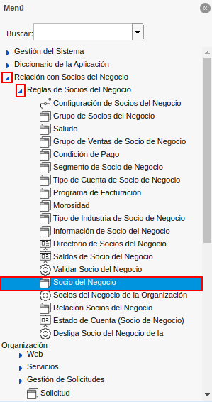
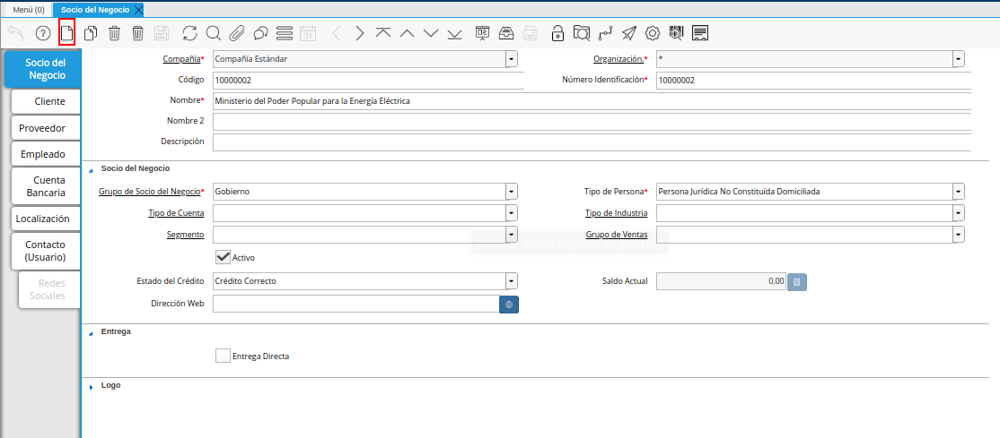
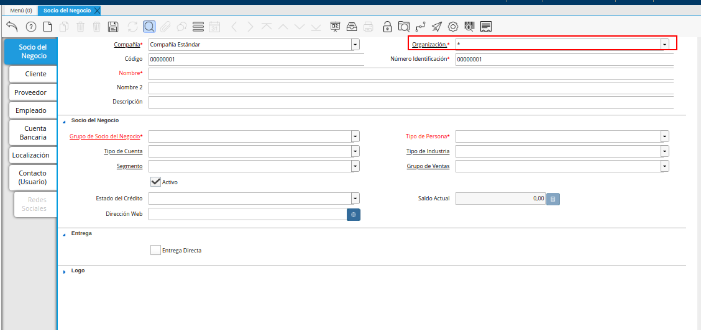
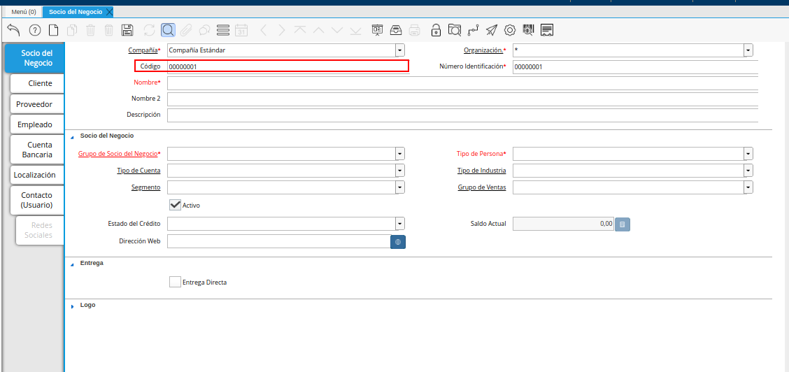
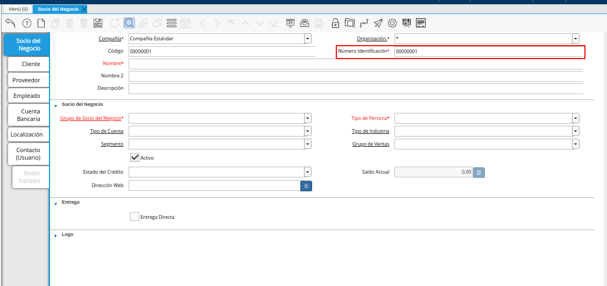
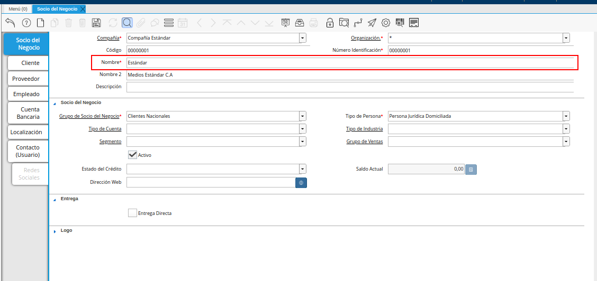
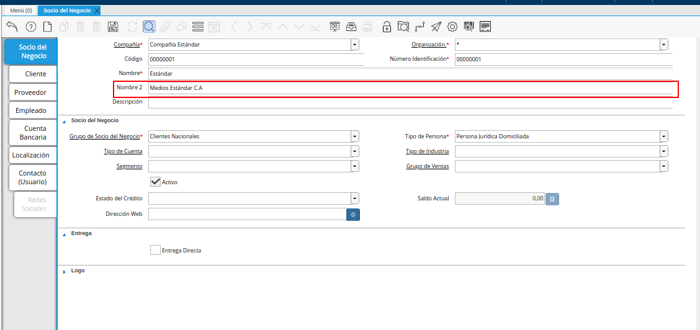
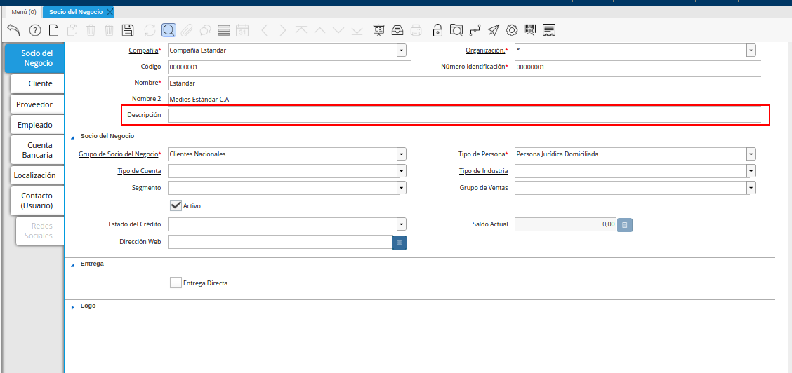
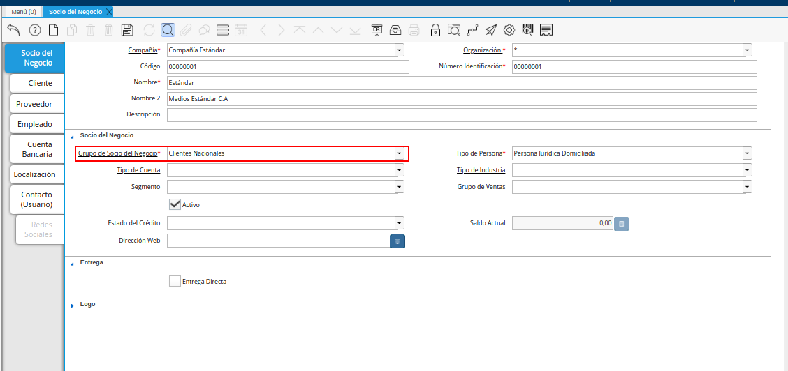

.. |Campo Tipo de Cuenta de la Pestaña Principal Socio del Negocio| image:: resources/account-type-field-of-the-business-partner-main-tab.png
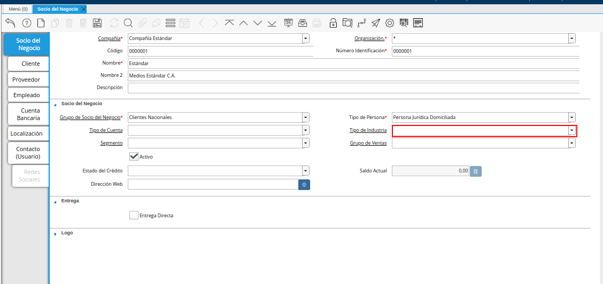
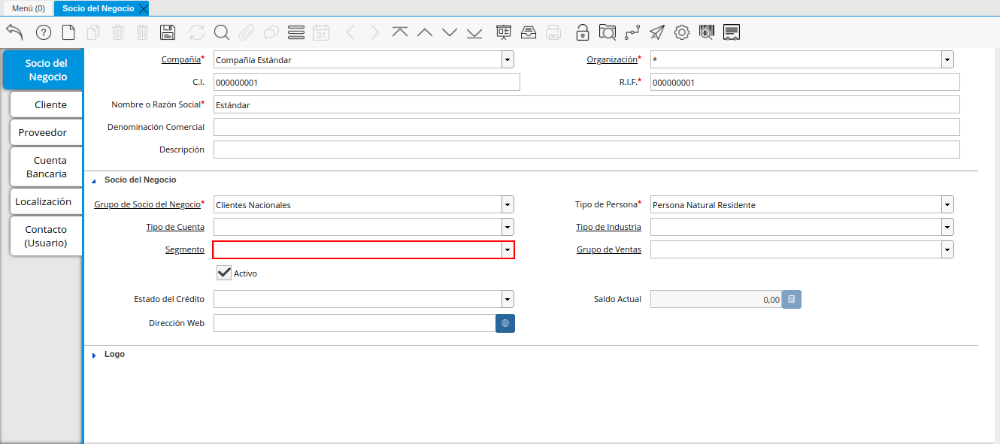

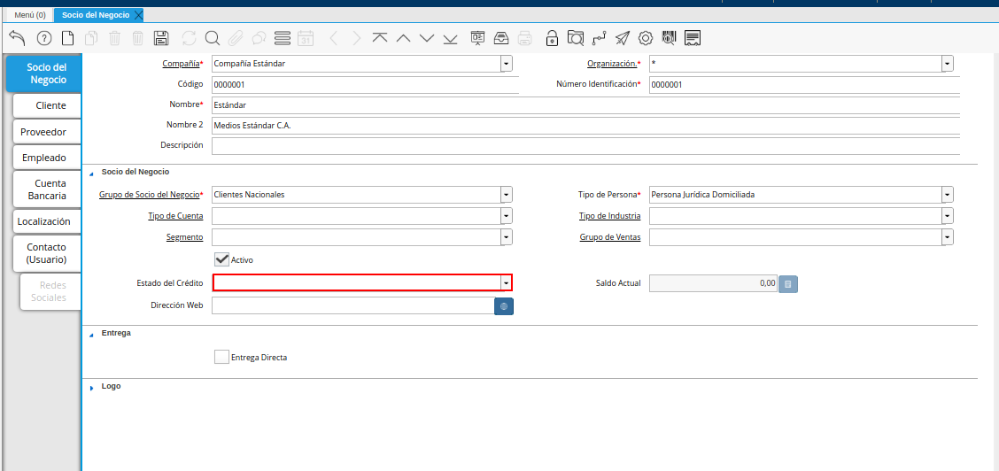
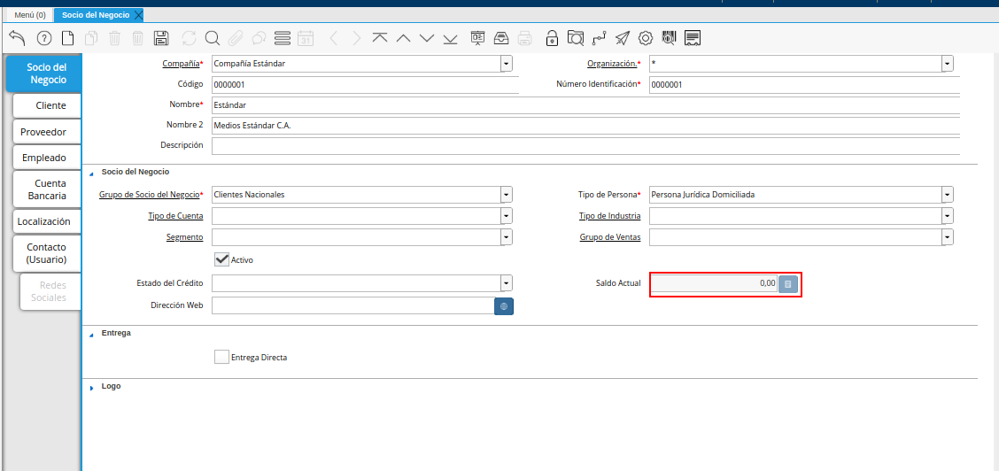
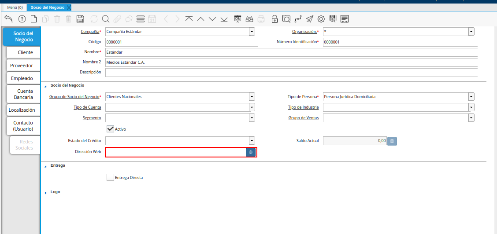
.. |Check entrega Directa de la Pestaña Principal Socio del Negocio| image:: resources/check-direct-delivery-field-of-the-main-business-partner-ta.png
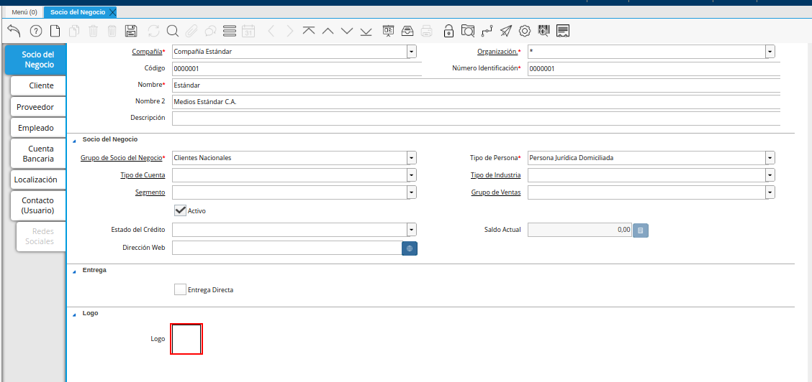
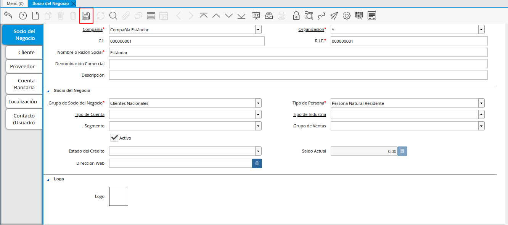

.. _documento/socio-negocio:

=================================
**Registro de Socio del Negocio**
=================================

En el menú de ADempiere, ubique y seleccione la carpeta "**Relación con Socio del Negocio**", luego seleccione la carpeta "**Reglas de Socios del Negocio**" y finalmente seleccione la ventana "**Socio del Negocio**".

    |Menú de ADempiere|

    Imagen 1. Menú de ADempiere

    En esta ventana se registran los datos principales que la empresa requiere del socio del negocio cliente. Cada uno de los campos con el símbolo (*) son obligatorios para el registro.

A continuación visualizará la ventana "**Socio del Negocio**", dónde debe seleccionar el icono de "**Registro Nuevo**" que se encuentra ubicado en la barra de herramientas de ADempiere.

    |Ventana Socio del Negocio|

    Imagen 2. Ventana Socio del Negocio

Proceda al llenado de los campos necesarios que a continuación se detallan.

    Seleccione la organización en el campo "**Organización**".

        La organización le permite definir la entidad legal ó una sub-unidad a la cual pertenece el socio de negocio, si la organización es (*), este estará disponible para todas las organizaciones al procesar documentos y transacciones, pero si por el contrario, ha seleccionado una organización diferente, este registro únicamente estará disponible para la organización seleccionada.

        |Campo Organización de la Pestaña Principal Socio del Negocio|

        Imagen 3. Campo Organización de la Pestaña Principal Socio del Negocio

        .. warning::

            Generalmente los **Socios de Negocios** son registros compartidos entre entidades organizacionales, por esta razón `ERPyA`_ recomienda la creación con organización (*) para evitar duplicidad e inconvenientes contables, de esta forma garantizamos la homogeneidad de los datos maestros.

    Introduzca el código del socio del negocio en el campo "**Código**".

        El código está representado por un valor único e irrepetible que protege la entrada de los registros y evita la duplicidad de los mismos, generalmente se refiere al número de identificación que acredite la identidad de una persona natural una entidad jurídica, por ejemplo, una cédula de identidad o un RIF.

        .. note::

            Si no es ingresado un dato en este campo, ADempiere autogenera el dato automáticamente

        |Campo Código de la Pestaña Principal Socio del Negocio|

        Imagen 4. Campo Código de la Pestaña Principal Socio del Negocio 

        .. warning::

            Se recomienda no ingresar caracteres especiales como puntos, guiones u otros que alteren el registro en este campo.

    Introduzca el número de identificación del socio del negocio en el campo "**Número de Identificación**".

        El número de identificación generalmente se refiere al número de identificación que acredite la identidad de una persona natural una entidad jurídica, por ejemplo, una cédula de identidad o un RIF.

        |Campo Numero de Identificación de la Pestaña Principal Socio del Negocio|

        Imagen 5. Campo Numero de Identificación de la Pestaña Principal Socio del Negocio 

        .. warning::

            Se recomienda no ingresar caracteres especiales como puntos, guiones u otros que alteren el registro en este campo.

    Introduzca el nombre del socio del negocio en el campo "**Nombre**".

        El nombre se refiere a la razón social, siendo esta el nombre ó la denominación con la que está registrado en los documentos legales, el nombre es utilizado a nivel administrativo, formal y jurídico.

        |Campo Nombre de la Pestaña Principal Socio del Negocio|

        Imagen 6. Campo Nombre de la Pestaña Principal Socio del Negocio

    Introduzca el Nombre 2 del socio del negocio en el campo "**Nombre 2**".

        El Nombre 2 varía su uso dependiendo de la naturaleza del socio del negocio (Cliente, Proveedor o Empleado), si es un cliente o un proveedor es opcional, y generalmente se utiliza para colocar la denominación comercial, por el contrario, si es un empleado es obligatorio, siendo este campo correspondiente al apellido, el mismo será impreso en los reportes administrativos y jurídicos.

        |Campo Nombre 2 de la Pestaña Principal Socio del Negocio|

        Imagen 7. Campo Nombre 2 de la Pestaña Principal Socio del Negocio

    Introduzca una breve descripción referente al socio del negocio cliente en el campo "**Descripción**".

        La descripción no es un campo obligatorio,sin embargo, le permite dejar descripciones o notas de interés para el registro.

        |Campo Descripción de la Pestaña Principal Socio del Negocio|

        Imagen 8. Campo Descripción de la Pestaña Principal Socio del Negocio

    Seleccione el grupo de socio del negocio en el campo "**Grupo de Socio del Negocio**".

        El grupo de Socio del Negocio, permite categorizar sus socios de negocio de una forma específica, lo cual es eficiente a la hora de emitir asientos contables y reportes, para entenderlo mejor veamos el siguiente ejemplo:

        Imaginemos que tenemos una cartera de clientes que manejan diferentes monedas, para categorizar de forma específica sería: **Clientes Nacionales** y **Clientes Internacionales**, de esta forma podría emitir reportes de cuentas por cobrar para clientes nacionales e Internacionales respectivamente.

        Adicionalmente, define en el socio de negocio funciones y parámetros a partir de la categoría, entre las que se encuentran:

        **Impresión a Color:** Define el color con los que serán mostrados en el arbol.

        **Info Confidencial:** Permite ingresar información confidencial en solicitudes Web.

        **Lista de Precios Venta:** Define lista de precios empleada en ordenes de venta y factura de cuentas por cobrar.

        **Lista de Precios Compra:** Define lista de precios empleada en ordenes de compra y factura de cuentas por pagar.

        **Esquema de Descuento OV:** Define esquema de descuento empleado en ordenes de venta y factura de cuentas por cobrar.

        **Esquema de Descuento OC:** Define esquema de descuento empleado en ordenes de compra y factura de cuentas por pagar.

        **Porcentaje de Crédito en Verificación de Cliente:** Define el porcentaje de crédito disponible para la evaluación del crédito previo a que un socio de negocio pase de crédito correcto a crédito en verificación.

        **Porcentaje de Tolerancia OC/Factura:** Define el porcentaje de diferencia que puede existir entre el precio de la orden de compra y el precio de la factura de cuentas por pagar, porcentaje de holgura con el cual podría ser completados estos documentos sin pasar por el flujo de aprobación.

        **Contabilidad:** Define cuentas contables en la que se realizarán los asientos contables dependiendo de la naturaleza del socio de negocio (Clientes o Proveedores).

        |Campo Grupo de Socio del Negocio de la Pestaña Principal Socio del Negocio|

        Imagen 9. Campo Grupo de Socio del Negocio de la Pestaña Principal Socio del Negocio

    Seleccione el tipo de persona en el campo "**Tipo de Persona**".

        El tipo de persona se refiere a la forma legal como está constituida una organización, entre las cuales tenemos las siguientes opciones:

        **Jurídica Domiciliada:** Persona Jurídica Domiciliada es una empresa constituida dentro del territorio nacional, que cumple sus obligaciones y resguarda la empresa con su patrimonio.

        **Jurídica No Domiciliada:** Persona Jurídica No Domiciliada es una empresa constituida fuera del territorio nacional, que cumple sus obligaciones y resguarda la empresa con su patrimonio.

        **Natural Residente:** Persona Natural Residente es una persona residente en el país que asume  las obligaciones, responsabilidades y resguarda las obligaciones con patrimonio propio.

        **Natural No Residente:** Persona Natural No Residente es una persona residente fuera del país, que asume las obligaciones, responsabilidades y resguarda las obligaciones con patrimonio propio.

        |Campo Tipo de Persona de la Pestaña Principal Socio del Negocio|

        Imagen 10. Campo Tipo de Persona de la Pestaña Principal Socio del Negocio

    Seleccione el tipo de cuenta en el campo "**Tipo de Cuenta**".

        El tipo de cuenta no es un campo obligatorio, sin embargo, le permite a los vendedores conocer con perfección las características de sus clientes y los diferentes tipos de clientes definidos en la empresa y así realizar un mejor estudio de mercado.

        |Campo Tipo de Cuenta de la Pestaña Principal Socio del Negocio|

        Imagen 11. Campo Tipo de Cuenta de la Pestaña Principal Socio del Negocio

    Seleccione el tipo de industria en el campo "**Tipo de Industria**".

        El tipo de industria no es un campo obligatorio, sin embargo, define la tipología de industria en la que se encuentra el Socio de Negocio.

        |Campo Tipo de Industria de la Pestaña Principal Socio del Negocio|

        Imagen 12. Campo Tipo de Industria de la Pestaña Principal Socio del Negocio

    Seleccione el segmento en el campo "**Segmento**".

        El segmento no es un campo obligatorio, sin embargo, permite segmentar socios de negocios de manera rigurosa, identificar patrones que pueden ser usados para asignar un segmento.

        |Campo Segmento de la Pestaña Principal Socio del Negocio|

        Imagen 13. Campo Segmento de la Pestaña Principal Socio del Negocio

    Seleccione el grupo de ventas en el campo "**Grupo de Ventas**".

        El grupo de ventas no es un campo obligatorio, sin embargo, permite categorizar al socio de negocio en un grupo de venta con objetivos referente a marketing y promociones.

        |Campo Grupo de Ventas de la Pestaña Principal Socio del Negocio|

        Imagen 14. Campo Grupo de Ventas de la Pestaña Principal Socio del Negocio

    Seleccione el estado de crédito en el campo "**Estado de Crédito**".

        El estado del crédito no es un campo obligatorio, sin embargo, le permite definir el comportamiento para la gestión del crédito del socio de negocio, actúa conjuntamente con el campo **Saldo Actual** y **Límite de Crédito** ubicado en la pestaña **Cliente**, este puede variar entre las siguiente opciones dependiendo de las necesidades:

        **Sin Verificación de Crédito:** Establecido de forma manual, omite la evaluación para los socios de negocios a los que no se evalúa el crédito, equivalente a **Sin límite de Crédito**.

        **Crédito Correcto:** Activa la gestión de crédito por estar dentro del límite de cŕedito.

        **Crédito Verificación:** Es establecido de forma automática por ADempiere al evaluar el crédito, cuando el saldo actual está por encima del % de crédito en verificación (por defecto es 90%) del límite de crédito pero no alcanza el 100%.

        **Crédito Retenido:** Es establecido de forma automática por ADempiere al evaluar el crédito, cuando el saldo actual está por encima del límite de crédito, bloqueando la posibilidad de completar ordenes de ventas, completar facturas y emitir entregas.

        **Crédito Detenido:** Establecido de forma manual, bloqueando la posibilidad de completar ordenes de ventas, completar facturas y emitir entregas.

        |Campo Estado de Crédito de la Pestaña Principal Socio del Negocio|

        Imagen 15. Campo Estado de Crédito de la Pestaña Principal Socio del Negocio

    Podrá visualizar el saldo actual que posee el cliente en el campo "**Saldo Actual**".

        El saldo actual es un campo solo lectura, actualizado de forma automática, aumentando o disminuyendo al emitir cuentas por cobrar o cuentas por pagar, controlando el estado de crédito.

        |Campo Saldo Actual de la Pestaña Principal Socio del Negocio|

        Imagen 16. Campo Saldo Actual de la Pestaña Principal Socio del Negocio

    Introduzca  la dirección de la página web en el campo "**Dirección Web**".

        La dirección Web no es un campo obligatorio, sin embargo, permite registrar el sitio web del socio del negocio (Cliente y Proveedores) en el cual se administra la información de contacto de la empresa para solucionar sus inquietudes, realizar compras y gestión de solicitudes, aprovechando oportunidades de negocio que se encuentran en la red.

        |Campo Dirección Web de la Pestaña Principal Socio del Negocio|

        Imagen 17. Campo Dirección Web de la Pestaña Principal Socio del Negocio

    Seleccione el Check "**Entrega Directa**"
    
        El Check Entrega directa no es un campo obligatorio, sin embargo, permite registrar información útil del socio de negocio cómo generar reportes e indicar que los envíos de las notas se envían del vendedor directamente al cliente; también es utilizado para considerar si el socio de negocio trabaja con productos a consignación.

        |Check entrega Directa de la Pestaña Principal Socio del Negocio|

        Imagen 18. Check Entrega Directa

    Adjunte el logo de la empresa en el campo "**Logo**".

        El logo no es un campo obligatorio, sin embargo permite guardar logotipos de socios de negocios.

        |Campo Logo de la Pestaña Principal Socio del Negocio|

        Imagen 19. Campo Logo de la Pestaña Principal Socio del Negocio

    Seleccione el icono "**Guardar Cambios**" ubicado en la barra de herramientas para guardar los datos ingresados.

        |Icono Guardar Cambios de la Pestaña Principal Socio del Negocio|

        Imagen 20. Icono Guardar Cambios de la Pestaña Principal Socio del Negocio

.. warning::

    Recuerde guardar el registro de los campos cada vez que se vaya a posicionar en una pestaña de la ventana socio del negocio.

.. toctree::
    :maxdepth: 2

    vendor/index
    customer/index
    employee/index