.. |Menú de ADempiere| image:: resources/menusocio.png
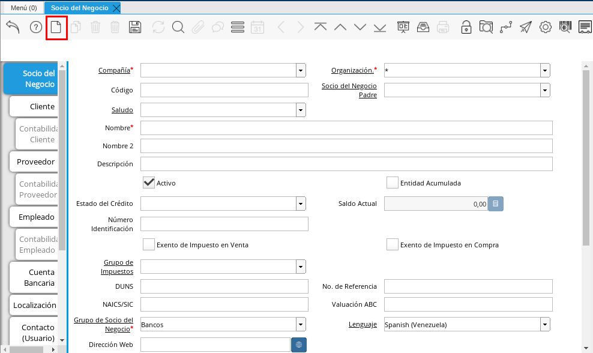
.. |Campo Organización| image:: resources/organizacion.png
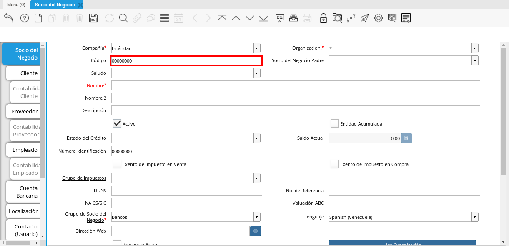
.. |Campo Nombre| image:: resources/nombre.png
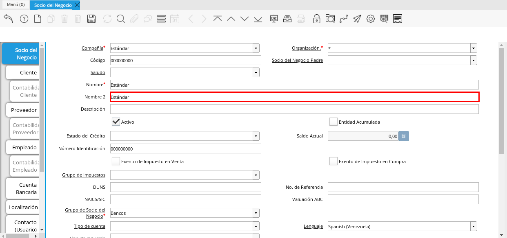
.. |Campo Descripción| image:: resources/descripcion.png
.. |Campo Entidad Acumulada| image:: resources/entiacumu.png
.. |Campo Estado de Crédito| image:: resources/estacredi.png
.. |Campo Saldo Actual| image:: resources/saldoac.png
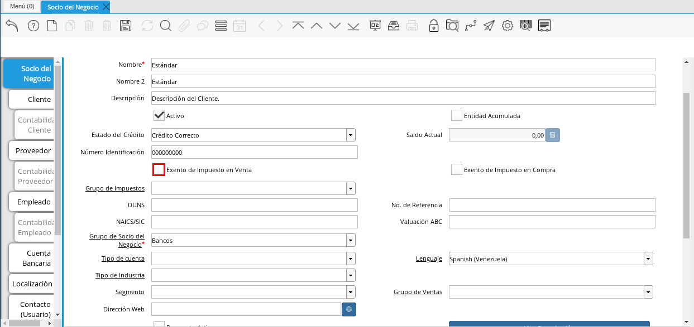
.. |Campo Exento de Impuesto en Compra| image:: resources/excompra.png
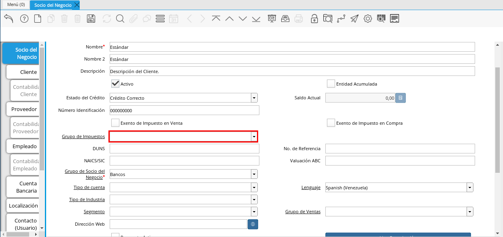
.. |Campo DUNS| image:: resources/duns.png
.. |Campo No. de Referencia| image:: resources/norefe.png
.. |Campo NAICS/SIC| image:: resources/naics.png
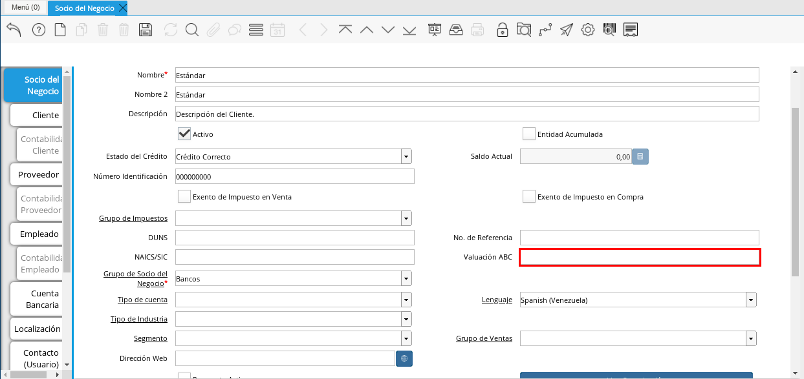
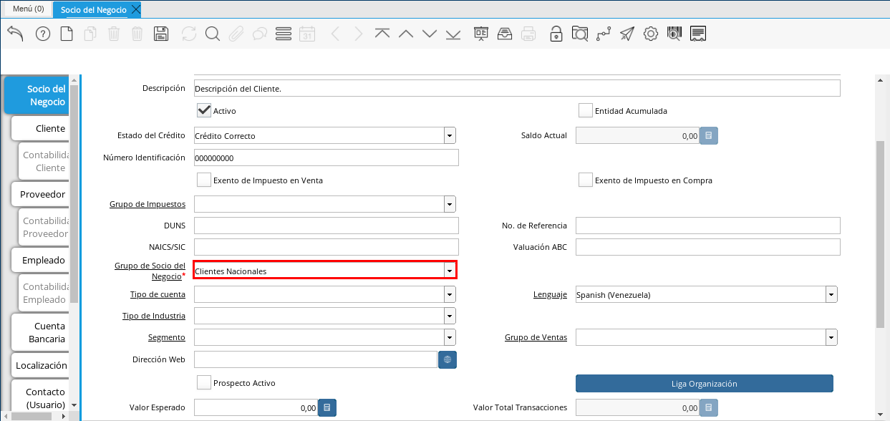
.. |Campo Tipo de Cuenta| image:: resources/cuentasocio.png
.. |Campo Lenguaje| image:: resources/lenguaje.png
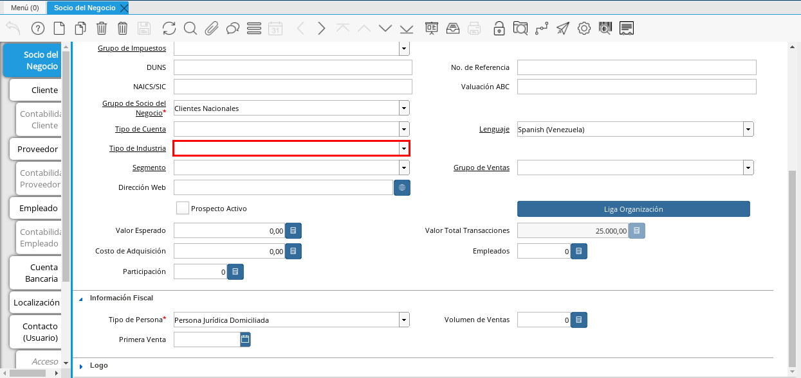
.. |Campo Segmento| image:: resources/segmento.png
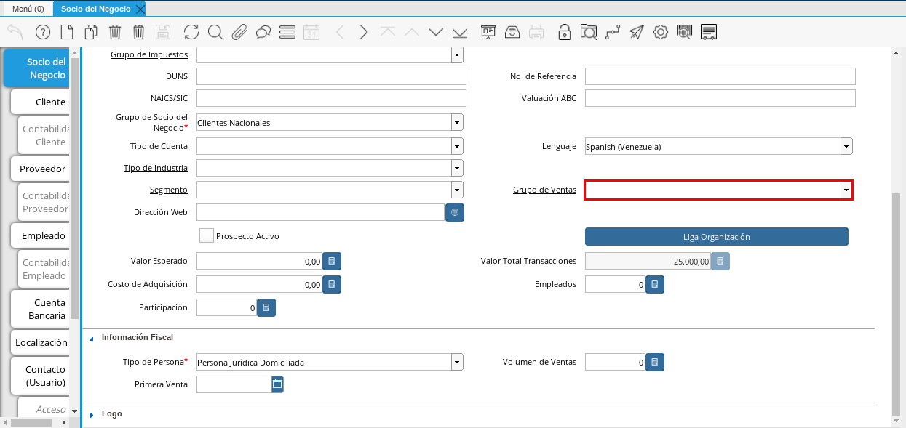
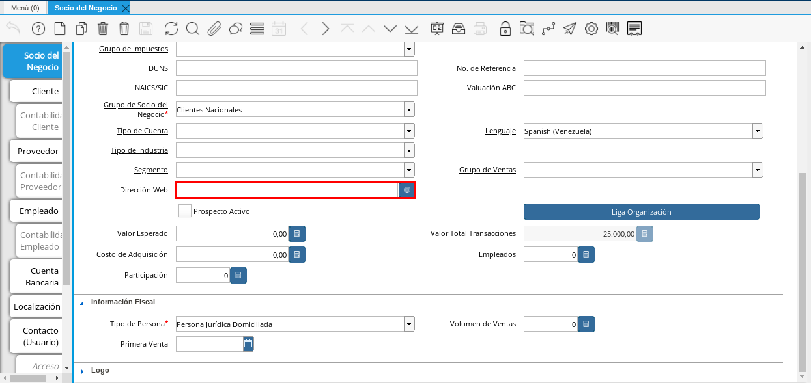
.. |Campo Prospecto Activo| image:: resources/prospecto.png
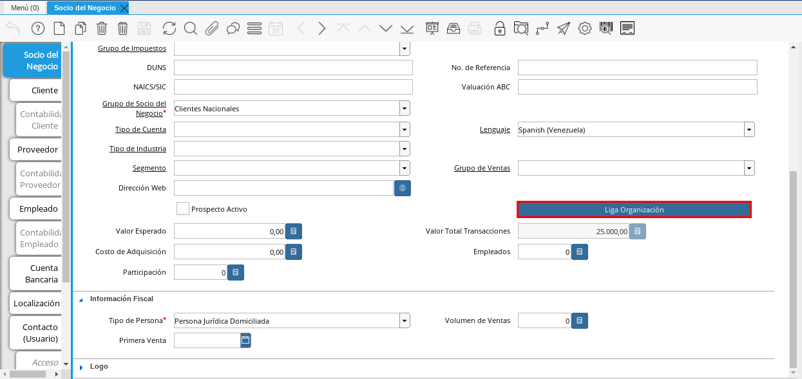
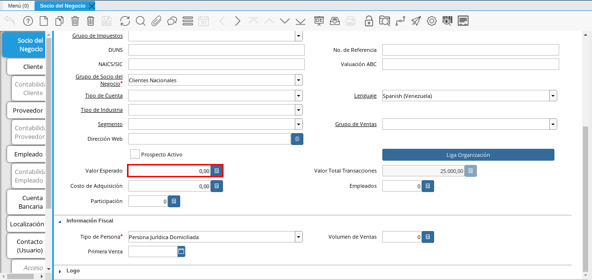
.. |Campo Valor Total Transacciones| image:: resources/transacciones.png
.. |Campo Costo de Adquisición| image:: resources/costo.png
.. |Campo Empleados| image:: resources/empleados.png
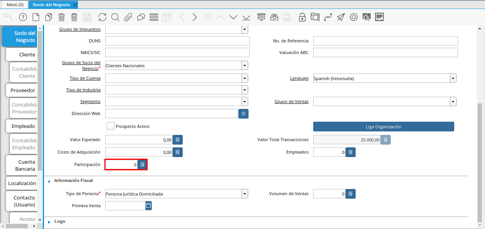
.. |Campo Tipo de Persona| image:: resources/tipoper.png
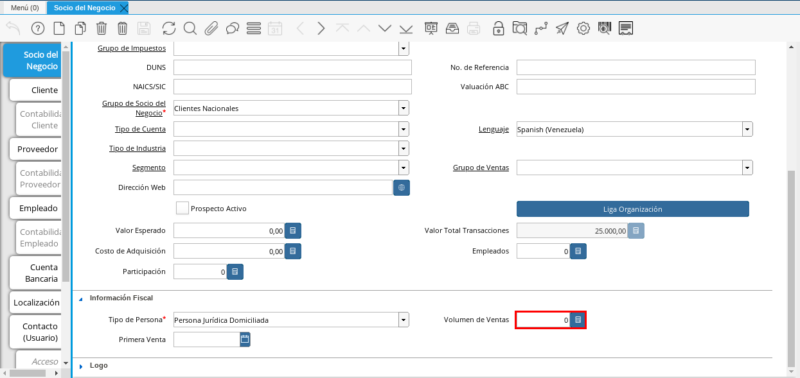
.. |Campo Primera Venta| image:: resources/fecha.png
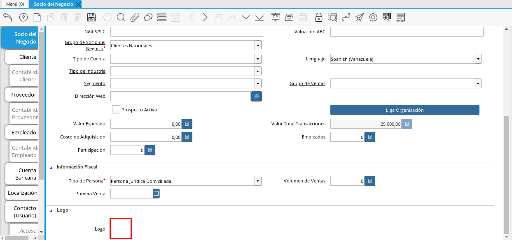
.. |Icono Guardar Cambios| image:: resources/guardar.png

.. _ERPyA: http://erpya.com

.. _documento/socio-negocio:

**Proceso de Registro del Socio del Negocio**
---------------------------------------------

#. En el menú de ADempiere, ubique y seleccione la carpeta "**Relación con Socio del Negocio**", luego seleccione la carpeta "**Reglas de Socios del Negocio**" y finalmente seleccione la ventana "**Socio del Negocio**".

    |Menú de ADempiere|

    Imagen 1. Menú de ADempiere

**Ventana Socio del Negocio**
-----------------------------

En esta ventana se registran los datos principales que la empresa requiere del socio del negocio cliente. Cada uno de los campos con el símbolo (*) son obligatorios para el registro.

#. A continuación visualizará la ventana "**Socio del Negocio**", dónde debe seleccionar el icono de "**Registro Nuevo**" que se encuentra ubicado en la barra de herramientas de ADempiere.

    |Ventana Principal Socio del Negocio|

    Imagen 2. Ventana Principal Socio del Negocio

#. Proceda al llenado de los campos necesarios que a continuación se detallan.

    #. Seleccione la organización en el campo "**Organización**".

    La Organización le permite definir la entidad legal ó una sub-unidad a la cual pertenece el Socio de negocio, si la organización es (*), este estará disponible para todas las organizaciones al procesar documentos y transacciones, pero si por el contrario, ha seleccionado una organización diferente este únicamente estará disponible para la organización seleccionada.

        |Campo Organización|

        Imagen 3. Campo Organización

        .. warning::

            Generalmente los **Socios de Negocios** son registros compartidos entre entidades organizacionales, por esta razón `ERPyA`_ recomienda la creación con organización (*) para evitar duplicidad e inconvenientes contables, de esta forma garantizamos la homogeneidad de los datos maestros.

    #. Introduzca el código de Socio del Negocio en el campo "**Código**".

    El código se refiere al número de identificación que acredite la identidad de una persona natural una entidad jurídica, por ejemplo, una cédula de identidad o un RIF.

        |Campo Código|

        Imagen 4. Campo Código

        .. note::

            Este campo mantiene incidencia en el campo **Número de Identificación**, es decir, al guardar el registro copia el código en este campo.

        .. warning::

            Se recomienda que al ingresar el valor en el campo "**Código**" no se ingrese caracteres especiales como puntos, guiones u otros que alteren el registro.

     #. Seleccione el Socio de Negocio Padre en el campo "**Socio de Negocio Padre**".

    Socio de Negocio Padre no es un campo obligatorio, sin embargo, es un campo que permite la agrupación de sub-entidades dependientes de un socio de negocio, para explicarlo mejor veamos el siguiente ejemplo:

        Imaginemos un proveedor de tipo cadena cuyo nombre es **Cadena Unica C.A**, esta tendrá dos tiendas fisicas, **Cadena Unica Centro C.A** y **Cadena Unica Oriente C.A** respectivamente. Para este caso el **Socio de Negocio Padre** es **Cadena Unica C.A**,quedando agrupado de forma que las dos tiendas serán hijas de **Cadena Unica C.A**, de esta forma al emitir reportes financieros podríamos generarlos desde el Socio de Negocio Padre (**Cadena Unica C.A**), agrupando todos los saldos de las tiendas por el padre ó podría generar los reportes unicamente por tienda.

        .. note::

        Generalmente esta opción es utlizada para franquicias, cadenas o corporaciones.

    #. Introduzca el nombre del socio del negocio  en el campo "**Nombre**".

    El nombre se refiere a la razón social, siendo esta el nombre ó la denominación con la que está registrado en los documentos legales, el nombre es utilizado a nivel administrativo, formal y jurídico.

        |Campo Nombre|

        Imagen 5. Campo Nombre

    #. Introduzca el Nombre 2 del socio del negocio en el campo "**Nombre 2**".

    El nombre 2 varia su uso dependiendo de la naturaleza del Socio del Negocio (Cliente, Proveedor o Empleado), si es un cliente o un proveedor es opcional, y generalmente se utiliza para colocar la denominación comercial, por el contrario, si es un empleado es obligatorio, siendo este campo que correspondiente al apellido, el mismo será impreso en los reportes administrativos y jurídicos.

        |Campo Nombre 2|

        Imagen 6. Campo Nombre 2

    #. Introduzca una breve descripción referente al socio del negocio cliente en el campo "**Descripción**".

    La descripción no es un campo obligatorio,sin embargo, le permite dejar descripciones o notas de interes para el registro.

        |Campo Descripción|

        Imagen 7. Campo Descripción

    #. Seleccione el checklist "**Entidad Acumulada**".

    Entidad acumulada no es un campo obligatorio, sin embargo, le permite definir al socio del negocio como entidad sumaria, lo que significa que si el socio de negocio tiene este check activo será un **Socio de Negocio Padre**.

        |Campo Entidad Acumulada|

        Imagen 8. Campo Entidad Acumulada

    #. Seleccione en el campo "**Estado de Crédito**".

    El estado del crédito no es un campo obligatorio, sin embargo, le permite definir el comportamiento para la gestión del crédito del socio de negocio, actua conjuntamente con el campo **Saldo Actual** y **Limite de Crédito** ubicado en la pestaña **Cliente**, este puede variar entre las siguiente opciones dependiendo de las necesidades:

        #. **Sin Verificación de Crédito:** Establecido de forma manual, omite la evaluación para los socios de negocios a los que no se evalua el crédito, equivalente a **Sin limite de Crédito**.

        #. **Crédito Correcto:** Activa la gestión de crédito por estar dentro del limite de cŕedito.

        #. **Crédito Verificación:** Es establecido de forma automatica por ADempiere al evaluar el crédito, cuando el saldo actual está por encima del 90% del limite de crédito.

        #. **Crédito Retenido:** Es establecido de forma automatica por ADempiere al evaluar el crédito, cuando el saldo actual está por encima del limite de crédito, bloqueando la posibilidad de completar ordenes de ventas, completar facturas y emitir entregas.

        #. **Crédito Detenido:** Establecido de forma manual, bloqueando la posibilidad de completar ordenes de ventas, completar facturas y emitir entregas.

        |Campo Estado de Crédito|

        Imagen 9. Campo Estado de Crédito

    #. Podra visualizar el saldo actual que posee el cliente en el campo "**Saldo Actual**.

    El saldo actual es un campo solo lectura, actualizado de forma automatica, aumentando o disminuyendo al emitir cuentas por cobrar o cuentas por pagar, controlando el estado de crédito.

        |Campo Saldo Actual|

        Imagen 10. Campo Saldo Actual

    #. Seleccione el checklist "**Exento de Impuesto en Venta**".

    Exento de Impuesto de Venta, no es un campo obligatorio, por defecto está establecido en falso, permite la omisión de impuestos al generar ordenes de ventas, es decir si un producto es gravado, hará una excepción para este socio de negocio, emitiendo la orden de venta con el producto en cuestión con impuesto (0%).

        |Campo Exento de Impuesto en Venta|

        Imagen 11. Campo Exento de Impuesto en Venta

    #. Seleccione el checklist "**Exento de Impuesto en Compra**", para definir al socio del negocio como exento de impuesto.

    Exento de Impuesto de Compra,  no es un campo obligatorio, por defecto está establecido en falso, permite la omisión de impuestos al generar ordenes de compras, es decir si un producto es gravado, hará una excepción para este socio de negocio, emitiendo la orden de compra con el producto en cuestión con impuesto (0%).

        |Campo Exento de Impuesto en Compra|

        Imagen 12. Campo Exento de Impuesto en Compra

    #. Seleccione el grupo de impuestos en el campo "**Grupo de Impuestos**".

        |Campo Grupo de Impuestos|

        Imagen 13. Campo Grupo de Impuestos

    #. Introduzca el código DUNS del socio del negocio en el campo "**DUNS**".

    El número DUNS (Data Universal Numbering System o Sistema Universal de Numeración de Datos) es un un número de identificación proporciona la identidad única a cada empresa a nivel internacional.

        |Campo DUNS|

        Imagen 14. Campo DUNS

    #. Introduzca el número de referencia socio del negocio en el campo "**No. de Referencia**".

    El número de Referencia es un número fijo que utiliza el socio de negocio para gestiones administrativas, este tiene incidencia en las ordenes de compra o venta dependiendo la naturaleza de la entidad, siendo establecido de forma automatica en las mismas.

        |Campo No. de Referencia|

        Imagen 15. Campo No. de Referencia

    #. Introduzca el código NAICS o SIC del socio del negocio en el campo "**NAICS/SIC**".

    El código NAICS (American Industry Classification System ó Sistema de Clasificación Industrial de América del Norte) es un código utilizado en los Estados Unidos, Canadá y México para clasificar la industria y actividad.

        |Campo NAICS/SIC|

        Imagen 16. Campo NAICS/SIC

    #. Introduzca en el campo "**Valuación ABC**", la clasificación de importancia que posee el socio del negocio cliente.

        |Campo Valuación ABC|

        Imagen 17. Campo Valuación ABC

    #. Seleccione el grupo de socio del negocio en el campo "**Grupo de Socio del Negocio**".
    El grupo de Socio del Negocio, permite categorizar sus socios de negocio de una forma especifica, lo cual es eficiente a la hora de emitir asientos contables y reportes, para entenderlo mejor veamos el siguiente ejemplo:

            Imaginemos que tenemos una cartera de clientes que manejan diferentes monedas, para categorizar de forma especifica sería: **Clientes Nacionales** y **Clientes Internacionales**, de esta forma podría emitir reportes de cuentas por cobrar para clientes nacionales e Internacionales respectivamente.

    Adicionalmente, define en el socio de negocio funciones y parametros a partir de la categoria, entre las que se encuentran:

        #. Impresión a Color: Define el color con los que serán mostrados en el arbol.

        #. Info Confidencial: Permite ingresar información confidencial en solicitudes Web.

        #. Lista de Precios Venta: Define lista de precios empleada en ordenes de venta y factura de cuentas por cobrar.

        #. Lista de Precios Compra: Define lista de precios empleada en ordenes de compra y factura de cuentas por pagar.

        #. Esquema de Descuento OV: Define esquema de descuento empleado en ordenes de venta y factura de cuentas por cobrar.

        #. Esquema de Descuento OC: Define esquema de descuento empleado en ordenes de compra y factura de cuentas por pagar.

        #. Porcentaje de Crédito en Verificación de Cliente: Define el porcentaje de crédito disponible para la evaluación del crédito previo a que un socio de negocio pase de crédito correcto a crédito en verificación.

        #. Porcentaje de Tolerancia OC/Factura: Define el porcentaje de diferencia que puede existir entre el precio de la orden de compra y el precio de la factura de cuentas por pagar, porcentaje de holgura con el cual podría ser completados estos documentos sin pasar por el flujo de aprobación.

        #. Contabilidad: Define cuentas contables en la que se realizarán los asientos contables dependiendo de la naturaleza del socio de negocio (Clientes o Proveedores).

        |Campo Grupo de Socio del Negocio|

        Imagen 18. Campo Grupo de Socio del Negocio

    #. Seleccione en el campo "**Tipo de Cuenta**", el tipo de cuenta o negocio que posee el socio del negocio cliente.

        |Campo Tipo de Cuenta|

        Imagen 19. Campo Tipo de Cuenta

    #. Seleccione en el campo "**Lenguaje**", el lenguaje a utilizar en los documentos que serán generados al socio del negocio cliente.

     El lenguaje no es un campo obligatorio, sin embargo, define el idioma con que será impreso los formatos de impresión asociados a este Socio de Negocio.

        |Campo Lenguaje|

        Imagen 20. Campo Lenguaje

    #. Seleccione en el campo "**Tipo de Industria**", el tipo de industria que clasifica al socio del negocio empleado.

    El tipo de industria no es un campo obligatorio, sin embargo, define la tipología de industria en la que se encuentra el Socio de Negocio.

        |Campo Tipo de Industria|

        Imagen 21. Campo Tipo de Industria

    #. Seleccione en el campo "**Segmento**", el segmento del socio del negocio cliente.

    El segmento no es un campo obligatorio, sin embargo, permite segmentar socios de negocios de manera rigurosa, identificar patrones que pueden ser usados para asignar un segmento.

        |Campo Segmento|

        Imagen 22. Campo Segmento

    #. Seleccione el grupo de ventas en el campo "**Grupo de Ventas**".

    El grupo de ventas no es un campo obligatorio, sin embargo, permite categorizar al socio de negocio en un grupo de venta con objetivos referente a marketing y promociones.

        |Campo Grupo de Ventas|

        Imagen 23. Campo Grupo de Ventas

    #. Introduzca  la dirección de la página web en el campo "**Dirección Web**".

    La dirección Web no es un campo obligatoro, sin embargo, permite registrar el sitio web del socio del negocio (Cliente y Proveedores) en el cual se administra la información de contacto de la empresa para solucionar sus inquietudes, realizar compras y gestión de solicitudes, aprovechando oportunidades de negocio que se encuentran en la red.

        |Campo Dirección Web|

        Imagen 24. Campo Dirección Web

    #. Seleccione el checklist "**Prospecto Activo**".

    Prospecto Activo no es un campo obligatorio, por defecto está establecido en falso, sin embargo al seleccionarlo indica que el socio de negocio de tipo cliente está activo.

        |Campo Prospecto Activo|

        Imagen 25. Campo Prospecto Activo

    #. Seleccione la opción "**Liga Organización**", para ejecutar el proceso.

    El proceso Liga Organización es ejecutado para los casos en los que son generados documentos en una organización A con una organización B, para entenderlo mejor veamos el siguiente ejemplo:

        Imaginemos que tenemos una organización (**Inversión del Norte**) la misma emite una orden de compra que será liquidada por la organización (**Inversión del Sur**), para este caso existirá un proveedor **Inversión del Sur C.A** en la organización **Inversión del Norte**, este proveedor entonces es ligado a la organización **Inversión del Sur**, esto con el fin de emitir la orden de compra que requiere la organización **Inversión del Norte** sea emitida con el socio de negocio del la organización **Inversión del Sur C.A**.

    Para ejecutar este proceso debe tomar en cuenta los siguientes parametros:

        #. Organización Existente: Seleccione una orgnización existente, si el campo queda vacio, se creará una organización con el nombre del socio de negocio de forma automatica.

        #. Tipo de Organización: Seleccione tipo de orgazación previa definición.

        #. Limite de Acceso al Rol: Seleccione un rol existente si desea que solo un rol especifico tenga acceso a esta organización, si el campo queda vacio, el rol ClientAdmin y ClientUser tendrán acceso a esta organización.

    Seleccione la opción **OK** y será ejecutado el proceso.

        .. note::

            Las configuraciones por limite de acceso a rol es modificable desde los roles.

        |Campo Liga Organización|

        Imagen 26. Campo Liga Organización

        .. warning::

            La organización puede ser ligada unicamente a un socio de negocio, para corregir error en la asignación de la organización, ejecute el proceso: **Desliga de Socio de Negocio a organización.**

    #. Introduzca el valor de ingresos en el campo "**Valor Esperado**".

    El valor esperado no es un campo obligatorio, sin embargo, permite ingresar un monto informativo de la rentabilidad esperada, basada en una estimación ingresos de un cliente.

        |Campo Valor Esperado|

        Imagen 27. Campo Valor Esperado

    #.  Podra visualizar el valor total de transacciones que posee el cliente en el campo "**Valor Total Transacciones**", el monto total de la primera venta realizada al socio del negocio cliente.

    El valor total transacciones es un campo solo lectura, actualizado de forma automatica, sumando cada ingreso generado por este cliente, el mismo permite evaluar la rentabilidad de un cliente potencial.

        |Campo Valor Total Transacciones|

        Imagen 28. Campo Valor Total Transacciones

    #. Introduzca el costo de adquisición en el campo "**Costo de Adquisición**".

    El costo de adquisición no es un campo obligatorio, sin embargo, permite registrar el monto total correspondiente al costo generado para lograr convertir un prospecto a cliente.

        |Campo Costo de Adquisición|

        Imagen 29. Campo Costo de Adquisición

    #. Introduzca la cantidad de empleados en el campo "**Empleados**".

    Empleados no es un campo obligatorio, sin embargo, le permite evaluar la cantidad de empleados de una empresa prospecto, funge como información informativa para ser utilizada en cotizaciones por ejemplo.

        |Campo Empleados|

        Imagen 30. Campo Empleados

    #. Introduzca el porcentaje de participación en el campo "**Participación**".

    La participación no es un campo obligatorio, sin embargo, le permite mantener el control porcentualmente de la proporción obtenidas de las compras del cliente en la producción o distribución de productos o servicios.

    Esto genera fedelización del cliente, dando la oportunidad de evaluar promociones y descuentos para aquellor clientes en los cuales su participación sea alta, y a su vez, mayor oportunidad en el aumento de la cartera de cliente creando programas para ventas cruzadas y sugestivas, comercializando así más productos y servicios.

        |Campo Participación|

        Imagen 31. Campo Participación

    #. Introduzca  el número de ventas total en el campo "**Volumen de Ventas**".

    El volumen de ventas no es un campo obligatorio, sin embargo, permite registrar el numero de ventas efectivas de un cliente, estas cifras generalmente son auditadas en reuniones directivas para evaluar la rentabilidad y expansión del negocio o si por el contrario sus ventas disminuyen.

    Adicionalmente este datos es producto de supervisión para controlar volumen de ventas en comparación a pronosticos de ventas, estableciendo una estimación de cantidades mínimas a vender para mantener un equilibrio en la organización.

        |Campo Volumen de Ventas|

        Imagen 33. Campo Volumen de Ventas

    #. Introduzca la fecha de la primera venta en el campo "**Primera Venta**".

    La primera venta no es un campo obligatorio, sin embargo, permite registrar la fecha de la primera venta de forma informativa, util para evaluar descuentos y promociones por aniversarios.

        |Campo Primera Venta|

        Imagen 34. Campo Primera Venta

    #. Seleccione el tipo de persona en el campo "**Tipo de Persona**.

    El tipo de persona se refiere a la forma legal como está esta constituida una organización, entre las cuales tenemos las siguientes opciones:

        #. Juridica Domiciliada: Persona Jurídica Domiciliada es una empresa constituida dentro del territorio nacional, que cumple sus obligaciones y resguarda la empresa con su patrimonio.

        #. Juridica No Domiciliada: Persona Jurídica No Domiciliada es una empresa constituida fuera del territorio nacional, que cumple sus obligaciones y resguarda la empresa con su patrimonio.

        #. Natural Residente: Persona Natural Residente es una persona residente en el país que asume  las obligaciones, responsabilidades y resguarda las obligaciones con patrimonio propio.

        #. Natural No Residente: Persona Natural No Residente es una persona residente fuera del país, que asume las obligaciones, responsabilidades y resguarda las obligaciones con patrimonio propio.

        |Campo Tipo de Persona|

        Imagen 32. Campo Tipo de Persona

   #. Adjunte el logo de la empresa en el campo "**Logo**".

   El logo no es un campo obligatorio, sin embargo permite guardar logotipos de socios de negocios.

        |Campo Logo|

        Imagen 35. Campo Logo

#. Seleccione el icono "**Guardar Cambios**" ubicado en la barra de herramientas para guardar los datos ingresados.

        |Icono Guardar Cambios|

        Imagen 36. Icono Guardar Cambios

.. warning::

    Recuerde guardar el registro de los campos cada vez que se vaya a posicionar en una pestaña de la ventana socio del negocio.
