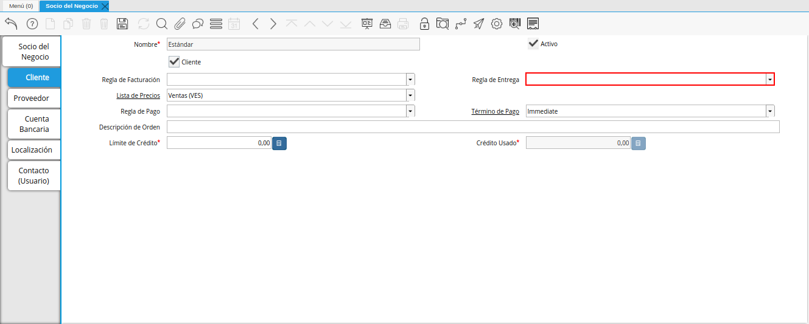
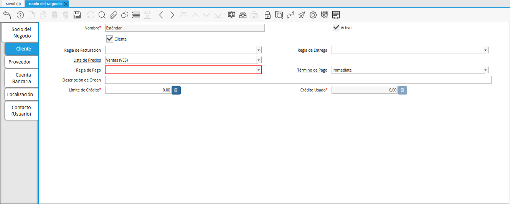
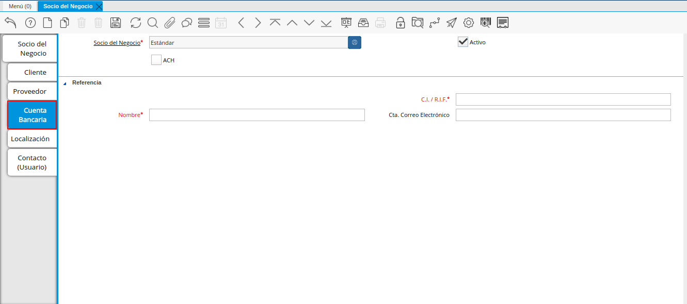
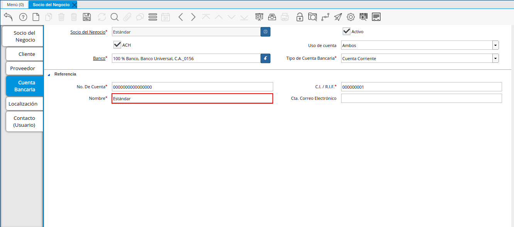
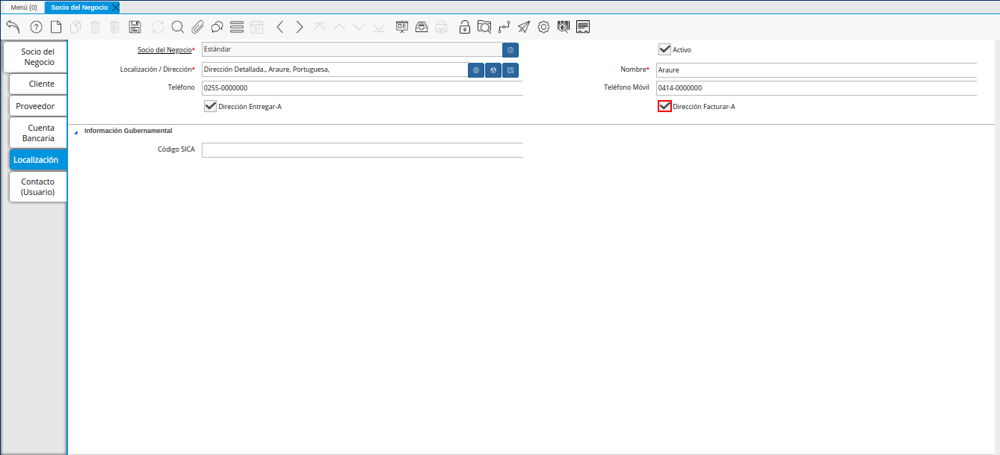
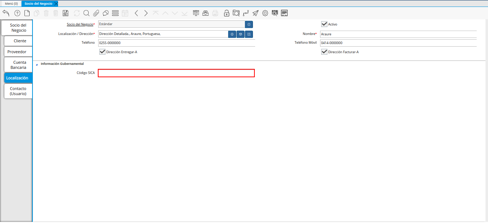
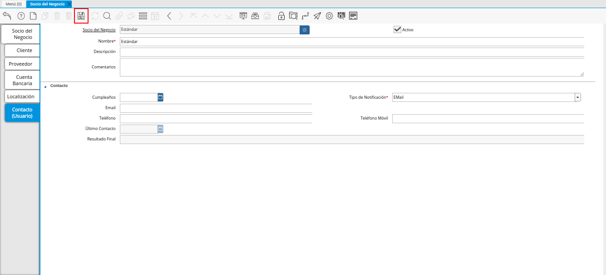

.. _ERPyA: http://erpya.com
.. |Pestaña Cliente de la Ventana Socio del Negocio| image:: resources/customer-tab-of-the-business-partner-window.png
.. |Checklist Cliente de la Pestaña Cliente de la Ventana Socio del Negocio| image:: resources/customer-checklist-from-the-customer-tab-of-the-business-partner-window.png
.. |Campo Regla de Facturación de la Pestaña Cliente| image:: resources/billing-rule-field-of-the-customer-tab.png

.. |Campo Lista de Precios de la Pestaña Cliente| image:: resources/price-list-field-of-the-customer-tab.png

.. |Campo Término de Pago de la Pestaña Cliente| image:: resources/payment-term-field-of-the-customer-tab.png
.. |Campo Descripción de Orden de la Pestaña Cliente| image:: resources/order-description-field-of-the-customer-tab.png
.. |Campo Límite de Crédito de la Pestaña Cliente| image:: resources/credit-limit-field-of-the-customer-tab.png
.. |Campo Crédito Usado de la Pestaña Cliente| image:: resources/used-credit-field-of-the-customer-tab.png

.. |Checklist ACH de la Pestaña Cuenta Bancaria del Registro Cliente| image:: resources/ach-checklist-of-the-bank-account-tab-of-the-supplier-record.png
.. |Campo Uso de Cuenta de la Pestaña Cuenta Bancaria del Registro Cliente| image:: resources/account-use-field-of-the-bank-account-tab-of-the-supplier-record.png
.. |Campo Banco de la Pestaña Cuenta Bancaria del Registro Cliente| image:: resources/bank-field-of-the-bank-account-tab-of-the-supplier-record.png
.. |Ventana Bancos de la Pestaña Cuenta Bancaria del Registro Cliente| image:: resources/banks-window-of-the-bank-account-tab-of-the-supplier-record.png
.. |Campo Tipo de Cuenta Bancaria de la Pestaña Cuenta Bancaria del Registro Cliente| image:: resources/bank-account-type-field-of-the-bank-account-tab-of-the-supplier-record.png
.. |Campo Nro De Cuenta de la Pestaña Cuenta Bancaria del Registro Cliente| image:: resources/account-number-field-of-the-bank-account-tab-of-the-supplier-record.png
.. |Campo CI RIF del Titular de la Cuenta de la Pestaña Cuenta Bancaria del Registro Cliente| image:: resources/ci-rif-field-of-the-account-holder-of-the-bank-account-tab-of-the-supplier-record.png

.. |Campo Cta Correo Electrónico del Titular de la Cuenta de la Pestaña Cuenta Bancaria del Registro Cliente| image:: resources/cta-field-email-of-the-account-holder-of-the-bank-account-tab-of-the-supplier-record.png
.. |Icono Guardar Cambios de la Pestaña Cuenta Bancaria del Registro Cliente| image:: resources/save-changes-icon-on-the-bank-account-tab-of-the-supplier-record.png
.. |Pestaña Localización del Registro Cliente| image:: resources/provider-record-location-tab.png
.. |Campo Ubicación Dirección de la Pestaña Localización del Registro Cliente| image:: resources/location-field-address-of-the-vendor-record-location-tab.png
.. |Ventana de Localización de la Pestaña Localización del Registro Cliente| image:: resources/location-window-of-the-vendor-record-location-tab.png
.. |Campo Nombre de la Pestaña Localización del Registro Cliente| image:: resources/field-name-of-the-supplier-record-location-tab.png
.. |Campo Teléfono de la Pestaña Localización del Registro Cliente| image:: resources/phone-field-of-the-provider-record-location-tab.png
.. |Campo Teléfono Móvil de la Pestaña Localización del Registro Cliente| image:: resources/mobile-phone-field-of-the-provider-record-location-tab.png
.. |Checklist Dirección Entregar-A de la Pestaña Localización del Registro Cliente| image:: resources/address-checklist-deliver-to-from-the-supplier-record-location-tab.png

.. |Icono Guardar Cambios de la Pestaña Localización del Registro Cliente| image:: resources/save-changes-icon-on-the-vendor-record-location-tab.png
.. |Pestaña Contacto del Registro Cliente| image:: resources/supplier-record-contact-tab.png
.. |Campo Nombre de Contacto de la Pestaña Contacto del Registro Cliente| image:: resources/contact-name-field-of-the-contact-tab-of-the-supplier-record.png
.. |Campo Descripción de Contacto de la Pestaña Contacto del Registro Cliente| image:: resources/contact-description-field-of-the-contact-tab-of-the-supplier-record.png
.. |Campo Comentarios de Contacto de la Pestaña Contacto del Registro Cliente| image:: resources/contact-comments-field-of-the-contact-tab-of-the-supplier-record.png
.. |Campo Cumpleaños de Contacto de la Pestaña Contacto del Registro Cliente| image:: resources/contact-birthday-field-of-the-contact-tab-of-the-supplier-record.png
.. |Campo Tipo de Notificación de Contacto de la Pestaña Contacto del Registro Cliente| image:: resources/contact-notification-type-field-of-the-contact-tab-of-the-supplier-record.png
.. |Campo Email de la Pestaña Contacto del Registro Cliente| image:: resources/email-field-of-the-contact-tab-of-the-supplier-record.png
.. |Campo Teléfono de la Pestaña Contacto del Registro Cliente| image:: resources/telephone-field-of-the-contact-tab-of-the-supplier-record.png
.. |Campo Teléfono Móvil de la Pestaña Contacto del Registro Cliente| image:: resources/mobile-phone-field-of-the-contact-tab-of-the-supplier-record.png
.. |Campo Último Contacto de la Pestaña Contacto del Registro Cliente| image:: resources/last-contact-field-of-the-contact-tab-of-the-supplier-record.png
.. |Campo Resultado Final de la Pestaña Contacto del Registro Cliente| image:: resources/final-result-field-of-the-contact-tab-of-the-supplier-record.png

.. _documento/socio-cliente:

**Registro de Cliente**
=======================

Para registrar un cliente, es necesario que sea realizado el procedimiento regular explicado en el documento :ref:`documento/socio-negocio`, elaborado por `ERPyA`_.

#. Luego de culminar el procedimieto de registro de socio del negocio, seleccione la pestaña "**Cliente**" que se encuentra del lado izquierdo de la ventana socio del negocio, para identificar al socio del negocio como cliente de la empresa.

    En esta pestaña es registrada la información que la empresa requiere del socio del negocio cliente al momento de una venta al mismo. Cada uno de los campos que la misma contiene son necesarios en algún punto de la transacción de ventas.

    |Pestaña Cliente de la Ventana Socio del Negocio|

    Imagen 1. Pestaña Cliente

#. A continuación visualizará la siguiente imagen, dónde debe tildar el checklist "**Cliente**".

    |Checklist Cliente de la Pestaña Cliente de la Ventana Socio del Negocio|

    Imagen 2. Checklist Cliente

    .. warning::

        Al tildar el checklist "**Cliente**", podrá apreciar diferentes campos que establecen los términos o reglas para las transacciones de ventas al socio del negocio cliente que esta registrando. Dichos campos no son obligatorios porque pueden ser establecidos al momento de generar la orden de venta al socio del negocio.

    #. Seleccione en el campo "**Regla de Facturación**", la regla establecida para facturar al socio del negocio cliente.

        |Campo Regla de Facturación de la Pestaña Cliente|

        Imagen 3. Campo Regla de Facturación

    #. Seleccione en el campo "**Regla de Entrega**", la regla establecida para entregar al cliente los productos o servicios.

        |Campo Regla de Entrega de la Pestaña Cliente|

        Imagen 4. Campo Regla de Entrega

    #. Seleccione en el campo "**Lista de Precios**", la lista de precios establecida para las ventas al socio del negocio cliente que esta registrando.

        |Campo Lista de Precios de la Pestaña Cliente|

        Imagen 5. Campo Lista de Precios

    #. Seleccione en el campo "**Regla de Pago**", la forma de pago de las facturas establecida para el socio del negocio cliente que esta registrando.

        |Campo Regla de Pago de la Pestaña Cliente|

        Imagen 6. Campo Regla de Pago

    #. Seleccione en el campo "**Término de Pago**", las condiciones de pago de las facturas establecida para el socio del negocio que esta registrando.

        |Campo Término de Pago de la Pestaña Cliente|

        Imagen 7. Campo Término de Pago

    #. Introduzca en el campo "**Descripción de Orden**", una descripción estándar para se utilizadas en las órdenes a generar al socio del negocio cliente que esta registrando.

        |Campo Descripción de Orden de la Pestaña Cliente|

        Imagen 8. Campo Descripción de Orden

    #. Introduzca en el campo "**Límite de Crédito**", el límite de crédito establecido para el socio del negocio cliente que esta registrando.

        |Campo Límite de Crédito de la Pestaña Cliente|

        Imagen 9. Campo Límite de Crédito

    #. Podrá visualizar en el campo "**Crédito Usado**", el crédito usado por el socio del negocio cliente que esta registrando.

        |Campo Crédito Usado de la Pestaña Cliente|

        Imagen 10. Campo Crédito Usado

.. warning::

    Recuerde guardar el registro de los campos cada vez que se vaya a posicionar en una pestaña de la ventana socio del negocio.

**Pestaña Cuenta Bancaria**
***************************

En esta pestaña se registran los datos bancarios del socio del negocio cliente, con el checklist "**ACH**" se pueden registrar los datos de la cuenta bancaria del socio del negocio.

#. Seleccione la pestaña "**Cuenta Bancaria**" que se encuentra ubicada del lado izquierdo de la ventana socio del negocio. Por defecto se encuentra tildado el checklist "**Activo**".

    |Pestaña Cuenta Bancaria del Registro Cliente|

    Imagen 11. Pestaña Cuenta Bancaria

**Checklist ACH**
+++++++++++++++++

#. Para registros de cuentas bancarias, tilde el checklist "**ACH**", a continuación se reflejarán los campos para el registro de la cuenta bancaria del socio del negocio.

    |Checklist ACH de la Pestaña Cuenta Bancaria del Registro Cliente|

    Imagen 12. Checklist ACH

#. Seleccione en el campo "**Uso de Cuenta**", la opción que define como es usada la cuenta banco del socio del negocio.

    |Campo Uso de Cuenta de la Pestaña Cuenta Bancaria del Registro Cliente|

    Imagen 13. Campo Uso de Cuenta

#. En el campo "**Banco**" seleccione el banco a registrar con ayuda del ícono identificador (adjunto imagen).

    |Campo Banco de la Pestaña Cuenta Bancaria del Registro Cliente|

    Imagen 14. Campo Banco

    #. A continuación visualizará la siguiente ventana con los diferentes bancos, dónde debe seleccionar el banco que posee el socio del negocio cliente y la opción "**OK**" para cargar los datos al formulario.

        |Ventana Bancos de la Pestaña Cuenta Bancaria del Registro Cliente|

        Imagen 15. Opción OK

#. Seleccione el tipo de cuenta correspondiente a la cuenta del socio del negocio cliente en el campo "**Tipo de Cuenta Bancaria**".

    |Campo Tipo de Cuenta Bancaria de la Pestaña Cuenta Bancaria del Registro Cliente|

    Imagen 16. Campo Tipo de Cuenta Bancaria

#. Introduzca en el campo "**No. De Cuenta**", el número de cuenta del socio del negocio cliente que esta registrando.

    |Campo Nro De Cuenta de la Pestaña Cuenta Bancaria del Registro Cliente|

    Imagen 17. Campo No. De Cuenta

    .. warning::

        Este proceso se realiza con la finalidad de registrar la cuenta del socio del negocio.

#. Introduzca en el campo "**C.I./R.I.F.**", el número de cédula o registro de información fiscal del titular de la cuenta bancaria que esta registrando.

    |Campo CI RIF del Titular de la Cuenta de la Pestaña Cuenta Bancaria del Registro Cliente|

    Imagen 18. Campo C.I./R.I.F. del Titular de la Cuenta

#. Introduzca el nombre de referencia en el campo "**Nombre**", en este campo va el nombre del titular de la tarjeta de crédito o de la cuenta bancaria que esta registrando.

    |Campo Nombre del Titular de la Cuenta de la Pestaña Cuenta Bancaria del Registro Cliente|

    Imagen 19. Campo Nombre de Titular de Cuenta

#. Introduzca en el campo "**Cta. Correo Electrónico**", la cuenta de correo electrónico del titular de la cuenta bancaria que esta registrando.

    |Campo Cta Correo Electrónico del Titular de la Cuenta de la Pestaña Cuenta Bancaria del Registro Cliente|

    Imagen 20. Campo Cta Correo Electrónico del Titular de la Cuenta

#. Seleccione el icono "**Guardar Cambios**" ubicado en la barra de herramientas para guardar los datos ingresados.

    |Icono Guardar Cambios de la Pestaña Cuenta Bancaria del Registro Cliente|

    Imagen 21. Icono Guardar Cambios de la Pestaña Cuenta Bancaria

.. warning::

    Este proceso se realiza con la finalidad de registrar la cuenta bancaria del socio del negocio cliente.

.. _documento/pestaña-localización-del-cliente:

**Pestaña Localización**
************************

La localización de un socio del negocio cliente es muy importante por diferentes motivos, ya que las transacciones de ventas serán realizadas al mismo, en esta pestaña se deben registrar con exactitud los datos de la dirección del socio del negocio.

#. Seleccione la pestaña "**Localización**" que se encuentra ubicada del lado izquierdo de la ventana socio del negocio.

    |Pestaña Localización del Registro Cliente|

    Imagen 22. Pestaña Localización

#. Introduzca en el campo "**Localización / Dirección**", la dirección de localización del socio del negocio cliente con ayuda del identificador.

    |Campo Ubicación Dirección de la Pestaña Localización del Registro Cliente|

    Imagen 23. Campo Localización / Dirección

        #. A continuación visualizará la siguiente ventana, dónde debe introducir la dirección exacta del socio del negocio cliente que esta registrando.

            |Ventana de Localización de la Pestaña Localización del Registro Cliente|

            Imagen 24. Ventana de Localización

#. Introduzca en el campo "**Nombre**", el nombre de la localización del socio del negocio.

    |Campo Nombre de la Pestaña Localización del Registro Cliente|

    Imagen 25. Campo Nombre

    .. note::

        Si no es ingresado ningún valor en este campo, al guardar el registro de la ventana, ADempiere toma el valor ingresado en el campo "**Dirección 1**", de la ventana desplegada por el identificador del campo "**Localización/Dirección**".

#. Introduzca en el campo "**Teléfono**", el número de teléfono local para contactar al socio del negocio cliente.

    |Campo Teléfono de la Pestaña Localización del Registro Cliente|

    Imagen 26. Campo Teléfono

#. Introduzca en el campo "**Teléfono Móvil**", el número de teléfono móvil para contactar al socio del negocio cliente.

    |Campo Teléfono Móvil de la Pestaña Localización del Registro Cliente|

    Imagen 27. Campo Teléfono Móvil

#. Podrá apreciar tildados los checklist "**Dirección Entregar-A**" y "**Dirección Facturar-A**", indicando cada uno de ellos un comportamiento diferente.

    #. El checklist "**Dirección Entregar-A**" establece la localización ingresada como la dirección para embarcar los bienes.

        |Checklist Dirección Entregar-A de la Pestaña Localización del Registro Cliente|

        Imagen 28. Campo Dirección Entregar-A

    #. El checklist "**Dirección Facturar-A**" establece la localización ingresada como la dirección para facturar.

        |Checklist Facturar-A de la Pestaña Localización del Registro Cliente|

        Imagen 29. Campo Dirección Facturar-A

#. Introduzca en el campo "**Código SICA**", el código SICA del socio del negocio cliente.

    |Campo Código SICA de la Pestaña Localización del Registro Cliente|

    Imagen 30. Campo Código SICA

#. Seleccione el icono "**Guardar Cambios**" ubicado en la barra de herramientas para guardar los datos ingresados.

    |Icono Guardar Cambios de la Pestaña Localización del Registro Cliente|

    Imagen 31. Icono Guardar Cambios de la Pestaña Localización

.. warning::

    Recuerde guardar el registro de los campos cada vez que se vaya a posicionar en una pestaña de la ventana socio del negocio.

**Pestaña Contacto**
********************

En esta pestaña se registran todos los datos de contacto que se posea el socio del negocio cliente.

#. Seleccione la pestaña "**Contacto**" que se encuentra ubicada del lado izquierdo de la ventana socio del negocio, para proceder a llenar los campos necesarios.

    |Pestaña Contacto del Registro Cliente|

    Imagen 32. Pestaña Contacto

    .. warning::

        El contacto (Usuario) permite registrar las diferentes personas de contacto que tiene la empresa con el socio del negocio cliente que esta registrando. Un ejemplo de esta pestaña puede ser, un jefe o persona de contacto por departamento para que a la hora de alguna venta de productos o servicios al socio del negocio cliente, se contacte a la persona correspondiente.

    #. Introduzca en el campo "**Nombre**", el nombre completo de la persona de contacto con el socio del negocio cliente que esta registrando.

        |Campo Nombre de Contacto de la Pestaña Contacto del Registro Cliente|

        Imagen 33. Nombre de Contacto

    #. Introduzca en el campo "**Descripción**", una breve descripción de la persona de contacto con el socio del negocio cliente que esta registrando.

        |Campo Descripción de Contacto de la Pestaña Contacto del Registro Cliente|

        Imagen 34. Campo Descripción

    #. Introduzca en el campo "**Comentarios**", los comentarios o información adicional sobre el registro de la persona de contacto con el socio del negocio cliente.

        |Campo Comentarios de Contacto de la Pestaña Contacto del Registro Cliente|

        Imagen 35. Campo Comentarios

    #. Seleccione en el campo "**Cumpleaños**", la fecha de nacimiento de la persona de contacto con el socio del negocio.

        |Campo Cumpleaños de Contacto de la Pestaña Contacto del Registro Cliente|

        Imagen 36. Campo Cumpleaños

    #. Seleccione en el campo "**Tipo de Notificación**", el tipo de notificación para los correos o avisos.

        |Campo Tipo de Notificación de Contacto de la Pestaña Contacto del Registro Cliente|

        Imagen 37. Campo Tipo de Notificación
        
    #. Introduzca en el campo "**Email**", el correo electrónico de la persona de contacto con el socio del negocio para las transacciones entre las empresas.

        |Campo Email de la Pestaña Contacto del Registro Cliente|

        Imagen 38. Campo Email

    #. Introduzca en el campo "**Teléfono**", el teléfono para localizar a la persona de contacto con el socio del negocio para las transacciones entre las empresas.

        |Campo Teléfono de la Pestaña Contacto del Registro Cliente|

        Imagen 39. Campo Teléfono de Contacto

    #. Introduzca en el campo "**Teléfono Móvil**", el teléfono móvil para localizar a la persona de contacto con el del socio del negocio.

        |Campo Teléfono Móvil de la Pestaña Contacto del Registro Cliente|

        Imagen 40. Campo Teléfono Móvil

    #. Podrá visualizar en el campo "**Último Contacto**", la última vez que fue contactado el individuo de contacto del socio del negocio.

        |Campo Último Contacto de la Pestaña Contacto del Registro Cliente|

        Imagen 41. Campo Último Contacto

    #. Podrá visualizar en el campo "**Resultado Final**", el resultado del último contacto realizado al individuo de contacto del socio del negocio.

        |Campo Resultado Final de la Pestaña Contacto del Registro Cliente|

        Imagen 42. Campo Resultado Final

    #. Seleccione el icono "**Guardar Cambios**" en la barra de herramientras de ADempiere, para guardar el registro de los campos.

        |Icono Guardar Cambios de la Pestaña Contacto del Registro Cliente|

        Imagen 43. Icono Guardar Cambios

.. note::

    Este procedimiento realizado aplica solo para los **Socios del Negocio** que cumplan el rol de **Cliente**.
