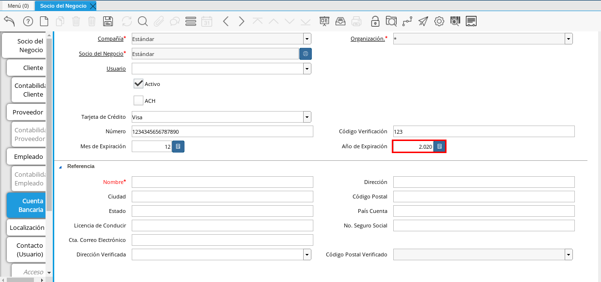
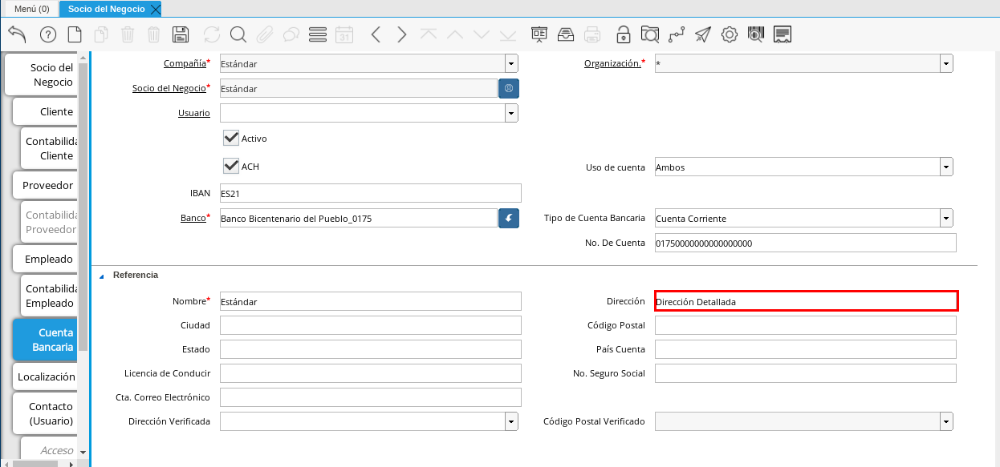
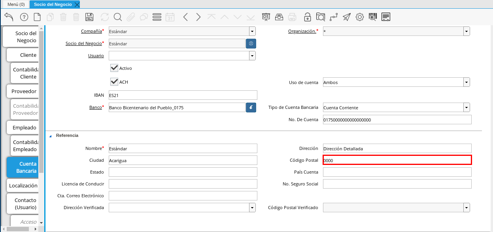
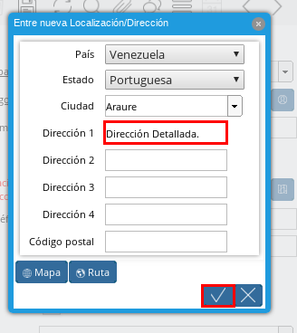
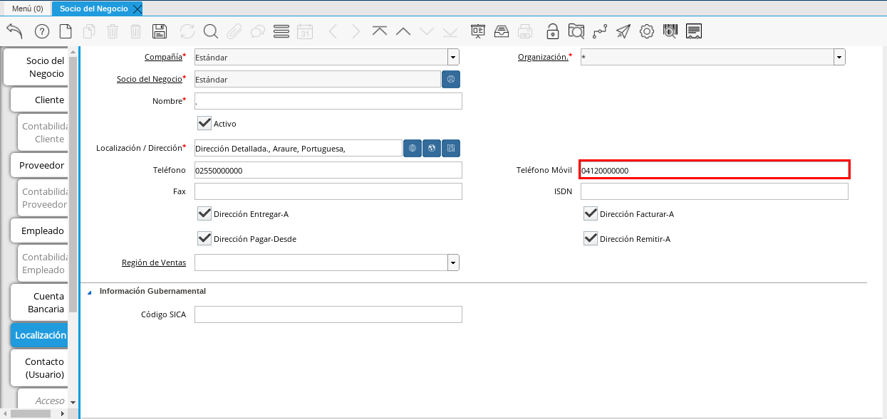
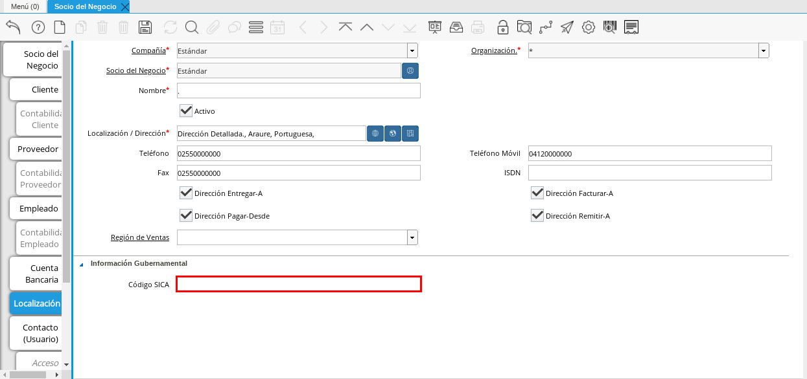
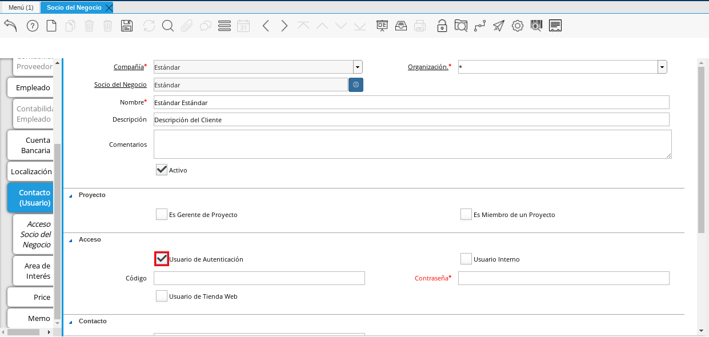
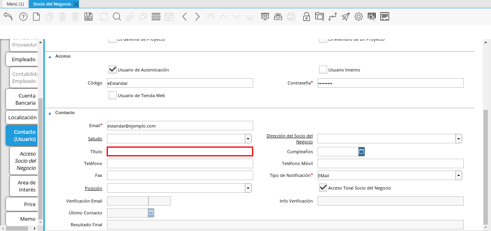
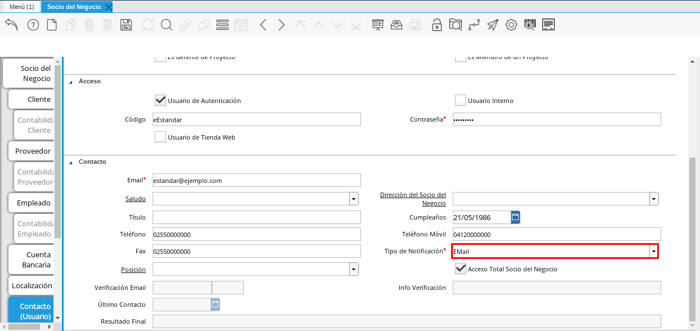
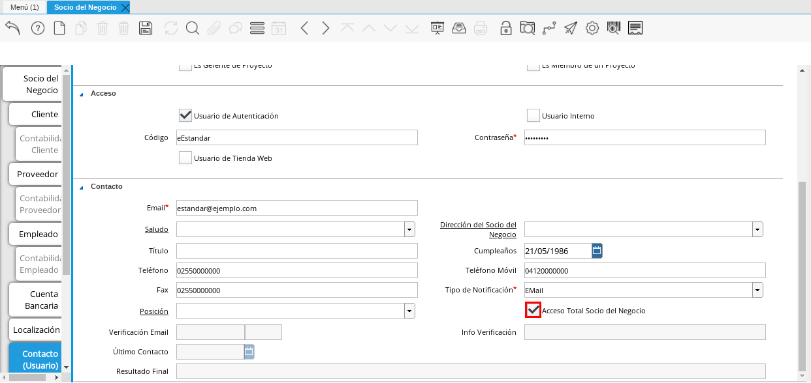

.. _ERPyA: http://erpya.com

.. |Pestaña Cliente| image:: resources/cliente.png

.. |Campo Regla de Facturación| image:: resources/regla.png
.. |Campo Programa de Facturación| image:: resources/programa.png

.. |Campo Vía de Entrega| image:: resources/via.png

.. |Campo % Descuento| image:: resources/descuento.png

.. |Campo Término de Pago| image:: resources/termino.png
.. |Campo Agente Comercial| image:: resources/agente.png
.. |Campo Morosidad| image:: resources/moroso.png

.. |Campo Límite de Crédito| image:: resources/limite.png

.. |Campo Tiempo de Gracia Cobro| image:: resources/gracia.png
.. |Pestaña Cuenta Bancaria| image:: resources/cuenta.png

.. |Campo Número| image:: resources/numtarjeta.png

.. |Campo Mes de Expiración| image:: resources/mes.png

.. |Campo Banco| image:: resources/banco.png
.. |Opción OK| image:: resources/selecbanco.png

.. |Campo No. De Cuenta| image:: resources/numcuenta.png

.. |Campo Estado de Entidad Bancaria| image:: resources/estadocuenta.png
.. |Campo País Cuenta| image:: resources/paiscuenta.png
.. |Campo Licencia de Conducir| image:: resources/licencia.png
.. |Campo No. Seguro Social| image:: resources/sso.png
.. |Campo Cta. Correo Electrónico| image:: resources/correo.png

.. |Campo Código Postal Verificado| image:: resources/postalveri.png

.. |Campo Estado| image:: resources/estado.png
.. |Campo Ciudad| image:: resources/ciudad.png

.. |Campo Teléfono| image:: resources/telelocal.png

.. |Campo Fax| image:: resources/fax.png

.. |Campo Dirección Pagar-Desde| image:: resources/direcpagar.png

.. |Campo Región de Ventas| image:: resources/region.png

.. |Pestaña Contacto| image:: resources/contacto.png
.. |Campo Nombre de Contacto| image:: resources/nomcontacto.png
.. |Campo Descripción Persona| image:: resources/descricliente.png
.. |Campo Comentarios| image:: resources/comentario.png
.. |Checklist Activo| image:: resources/activo.png

.. |Campo Es Miembro de un Proyecto| image:: resources/miembro.png

.. |Campo Usuario Interno| image:: resources/interno.png
.. |Campo Código Usuario| image:: resources/nomusuario.png

.. |Checklist Usuario de Tienda Web| image:: resources/tienda.png

.. |Campo Saludo| image:: resources/saludo.png
.. |Campo Dirección del Socio del Negocio| image:: resources/direcontacto.png

.. |Campo Cumpleaños| image:: resources/cumple.png

.. |Campo Teléfono Móvil Contacto| image:: resources/movil.png
.. |Campo Fax Contacto| image:: resources/faxcontacto.png

.. |Campo Posición| image:: resources/posicion.png

.. |Icono Guardar Cambios2| image:: resources/campos.png

.. _documento/socio-cliente:

**Registro de Cliente**
=======================

Para registrar un cliente, es necesario que sea realizado el procedimiento regular explicado en el documento :ref:`documento/socio-negocio`, elaborado por `ERPyA`_.

Luego de culminar el procedimieto de registro de socio del negocio, seleccione la pestaña "**Cliente**" que se encuentra del lado izquierdo de la ventana socio del negocio, para identificar al socio del negocio como cliente de la empresa.

    En esta pestaña es registrada la información que la empresa requiere del socio del negocio cliente al momento de una venta al mismo. Cada uno de los campos que la misma contiene son necesarios en algún punto de la transacción de ventas.

    |Pestaña Cliente|

    Imagen 1. Pestaña Cliente

A continuación visualizará la siguiente imagen, dónde debe tildar el checklist "**Cliente**".

    |Checklist Cliente|

    Imagen 2. Checklist Cliente

    .. warning::

        Al tildar el checklist "**Cliente**", podrá apreciar diferentes campos que establecen los términos o reglas para las transacciones de ventas al socio del negocio cliente que esta registrando. Dichos campos no son obligatorios porque pueden ser establecidos al momento de generar la orden de venta al socio del negocio.

Introduzca en el campo "**Copias del Documento**", el número de copias a ser impresas de cada documento generado al socio del negocio cliente.

    |Campo Copias del Documento|

    Imagen 3. Campo Copias del Documento

Seleccione en el campo "**Regla de Facturación**", la regla establecida para facturar al socio del negocio cliente.

    |Campo Regla de Facturación|

    Imagen 4. Campo Regla de Facturación

Seleccione en el campo "**Programa de Facturación**", la frecuencia usada cuando se generan las facturas.

    |Campo Programa de Facturación|

    Imagen 5. Campo Programa de Facturación

Seleccione en el campo "**Regla de Entrega**", la regla establecida para entregar al cliente los productos o servicios.

    |Campo Regla de Entrega|

    Imagen 6. Campo Regla de Entrega

Seleccione en el campo "**Vía de Entrega**", como serán entregados los productos o servicios de la orden.

    |Campo Vía de Entrega|

    Imagen 7. Campo Vía de Entrega

Seleccione en el campo "**Lista de Precios**", la lista de precios establecida para las ventas al socio del negocio cliente que esta registrando.

    |Campo Lista de Precios|

    Imagen 8. Campo Lista de Precios

Seleccione en el campo "**Esq List Precios/Desc**", el esquema para calcular el porcentaje de descuento comercial.

    |Campo Esq List Precios/Desc|

    Imagen 9. Campo Esq List Precios/Desc

Podrá apreciar en el campo "**% Descuento**", el porcentaje de descuento configurado en el esquema de descuento.

    |Campo % Descuento|

    Imagen 10. Campo % Descuento

Seleccione en el campo "**Regla de Pago**", la forma de pago de las facturas establecida para el socio del negocio cliente que esta registrando.

    |Campo Regla de Pago|

    Imagen 11. Campo Regla de Pago

Seleccione en el campo "**Término de Pago**", las condiciones de pago de las facturas establecida para el socio del negocio que esta registrando.

    |Campo Término de Pago|

    Imagen 12. Campo Término de Pago

Seleccione en el campo "**Agente Comercial**", asignado a la región donde se encuentra el socio del negocio cliente.

    |Campo Agente Comercial|

    Imagen 13. Campo Agente Comercial

Seleccione en el campo "**Morosidad**", la regla de morosidad para facturas vencidas.

    |Campo Morosidad|

    Imagen 14. Campo Morosidad

Introduzca en el campo "**Referencia de Orden de Socio del Negocio**", el número estándar de referencia para las órdenes de compra.

    |Campo Referencia de Orden de Socio del Negocio|

    Imagen 15. Campo Referencia de Orden de Socio del Negocio

Seleccione el checklist "**Imprimir Descuento**", si desea imprimir en la factura y en la orden de venta el descuento aplicado.

    |Campo Imprimir Descuento|

    Imagen 16. Campo Imprimir Descuento

Introduzca en el campo "**Descripción de Orden**", una descripción estándar para se utilizadas en las órdenes a generar al socio del negocio cliente que esta registrando.

    |Campo Descripción de Orden|

    Imagen 17. Campo Descripción de Orden

Seleccione en el campo "**Formato de Impresión**", el formato de impresión a utilizar en las facturas del socio del negocio cliente.

    |Campo Formato de Impresión|

    Imagen 18. Campo Formato de Impresión

Introduzca en el campo "**Mín de Vida útil %**", tiempo mínimo de vida útil que tienen los productos.

    |Campo Mín de Vida útil %|

    Imagen 19. Campo Mín de Vida útil %

Introduzca en el campo "**Límite de Crédito**", el límite de crédito establecido para el socio del negocio cliente que esta registrando.

    |Campo Límite de Crédito|

    Imagen 20. Campo Límite de Crédito

Podrá visualizar en el campo "**Crédito Usado**", el crédito usado por el socio del negocio cliente que esta registrando.

    |Campo Crédito Usado|

    Imagen 21. Campo Crédito Usado

Introduzca en el campo "**Tiempo Gracia Cobro**", los días de gracia que tiene el socio del negocio antes de que el agente comercial le realice el cobro.

    |Campo Tiempo de Gracia Cobro|

    Imagen 22. Campo Tiempo de Gracia Cobro

**Pestaña Cuenta Bancaria**
***************************

En esta pestaña se registran los datos bancarios del socio del negocio cliente, con el checklist "**Activo**" se pueden registrar los datos de la tarjeta de crédito del socio del negocio. Así mismo, con el checklist "**ACH**" se pueden registrar los datos de la cuenta bancaria del socio del negocio.

Seleccione la pestaña "**Cuenta Bancaria**" que se encuentra ubicada del lado izquierdo de la ventana socio del negocio. Por defecto se encuentra tildado el checklist "**Activo**".

    |Pestaña Cuenta Bancaria|

    Imagen 23. Pestaña Cuenta Bancaria

**Checklist Activo**
++++++++++++++++++++

Seleccione en el campo "**Tarjeta de Crédito**", el tipo de tarjeta de crédito que posee el socio del negocio cliente que esta registrando.

    |Campo Tarjeta de Crédito|

    Imagen 24. Campo Tarjeta de Crédito

Introduzca en el campo "**Número**", el número de tarjeta de crédito del socio del negocio cliente que esta registrando.

    |Campo Número|

    Imagen 25. Campo Número

Introduzca en el campo "**Código Verificación**", el código de verificación de la tarjeta de crédito del socio del negocio cliente que esta registrando, este código son los últimos tres números del reverso de la tarjeta.

    |Campo Código de Verificación|

    Imagen 26. Campo Código de Verificación

Introduzca en el campo "**Mes de Expiración**", el mes de expiración de la tarjeta de crédito del socio del negocio cliente que esta registrando.

    |Campo Mes de Expiración|

    Imagen 27. Campo Mes de Expiración

Introduzca el año de expiración de la tarjeta de crédito del socio del negocio cliente que esta registrando en el campo "**Año de Expiración**".

    |Campo Año de Expiración|

    Imagen 28. Campo Año de Expiración

    .. warning::

        Este proceso se realiza con la finalidad de registrar la tarjeta de crédito del socio del negocio.

**Checklist ACH**
+++++++++++++++++

Para registros de cuentas bancarias, tilde el checklist "**ACH**", a continuación se reflejarán los campos para el registro de la cuenta bancaria del socio del negocio.

    |Checklist ACH|

    Imagen 29. Checklist ACH

Introduzca en el campo "**IBAN**", el código IBAN conformado por el código del país (2 dígitos) más el código de control de la localidad donde se encuentra la sucursal del banco (2 dígitos). Para ejemplificar el registro es utilizado el código "**VE21**".

    |Campo IBAN|

    Imagen 30. Campo IBAN

En el campo "**Banco**" seleccione el banco a registrar con ayuda del ícono identificador (adjunto imagen).

    |Campo Banco|

    Imagen 31. Campo Banco

A continuación visualizará la siguiente ventana con los diferentes bancos, dónde debe seleccionar el banco que posee el socio del negocio cliente y la opción "**OK**" para cargar los datos al formulario.

    |Opción OK|

    Imagen 32. Opción OK

Seleccione el tipo de cuenta correspondiente a la cuenta del socio del negocio cliente en el campo "**Tipo de Cuenta Bancaria**".

    |Campo Tipo de Cuenta Bancaria|

    Imagen 33. Campo Tipo de Cuenta Bancaria

Introduzca en el campo "**No. De Cuenta**", el número de cuenta del socio del negocio cliente que esta registrando.

    |Campo No. De Cuenta|

    Imagen 34. Campo No. De Cuenta

    .. warning::

        Este proceso se realiza con la finalidad de registrar la cuenta del socio del negocio.

Introduzca el nombre de referencia en el campo "**Nombre**", en este campo va el nombre del titular de la tarjeta de crédito o de la cuenta bancaria que esta registrando.

    |Campo Nombre de Titular de Cuenta|

    Imagen 35. Campo Nombre de Titular de Cuenta

Introduzca en el campo "**Dirección**", la dirección de la entidad bancaria poseedora de la tarjeta de crédito.

    |Campo Dirección de Entidad Bancaria|

    Imagen 36. Campo Dirección de Entidad Bancaria

Introduzca en el campo "**Ciudad**", el nombre de la ciudad donde se encuentra la entidad bancaria poseedora de la tarjeta de crédito.

    |Campo Ciudad de Entidad Bancaria|

    Imagen 37. Campo Ciudad de Entidad Bancaria

Introduzca en el campo "**Código Postal**", el código postal de la ciudad donde se encuentra la entidad bancaria poseedora de la tarjeta de crédito.

    |Campo Código Postal|

    Imagen 38. Campo Código Postal

Introduzca en el campo "**Estado**", el nombre del estado donde se encuentra la entidad bancaria poseedora de la tarjeta de crédito.

    |Campo Estado de Entidad Bancaria|

    Imagen 39. Campo Estado de Entidad Bancaria

Introduzca en el campo "**País Cuenta**", el nombre del país donde se encuentra la entidad bancaria poseedora de la tarjeta de crédito.

    |Campo País Cuenta|

    Imagen 40. Campo País Cuenta

Introduzca en el campo "**Licencia de Conducir**", el número de licencia de conducir del socio del negocio cliente que esta registrando.

    |Campo Licencia de Conducir|

    Imagen 41. Campo Licencia de Conducir

Introduzca en el campo "**No. Seguro Social**", el número de cédula del titular de la tarjeta de crédito o cuenta bancaria que esta registrando.

    |Campo No. Seguro Social|

    Imagen 42. Campo No. Seguro Social

Introduzca en el campo "**Cta. Correo Electrónico**", el correo electrónico asociado a la tarjeta de crédito o cuenta bancaria que esta registrando.

    |Campo Cta. Correo Electrónico|

    Imagen 43. Campo Cta. Correo Electrónico

Seleccione en el campo "**Dirección Verificada**", si la dirección de la entidad bancaria se encuentra verificada.

    |Campo Dirección Verificada|

    Imagen 44. Campo Dirección Verificada

Seleccione en el campo "**Código Postal Verificado**", si el código postal de la entidad bancaria se encuentra verificado.

    |Campo Código Postal Verificado|

    Imagen 45. Campo Código Postal Verificado

.. _documento/pestaña-localización-del-cliente:

**Pestaña Localización**
************************

La localización de un socio del negocio cliente es muy importante por diferentes motivos, ya que las transacciones de ventas serán realizadas al mismo, en esta pestaña se deben registrar con exactitud los datos de la dirección del socio del negocio.

Seleccione la pestaña "**Localización**" que se encuentra ubicada del lado izquierdo de la ventana socio del negocio.

    |Pestaña Localización|

    Imagen 46. Pestaña Localización

Introduzca en el campo "**Localización / Dirección**", la dirección de localización del socio del negocio cliente con ayuda del identificador.

    |Campo Localización / Dirección|

    Imagen 47. Campo Localización / Dirección

    Seleccione en el campo "**País**", el país donde se encuentra domiciliado el socio del negocio que esta registrando.

        |Campo País|

        Imagen 48. Campo País

    Seleccione en el campo "**Estado**", el estado donde se encuentra domiciliado el socio del negocio que esta registrando.

        |Campo Estado|

        Imagen 49. Campo Estado

    Seleccione en el campo "**Ciudad**", la ciudad donde se encuentra domiciliado el socio del negocio que esta registrando.

        |Campo Ciudad|

        Imagen 50. Campo Ciudad

    Introduzca la dirección detallada del socio del negocio cliente en el campo "**Dirección 1**" y seleccione la opción "**OK**".

        |Campo Dirección 1|

        Imagen 51. Campo Dirección 1

Introduzca en el campo "**Teléfono**", el número de teléfono local para contactar al socio del negocio cliente.

    |Campo Teléfono|

    Imagen 52. Campo Teléfono

Introduzca en el campo "**Teléfono Móvil**", el número de teléfono móvil para contactar al socio del negocio cliente.

    |Campo Teléfono Móvil|

    Imagen 53. Campo Teléfono Móvil

Introduzca en el campo "**Fax**", el fax para contactar al socio del negocio cliente.

    |Campo Fax|

    Imagen 54. Campo Fax

Introduzca en el campo "**ISDN**", el ISDN para contactar al socio del negocio cliente.

    |Campo ISDN|

    Imagen 55. ISDN

Podrá apreciar tildados los checklist "**Dirección Entregar-A**", "**Dirección Facturar-A**", "**Dirección Pagar-Desde**" y "**Dirección Remitir-A**", indicando cada uno de ellos un comportamiento diferente.

El checklist "**Dirección Entregar-A**" establece la localización ingresada como la dirección para embarcar los bienes.

    |Campo Dirección Entregar-A|

    Imagen 56. Campo Dirección Entregar-A

El checklist "**Dirección Facturar-A**" establece la localización ingresada como la dirección para facturar.

    |Campo Dirección Facturar-A|

    Imagen 57. Campo Dirección Facturar-A

El checklist "**Dirección Pagar-Desde**" establece la localización ingresada como la dirección desde donde paga las facturas el socio del negocio y donde son enviadas las cartas de morosidad.

    |Campo Dirección Pagar-Desde|

    Imagen 58. Campo Dirección Pagar-Desde

El checklist "**Dirección Remitir-A**" establece la localización ingresada como la dirección para el envío de los pagos.

    |Campo Dirección Remitir-A|

    Imagen 59. Dirección Remitir-A

Seleccione en el campo "**Región de Ventas**", la región o área de ventas en la que se encuentra localizado el socio del negocio cliente.

    |Campo Región de Ventas|

    Imagen 60. Campo Región de Ventas

    .. note::

        Para conocer más sobre las regiones de ventas que puede tener una compañía u organización, visite el documento :ref:`documento/region-ventas`, elaborado por `ERPyA`_.

Introduzca en el campo "**Código SICA**", el código SICA del socio del negocio cliente.

    |Campo Código SICA|

    Imagen 61. Campo Código SICA

.. warning::

    Recuerde guardar el registro de los campos cada vez que se vaya a posicionar en una pestaña de la ventana socio del negocio.

**Pestaña Contacto**
********************

En esta pestaña se registran todos los datos de contacto que se posea el socio del negocio cliente. De igual manera, es creado su usuario de acceso en ADempiere.

Seleccione la pestaña "**Contacto**" que se encuentra ubicada del lado izquierdo de la ventana socio del negocio, para proceder a llenar los campos necesarios.

    |Pestaña Contacto|

    Imagen 62. Pestaña Contacto

    .. warning::

        El contacto (Usuario) permite registrar las diferentes personas de contacto que tiene la empresa con el socio del negocio cliente que esta registrando. Un ejemplo de esta pestaña puede ser, un jefe o persona de contacto por departamento para que a la hora de alguna venta de productos o servicios al socio del negocio cliente, se contacte a la persona correspondiente.

Introduzca en el campo "**Nombre**", el nombre completo de la persona de contacto con el socio del negocio cliente que esta registrando.

    |Campo Nombre de Contacto|

    Imagen 63. Nombre de Contacto

Introduzca en el campo "**Descripción**", una breve descripción de la persona de contacto con el socio del negocio cliente que esta registrando.

    |Campo Descripción Persona|

    Imagen 64. Campo Descripción

Introduzca en el campo "**Comentarios**", los comentarios o información adicional sobre el registro de la persona de contacto con el socio del negocio cliente.

    |Campo Comentarios|

    Imagen 65. Campo Comentarios

El checklist "**Activo**", indica que el registro se encuentra activo en el sistema.

    |Checklist Activo|

    Imagen 66. Checklist Activo

Seleccione el checklist "**Es Gerente de Proyecto**", para indicar que la persona de contacto con el socio del negocio cliente es gerente de proyecto.

    |Campo Es Gerente de Proyecto|

    Imagen 67. Campo Es Gerente de Proyecto

Seleccione el checklist "**Es Miembro de un Proyecto**", para indicar que la persona de contacto con el socio del negocio cliente es miembro de un proyecto.

    |Campo Es Miembro de un Proyecto|

    Imagen 68. Campo Es Miembro de un Proyecto

Seleccione el checklist "**Usuario de Autenticación**" para que sean reflejados los campos necesarios para crear el usuario del socio del negocio cliente.

    |Campo Usuario de Autenticación|

    Imagen 69. Usuario de Autenticación

    Seleccione el checklist "**Usuario Interno**", para indicar que la persona de contacto con el socio del negocio cliente es usuario interno.

        |Campo Usuario Interno|

        Imagen 70. Campo Usuario Interno

    Introduzca en el campo **Código**, el usuario de la persona de contacto con el socio del negocio cliente para ingresar a ADempiere.

        |Campo Código Usuario|

        Imagen 71. Campo Código

        .. warning::

            `ERPyA`_ tiene establecido como estándar de creación de usuario y contraseña en ADempiere, la inicial del primer nombre en minúscula, seguido del primer apellido completo, con la primera letra del mismo en mayúscula.

    Introduzca en el campo "**Contraseña**", la contraseña de la persona de contacto con el socio del negocio cliente para ingresar a ADempiere.

        |Campo Contraseña|

        Imagen 72. Campo Contraseña

        .. warning::

            `ERPyA`_ tiene establecido como estándar de creación de usuario y contraseña en ADempiere, la inicial del primer nombre en minúscula, seguido del primer apellido completo, con la primera letra del mismo en mayúscula.

    Seleccione el checklist "**Usuario de Tienda Web**", para indicar que la persona de contacto con el socio del negocio es usuario de tienda web.

        |Checklist Usuario de Tienda Web|

        Imagen 73. Checklist Usuario de Tienda Web

Introduzca en el campo "**Email**", el correo electrónico de la persona de contacto con el socio del negocio para las transacciones entre las empresas.

    |Campo Email|

    Imagen 74. Campo Email

Seleccione en el campo "**Saludo**", la forma de saludar a la persona de contacto con el socio del negocio en los documentos a ser enviados.

    |Campo Saludo|

    Imagen 75. Campo Saludo

Seleccione en el campo "**Dirección del Socio del Negocio**, la dirección de ubicación de la persona de contacto con el socio del negocio.

    |Campo Dirección del Socio del Negocio|

    Imagen 76. Campo Dirección del Socio del Negocio

Introduzca en el campo "**Título**", el nombre del socio del negocio cliente.

    |Campo Título|

    Imagen 77. Campo Título

Seleccione en el campo "**Cumpleaños**", la fecha de nacimiento de la persona de contacto con el socio del negocio.

    |Campo Cumpleaños|

    Imagen 78. Campo Cumpleaños

Introduzca en el campo "**Teléfono**", el teléfono para localizar a la persona de contacto con el socio del negocio para las transacciones entre las empresas.

    |Campo Teléfono de Contacto|

    Imagen 79. Campo Teléfono de Contacto

Introduzca en el campo "**Teléfono Móvil**", el teléfono móvil para localizar a la persona de contacto con el del socio del negocio.

    |Campo Teléfono Móvil Contacto|

    Imagen 80. Campo Teléfono Móvil

Introduzca en el campo "**Fax**", el fax de contacto del socio del negocio.

    |Campo Fax Contacto|

    Imagen 81. Campo Fax

Seleccione en el campo "**Tipo de Notificación**", la forma de enviar notificaciones a la persona de contacto con el socio del negocio.

    |Campo Tipo de Notificación|

    Imagen 82. Campo Tipo de Notificación

Seleccione en el campo "**Posición**", la posición de trabajo de la persona de contacto con el socio del negocio.

    |Campo Posición|

    Imagen 83. Campo Posición

Podrá apreciar el checklist "**Acceso Total Socio del Negocio**", que al estar tildado indica que la persona de contacto con el socio del negocio cliente posee acceso total a su rol.

    |Campo Acceso Total Socio del Negocio|

    Imagen 84. Campo Acceso Total Socio del Negocio

Seleccione el icono "**Guardar Cambios**" en la barra de herramientras de ADempiere, para guardar el registro de los campos.

    |Icono Guardar Cambios2|

    Imagen 85. Icono Guardar Cambios

.. note::

    Este procedimiento realizado aplica solo para los **Socios del Negocio** que cumplan el rol de **Cliente**.
