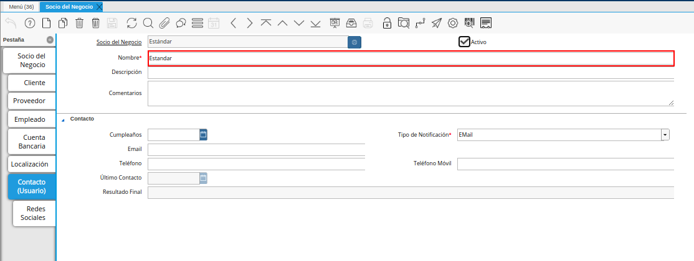

.. _ERPyA: http://erpya.com

.. |Checklist Dirección Entregar-A de la Pestaña Localización del Registro empleado| image:: resources/address-checklist-deliver-to-from-the-supplier-record-location-tab.png

.. _documento/socio-empleado:

**Registro de Empleado**
=========================

Para registrar un socio de negocio empleado, es necesario que sea realizado el procedimiento regular explicado en el documento :ref:`documento/socio-negocio`, elaborado por `ERPyA`_.

Luego de culminar el procedimiento de registro de socio del negocio, seleccione la pestaña "**Empleado**" que se encuentra debajo de la ventana principal socio de negocio.

    
    |Pestaña Empleado de la Ventana Socio del Negocio|

    Imagen 1. Pestaña Empleado de la Ventana Socio del Negocio

    .. note::

        La pestaña "**Empleado**" se compone de:

        - Los datos principales del socio del negocio donde el campo "**Nombre**" y "**Código**", viene cargado automaticamente de la pestaña principal "**Socio del Negocio**" y usted no deba transcribirlo nuevamente
  
        - Un checklist "**Empleado**".

        - Un checklist "**Agente Comercial**".

Seleccione el checklist "**Empleado**" para habilitar en ADempiere el socio del negocio como empleado de la compañía u organización. 

    |Checklist Empleado de la Pestaña Empleado de la Ventana Socio del Negocio|

    Imagen 2. Checklist Empleado de la Pestaña Empleado de la Ventana Socio del Negocio

    .. warning::

        De no ser tildado el checklist "**Empleado**", ADempiere no tomará el socio del negocio como empleado.

Seleccione el checklist "**Agente Comercial**" para identificar a un vendedor autorizado de la compañía u organización. Un agente comercial es un empleado por lo tanto debe considerar tildar tambien el checklist "**Empleado**" al momento de para asignar como agente comercial un vendedor.

    |Checklist Agente Comercial de la Pestaña Empleado de la Ventana Socio del Negocio|
    
    Imagen 2. Checklist Agente Comerccial de la Pestaña Empleado de la Ventana Socio del Negocio
    
    .. warning::
    
        De no ser tildado el checklist "**Agente Comercial**", ADempiere no reconocerá el socio del negocio como vendedor.

**Pestaña Cuenta Bancaria**
***************************

Si usted mantiene una relación laboral con su empleado, es importante conocer los datos bancarios del mismo, de modo que cumplir sus obligaciones laborales sea lo más eficiente posible, es por eso que en ADempiere usted encontrará esta pestaña en donde puede registrar los datos bancarios del socio del negocio empleado para eso puede llenar la siguiente información.

Seleccione la pestaña "**Cuenta Bancaria**" que se encuentra ubicada del lado izquierdo de la ventana socio del negocio. Por defecto se encuentra tildado el checklist "**Activo**".

    |Pestaña Cuenta Bancaria del Registro Empleado|

    Imagen 8. Pestaña Cuenta Bancaria

**Checklist ACH**
+++++++++++++++++

Para indicar que el proceso de pago con dicho socio de negocio empleado se realizará a traves de  transferencias bancarias, tilde el checklist "**ACH**", a continuación se reflejarán los campos para el registro de los datos bancarios.

    |Checklist ACH de la Pestaña Cuenta Bancaria del Registro Empleado|

    Imagen 9. Checklist ACH

En el campo "**Uso de Cuenta**", seleccione la opción que define como será usada la cuenta bancaria del socio del negocio.

    |Campo Uso de Cuenta de la Pestaña Cuenta Bancaria del Registro Empleado|

    Imagen 10. Campo Uso de Cuenta

Seleccione entre los distintos bancos registrados en ADempiere el "**Banco**" de su cuenta bancaria con ayuda del icono identificador (adjunto imagen).

    |Campo Banco de la Pestaña Cuenta Bancaria del Registro Empleado|

    Imagen 11. Campo Banco

A continuación visualizará la siguiente ventana con los diferentes bancos, dónde debe seleccionar el banco que posee el socio del negocio empleado y la opción "**OK**" para cargar los datos a la ventana.

    |Ventana Bancos de la Pestaña Cuenta Bancaria del Registro Empleado|

    Imagen 12. Ventana Bancos

Seleccione en el campo "**Tipo de Cuenta Bancaria**", el tipo de cuenta correspondiente a la cuenta del socio del negocio Empleado.

    |Campo Tipo de Cuenta Bancaria de la Pestaña Cuenta Bancaria del Registro empleado|

    Imagen 13. Campo Tipo de Cuenta Bancaria

Introduzca en el campo "**No. De Cuenta**", el número de cuenta del socio del negocio empleado que esta registrando.

    |Campo Nro De Cuenta de la Pestaña Cuenta Bancaria del Registro empleado|

    Imagen 14. Campo No. De Cuenta

Introduzca en el campo "**No. de Seguro Social**", representado por el número de cédula o registro de información fiscal del titular de la cuenta bancaria que esta registrando.

    |Campo No. de Seguro Social del Titular de la Cuenta de la Pestaña Cuenta Bancaria del Registro empleado|

    Imagen 15. Campo No. de Seguro Social del Titular de la Cuenta

Introduzca en el campo "**Nombre**", el nombre del titular de la cuenta bancaria que esta registrando.

    |Campo Nombre del Titular de la Cuenta de la Pestaña Cuenta Bancaria del Registro Empleado|

    Imagen 16. Campo Nombre del Titular de la Cuenta

Introduzca en el campo "**Cta. Correo Electrónico**", la cuenta de correo electrónico del titular de la cuenta bancaria que esta registrando.

    |Campo Cta Correo Electrónico del Titular de la Cuenta de la Pestaña Cuenta Bancaria del Registro Empleado|

    Imagen 17. Campo Cta Correo Electrónico del Titular de la Cuenta

Seleccione el icono "**Guardar Cambios**" ubicado en la barra de herramientas para guardar los datos ingresados.

    |Icono Guardar Cambios de la Pestaña Cuenta Bancaria del Registro empleado|

    Imagen 18. Icono Guardar Cambios de la Pestaña Cuenta Bancaria

.. warning::

    Este proceso se realiza con la finalidad de registrar la cuenta bancaria del socio del negocio Empleado.

**Pestaña Localización**
************************

La localización de un socio de negocio empleado es muy importante para la empresa,por tal razón se recomienda que en está ventana se pueda detallar con exactitud la dirección de su socio de negocio empleado. 

Seleccione la pestaña "**Localización**" que se encuentra ubicada debajo de la ventana principal del socio de negocio.

    |Pestaña Localización del Registro empleado|

    Imagen 19. Pestaña Localización

    Seleccione el identificador "**Ubicación o Dirección**", ubicado del lado derecho del campo **Localización/Dirección**", para ingresar la dirección del socio del negocio.

        |Campo Ubicación Dirección de la Pestaña Localización del Registro empleado|

        Imagen 20. Campo Ubicación Dirección de la Pestaña Localización del Registro empleado

        A continuación visualizará la siguiente ventana, dónde debe introducir la dirección exacta del socio del negocio empleado que esta registrando.

            |Ventana de Localización de la Pestaña Localización del Registro empleado|

            Imagen 21. Ventana de Localización

    Introduzca en el campo "**Nombre**", el nombre de la localización del socio del negocio.

        |Campo Nombre de la Pestaña Localización del Registro empleado|

        Imagen 22. Campo Nombre

        .. note::

            Si no es ingresado ningún valor en este campo, al guardar el registro de la ventana, ADempiere toma el valor ingresado en el campo "**Dirección 1**", de la ventana desplegada por el identificador del campo "**Localización/Dirección**".

    Introduzca en el campo "**Teléfono**", el número de teléfono para la localización del socio del negocio.

        |Campo Teléfono de la Pestaña Localización del Registro empleado|

        Imagen 23. Campo Teléfono

    Introduzca en el campo "**Teléfono Móvil**", el teléfono móvil para la localización del socio del negocio.

        |Campo Teléfono Móvil de la Pestaña Localización del Registro empleado|

        Imagen 24. Campo Teléfono Móvil

    EL checklist "**Dirección Entregar-A**", indica que la dirección ingresada en el campo "**Localización/Dirección**", es la dirección establecida para la entrega.

        |Checklist Dirección Entregar-A de la Pestaña Localización del Registro empleado|

        Imagen 25. Checklist Dirección Entregar-A

    EL checklist "**Dirección Facturar-A**", indica que la dirección ingresada en el campo "**Localización/Dirección**", es la dirección establecida para la facturación.

        |Checklist Facturar-A de la Pestaña Localización del Registro empleado|

        Imagen 26. Checklist Facturar-A

    Introduzca en el campo "**Código SICA**", el código de SUNAGRO utilizado para identificar la localización.

        |Campo Código SICA de la Pestaña Localización del Registro empleado|

        Imagen 27. Campo Código SICA

Seleccione el icono "**Guardar Cambios**" ubicado en la barra de herramientas para guardar los datos ingresados.

    |Icono Guardar Cambios de la Pestaña Localización del Registro empleado|

    Imagen 28. Icono Guardar Cambios de la Pestaña Localización

.. warning::

    Recuerde guardar el registro de los campos cada vez que se vaya a posicionar en una pestaña de la ventana socio del negocio.

**Pestaña Contacto**
********************

En esta pestaña se registran todos los datos de contacto que se tengan del socio del negocio empleado.

Seleccione la pestaña "**Contacto**" que se encuentra ubicada debajo de la ventana principal del socio del negocio, para proceder a llenar los campos necesarios.

    |Pestaña Contacto del Registro empleado|

    Imagen 29. Pestaña Contacto

Introduzca en el campo "**Nombre**", el nombre del socio del negocio.

    |Campo Nombre de Contacto de la Pestaña Contacto del Registro empleado|

    Imagen 30. Campo Nombre

Introduzca en el campo "**Descripción**", una breve descripción del socio del negocio que usted considere relevante.

    |Campo Descripción de Contacto de la Pestaña Contacto del Registro empleado|

    Imagen 31. Campo Descripción

Introduzca en el campo "**Comentarios**", la información adicional que se tienen sobre el socio del negocio.

    |Campo Comentarios de Contacto de la Pestaña Contacto del Registro empleado|

    Imagen 32. Campo Comentarios

Seleccione en el campo "**Cumpleaños**", la fecha de nacimiento del socio del negocio que se encuentra registrando.

    |Campo Cumpleaños de Contacto de la Pestaña Contacto del Registro empleado|

    Imagen 33. Campo Cumpleaños

Seleccione en el campo "**Tipo de Notificación**", el tipo de notificación para los correos o avisos.

    |Campo Tipo de Notificación de Contacto de la Pestaña Contacto del Registro empleado|

    Imagen 34. Campo Tipo de Notificación

Introduzca en el campo "**Email**", el email del socio del negocio.

    |Campo Email de la Pestaña Contacto del Registro empleado|

    Imagen 35. Campo Email

Introduzca en el campo "**Teléfono**", el teléfono del socio del negocio.

    |Campo Teléfono de la Pestaña Contacto del Registro empleado|

    Imagen 36. Campo Teléfono

Introduzca en el campo "**Teléfono Móvil**", el teléfono móvil del socio del negocio.

    |Campo Teléfono Móvil de la Pestaña Contacto del Registro empleado|

    Imagen 37. Campo Teléfono Móvil

Podrá visualizar en el campo "**Último Contacto**", la última vez que fue contactado el socio de negocio empleado 

    |Campo Último Contacto de la Pestaña Contacto del Registro empleado|

    Imagen 38. Campo Último Contacto

Podrá visualizar en el campo "**Resultado Final**", el resultado del último contacto realizado con el socio del negocio.

    |Campo Resultado Final de la Pestaña Contacto del Registro empleado|

    Imagen 39. Campo Resultado Final

Seleccione el icono "**Guardar Cambios**" ubicado en la barra de herramientas para guardar los datos ingresados.

    |Icono Guardar Cambios de la Pestaña Contacto del Registro empleado|

    Imagen 40. Icono Guardar Cambios de la Pestaña Contacto

.. note::

    Este procedimiento realizado aplica solo para los **Socios del Negocio** que cumplan el rol de **empleado**.

**Pestaña Redes Sociales**
**************************

En la actualidad una de las mejores formas de comunicación de expasión y de marketing digital de cualquier socio de negocio es a traves de las redes sociales, es por eso que Adempiere siempre a la par a la nuevas innovaciones en el campo tecnológico y social ha creado nuevas funcionalidades que permitan la adaptación de ADempiere con la red social Telegram y así el usuario puede consultar información de cómo generar reportes de “Saldos Abiertos”, “Detalle de Facturas y Margen”, entre otros reportes que son requeridos por el mismo de cierta en manera en su momento. Por tal motivo es importante mantener actualizada y configurada la información es está nueva pestaña. 

Seleccione la pestaña "**Redes sociales**" que se encuentra ubicada del lado izquierdo de la ventana socio del negocio.

    |Pestaña Redes Sociales de la ventana socio del negocio|

    Imagen 41. Pestaña Redes Sociales

Seleccione en el campo "**Aplicación Soportada**”, la opción "**Telegram**”, ya que para este momento es la aplicación que está soportada en ADempiere

    |Campo aplicación soportada de la pestaña redes sociales de la ventana socio del negocio|

    Imagen 42. Campo Aplicación Soportada

Seleccione el "**Tipo de Aplicación**" entre las distintas redes sociales disponibles.

    |Campo tipo de aplicación de la pestaña redes sociales de la ventana socio de negocio|

    Imagen 43. Campo Tipo de Aplicación

Introduzca en el campo "**Nombre de Cuenta**" , el nombre de la red social seleccionada en el campo "**Aplicación Soportada**" del socio de negocio empleado, por ser una  nueva cuenta automaticamente se tildará con el checklist "**Activo**". Si usted no desea utilizar más este registro puede inactivarlo

    |Campo nombre de cuenta de la pestaña redes sociales de la ventana socio del negocio|

    Imagen 44. Campo Nombre de Cuenta

Introduzca en el campo "**Descripción**" una breve descripción del la red social creada a ese socio de negocio empleado.

    |Campo descripción de la pestaña redes sociales de la ventana socio del negocio|

    Imagen 45. Campo Descripción de la pestaña redes sociales de la ventana Socio del Negocio            

Guarde el registro de los campos seleccionando el icono “Guardar Cambios”, ubicado en la barra de herramientas de ADempiere.

    |Icono guardar cambios de la pestaña redes sociales de la ventana socio del negocio|

    Imagen 46. Icono Guardar Cambios

