.. _ERPyA: http://erpya.com
.. |Pestaña Proveedor de la Ventana Socio del Negocio| image:: resources/vendor-tab-of-the-business-partner-window.png
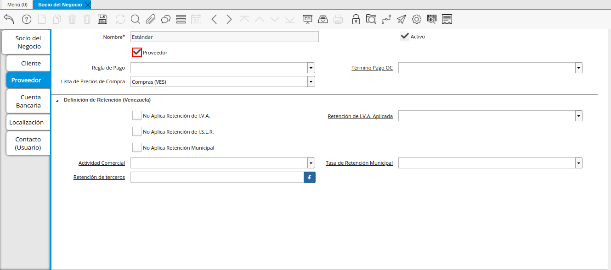
.. |Grupo de Campos Generados por el Checklist Proveedor de la Pestaña Proveedor de la Ventana Socio del Negocio| image:: resources/group-of-fields-generated-by-the-supplier-checklist-of-the-supplier-tab-of-the-business-partner-window.png
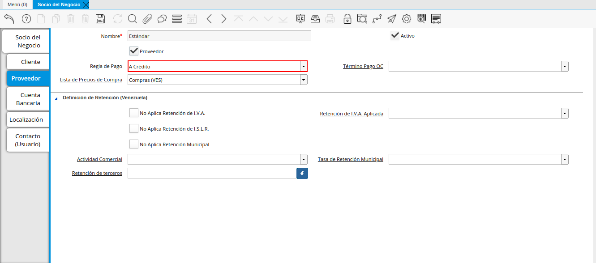
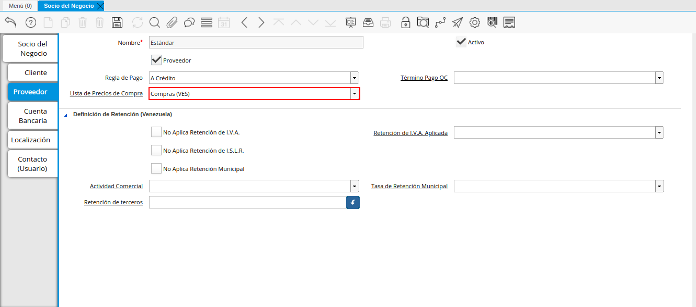
.. |Campo Término de Pago Orden de Compra de la Pestaña Proveedor de la Ventana Socio del Negocio| image:: resources/purchase-order-payment-term-field-of-the-supplier-tab-of-the-business-partner-window.png
.. |Icono Guardar Cambios de la Pestaña Proveedor| image:: resources/save-changes-icon-on-the-provider-tab.png
.. |Pestaña Cuenta Bancaria del Registro Proveedor| image:: resources/bank-account-tab-of-the-supplier-record.png
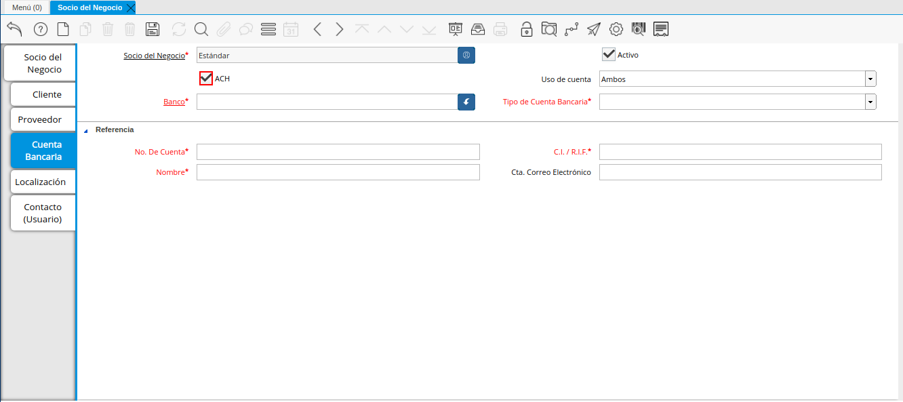
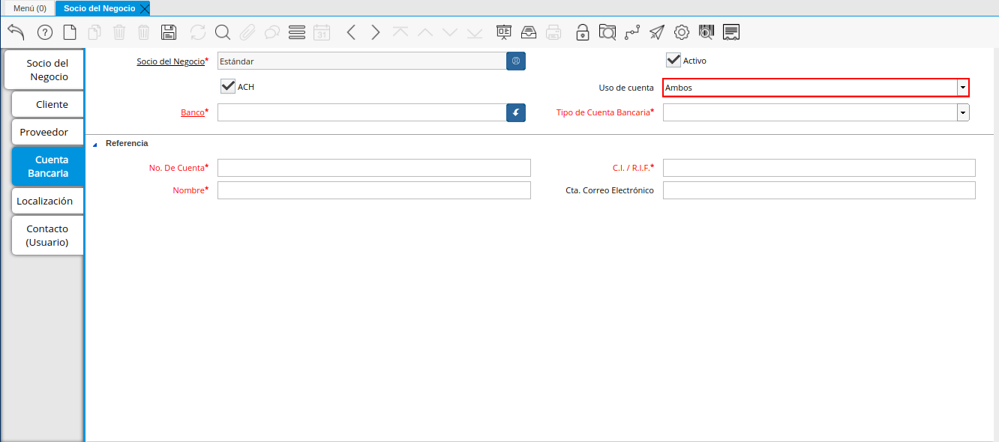
.. |Campo Banco de la Pestaña Cuenta Bancaria del Registro Proveedor| image:: resources/bank-field-of-the-bank-account-tab-of-the-supplier-record.png
.. |Ventana Bancos de la Pestaña Cuenta Bancaria del Registro Proveedor| image:: resources/banks-window-of-the-bank-account-tab-of-the-supplier-record.png
.. |Campo Tipo de Cuenta Bancaria de la Pestaña Cuenta Bancaria del Registro Proveedor| image:: resources/bank-account-type-field-of-the-bank-account-tab-of-the-supplier-record.png
.. |Campo Nro De Cuenta de la Pestaña Cuenta Bancaria del Registro Proveedor| image:: resources/account-number-field-of-the-bank-account-tab-of-the-supplier-record.png
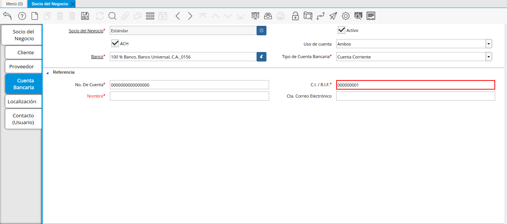
.. |Campo Nombre del Titular de la Cuenta de la Pestaña Cuenta Bancaria del Registro Proveedor| image:: resources/account-holder-name-field-of-the-bank-account-tab-of-the-supplier-record.png
.. |Campo Cta Correo Electrónico del Titular de la Cuenta de la Pestaña Cuenta Bancaria del Registro Proveedor| image:: resources/cta-field-email-of-the-account-holder-of-the-bank-account-tab-of-the-supplier-record.png
.. |Icono Guardar Cambios de la Pestaña Cuenta Bancaria del Registro Proveedor| image:: resources/save-changes-icon-on-the-bank-account-tab-of-the-supplier-record.png
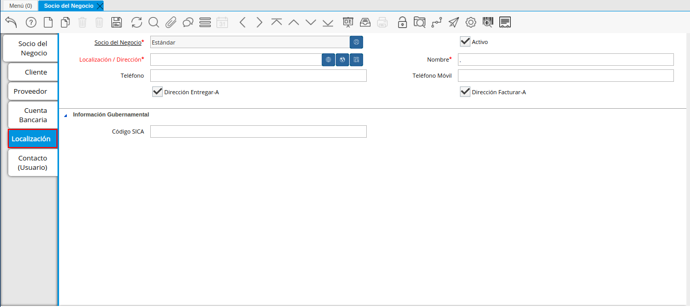
.. |Campo Ubicación Dirección de la Pestaña Localización del Registro Proveedor| image:: resources/location-field-address-of-the-vendor-record-location-tab.png
.. |Ventana de Localización de la Pestaña Localización del Registro Proveedor| image:: resources/location-window-of-the-vendor-record-location-tab.png
.. |Campo Nombre de la Pestaña Localización del Registro Proveedor| image:: resources/field-name-of-the-supplier-record-location-tab.png
.. |Campo Teléfono de la Pestaña Localización del Registro Proveedor| image:: resources/phone-field-of-the-provider-record-location-tab.png
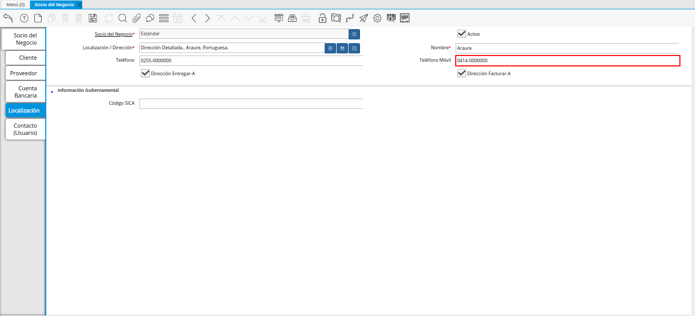
.. |Checklist Dirección Entregar-A de la Pestaña Localización del Registro Proveedor| image:: resources/address-checklist-deliver-to-from-the-supplier-record-location-tab.png
.. |Checklist Facturar-A de la Pestaña Localización del Registro Proveedor| image:: resources/address-bill-to-from-the-tab-location-of-the-supplier-record.png
.. |Campo Código SICA de la Pestaña Localización del Registro Proveedor| image:: resources/physical-code-field-of-the-supplier-record-location-tab.png
.. |Icono Guardar Cambios de la Pestaña Localización del Registro Proveedor| image:: resources/save-changes-icon-on-the-vendor-record-location-tab.png
.. |Pestaña Contacto del Registro Proveedor| image:: resources/supplier-record-contact-tab.png
.. |Campo Nombre de Contacto de la Pestaña Contacto del Registro Proveedor| image:: resources/contact-name-field-of-the-contact-tab-of-the-supplier-record.png
.. |Campo Descripción de Contacto de la Pestaña Contacto del Registro Proveedor| image:: resources/contact-description-field-of-the-contact-tab-of-the-supplier-record.png
.. |Campo Comentarios de Contacto de la Pestaña Contacto del Registro Proveedor| image:: resources/contact-comments-field-of-the-contact-tab-of-the-supplier-record.png
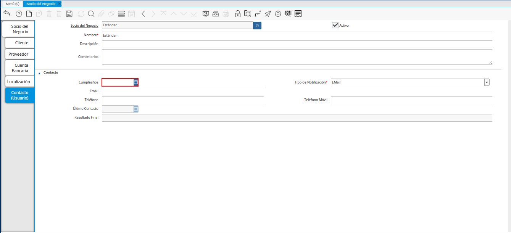
.. |Campo Tipo de Notificación de Contacto de la Pestaña Contacto del Registro Proveedor| image:: resources/contact-notification-type-field-of-the-contact-tab-of-the-supplier-record.png
.. |Campo Email de la Pestaña Contacto del Registro Proveedor| image:: resources/email-field-of-the-contact-tab-of-the-supplier-record.png
.. |Campo Teléfono de la Pestaña Contacto del Registro Proveedor| image:: resources/telephone-field-of-the-contact-tab-of-the-supplier-record.png
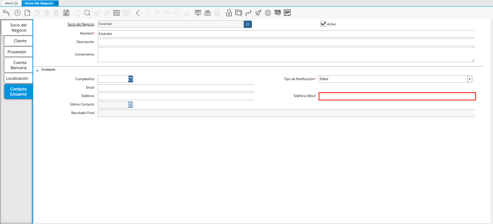
.. |Campo Último Contacto de la Pestaña Contacto del Registro Proveedor| image:: resources/last-contact-field-of-the-contact-tab-of-the-supplier-record.png
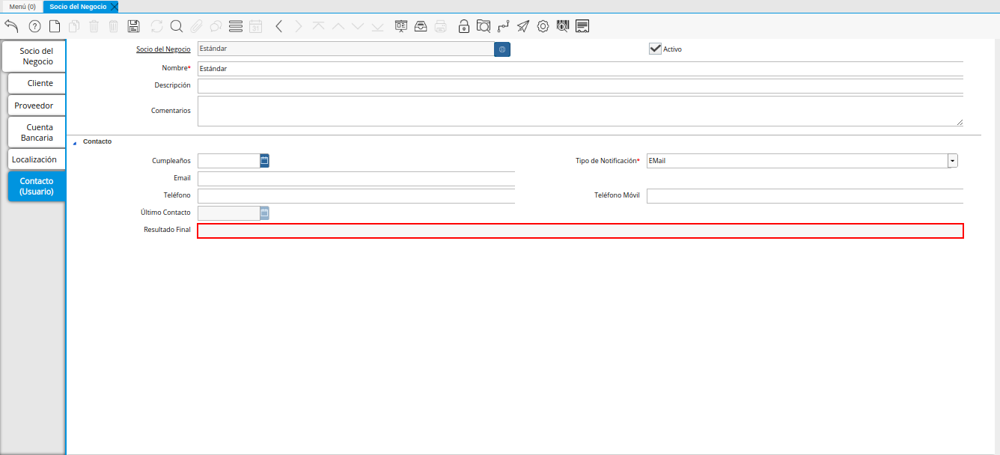
.. |Icono Guardar Cambios de la Pestaña Contacto del Registro Proveedor| image:: resources/icon-save-changes-of-the-contact-tab-of-the-supplier-record.png

.. _documento/socio-proveedor:

**Registro de Proveedor**
=========================

Para registrar un proveedor, es necesario que sea realizado el procedimiento regular explicado en el documento :ref:`documento/socio-negocio`, elaborado por `ERPyA`_.

Luego de culminar el procedimiento de registro de socio del negocio, seleccione la pestaña "**Proveedor**" que se encuentra del lado izquierdo de la ventana socio del negocio, para identificar al socio del negocio como proveedor de la empresa.

    Esta pestaña le indica a ADempiere si el socio del negocio que se esta registrando es un proveedor.

    |Pestaña Proveedor de la Ventana Socio del Negocio|

    Imagen 1. Pestaña Proveedor de la Ventana Socio del Negocio

    .. note::

        La pestaña "**Proveedor**" se compone de:

        - Un checklist "**Proveedor**".

        - Los datos principales del socio del negocio donde el campo "**Nombre**", viene cargado de la pestaña principal "**Socio del Negocio**".

        - Ademas posee un grupo de campos que definen la configuración de retenciones a aplicar al socio del negocio.

Seleccione el checklist "**Proveedor**" para habilitar en ADempiere el socio del negocio como proveedor de la compañía u organización. 

    |Checklist Proveedor de la Pestaña Proveedor de la Ventana Socio del Negocio|

    Imagen 2. Checklist Proveedor de la Pestaña Proveedor de la Ventana Socio del Negocio

    .. warning::

        De no ser tildado el checklist "**Proveedor**", ADempiere no tomará el socio del negocio como proveedor.

Al tildar el checklist "**Proveedor**" podrá apreciar un grupo de campos necesarios para la compra de productos al mismo, dichos campos no son obligatorios ya que pueden ser definidos en el documento "**Orden de Compra**" al momento de su elaboración.

    |Grupo de Campos Generados por el Checklist Proveedor de la Pestaña Proveedor de la Ventana Socio del Negocio|

    Imagen 3. Grupo de Campos Generados por el Checklist Proveedor de la Pestaña Proveedor de la Ventana Socio del Negocio

El campo "**Regla de Pago**" establece la regla de pago definitiva para las compras al socio del negocio proveedor que se esta registrando, para este ejemplo la regla de pago utilizada es "**A Crédito**".

    |Campo Regla de Pago de la Pestaña Proveedor de la Ventana Socio del Negocio|

    Imagen 4. Campo Regla de Pago de la Pestaña Proveedor de la Ventana Socio del Negocio

El campo "**Lista de Precios de Compra**" establece la lista de precios definitiva para las compras al socio del negocio proveedor que se esta registrando, para este ejemplo la lista de precios utilizada es "**Compra (VES)**".

    |Campo Lista de Precios de Compra de la Pestaña Proveedor de la Ventana Socio del Negocio|

    Imagen 5. Campo Lista de Precios de Compra de la Pestaña Proveedor de la Ventana Socio del Negocio

El campo "**Término Pago Orden de Compra**" establece el término de pago definitivo para las compras al socio del negocio proveedor que se esta registrando, para este ejemplo el término de pago utilizado es "**Crédito 7 días**".

    |Campo Término de Pago Orden de Compra de la Pestaña Proveedor de la Ventana Socio del Negocio|

    Imagen 6. Campo Término de Pago Orden de Compra de la Pestaña Proveedor de la Ventana Socio del Negocio

Seleccione el icono "**Guardar Cambios**" ubicado en la barra de herramientas para guardar los datos ingresados.

    |Icono Guardar Cambios de la Pestaña Proveedor|

    Imagen 7. Icono Guardar Cambios de la Pestaña Proveedor

    .. note::

        _ Tener tildado el Checklist "**Proveedor**" le permitirá mejorar la  búsqueda avanzada de socios de negocios al momento de realizar un registro en donde necesite ubicar un socio de negocio "Proveedor". 

**Pestaña Cuenta Bancaria**
***************************

En esta pestaña se registran los datos bancarios del socio del negocio proveedor, con el checklist "**ACH**" se pueden registrar los datos de la cuenta bancaria del socio del negocio.

Seleccione la pestaña "**Cuenta Bancaria**" que se encuentra ubicada del lado izquierdo de la ventana socio del negocio. Por defecto se encuentra tildado el checklist "**Activo**".

    |Pestaña Cuenta Bancaria del Registro Proveedor|

    Imagen 8. Pestaña Cuenta Bancaria

**Checklist ACH**
+++++++++++++++++

Para registros de cuentas bancarias, tilde el checklist "**ACH**", a continuación se reflejarán los campos para el registro de la cuenta bancaria del socio del negocio proveedor.

    |Checklist ACH de la Pestaña Cuenta Bancaria del Registro Proveedor|

    Imagen 9. Checklist ACH

Seleccione en el campo "**Uso de Cuenta**", la opción que define como es usada la cuenta banco del socio del negocio.

    |Campo Uso de Cuenta de la Pestaña Cuenta Bancaria del Registro Proveedor|

    Imagen 10. Campo Uso de Cuenta

En el campo "**Banco**" seleccione el banco a registrar con ayuda del icono identificador (adjunto imagen).

    |Campo Banco de la Pestaña Cuenta Bancaria del Registro Proveedor|

    Imagen 11. Campo Banco

A continuación visualizará la siguiente ventana con los diferentes bancos, dónde debe seleccionar el banco que posee el socio del negocio proveedor y la opción "**OK**" para cargar los datos a la ventana.

    |Ventana Bancos de la Pestaña Cuenta Bancaria del Registro Proveedor|

    Imagen 12. Ventana Bancos

Seleccione en el campo "**Tipo de Cuenta Bancaria**", el tipo de cuenta correspondiente a la cuenta del socio del negocio proveedor.

    |Campo Tipo de Cuenta Bancaria de la Pestaña Cuenta Bancaria del Registro Proveedor|

    Imagen 13. Campo Tipo de Cuenta Bancaria

Introduzca en el campo "**No. De Cuenta**", el número de cuenta del socio del negocio proveedor que esta registrando.

    |Campo Nro De Cuenta de la Pestaña Cuenta Bancaria del Registro Proveedor|

    Imagen 14. Campo No. De Cuenta

Introduzca en el campo "**C.I./R.I.F.**", el número de cédula o registro de información fiscal del titular de la cuenta bancaria que esta registrando.

    |Campo CI RIF del Titular de la Cuenta de la Pestaña Cuenta Bancaria del Registro Proveedor|

    Imagen 15. Campo C.I./R.I.F. del Titular de la Cuenta

Introduzca en el campo "**Nombre**", el nombre del titular de la cuenta bancaria que esta registrando.

    |Campo Nombre del Titular de la Cuenta de la Pestaña Cuenta Bancaria del Registro Proveedor|

    Imagen 16. Campo Nombre del Titular de la Cuenta

Introduzca en el campo "**Cta. Correo Electrónico**", la cuenta de correo electrónico del titular de la cuenta bancaria que esta registrando.

    |Campo Cta Correo Electrónico del Titular de la Cuenta de la Pestaña Cuenta Bancaria del Registro Proveedor|

    Imagen 17. Campo Cta Correo Electrónico del Titular de la Cuenta

Seleccione el icono "**Guardar Cambios**" ubicado en la barra de herramientas para guardar los datos ingresados.

    |Icono Guardar Cambios de la Pestaña Cuenta Bancaria del Registro Proveedor|

    Imagen 18. Icono Guardar Cambios de la Pestaña Cuenta Bancaria

.. warning::

    Este proceso se realiza con la finalidad de registrar la cuenta bancaria del socio del negocio proveedor.

**Pestaña Localización**
************************

La localización de un socio del negocio es muy importante por diferentes motivos y más si el socio del negocio es proveedor. Ya que las transacciones de compras serán realizadas al mismo, en esta pestaña se deben registrar con exactitud los datos de la dirección del socio del negocio.

Seleccione la pestaña "**Localización**" que se encuentra ubicada del lado izquierdo de la ventana socio del negocio.

    |Pestaña Localización del Registro Proveedor|

    Imagen 19. Pestaña Localización

    Seleccione el identificador "**Ubicación o Dirección**", ubicado del lado derecho del campo **Localización/Dirección**", para ingresar la dirección del socio del negocio.

        |Campo Ubicación Dirección de la Pestaña Localización del Registro Proveedor|

        Imagen 20. Campo Ubicación Dirección de la Pestaña Localización del Registro Proveedor

        A continuación visualizará la siguiente ventana, dónde debe introducir la dirección exacta del socio del negocio proveedor que esta registrando.

            |Ventana de Localización de la Pestaña Localización del Registro Proveedor|

            Imagen 21. Ventana de Localización

    Introduzca en el campo "**Nombre**", el nombre de la localización del socio del negocio.

        |Campo Nombre de la Pestaña Localización del Registro Proveedor|

        Imagen 22. Campo Nombre

        .. note::

            Si no es ingresado ningún valor en este campo, al guardar el registro de la ventana, ADempiere toma el valor ingresado en el campo "**Dirección 1**", de la ventana desplegada por el identificador del campo "**Localización/Dirección**".

    Introduzca en el campo "**Teléfono**", el número de teléfono para la localización del socio del negocio.

        |Campo Teléfono de la Pestaña Localización del Registro Proveedor|

        Imagen 23. Campo Teléfono

    Introduzca en el campo "**Teléfono Móvil**", el teléfono móvil para la localización del socio del negocio.

        |Campo Teléfono Móvil de la Pestaña Localización del Registro Proveedor|

        Imagen 24. Campo Teléfono Móvil

    EL checklist "**Dirección Entregar-A**", indica que la dirección ingresada en el campo "**Localización/Dirección**", es la dirección establecida para la entrega.

        |Checklist Dirección Entregar-A de la Pestaña Localización del Registro Proveedor|

        Imagen 25. Checklist Dirección Entregar-A

    EL checklist "**Dirección Facturar-A**", indica que la dirección ingresada en el campo "**Localización/Dirección**", es la dirección establecida para la facturación.

        |Checklist Facturar-A de la Pestaña Localización del Registro Proveedor|

        Imagen 26. Checklist Facturar-A

    Introduzca en el campo "**Código SICA**", el código de SUNAGRO utilizado para identificar la localización.

        |Campo Código SICA de la Pestaña Localización del Registro Proveedor|

        Imagen 27. Campo Código SICA

Seleccione el icono "**Guardar Cambios**" ubicado en la barra de herramientas para guardar los datos ingresados.

    |Icono Guardar Cambios de la Pestaña Localización del Registro Proveedor|

    Imagen 28. Icono Guardar Cambios de la Pestaña Localización

.. warning::

    Recuerde guardar el registro de los campos cada vez que se vaya a posicionar en una pestaña de la ventana socio del negocio.

**Pestaña Contacto**
********************

En esta pestaña se registran todos los datos de contacto que se tengan del socio del negocio proveedor.

Seleccione la pestaña "**Contacto**" que se encuentra ubicada del lado izquierdo de la ventana socio del negocio, para proceder a llenar los campos necesarios.

    |Pestaña Contacto del Registro Proveedor|

    Imagen 29. Pestaña Contacto

Introduzca en el campo "**Nombre**", el nombre del socio del negocio contacto para las transacciones entre las empresas.

    |Campo Nombre de Contacto de la Pestaña Contacto del Registro Proveedor|

    Imagen 30. Campo Nombre

Introduzca en el campo "**Descripción**", una breve descripción del socio del negocio contacto para las transacciones entre las empresas.

    |Campo Descripción de Contacto de la Pestaña Contacto del Registro Proveedor|

    Imagen 31. Campo Descripción

Introduzca en el campo "**Comentarios**", la información adicional que se tienen sobre el socio del negocio contacto para las transacciones entre las empresas.

    |Campo Comentarios de Contacto de la Pestaña Contacto del Registro Proveedor|

    Imagen 32. Campo Comentarios

Seleccione en el campo "**Cumpleaños**", la fecha de nacimiento del socio del negocio que se encuentra registrando.

    |Campo Cumpleaños de Contacto de la Pestaña Contacto del Registro Proveedor|

    Imagen 33. Campo Cumpleaños

Seleccione en el campo "**Tipo de Notificación**", el tipo de notificación para los correos o avisos.

    |Campo Tipo de Notificación de Contacto de la Pestaña Contacto del Registro Proveedor|

    Imagen 34. Campo Tipo de Notificación

Introduzca en el campo "**Email**", el email del socio del negocio contacto para las transacciones entre las empresas.

    |Campo Email de la Pestaña Contacto del Registro Proveedor|

    Imagen 35. Campo Email

Introduzca en el campo "**Teléfono**", el teléfono del socio del negocio contacto para las transacciones entre las empresas.

    |Campo Teléfono de la Pestaña Contacto del Registro Proveedor|

    Imagen 36. Campo Teléfono

Introduzca en el campo "**Teléfono Móvil**", el teléfono móvil del socio del negocio contacto para las transacciones entre las empresas.

    |Campo Teléfono Móvil de la Pestaña Contacto del Registro Proveedor|

    Imagen 37. Campo Teléfono Móvil

Podrá visualizar en el campo "**Último Contacto**", la última vez que fue contactado el individuo de contacto del socio del negocio.

    |Campo Último Contacto de la Pestaña Contacto del Registro Proveedor|

    Imagen 38. Campo Último Contacto

Podrá visualizar en el campo "**Resultado Final**", el resultado del último contacto realizado al individuo de contacto del socio del negocio.

    |Campo Resultado Final de la Pestaña Contacto del Registro Proveedor|

    Imagen 39. Campo Resultado Final

Seleccione el icono "**Guardar Cambios**" ubicado en la barra de herramientas para guardar los datos ingresados.

    |Icono Guardar Cambios de la Pestaña Contacto del Registro Proveedor|

    Imagen 40. Icono Guardar Cambios de la Pestaña Contacto

.. note::

    Este procedimiento realizado aplica solo para los **Socios del Negocio** que cumplan el rol de **Proveedor**.
