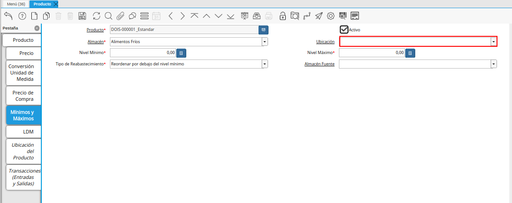

.. _Codificar los Productos: https://docs.erpya.com/es/latest/lve/standard-coding/product/
.. _ERPyA: http://erpya.com
.. |Menú de ADempiere| image:: resources/product-menu.png
.. |Icono Registro Nuevo de la Ventana Producto| image:: resources/new-registration-icon-in-the-product-window.png
.. |Campo Organización de la Ventana Producto| image:: resources/product-window-organization-field.png
.. |Campo Código de la Ventana Producto| image:: resources/product-window-code-field.png
.. |Campo Nombre de la Ventana Producto| image:: resources/product-window-name-field.png
.. |Campo Descripción de la Ventana Producto| image:: resources/product-window-description-field.png
.. |Campo UPC/EAN de la Ventana Producto| image:: resources/upc-ean-field-of-product-window.png
.. |Campo UM Almacenamiento de la Ventana Producto| image:: resources/product-window-storage-um-field.png
.. |Campo Categoría del Producto de la Ventana Producto| image:: resources/product-category-field-of-the-product-window.png
.. |Campo Grupo de Producto de la Ventana Producto| image:: resources/product-group-field-of-the-product-window.png
.. |Campo Clase de Producto de la Ventana Producto| image:: resources/product-class-field-of-the-product-window.png
.. |Campo Clasificación de Producto de la Ventana Producto| image:: resources/product-classification-field-of-the-product-window.png
.. |Campo Categoría del Impuesto de la Ventana Producto| image:: resources/tax-category-field-of-the-product-window.png
.. |Campo UM de la Ventana Producto| image:: resources/um-field-of-the-product-window.png
.. |Campo Tipo de Producto de la Ventana Producto| image:: resources/product-type-field-of-the-product-window.png
.. |Campo Almacenado de la Ventana Producto| image:: resources/product-window-storage-field.png
.. |Campo Ubicación de la Ventana Producto| image:: resources/product-window-location-field.png
.. |Checklist Comprado de la Ventana Producto| image:: resources/checklist-purchased-from-the-product-window.png
.. |Checklist Vendido de la Ventana Producto| image:: resources/product-window-sold-checklist.png
.. |Campo Código CPE de la Ventana Producto| image:: resources/cpe-code-field-of-the-product-window.png
.. |Icono Guardar Cambios de la Ventana Producto| image:: resources/save-changes-icon-in-the-product-window.png
.. |Pestaña Precio de la Ventana Producto| image:: resources/product-window-price-tab.png
.. |Campo Producto de la Pestaña Precio de la Ventana Producto| image:: resources/product-field-of-the-price-tab-of-the-product-window.png
.. |Campo Versión de Lista de Precios de la Pestaña Precio de la Ventana Producto| image:: resources/price-list-version-field-of-the-price-tab-of-the-product-window.png
.. |Campo Precio de Lista de la Pestaña Precio de la Ventana Producto| image:: resources/list-price-field-of-the-price-tab-of-the-product-window.png
.. |Campo Precio de Venta de la Pestaña Precio de la Ventana Producto| image:: resources/sale-price-field-of-the-price-tab-of-the-product-window.png
.. |Campo Precio de Límite de la Pestaña Precio de la Ventana Producto| image:: resources/limit-price-field-of-the-price-tab-of-the-product-window.png
.. |Campo PMVP de la Pestaña Precio de la Ventana Producto| image:: resources/pmvp-field-of-the-price-tab-of-the-product-window.png
.. |Icono Guardar Cambios de la Pestaña Precio de la Ventana Producto| image:: resources/save-changes-icon-on-the-price-tab-of-the-product-window.png
.. |Pestaña Conversión Unidad de Medida de la Ventana Producto| image:: resources/unit-of-measure-conversion-tab-of-the-product-window.png
.. |Campo Producto de la Pestaña Conversión Unidad de Medida de la Ventana Producto| image:: resources/product-field-of-the-unit-of-measure-conversion-tab-of-the-product-window.png
.. |Campo UM de Producto de la Pestaña Conversión Unidad de Medida de la Ventana Producto| image:: resources/product-um-field-of-the-unit-of-measure-conversion-tab-of-the-product-window.png
.. |Campo UM a Convertir de la Pestaña Conversión Unidad de Medida de la Ventana Producto| image:: resources/um-field-to-convert-from-the-unit-of-measure-conversion-tab-of-the-product-window.png
.. |Tasa de Conversión Multiplicar Por de la Pestaña Conversión Unidad de Medida de la Ventana Producto| image:: resources/conversion-rate-multiply-by-field-of-the-unit-of-measure-conversion-tab-of-the-product-window.png
.. |Tasa de Conversión Dividir Por de la Pestaña Conversión Unidad de Medida de la Ventana Producto| image:: resources/conversion-rate-divide-by-field-of-the-unit-of-measure-conversion-tab-of-the-product-window.png
.. |Icono Guardar Cambios de la Pestaña Conversión Unidad de Medida de la Ventana Producto| image:: resources/icon-save-changes-of-the-unit-of-measure-conversion-tab-of-the-product-window.png
.. |Pestaña Precio de Compras de la Ventana Producto| image:: resources/product-window-purchase-price-tab.png

.. _documento/producto:

**Registro de Producto**
========================

En el menú de ADempiere, ubique y seleccione la carpeta "**Gestión de Materiales**", luego seleccione la carpeta "**Reglas de Gestión de Materiales**" y finalmente seleccione la ventana "**Producto**", adjunto imagen para referencia.

    |Menú de ADempiere|

    Imagen 1. Menú de ADempiere

En esta ventana se registran los datos principales que la empresa requiere conocer de los productos, con la finalidad de ser utilizada al momento de realizar alguna compra / venta con dicho producto. Cada uno de los campos con el símbolo (\*) son obligatorios para el registro.

Podrá visualizar la ventana "**Producto**", dónde debe seleccionar el icono "**Registro Nuevo**", que se encuentra ubicado en la barra de herramientas de ADempiere, para registrar un nuevo producto.

    |Icono Registro Nuevo de la Ventana Producto|

    Imagen 2. Icono Registro Nuevo de la Ventana Producto

Seleccione en el campo "**Organización**", la organización para la cual esta registrando el producto.

    |Campo Organización de la Ventana Producto|

    Imagen 3. Campo Organización de la Ventana Producto

    .. warning::

        Para que el producto este disponible para todas las organizaciones, el mismo deberá estar registrado con la organización en (*) de lo contrario el producto solo estará disponible para una sola organización.

Introduzca en el campo "**Código**", el código para el producto que esta registrando, este código es definido por un estándar de códificación establecido en `ERPyA`_ para `Codificar los Productos`_.

    |Campo Código de la Ventana Producto|

    Imagen 4. Campo Código de la Ventana Producto

Introduzca en el campo "**Nombre**", el nombre del producto que esta registrando.

    |Campo Nombre de la Ventana Producto|

    Imagen 5. Campo Nombre de la Ventana Producto

Introduzca en el campo "**Descripción**", una breve descripción correspondiente al producto que esta registrando.

    |Campo Descripción de la Ventana Producto|

    Imagen 6. Campo Descripción de la Ventana Producto

Introduzca en el campo "**UPC/EAN**", el código de barras correspondiente al producto que esta registrando.

    |Campo UPC/EAN de la Ventana Producto|

    Imagen 7. Campo UPC/EAN de la Ventana Producto

Introduzca en el campo "**UM Almacenamiento**", la unidad de medida de almacenamiento del producto.

    |Campo UM Almacenamiento de la Ventana Producto|

    Imagen 8. Campo UM Almacenamiento de la Ventana Producto

Seleccione en el campo "**Categoría del Producto**", la categoría a la cual pertenece el producto que esta registrando, la selección de este define el comportamiento del producto que se esta registrando, dicho comportamiento se encuentra explicado en el documento :ref:`documento/categoria-productos` elaborado por `ERPyA`_.

    |Campo Categoría del Producto de la Ventana Producto|

    Imagen 9. Campo Categoría del Producto de la Ventana Producto

Seleccione en el campo "**Grupo de Producto**", el grupo al cual pertenece el producto que esta registrando, la selección de este define el comportamiento del producto que se esta registrando, dicho comportamiento se encuentra explicado en el documento :ref:`documento/grupo-producto` elaborado por `ERPyA`_.

    |Campo Grupo de Producto de la Ventana Producto|

    Imagen 10. Campo Grupo de Producto de la Ventana Producto

Seleccione en el campo "**Clase de Producto**", la clase a la cual pertenece el producto que esta registrando.

    |Campo Clase de Producto de la Ventana Producto|

    Imagen 11. Campo Clase de Producto de la Ventana Producto

Seleccione en el campo "**Clasificación de Producto**", la clasificación a la cual pertenece el producto que esta registrando.

    |Campo Clasificación de Producto de la Ventana Producto|

    Imagen 12. Campo Clasificación de Producto de la Ventana Producto

Seleccione en el campo "**Categoría del Impuesto**", la agrupación de impuestos aplicale al producto que esta registrando.

    |Campo Categoría del Impuesto de la Ventana Producto|

    Imagen 13. Campo Categoría del Impuesto de la Ventana Producto

Seleccione en el campo "**UM**", la unidad de medida del producto.

    |Campo UM de la Ventana Producto|

    Imagen 14. Campo UM de la Ventana Producto

Seleccione en el campo "**Tipo de Producto**", el tipo de producto que esta registrando.

    |Campo Tipo de Producto de la Ventana Producto|

    Imagen 15. Campo Tipo de Producto de la Ventana Producto

Podrá apreciar el checklist "**Almacenado**", indicando que la empresa almacena el producto que esta registrando.

    |Campo Almacenado de la Ventana Producto|

    Imagen 16. Checklist Almacenado de la Ventana Producto

Seleccione en el campo "**Ubicación**", la ubicación de almacenamiento dentro de la empresa del producto que esta registrando.

    |Campo Ubicación de la Ventana Producto|

    Imagen 17. Campo Ubicación de la Ventana Producto

Podrá apreciar el checklist "**Comprado**", indicando que la empresa compra el producto que esta registrando.

    |Checklist Comprado de la Ventana Producto|

    Imagen 18. Checklist Comprado de la Ventana Producto

Podrá apreciar el checklist "**Vendido**", indicando que la empresa vende el producto que esta registrando.

    |Checklist Vendido de la Ventana Producto|

    Imagen 19. Checklist Vendido de la Ventana Producto

Introduzca en el campo "**Código CPE**", el código del producto envasados que esta registrando.

    |Campo Código CPE de la Ventana Producto|

    Imagen 20. Campo Código CPE de la Ventana Producto

Seleccione el icono "**Guardar Cambios**" en la barra de herramientas de ADempiere.

    |Icono Guardar Cambios de la Ventana Producto|

    Imagen 21. Icono Guardar Cambios de la Ventana Producto

**Pestaña Precio**
^^^^^^^^^^^^^^^^^^

En esta ventana se registran las listas de precios utilizadas por la empresa, con sus diferentes precios de lista, límite y estándar que poseen los productos, con la finalidad de ser utilizada al momento de realizar alguna compra / venta con los mismos. Cada uno de los campos con el símbolo (\*) son obligatorios para el registro.

Seleccione la pestaña "**Precio**", ubicada del lado izquierdo de la ventana "**Producto**" y proceda al llenado de los campos correspondientes.

    |Pestaña Precio de la Ventana Producto|

    Imagen 22. Pestaña Precio de la Ventana Producto

Podrá visualizar en el campo "**Producto**", el nombre del producto que se encuentra registrando.

    |Campo Producto de la Pestaña Precio de la Ventana Producto|

    Imagen 23. Campo Producto de la Pestaña Precio de la Ventana Producto

Seleccione en el campo "**Versión de Lista de Precios**", la lista de precios que será utilizada para el producto que esta registrando.

    |Campo Versión de Lista de Precios de la Pestaña Precio de la Ventana Producto|

    Imagen 24. Campo Versión de Lista de Precios de la Pestaña Precio de la Ventana Producto

Introduzca en el campo "**Precio de Lista**", el precio lista oficial en la moneda del documento.

    |Campo Precio de Lista de la Pestaña Precio de la Ventana Producto|

    Imagen 25. Campo Precio de Lista de la Pestaña Precio de la Ventana Producto

Introduzca en el campo "**Precio de Venta**", el precio usado para ventas o compras según sea el caso, este precio es el usado por defecto al momento de cargar una "**Orden de Venta**" o "**Factura**".

    |Campo Precio de Venta de la Pestaña Precio de la Ventana Producto|

    Imagen 26. Campo Precio de Venta de la Pestaña Precio de la Ventana Producto

Introduzca en el campo "**Precio de Límite**", el precio más bajo para el producto establecido en la moneda de la lista de precio.

    |Campo Precio de Límite de la Pestaña Precio de la Ventana Producto|

    Imagen 27. Campo Precio de Límite de la Pestaña Precio de la Ventana Producto

Introduzca en el campo "**PMVP**", el precio marcado de venta al público.

    |Campo PMVP de la Pestaña Precio de la Ventana Producto|

    Imagen 28. Campo PMVP de la Pestaña Precio de la Ventana Producto

Seleccione el icono "**Guardar Cambios**" en la barra de herramientas de ADempiere.

    |Icono Guardar Cambios de la Pestaña Precio de la Ventana Producto|

    Imagen 29. Icono Guardar Cambios de la Pestaña Precio de la Ventana Producto

**Pestaña Conversión Unidad de Medida**
^^^^^^^^^^^^^^^^^^^^^^^^^^^^^^^^^^^^^^^ 

En esta ventana se registran las conversiones de las diferentes unidades de medida utilizadas por la empresa, con la finalidad de aplicar dichas conversiones al momento de realizar alguna compra / venta de un producto. Cada uno de los campos con el símbolo (\*) son obligatorios para el registro.

Seleccione la pestaña "**Conversión Unidad de Medida**", ubicada del lado izquierdo de la ventana "**Producto**" y proceda al llenado de los campos correspondientes.

    |Pestaña Conversión Unidad de Medida de la Ventana Producto|

    Imagen 30. Pestaña Conversión Unidad de Medida de la Ventana Producto

Podrá visualizar en el campo "**Producto**", el nombre del producto que se encuentra registrando.

    |Campo Producto de la Pestaña Conversión Unidad de Medida de la Ventana Producto|

    Imagen 31. Campo Producto de la Pestaña Conversión Unidad de Medida de la Ventana Producto

Seleccione en el campo "**UM de Producto**", la unidad de medida del producto que se encuentra registrando.

    |Campo UM de Producto de la Pestaña Conversión Unidad de Medida de la Ventana Producto|

    Imagen 32. Campo UM de Producto de la Pestaña Conversión Unidad de Medida de la Ventana Producto

Seleccione en el campo "**UM a Convertir**", la unidad de medida a la cual será realizada la conversión.

    |Campo UM a Convertir de la Pestaña Conversión Unidad de Medida de la Ventana Producto|

    Imagen 33. Campo UM a Convertir de la Pestaña Conversión Unidad de Medida de la Ventana Producto

Introduzca en el campo "**Tasa de Conversión (Multiplicar Por)**", la tasa por la cual se multiplicará la unidad de medida hasta llegar a "**UM a Convertir**".

    |Tasa de Conversión Multiplicar Por de la Pestaña Conversión Unidad de Medida de la Ventana Producto|

    Imagen 34. Campo Tasa de Conversión Multiplicar Por de la Pestaña Conversión Unidad de Medida de la Ventana Producto 

Introduzca en el campo "**Tasa de Conversión (Dividir Por)**", la tasa por la cual se dividirá la unidad de medida hasta llegar a "**UM a Convertir**".

    |Tasa de Conversión Dividir Por de la Pestaña Conversión Unidad de Medida de la Ventana Producto|

    Imagen 35. Campo Tasa de Conversión Dividir Por de la Pestaña Conversión Unidad de Medida de la Ventana Producto 

Seleccione el icono "**Guardar Cambios**" en la barra de herramientas de ADempiere.

    |Icono Guardar Cambios de la Pestaña Conversión Unidad de Medida de la Ventana Producto|

    Imagen 36. Icono Guardar Cambios de la Pestaña Conversión Unidad de Medida de la Ventana Producto

**Pestaña Precio de Compras**
^^^^^^^^^^^^^^^^^^^^^^^^^^^^^

En esta ventana se registran los precios y reglas de compras por socios del negocio, con la finalidad de ser utilizada al momento de realizar alguna compra de dicho producto. Cada uno de los campos con el símbolo (*) son obligatorios para el registro.

.. warning::

        Para el caso de la mercancía en consignación, esta pestaña no debe ser modificada por ningún motivo, ya que la información de la misma es cargada desde la última orden de compra procesada en la que se encuentre dicho producto.

Seleccione la pestaña "**Precio de Compra**” ubicada del lado izquierdo de la ventana "**Producto**” y proceda al llenado de los campos correspondientes, en está ventana aparecerá automaticamente el nombre de su producto y estará tildado el check de activo, con la finalidad de que el registro que realice este activo para futuras transacciones.

    |Pestaña Precio de Compras de la Ventana Producto|

    Imagen 37. Pestaña Precio de Compras

Seleccione en el campo "**Socio del Negocio**”, el socio del negocio proveedor del producto que esta registrando. En caso de que sea un producto a consignación este campo se actualizará con la información del socio de negocio que le proporcionó el producto.

    |Campo Socio del Negocio de la Pestaña Precio de Compras|

    Imagen 38. Campo Socio del Negocio

Seleccione en el campo "**Moneda**”, la moneda utilizada para la compra del producto que esta registrando. Si la información proviene de una orden de compra a consignación, le indicará la moneda de dicha orden de compra.

    |Campo Moneda de la Pestaña Precio de Compras|

    Imagen 39. Campo Moneda

Introduzca en el campo "**No. de Producto del Socio del Negocio**" el código del producto que le está relacionando ese socio de negocio, que debe ser identico al campo código del producto.

    |Campo No. de Producto del Socio del Negocio de la Pestaña Precio de Compras|

    Imagen 42. Campo No. de Producto del Socio del Negocio.

Seleccione en el campo “UM”, la unidad de medida para realizar la compra del producto que esta registrando.

    |Campo UM Compras de la Pestaña Precio de Compras|

    Imagen 43. Campo UM

Introduzca en el campo "**Precio de Lista**”, el precio del producto en la moneda seleccionada. Si la información proviene de una orden de compra, indicará el precio lista proporcionado en dicha orden de compra.

    |Campo Precio de Lista de la Pestaña Precio de Compras|

    Imagen 40. Campo Precio de Lista

En el campo "**Último Precio de OC**”, indicará automaticamente el último precio que presento el producto en la ultima orden de compra procesada.

    |Campo Último Precio OC de la Pestaña Precio de Compras|

    Imagen 41. Campo Último Precio OC

Introduzca en el campo "**Precio OC**”, correspondiente al precio que tuvo el producto en su orden de compra. Este precio estará llenado automaticamente de tu ultima orden de compra si es un producto a consignación.

    |Campo Precio OC de la Pestaña Precio de Compras|

    Imagen 42. Campo Precio OC

En el campo "**Último Precio de la Factura**”, indicará automaticamente el último precio que presento el producto en el último documento por pagar.

    |Campo Último Precio de Factura de la Pestaña Precio de Compras|

    Imagen 43. Campo Último Precio de Factura

El checklist "**Descontinuado**" puede activarse para indicar el que dicho producto no está disponible, de lo contrario no es necesario que esté tildado.

    |Checklist Descotinuado de la Pestaña Precio de Compras|

    Imagen 44. Checklist Descotinuado

El checklist "**Proveedor Actual**" puede activarse para indicar que ese socio de negocio es el proveedor actual de ese producto.

    |Checklist Proveedor Actual de la Pestaña Precio de Compras|

    Imagen 45. Checklist Proveedor Actual  

Seleccione el icono "**Guardar Cambios**” en la barra de herramientas de ADempiere, luego de que culminó el registros de sus datos.

    |Icono Guardar Cambios Pestaña Precio de Compras|

    Imagen 46. Icono Guardar Cambios

**Pestaña Mínimos y Máximos**
^^^^^^^^^^^^^^^^^^^^^^^^^^^^^

Seleccione la pestaña "**Mínimos y Máximos**”, ubicada del lado izquierdo de la ventana “Producto” y proceda al llenado de los campos correspondientes.
    
    |Pestaña Mínimos y Máximos de la Ventana Producto|
    
    Imagen 47. Pestaña Reabastecer
    
Seleccione en el campo "**Almacén**”, el almacén del producto donde requiere llevar una relación de las cantidad máximas y mínimos del mismo.
        
    |Campo Almacén de la Pestaña Mínimos y Máximos|
    
    Imagen 48. Campo Almacén
    
Seleccione en el campo "**Ubicación**”, la ubicación exacta en el almacén relacionada con el registro que se encuentra realizando. Este campo indica en que parte del almacén se localiza el producto.
    
    |Campo Ubicación de la Pestaña Mínimos y Máximos|
    
    Imagen 49. Campo Ubicación

Seleccione en el campo "**Nivel Mínimo**”, el nivel mínimo que el producto debe presentar en la ubicación determinada.
    
    |Campo Nivel Mínimo de la Pestaña Mínimos y Máximos|
    
    Imagen 50. Campo Nivel Mínimo
    
Seleccione en el campo "**Nivel Máximo**”, el nivel máximo que el producto debe presentar en la ubicación determinada
        
    |Campo Nivel Máximo de la Pestaña Mínimos y Máximos|
    
    Imagen 51. Campo Nivel Mínimo
    
Seleccione en el campo "**Tipo de Reabastecimiento**”, el tipo de reabastecimiento relacionado con el registro que se encuentra realizando.
    
    .. note::

        Método para re-ordenar un producto. El tipo de reabastecimiento indica si este producto será manualmente reordenado; ordenado cuando la cantidad esté por debajo de la cantidad mínima u ordenado cuando esté debajo de la cantidad máxima.
    
    |Campo Tipo de Reabastecimiento de la Pestaña Mínimos y Máximos| 
    
    Imagen 52. Campo Tipo de Reabastecimiento
    
Seleccione en el campo "**Almacén Fuente**”, es el almacén opcional para reabastecimiento. Si se define, este almacén será seleccionado para reabastecimiento de producto.
    
    |Campo Almacén Fuente de la Pestaña Mínimos y Máximos|
    
    Imagen 53. Campo Almacén Fuente
   
Seleccione el icono "**Guardar Cambios**” en la barra de herramientas de ADempiere.
    
    |Icono Guardar Cambios de la Pestaña Mínimos y Máximos|
    
    Imagen 54. Icono Guardar Cambios
    
    

