.. _ERPyA: http://erpya.com
.. |Menú de ADempiere| image:: resources/menu.png
.. |Icono Registro Nuevo| image:: resources/nuevo.png 

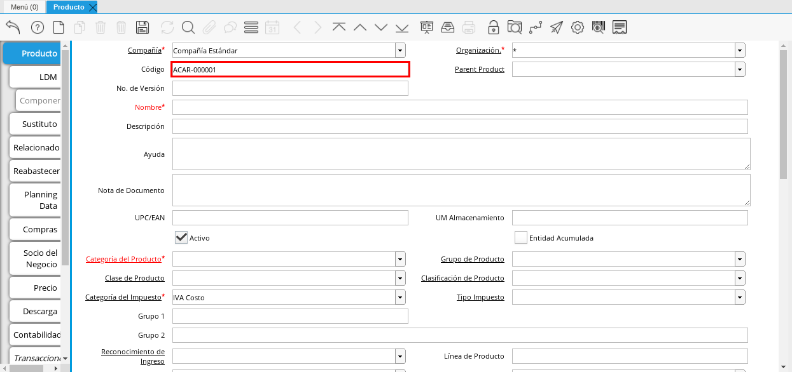
.. |Campo Nombre| image:: resources/nombre.png
.. |Campo Descripción| image:: resources/des.png
.. |Campo Nota de Documento| image:: resources/nota.png
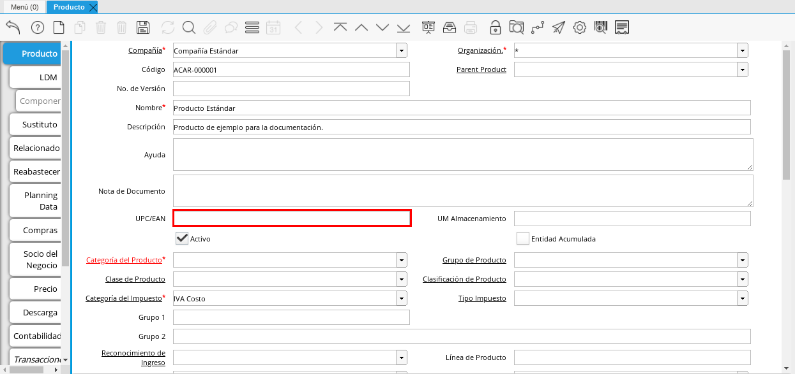
.. |Campo UM Almacenamiento| image:: resources/um.png
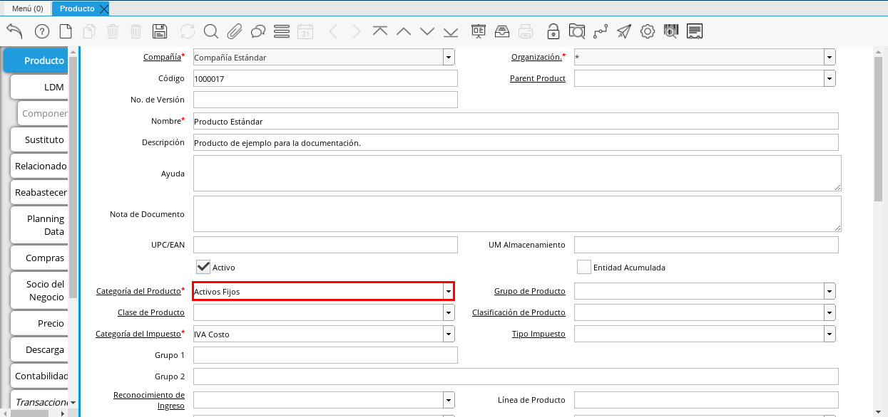
.. |Campo Grupo de Producto| image:: resources/grupo.png
.. |Campo Clase de Producto| image:: resources/clase.png
.. |Campo Clasificación de Producto| image:: resources/clasifi.png
.. |Campo Categoría del Impuesto| image:: resources/impuesto.png
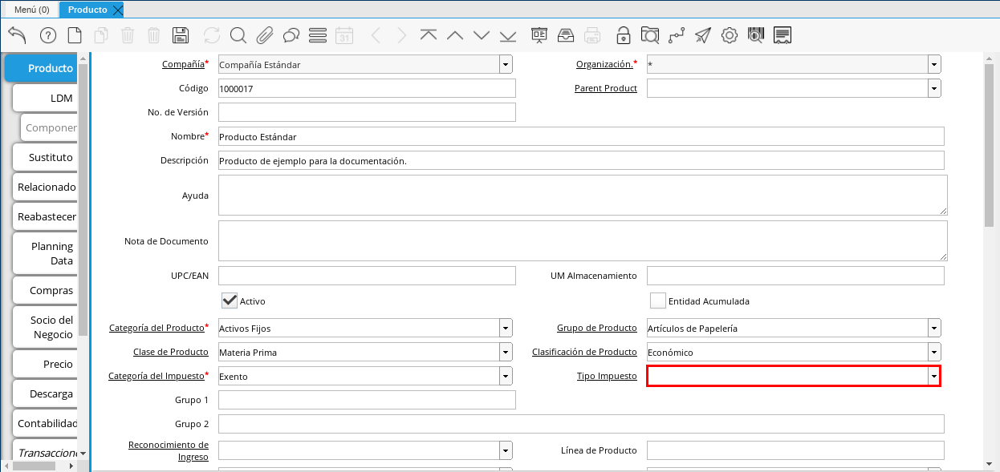
.. |Campo Grupo 1| image:: resources/grupo1.png
.. |Campo Grupo 2| image:: resources/grupo2.png
.. |Campo Reconocimiento de Ingreso| image:: resources/reconocimiento.png
.. |Campo Línea de Producto| image:: resources/linea.png
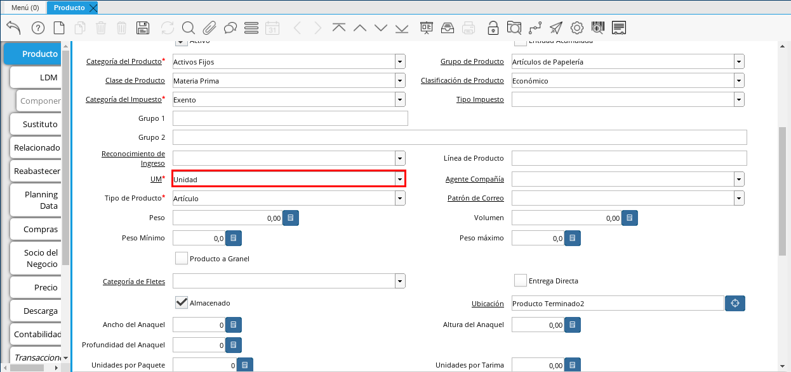
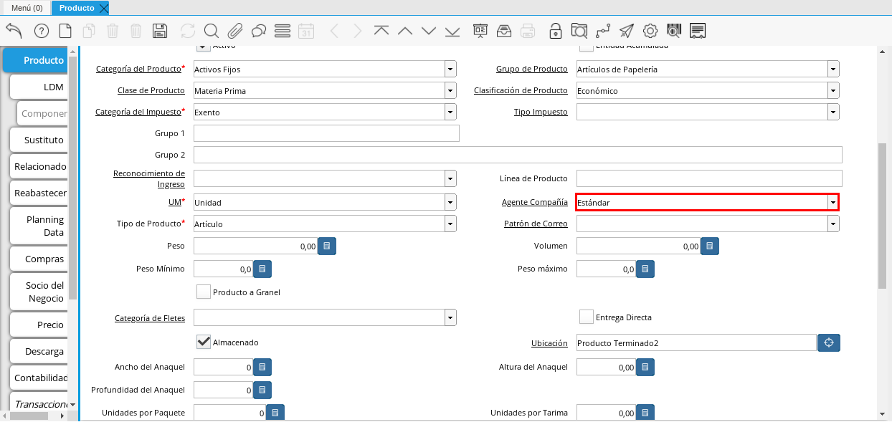
.. |Campo Tipo de Producto| image:: resources/tipopro.png
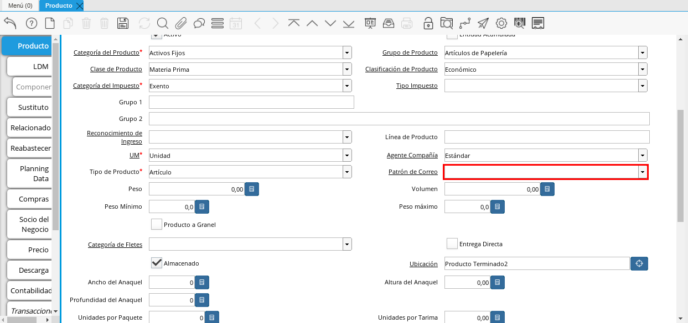
.. |Campo Peso| image:: resources/peso.png
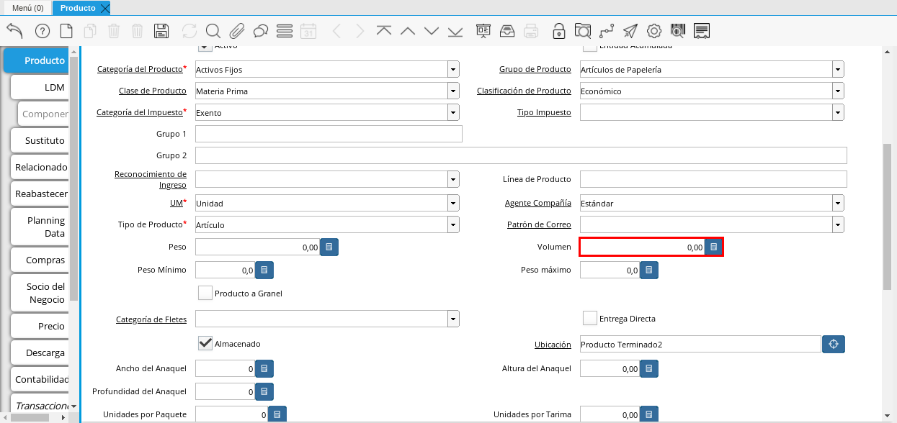
.. |Campo Peso Mínimo| image:: resources/pesomin.png
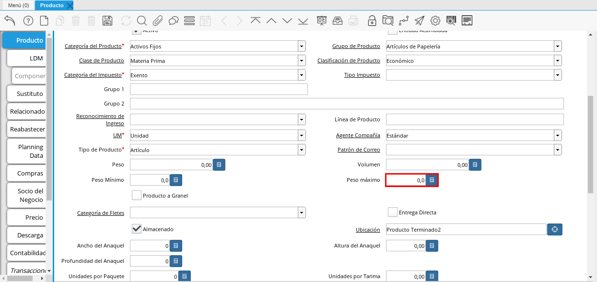
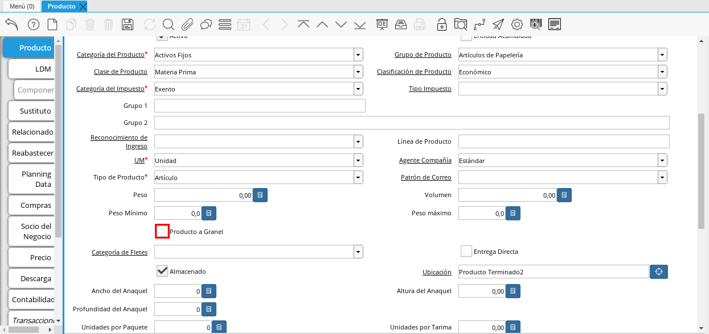
.. |Campo Categoría de Fletes| image:: resources/fletes.png

.. |Campo Ubicación| image:: resources/ubicacion.png

.. |Campo Profundidad del Anaquel| image:: resources/profundo.png
.. |Campo Unidades por Paquete| image:: resources/paquete.png
.. |Campo Unidades por Tarima| image:: resources/tarima.png
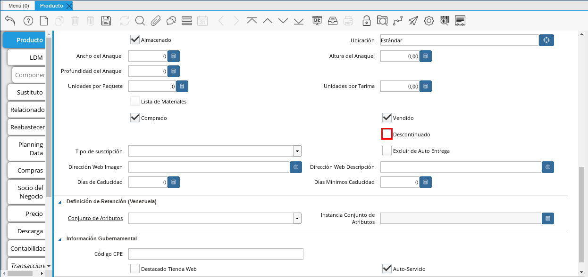

.. |Campo Excluir de Auto Entrega| image:: resources/excluir.png
.. |Campo Dirección Web Imagen| image:: resources/imagenw.png

.. |Campo Días de Caducidad| image:: resources/caducidad.png
.. |Campo Días Mínimos Caducidad| image:: resources/mcaducidad.png

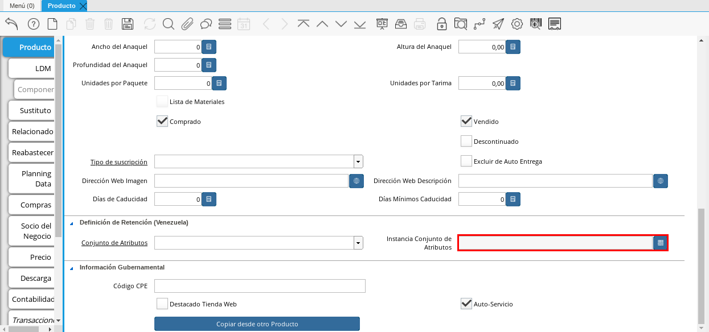

.. |Pestaña Reabastecer| image:: resources/pest-reabastecer.png
.. |Campo Almacén| image:: resources/campo-almacen.png
.. |Campo Ubicación Reabastecer| image:: resources/campo-ubicacion.png
.. |Campo Tipo de Reabastecimiento| image:: resources/tipo-reabastecimiento.png
.. |Campo Nivel Mínimo| image:: resources/campo-nivel-minimo.png
.. |Campo Nivel Máximo| image:: resources/campo-nivel-maximo.png
.. |Campo Almacén Fuente| image:: resources/campo-almacen-fuente.png
.. |Campo Tamaño Cantidad Lote| image:: resources/campo-tamano-cant-lote.png
.. |Icono Guardar Cambios Pestaña Reabastecer| image:: resources/guardar-reabastecer.png
.. |Pestaña Compras| image:: resources/lineacompras.png
.. |Campo Socio del Negocio Proveedor| image:: resources/proveedor.png
.. |Campo UPC/EAN Compras| image:: resources/upclinea.png
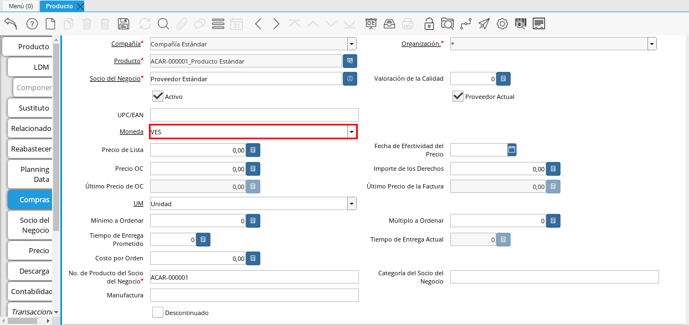
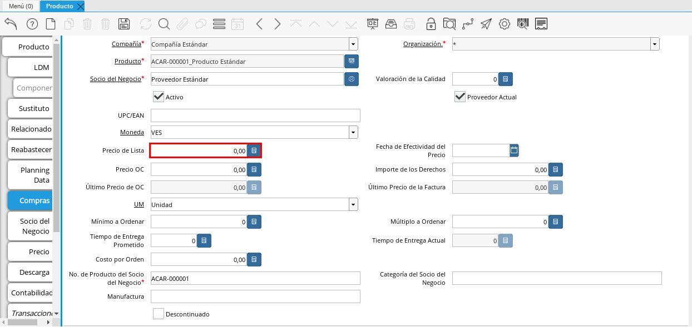

.. |Campo Precio OC| image:: resources/precioc.png

.. |Campo Mínimo a Ordenar| image:: resources/ordenarmi.png

.. |Campo Tiempo de Entrega Prometido| image:: resources/entregapro.png
.. |Campo Costo por Orden| image:: resources/costo.png
.. |Icono Guardar Cambios Pestaña Compras| image:: resources/guardarco.png

.. |Campo Versión de Lista de Precios| image:: resources/preciov.png

.. |Pestaña Conversión Unidad de Medida| image:: resources/lineamedida.png
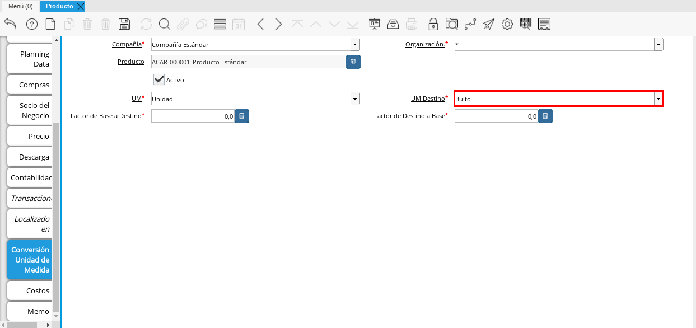
.. |Campo Factor de Destino a Base| image:: resources/factor.png

.. _documento/producto:

**Registro de Producto**
========================

#. En el menú de ADempiere, ubique y seleccione la carpeta "**Gestión de Materiales**", luego seleccione la carpeta "**Reglas de Gestión de Materiales**" y finalmente seleccione la ventana "**Producto**", adjunto imagen para referencia.

    |Menú de ADempiere|

    Imagen 1. Menú de ADempiere

En esta ventana se registran los datos principales que la empresa requiere conocer de los productos, con la finalidad de ser utilizada al momento de realizar alguna compra / venta con dicho producto. Cada uno de los campos con el símbolo (\*) son obligatorios para el registro.

#. Podrá visualizar la ventana "**Producto**", dónde debe seleccionar el icono "**Registro Nuevo**", que se encuentra ubicado en la barra de herramientas de ADempiere.

    |Icono Registro Nuevo| 

    Imagen 2. Icono Registro Nuevo

    #. Seleccione en el campo "**Organización**", la organización para la cual esta registrando el producto.

        |Campo Organización|

        Imagen 3. Campo Organización

        .. warning::

            Para que el producto este disponible para todas las organizaciones, el mismo deberá estar registrado con la organización en (*) de lo contrario el producto solo estará disponible para una sola organización.

    #. Introduzca en el campo "**Código**", el código para el producto que esta registrando, este código es definido por un estándar de códificación establecido en `ERPyA`_ para la :ref:`lve/standard-coding/product`.

        |Campo Código|

        Imagen 4. Campo Código

    #. Introduzca en el campo "**Nombre**", el nombre del producto que esta registrando.

        |Campo Nombre|

        Imagen 5. Campo Nombre

    #. Introduzca en el campo "**Descripción**", una breve descripción correspondiente al producto que esta registrando.

        |Campo Descripción|

        Imagen 6. Campo Descripción

    #. Introduzca en el campo "**Nota de Documento**", cualquier información adicional que considere necesaria.

        |Campo Nota de Documento|

        Imagen 7. Campo Nota de Documento

    #. Introduzca en el campo "**UPC/EAN**", el código de barras correspondiente al producto que esta registrando.

        |Campo UPC/EAN|

        Imagen 8. Campo UPC/EAN

    #. Introduzca en el campo "**UM Almacenamiento**", la unidad de medida de almacenamiento del producto.

        |Campo UM Almacenamiento|

        Imagen 9. Campo UM Almacenamiento

    #. Seleccione en el campo "**Categoría del Producto**", la categoría a la cual pertenece el producto que esta registrando, la selección de este define el comportamiento del producto que se esta registrando, dicho comportamiento se encuentra explicado en el documento :ref:`documento/categoria-productos` elaborado por `ERPyA`_.

        |Campo Categoría del Producto|

        Imagen 10. Campo Categoría del Producto

    #. Seleccione en el campo "**Grupo de Producto**", el grupo al cual pertenece el producto que esta registrando, la selección de este define el comportamiento del producto que se esta registrando, dicho comportamiento se encuentra explicado en el documento :ref:`documento/grupo-producto` elaborado por `ERPyA`_.

        |Campo Grupo de Producto|

        Imagen 11. Campo Grupo de Producto

    #. Seleccione en el campo "**Clase de Producto**", la clase a la cual pertenece el producto que esta registrando.

        |Campo Clase de Producto|

        Imagen 12. Campo Clase de Producto

    #. Seleccione en el campo "**Clasificación de Producto**", la clasificación a la cual pertenece el producto que esta registrando.

        |Campo Clasificación de Producto|

        Imagen 13. Campo Clasificación de Producto

    #. Seleccione en el campo "**Categoría del Impuesto**", la agrupación de impuestos aplicale al producto que esta registrando.

        |Campo Categoría del Impuesto|

        Imagen 14. Campo Categoría del Impuesto

    #. Seleccione en el campo "**Tipo de Impuesto**", el tipo de impuesto aplicable al producto que esta registrando.

        |Campo Tipo de Impuesto|

        Imagen 15. Campo Tipo de Impuesto

    #. Introduzca en el campo "**Grupo 1**", el grupo al cual pertenece el producto.

        |Campo Grupo 1|

        Imagen 16. Campo Grupo 1

    #. Introduzca en el campo "**Grupo 2**", el grupo adicional al cual pertenece el producto.

        |Campo Grupo 2|

        Imagen 17. Campo Grupo 2

    #. Seleccione en el campo "**Reconocimiento de Ingreso**", como serán reconocidos los ingresos para el producto.

        |Campo Reconocimiento de Ingreso|

        Imagen 18. Campo Reconocimiento de Ingreso

    #. Introduzca en el campo "**Línea de Producto**", la clasificación para agrupar el producto.

        |Campo Línea de Producto|

        Imagen 19. Campo Línea de Producto

    #. Seleccione en el campo "**UM**", la unidad de medida del producto.

        |Campo UM|

        Imagen 20. Campo UM

    #. Seleccione en el campo "**Agente Compañía**", el agente de compras del producto que esta registrando.

        |Campo Agente Compañía|

        Imagen 21. Campo Agente Compañía

    #. Seleccione en el campo "**Tipo de Producto**", el tipo de producto que esta registrando.

        |Campo Tipo de Producto|

        Imagen 22. Campo Tipo de Producto

    #. Seleccione en "**Patrón de Correo**", la plantilla utilizada para ser enviada a los socios del negocio con respecto al producto.

        |Campo Patrón de Correo|

        Imagen 23. Campo Patrón de Correo

    #. Introduzca en el campo "**Peso**", el peso del producto que esta registrando.

        |Campo Peso|

        Imagen 24. Campo Peso

    #. Introduzca en el campo "**Volumen**", el volumen del producto que esta registrando.

        |Campo Volumen|

        Imagen 25. Campo Volumen

    #. Introduzca en el campo "**Peso Mínimo**", el peso mínimo del producto que esta registrando.

        |Campo Peso Mínimo|

        Imagen 26. Campo Peso Mínimo

    #. Introduzca en el campo "**Peso Máximo**", el peso máximo del producto que esta registrando.

        |Campo Peso Máximo|

        Imagen 27. Campo Peso Máximo

    #. Seleccione el checklist "**Producto a Granel**", para indicar que el producto que esta registrando es a granel.

        |Campo Producto a Granel|

        Imagen 28. Campo Producto a Granel

    #. Seleccione en el campo "**Categoría de Fletes**", la categoría de fletes a aplicar al producto seleccionado.

        |Campo Categoría de Fletes|

        Imagen 29. Campo Categoría de Fletes

    #. Seleccione el checklist "**Entrega Directa**", para indicar que los envíos del producto que esta registrando, se realizarán directamente al socio del negocio cliente.

        |Campo Entrega Directa|

        Imagen 30. Campo Entrega Directa

    #. Podrá apreciar el checklist "**Almacenado**", indicando que la empresa almacena el producto que esta registrando.

        |Campo Almacenado|

        Imagen 31. Campo Almacenado

    #. Seleccione en el campo "**Ubicación**", la ubicación de almacenamiento dentro de la empresa del producto que esta registrando.

        |Campo Ubicación|

        Imagen 32. Campo Ubicación

    #. Introduzca en el campo "**Ancho de Anaquel**", el ancho requerido del anaquel para almacenar el producto que esta registrando.

        |Campo Ancho de Anaquel|

        Imagen 33. Campo Ancho de Anaquel

    #. Introduzca en el campo "**Altura del Anaquel**", la altura requerida del anaquel para almacenar el producto que esta registrando.

        |Campora del Anaquel|

        Imagen 34. Campora del Anaquel

    #. Introduzca en el campo "**Profundidad del Anaquel**", la profundidad requerida del anaquel para almacenar el producto que esta registrando.

        |Campo Profundidad del Anaquel|

        Imagen 35. Campo Profundidad del Anaquel

    #. Introduzca en el campo "**Unidades por Paquete**", el número de unidades del producto que esta registrando que conforman un paquete.

        |Campo Unidades por Paquete|

        Imagen 36. Campo Unidades por Paquete

    #. Introduzca en el campo "**Unidades por Tarima**",

        |Campo Unidades por Tarima|

        Imagen 37. Campo Unidades por Tarima

    #. Seleccione el checklist "**Descontinuado**", para indicar que el producto no se encuentra disponible.

        |Campo Descontinuado|

        Imagen 38. Campo Descontinuado

    #. Seleccione en el campo "**Tipo de Suscripción**", el tipo de suscripción del producto.

        |Campo Tipo de Suscripción|

        Imagen 39. Campo Tipo de Suscripción

    #. Seleccione el checklist "**Excluir de Auto Entrega**", para excluir el producto de la entrega automática.

        |Campo Excluir de Auto Entrega|

        Imagen 40. Campo Excluir de Auto Entrega

    #. Introduzca en el campo "**Dirección Web Imagen**", la url de la imagen del producto.

        |Campo Dirección Web Imagen|

        Imagen 41. Campo Dirección Web Imagen

    #. Introduzca en el campo "**Dirección Web Descripción**", la url de la descripción del producto.

        |Campo Dirección Web Descripción|

        Imagen 42. Campo Dirección Web Descripción

    #. Introduzca en el campo "**Días de Caducidad**", el número de días límite de disponibilidad o garantía del producto que esta registrando.

        |Campo Días de Caducidad|

        Imagen 43. Campo Días de Caducidad

    #. Introduzca en el campo "**Días Mínimos Caducidad**", el número mínimo de días límite de disponibilidad o garantía del producto que esta registrando.

        |Campo Días Mínimos Caducidad|

        Imagen 44. Campo Días Mínimos Caducidad

    #. Seleccione en el campo "**Conjunto de Atributos**", el atributo del producto que esta registrando.

        |Campo Conjunto de Atributos|

        Imagen 45. Campo Conjunto de Atributos

    #. Seleccione en el campo "**Instancia Conjunto de Atributos**", el conjunto de atributos perteneciente al producto que esta registrando.

        |Campo Instancia Conjunto de Atributo|

        Imagen 46. Campo Instancia Conjunto de Atributo

    #. Introduzca en el campo "**Código CPE**", el código CPE perteneciente al producto que esta registrando.

        |Campo Código CPE|

        Imagen 47. Campo Código CPE

#. Seleccione el icono "**Guardar Cambios**" en la barra de herramientas de ADempiere.

    |Icono Guardar Cambios Pestaña Producto|

    Imagen 48. Icono Guardar Cambios

.. _paso/reabastecer-producto:

**Pestaña Reabastecer**
-----------------------

#. Seleccione la pestaña "**Reabastecer**", ubicada del lado izquierdo de la ventana "**Producto**" y proceda al llenado de los campos correspondientes.

    |Pestaña Reabastecer|

    Imagen 49. Pestaña Reabastecer

    #. Seleccione en el campo "**Almacén**", el almacén relacionado con el registro que se encuentra realizando.

        Este campo identifica un punto único donde los productos son almacenados

        |Campo Almacén|

        Imagen 50. Campo Almacén

    #. Seleccione en el campo "**Ubicación**", la ubicación exacta en el almacén relacionada con el registro que se encuentra realizando.

        Este campo indica en que parte del almacén se localiza el producto

        |Campo Ubicación Reabastecer|

        Imagen 51. Campo Ubicación

    #. Seleccione en el campo "**Tipo de Reabastecimiento**", el tipo de reabastecimiento relacionado con el registro que se encuentra realizando.

        Método para re-ordenar un producto. El tipo de reabastecimiento indica si este producto será manualmente reordenado; ordenado cuando la cantidad esté por debajo de la cantidad mínima u ordenado cuando esté debajo de la cantidad máxima.

        |Campo Tipo de Reabastecimiento|

        Imagen 52. Campo Tipo de Reabastecimiento

    #. Seleccione en el campo "**Nivel Mínimo**", el nivel mínimo relacionado con el registro que se encuentra realizando.

        Este campo indica la cantidad mínima de este producto a ser almacenada en inventario

        |Campo Nivel Mínimo|

        Imagen 53. Campo Nivel Mínimo

    #. Seleccione en el campo "**Nivel Máximo**", el nivel máximo relacionado con el registro que se encuentra realizando.

        Este campo indica la cantidad máxima de este producto a ser almacenada en inventario

        |Campo Nivel Máximo|

        Imagen 54. Campo Nivel Mínimo

    #. Seleccione en el campo "**Almacén Fuente**", el almacén fuente relacionado con el registro que se encuentra realizando.

        Almacén opcional para reabastecimiento. Si se define, este almacén será seleccionado para reabastecimiento de producto

        |Campo Almacén Fuente|

        Imagen 55. Campo Almacén Fuente

    #. Seleccione en el campo "**Tamaño Cantidad Lote**", el almacén fuente relacionado con el registro que se encuentra realizando.

        |Campo Tamaño Cantidad Lote|

        Imagen 56. Campo Tamaño Cantidad Lote

#. Seleccione el icono "**Guardar Cambios**" en la barra de herramientas de ADempiere.

    |Icono Guardar Cambios Pestaña Reabastecer|

    Imagen 57. Icono Guardar Cambios

**Pestaña Compras**
-------------------

En esta ventana se registran los precios y reglas de compras por socios del negocio, con la finalidad de ser utilizada al momento de realizar alguna compra de dicho producto. Cada uno de los campos con el símbolo (\*) son obligatorios para el registro.

#. Seleccione la pestaña "**Compras**", ubicada del lado izquierdo de la ventana "**Producto**" y proceda al llenado de los campos correspondientes.

    |Pestaña Compras|

    Imagen 58. Pestaña Compras

    #. Seleccione en el campo "**Socio del Negocio**", el socio del negocio proveedor del producto que esta registrando.

        |Campo Socio del Negocio Proveedor|

        Imagen 59. Campo Socio del Negocio Proveedor

    #. Introduzca en el campo "**UPC/EAN**", el código de barras correspondiente al producto que esta registrando.

        |Campo UPC/EAN Compras|

        Imagen 60. Campo UPC/EAN

    #. Seleccione en el campo "**Moneda**", la moneda utilizada para la compra del producto que esta registrando.

        |Campo Moneda|

        Imagen 61. Campo Moneda

    #. Introduzca en el campo "**Precio de Lista**", el precio del producto en la moneda seleccionada.

        |Campo Precio de Lista|

        Imagen 62. Campo Precio de Lista

    #. Seleccione en el campo "**Fecha de Efectividad del Precio**", la fecha en la que el precio ingresado es válido.

        |Campo Fecha de Efectividad del Precio|

        Imagen 63. Campo Fecha de Efectividad del Precio

    #. Introduzca en el campo "**Precio OC**", el precio unitario del producto para una orden de compra.

        |Campo Precio OC|

        Imagen 64. Campo Precio OC

    #. Seleccione en el campo "**UM**", la unidad de medida para realizar la compra del producto que esta registrando.

        |Campo UM Compras|

        Imagen 65. Campo UM

    #. Introduzca en el campo "**Mínimo a Ordenar**", la cantidad mínima a ordenar en la unidad de medida seleccionada del producto que esta registrando.

        |Campo Mínimo a Ordenar|

        Imagen 66. Campo Mínimo a Ordenar

    #. Introduzca en el campo "**Múltiplo a Ordenar**", el número de productos que contiene la unidad de medida seleccionada.

        |Campo Múltiplo a Ordenar|

        Imagen 67. Campo Múltiplo a Ordenar

    #. Introduzca en el campo "**Tiempo de Entrega Prometido**", el número de días existentes entre la fecha de la orden y la fecha prometida de la entrega.

        |Campo Tiempo de Entrega Prometido|

        Imagen 68. Campo Tiempo de Entrega Prometido

    #. Introduzca en el campo "**Costo por Orden**", el costo por la orden para el producto que esta registrando.

        |Campo Costo por Orden|

        Imagen 69. Campo Costo por Orden

#. Seleccione el icono "**Guardar Cambios**" en la barra de herramientas de ADempiere.

    |Icono Guardar Cambios Pestaña Compras|

    Imagen 70. Icono Guardar Cambios

**Pestaña Precio**
------------------

En esta ventana se registran las listas de precios utilizadas por la empresa, con sus diferentes precios de lista, límite y estándar que poseen los productos, con la finalidad de ser utilizada al momento de realizar alguna compra / venta con los mismos. Cada uno de los campos con el símbolo (\*) son obligatorios para el registro.

#. Seleccione la pestaña "**Precio**", ubicada del lado izquierdo de la ventana "**Producto**" y proceda al llenado de los campos correspondientes.

    |Pestaña Precio|

    Imagen 71. Pestaña Precio

    #. Seleccione en el campo "**Versión de Lista de Precios**", la lista de precios que será utilizada para el producto que esta registrando.

        |Campo Versión de Lista de Precios|

        Imagen 72. Campo Versión de Lista de Precios

#. Seleccione el icono "**Guardar Cambios**" en la barra de herramientas de ADempiere.

    |Icono Guardar Cambios Pestaña Precio|

    Imagen 73. Icono Guardar Cambios

**Pestaña Conversión Unidad de Medida**
---------------------------------------

En esta ventana se registran las conversiones de las diferentes unidades de medida utilizadas por la empresa, con la finalidad de aplicar dichas conversiones al momento de realizar alguna compra / venta de un producto. Cada uno de los campos con el símbolo (\*) son obligatorios para el registro.

#. Seleccione la pestaña "**Conversión Unidad de Medida**", ubicada del lado izquierdo de la ventana "**Producto**" y proceda al llenado de los campos correspondientes.

    |Pestaña Conversión Unidad de Medida|

    Imagen 74. Pestaña Conversión Unidad de Medida

    #. Seleccione en el campo "**UM Destino**", la unidad de medida a la cual será realizada la conversión.

        |Campo UM Destino|

        Imagen 75. Campo UM Destino

    #. Introduzca en el campo "**Factor de Destino a Base**", el número de productos que contiene la unidad de medida seleccionada.

        |Campo Factor de Destino a Base|

        Imagen 76. Campo Factor de Destino a Base

#. Seleccione el icono "**Guardar Cambios**" en la barra de herramientas de ADempiere.

    |Icono Guardar Cambios Pestaña Conversión|

    Imagen 77. Icono Guardar Cambios
