.. |menú del directorio de socios del negocio| image:: resources/business-partner-directory-menu.png
.. |ventana del reporte directorio de socios del negocio| image:: resources/business-partner-directory-report-window.png
.. |campo nombre del reporte directorio de socios del negocio| image:: resources/report-name-field-business-partner-directory.png
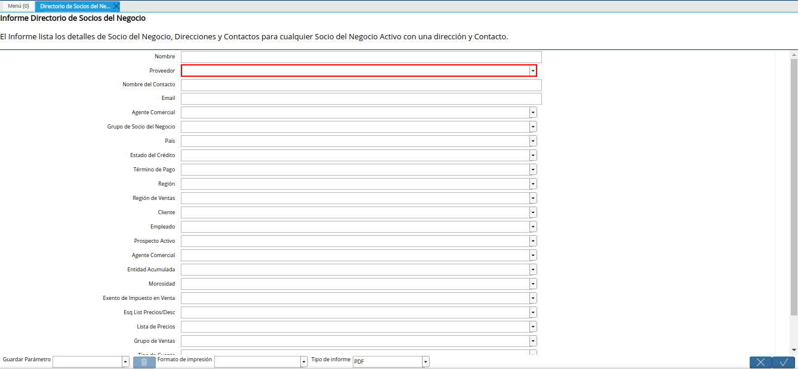
.. |campo nombre del contacto del reporte directorio de socios del negocio| image:: resources/contact-name-field-of-the-business-partner-directory-report.png
.. |campo email del reporte directorio de socios del negocio| image:: resources/email-field-of-the-business-partner-directory-report.png
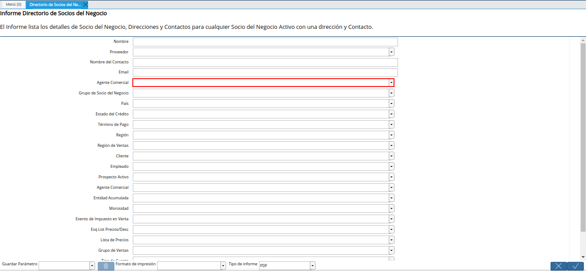
.. |campo grupo de socio del negocio del reporte directorio de socios del negocio| image:: resources/business-partner-group-field-of-the-business-partner-directory-report.png
.. |campo país del reporte directorio de socios del negocio| image:: resources/country-field-of-the-business-partner-directory-report.png
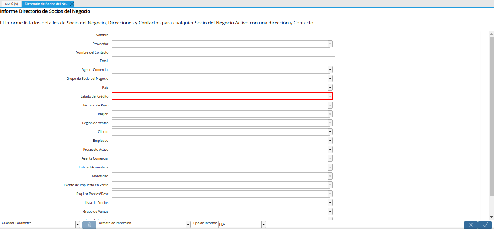
.. |campo término de pago del reporte directorio de socios del negocio| image:: resources/payment-term-field-of-the-business-partner-directory-report.png
.. |campo región del reporte directorio de socios del negocio| image:: resources/region-field-of-the-business-partner-directory-report.png
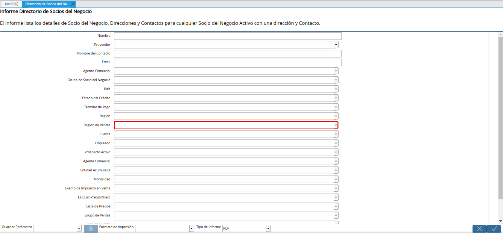
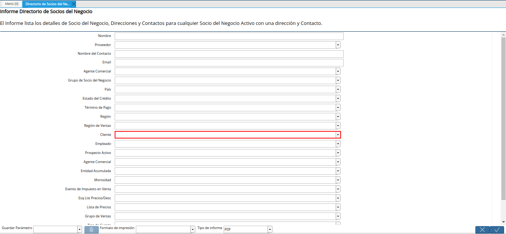
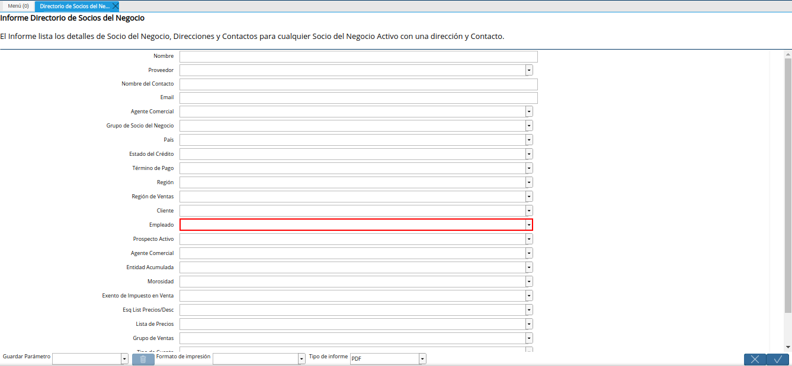
.. |campo prospecto activo del reporte directorio de socios del negocio| image:: resources/active-prospect-field-of-the-business-partner-directory-report.png
.. |otro campo agente comercial del reporte directorio de socios del negocio| image:: resources/another-commercial-agent-field-of-the-business-partner-directory-report.png
.. |campo entidad acumulada del reporte directorio de socios del negocio| image:: resources/cumulative-entity-field-of-the-business-partner-directory-report.png
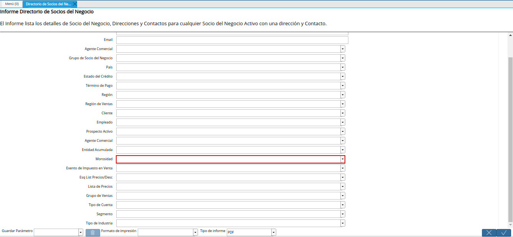
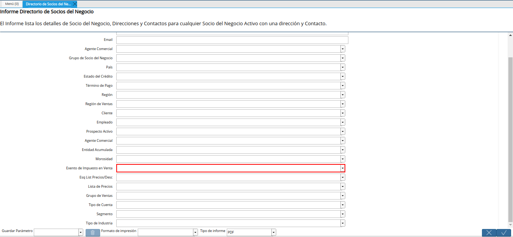
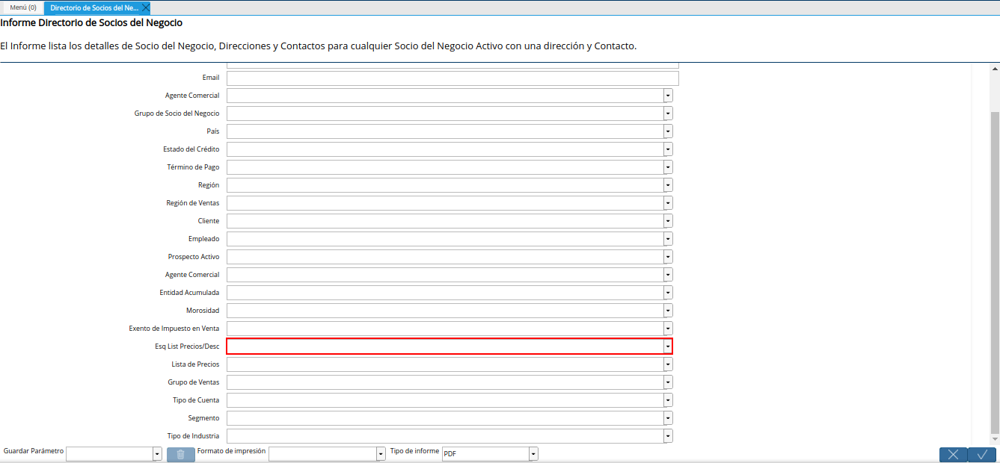
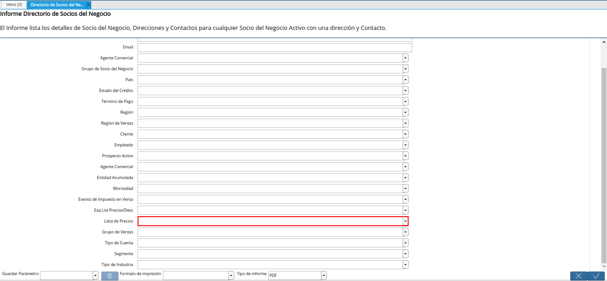
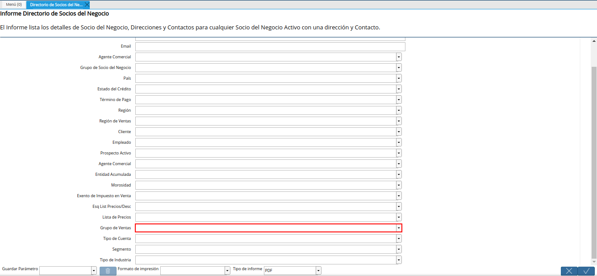
.. |campo tipo de cuenta del reporte directorio de socios del negocio| image:: resources/account-type-field-of-the-business-partner-directory-report.png
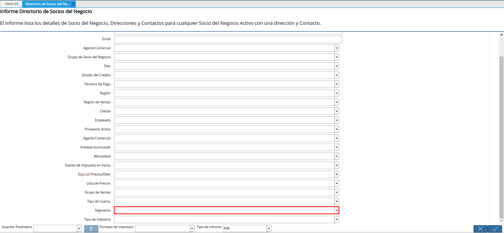
.. |campo tipo de industria del reporte directorio de socios del negocio| image:: resources/field-industry-type-of-report-business-partner-directory.png
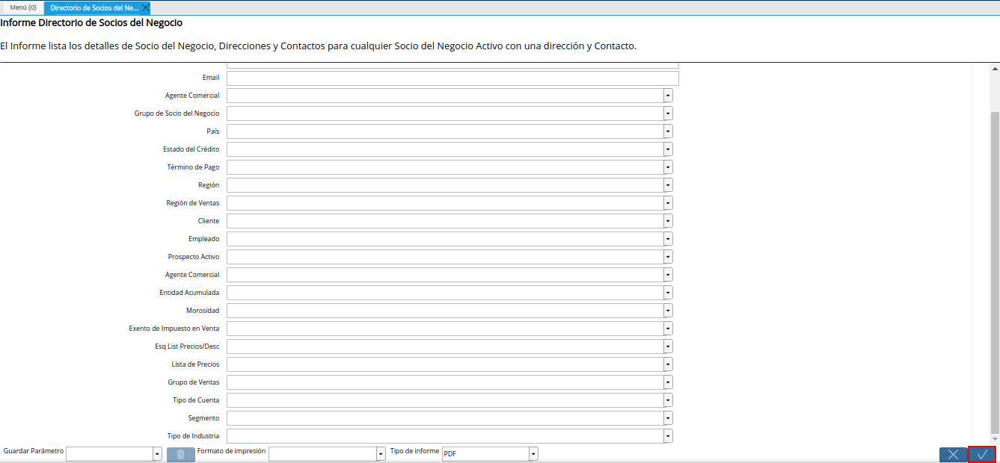
.. |reporte directorio de socios del negocio| image:: resources/business-partner-directory-report.png

.. _documento/directorio-de-socios-del-negocio:

**Directorio de Socios del Negocio**
====================================

 Ubique y seleccione en el menú de ADempiere, la carpeta "**Relación con Socios del Negocio**", luego seleccione la carpeta "**Reglas de Socios del Negocio**", por último seleccione el reporte "**Directorio de Socios del Negocio**".

    |menú del directorio de socios del negocio|

    Imagen 1. Menú de ADempiere

 Podrá visualizar la ventana del reporte "**Directorio de Socios del Negocio**", con diferentes campos que permiten filtrar la información en base a lo requerido por el usuario.

    |ventana del reporte directorio de socios del negocio|

    Imagen 2. Ventana del Reporte Directorio de Socios del Negocio

 Seleccione en el campo "**Nombre**", el nombre del socio del negocio por el cual requiere filtrar la búsqueda de información.

    |campo nombre del reporte directorio de socios del negocio|

    Imagen 3. Campo Nombre del Socio del Negocio

 Indique en el campo "**Proveedor**", si requiere filtrar la búsqueda de información de los socios del negocio por proveedores.

    |campo proveedor del reporte directorio de socios del negocio|

    Imagen 4. Campo Proveedor

 Introduzca en el campo "**Nombre del Contacto**", en nombre del contacto por el cual requiere filtrar la búsqueda de información.

    |campo nombre del contacto del reporte directorio de socios del negocio|

    Imagen 5. Campo Nombre del Contacto

 Introduzca en el campo "**Email**", la información de correo electrónico por la cual requiere filtrar la búsqueda de información.

    |campo email del reporte directorio de socios del negocio|

    Imagen 6. Campo Email

 Seleccione en el campo "**Agente Comercial**", el agente comercial por el cual requiere filtrar la búsqueda de información.

    |campo agente comercial del reporte directorio de socios del negocio|

    Imagen 7. Campo Agente Comercial

 Seleccione en el campo "**Grupo de Socio del Negocio**", el grupo de socio del negocio por el cual requiere filtrar la búsqueda información.

    |campo grupo de socio del negocio del reporte directorio de socios del negocio|

    Imagen 8. Campo Grupo de Socio del Negocio

 Seleccione en el campo "**País**", el país por el cual requiere filtrar la información.

    |campo país del reporte directorio de socios del negocio|

    Imagen 9. Campo País

 Seleccione en el campo "**Estado del Crédito**", el estado del crédito por el cual requiere filtrar la búsqueda de información.

    |campo estado del crédito del reporte directorio de socios del negocio|

    Imagen 10. Campo Estado del Crédito

 Seleccione en el campo "**Término de Pago**", el término de pago por el cual requiere filtrar la búsqueda de información.

    |campo término de pago del reporte directorio de socios del negocio|

    Imagen 11. Campo Término de Pago

 Seleccione en el campo "**Región**", la región por la cual requiere filtrar la búsqueda de información.

    |campo región del reporte directorio de socios del negocio|

    Imagen 12. Campo Región

 Seleccione en el campo "**Región de Ventas**", la región de ventas por la cual requiere filtrar la búsqueda de información.

    |campo región de ventas del reporte directorio de socios del negocio|

    Imagen 13. Campo Región de Ventas 

 Indique en el campo "**Cliente**", si requiere filtrar la búsqueda de información de los socios del negocio por clientes.

    |campo cliente del reporte directorio de socios del negocio|

    Imagen 14. Campo Cliente

 Indique en el campo "**Empleado**", si requiere filtrar la búsqueda de información de los socios del negocio por empleado.

    |campo empleado del reporte directorio de socios del negocio|

    Imagen 15. Campo Empleado

 Indique en el campo "**Prospecto Activo**", si requiere filtrar la búsqueda de información de los socios del negocio por prospectos activos.

    |campo prospecto activo del reporte directorio de socios del negocio|

    Imagen 16. Campo Prospecto Activo

 Indique en el campo "**Agente Comercial**", si requiere filtrar la búsqueda de información de los socios del negocio por agente comercial.

    |otro campo agente comercial del reporte directorio de socios del negocio|

    Imagen 17. Campo Agente Comercial

 Indique en el campo "**Entidad Acumulada**", si requiere filtrar la búsqueda de información de los socios del negocio por entidad acumulada.

    |campo entidad acumulada del reporte directorio de socios del negocio|

    Imagen 18. Campo Entidad Acumulada

 Seleccione en el campo "**Morosidad**", la morosidad por la cual requiere filtrar la búsqueda de información.

    |campo morosidad del reporte directorio de socios del negocio|

    Imagen 19. Campo Morosidad

 Indique en el campo "**Exento de Impuesto en Venta**", si requiere filtrar la búsqueda de información de los socios del negocio por exento de impuesto en venta.

    |campo exento de impuesto en venta del reporte directorio de socios del negocio|

    Imagen 20. Campo Exento de Impuesto en Venta

 Seleccione en el campo "**Esq List Precios/Desc**", el esquema de lista de precios de descuento por el cual requiere filtrar la búsqueda de información.

    |campo esq list precios desc del reporte directorio de socios del negocio|

    Imagen 21. Campo Esq List Precios/Desc

 Seleccione en el campo "**Lista de Precios**", la lista de precios por la cual requiere filtrar la búsqueda de información.

    |campo lista de precios del reporte directorio de socios del negocio|

    Imagen 22. Campo Lista de Precios

 Seleccione en el campo "**Grupo de Ventas**", el grupo de ventas por el cual requiere filtrar la búsqueda de información.

    |campo grupo de ventas del reporte directorio de socios del negocio|

    Imagen 23. Campo Grupo de Ventas

 Seleccione en el campo "**Tipo de Cuenta**", el tipo de cuenta por el cual requiere filtrar la búsqueda de información.

    |campo tipo de cuenta del reporte directorio de socios del negocio|

    Imagen 24. Campo Tipo de Cuenta

 Seleccione en el campo "**Segmento**", el segmento por el cual requiere filtrar la búsqueda de información.

    |campo segmento del reporte directorio de socios del negocio|

    Imagen 25. Campo Segmento

 Seleccione en el campo "**Tipo de Industria**", el tipo de industria por el cual requiere filtrar la búsqueda de información.

    |campo tipo de industria del reporte directorio de socios del negocio|

    Imagen 26. Campo Tipo de Industria

 Seleccione la opción "**OK**", para generar el reporte de acuerdo a lo seleccionado en la ventana "**Directorio de Socios del Negocio**".

    |opción ok del reporte directorio de socios del negocio|

    Imagen 27. Opción OK 

 Al filtrar el reporte ingresando solamente el nombre del socio del negocio en el campo "**Nombre**", podrá visualizar el reporte de la siguiente manera.

    |reporte directorio de socios del negocio|

    Imagen 28. Reporte Directorio de Socios del Negocio