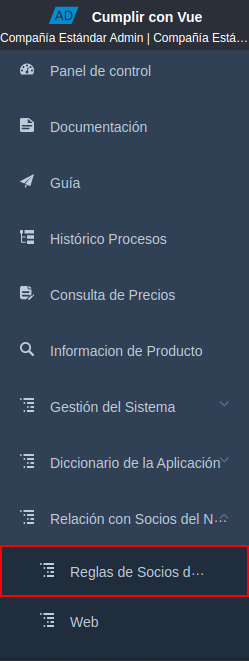
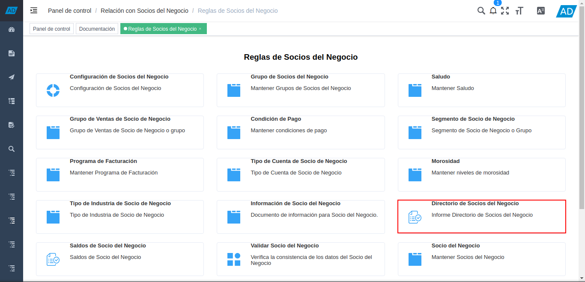
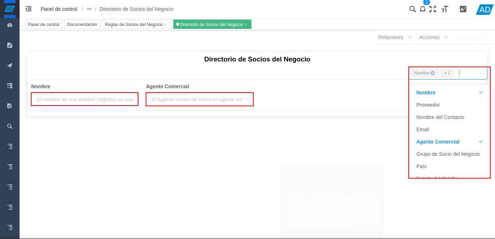
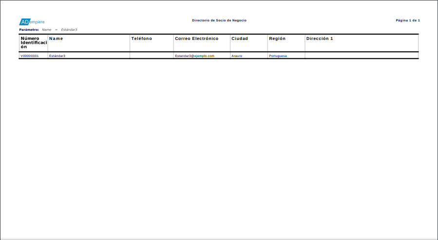
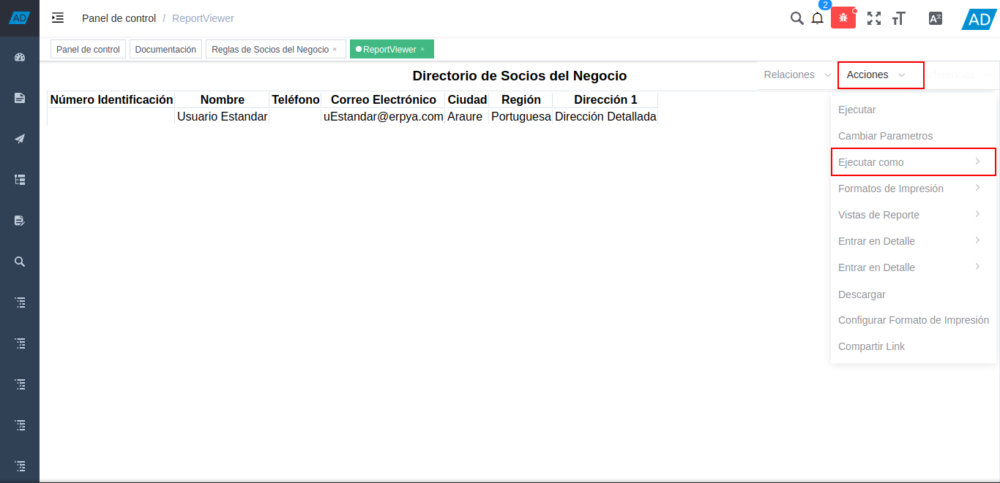

.. |carpeta reglas de socios del negocio| image:: resources/business-partner-rules-folder.png

.. |campos a visualizar en el reporte directorio de socios del negocio| image:: resources/fields-to-display-in-the-business-partner-directory-report.png

.. |información en los campos agregados| image:: resources/information-in-added-fields.png
.. |acción ejecutar del reporte directorio de socios del negocio| image:: resources/execute-action-of-the-report-directory-of-business-partners.png

.. |seleccionar formato de impresión| image:: resources/select-print-format.png
.. |cambiar formato de impresión| image:: resources/change-print-format.png

.. |seleccionar formato a exportar| image:: resources/select-format-to-export.png

.. _documento/directorio-de-socios-del-negocio:

**Directorio de Socios del Negocio**
====================================

#. Ubique y seleccione en el menú de ADempiere, la carpeta "**Relación con Socios del Negocio**", luego seleccione la carpeta "**Reglas de Socios del Negocio**".

    |menú del directorio de socios del negocio|

    Imagen 1. Menú de ADempiere

#. Podrá visualizar la carpeta "**Reglas de Socios del Negocio**", con diferentes ventanas, procesos y reportes.

    |carpeta reglas de socios del negocio|

    Imagen 2. Carpeta Reglas de Socios del Negocio

#. Seleccione el reporte "**Directorio de Socios del Negocio**", para generar el reporte en base a lo requerido.

    |selección del reporte directorio de socios del negocio|
    
    Imagen 3. Selección del Reporte Directorio de Socios del Negocio
    
#. Podrá visualizar la ventana del reporte "**Directorio de Socios del Negocio**", con el campo "**Columnas Opcionales**", en el cual se deben tildar los campos que se requiere visualizar en el reporte.

    |campos a visualizar en el reporte directorio de socios del negocio|

    Imagen 4. Campo Columnas Opcionales

    Los campos que pueden ser agregados al reporte "**Directorio de Socios del Negocio**", son los siguiente:

        - Nombre
        - Proveedor
        - Nombre del Contacto
        - Email
        - Agente Comercial
        - Grupo de Socio del Negocio
        - País
        - Estado del Crédito
        - Término de Pago
        - Región
        - Región de Ventas
        - Cliente
        - Empleado
        - Prospecto Activo
        - Agente Comercial
        - Entidad Acumulada
        - Morosidad
        - Exento de Impuesto en Venta
        - Esq List Precios/Desc
        - Lista de Precios
        - Grupo de Ventas
        - Tipo de Cuenta
        - Segmento
        - Tipo de Industria

#. Al ir tildando los campos requeridos en el reporte "**Directorio de Socios del Negocio**", se agregan los mismos a la ventana de manera automática.

    |campos agregados de manera automática|

    Imagen 5. Campos del Reporte

#. Introduzca en cada uno de los campos agregados al reporte, los valores correspondientes para filtrar la información del reporte en base a ello.

    |información en los campos agregados|

    Imagen 6. Valores de los Campos

    .. note::

        Si no es ingresado ningún valor en los campos agregados a la ventana del reporte, ADempiere realiza una consulta general y muestra los resultados en base a los campos agregados.

#. Posicione el cursor en la opción "**Acciones**", luego ubique y seleccione la opción "**Ejecutar**", para generar el reporte a los valores ingresados en los campos agregados al reporte.

    |acción ejecutar del reporte directorio de socios del negocio|

    Imagen 7. Acción Ejecutar

#. Podrá visualizar el reporte de la siguiente manera.

    |reporte directorio de socios del negocio|

    Imagen 8. Reporte Directorio de Socios del Negocio

#. Para cambiar el formato de impresión del reporte, se debe posicionar sobre el campo "**Acciones**" y luego se debe posicionar sobre la opción "**Formato de Impresión**".

    |seleccionar formato de impresión|

    Imagen 9. Cambiar Formato de Impresión.

    #. Finalmente, seleccione el formato de impresión requerido.

        |cambiar formato de impresión|

        Imagen 10. Cambiar Formato de Impresión.

#. Para exportar el reporte en el formato requerido, se debe posicionar sobre el campo "**Acciones**" y luego se debe posicionar sobre la opción "**Ejecutar Como**".

    |seleccionar ejecutar como|

    Imagen 11. Exportar Reporte 

    #. Finalmente, seleccione el formato con el cual requiere exportar el reporte.

        |seleccionar formato a exportar|

        Imagen 12. Seleccionar Formato a Exportar

.. note::

    En la versión 3.9.2 de ADempiere, al ejecutar un proceso o generar un reporte con mucha información, la ventana queda "**Procesando**" y no permite ejecutar otros procesos. Mientras que la versión 4.0.0, permite ejecutar procesos en una ventana y al mismo tiempo, generar reportes o ejecutar otros procesos.