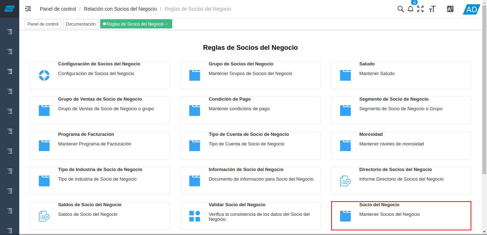
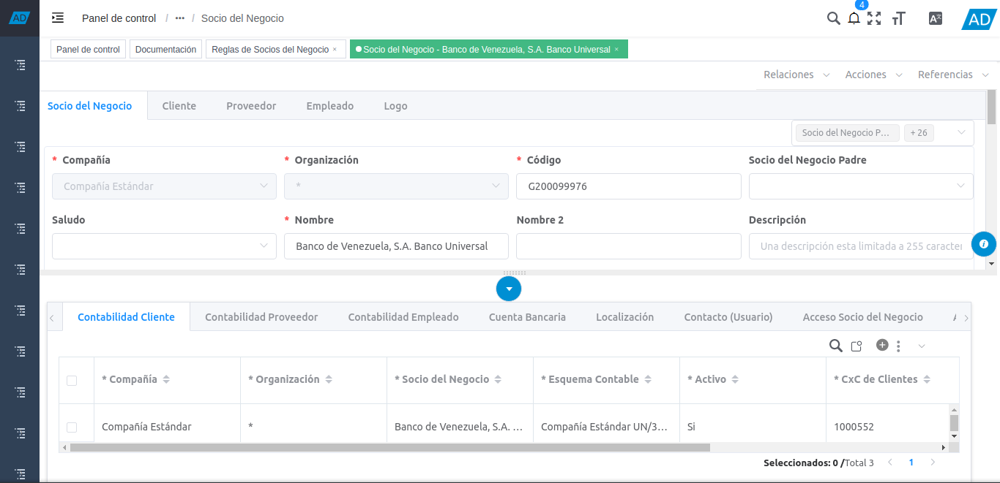
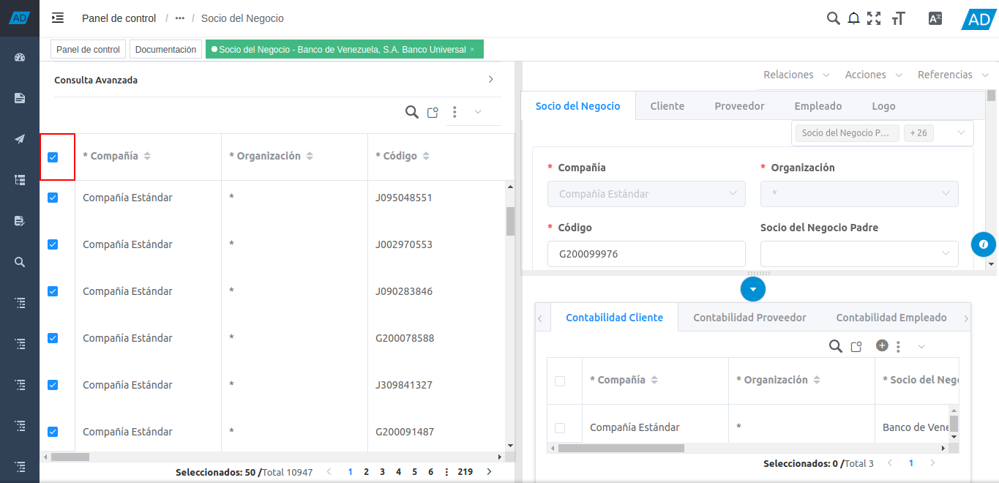
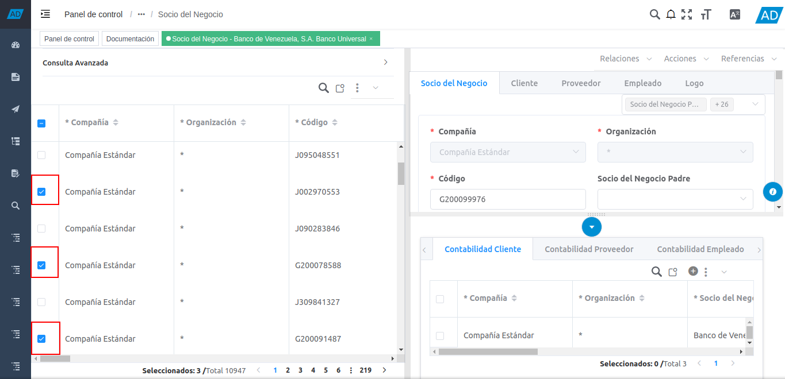
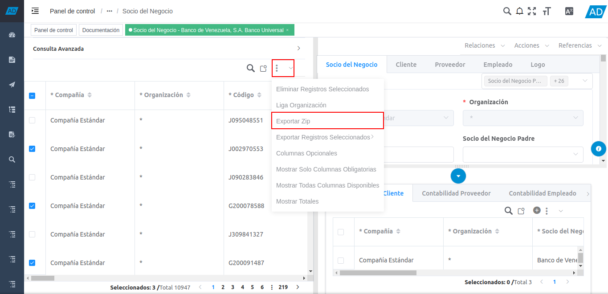

.. |menú del directorio de socios del negocio| image:: resources/business-partner-directory-menu.png
.. |carpeta reglas de socios del negocio| image:: resources/business-partner-rules-folder.png

.. |icono menor que de la ventana socio del negocio| image:: resources/business-partner-window-less-than-icon.png
.. |panel de consulta avanzada del socio del negocio| image:: resources/advanced-business-partner-inquiry-panel.png

.. |icono opciones y opción zip para todos los registros| image:: resources/icon-options-and-zip-option-for-all-records.png

.. _documento/exportación-de-registros:

**Exportación de Registros de Socios del Negocio**
==================================================

#. Ubique y seleccione en el menú de ADempiere, la carpeta "**Relación con Socios del Negocio**", luego seleccione la carpeta "**Reglas de Socios del Negocio**".

    |menú del directorio de socios del negocio|

    Imagen 1. Menú de ADempiere

#. Podrá visualizar la carpeta "**Reglas de Socios del Negocio**", con diferentes ventanas, procesos y reportes.

    |carpeta reglas de socios del negocio|

    Imagen 2. Carpeta Reglas de Socios del Negocio

#. Seleccione la ventana "**Socios del Negocio**", para exportar los registros de los socios del negocio en base a lo requerido.

    |selección de ventana socios del negocio|

    Imagen 3. Selección de Ventana Socios del Negocio

#. Podrá visualizar la ventana "**Socio del Negocio**", con los registros de socios del negocio.

    |ventana socios del negocio|

    Imagen 4. Ventana Socios del Negocio

#. Posicione el cursor del lado izquierdo de la ventana, sin que el mismo toque la barra del menú de ADempiere. Luego seleccione el icono "**>**", para mostrar el panel de consulta avanzada.

    |icono menor que de la ventana socio del negocio|

    Imagen 5. Icono >

#. Podrá visualizar el panel de consulta avanzada con el campo "**Buscar**", el icono "**Opciones**" y la tabla de visualización de registros de socios del negocio.

    |panel de consulta avanzada del socio del negocio|

    Imagen 6. Panel de Consulta Avanzada del Socio del Negocio

#. Para exportar todos registros de socios del negocio de la página en la que se encuentra ubicado, tilde el check que se encuentra del lado izquierdo del campo "**Compañía**", para seleccionar todos los registros de dicha página.

    |tildar todos los socios|

    Imagen 7. Check para seleccionar todos los registros

    #. Posicione el cursor sobre el icono "**Opciones**" y luego seleccione la opción "**Exportar Zip**".

        |icono opciones y opción zip para todos los registros|

        Imagen 8. Icono Opciones y Opción Zip

#. Para exportar algunos registros de socios del negocio que se encuentran en ADempiere, tilde el check de cada uno de los registros que requiere exportar.

    |tildar algunos socios|

    Imagen 9. Check de algunos registros

    #. Posicione el cursor sobre el icono "**Opciones**" y luego seleccione la opción "**Exportar Zip**".

        |icono opciones y opción zip|

        Imagen 10. Icono Opciones y Opción Zip