.. |menú tipo de boleto| image:: resources/ticket-type-menu.png
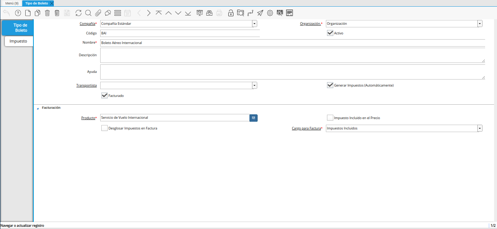
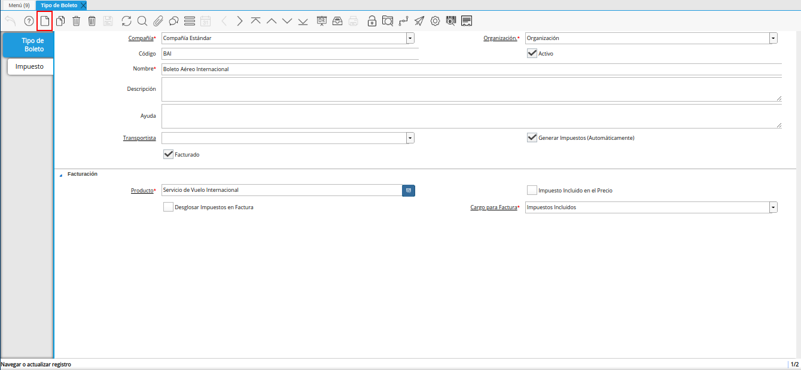
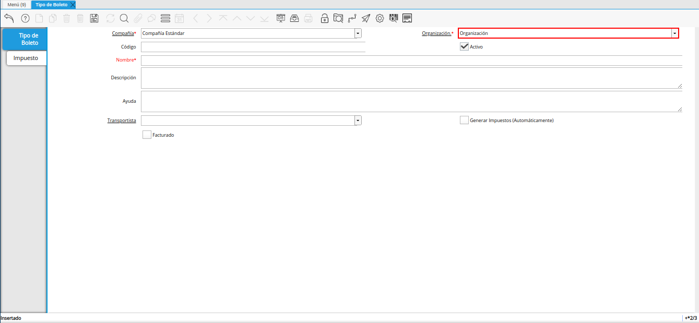
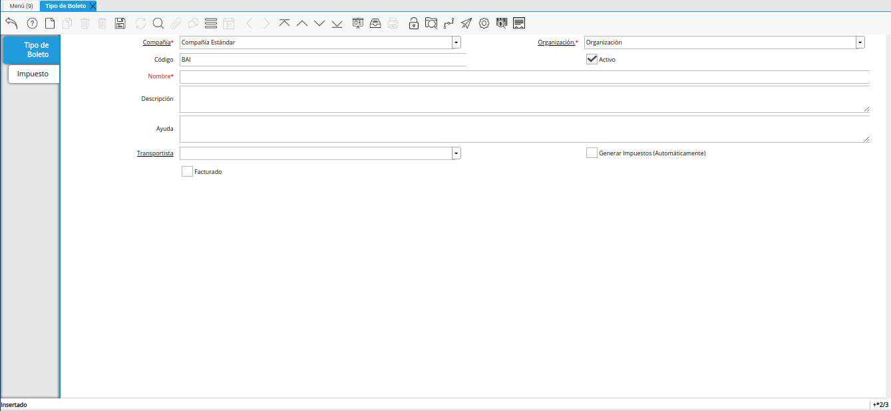
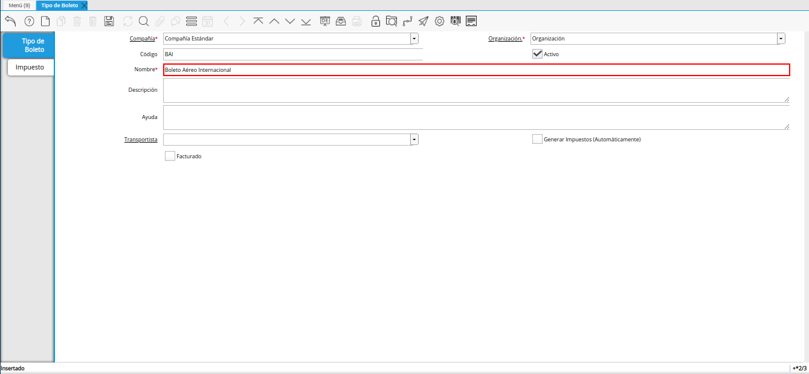
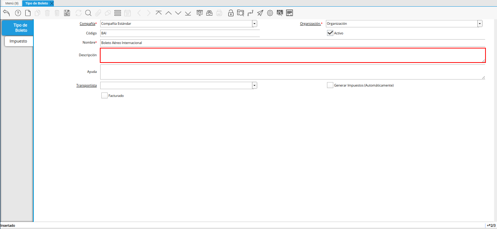
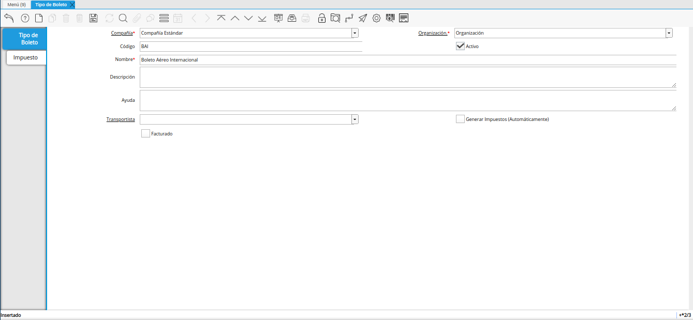

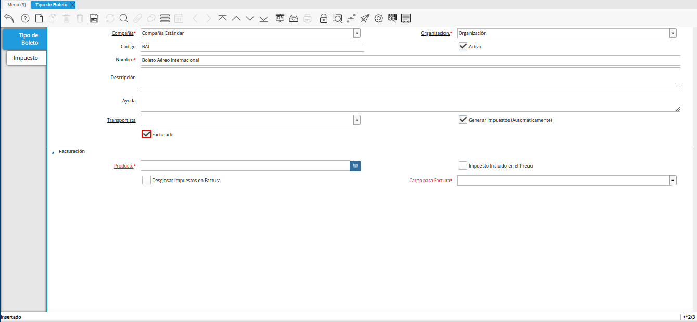
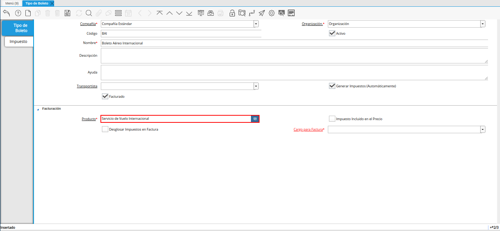
.. |check impuesto incluido en el precio de la ventana tipo de boleto| image:: resources/check-tax-included-in-the-price-of-the-window-type-of-ticket.png
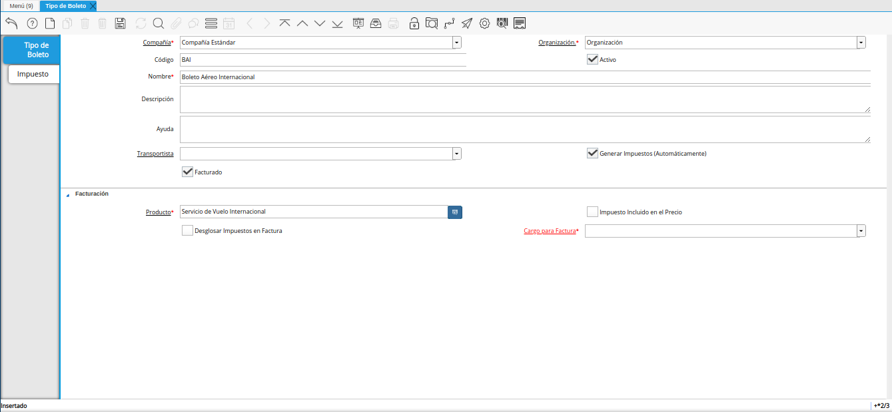
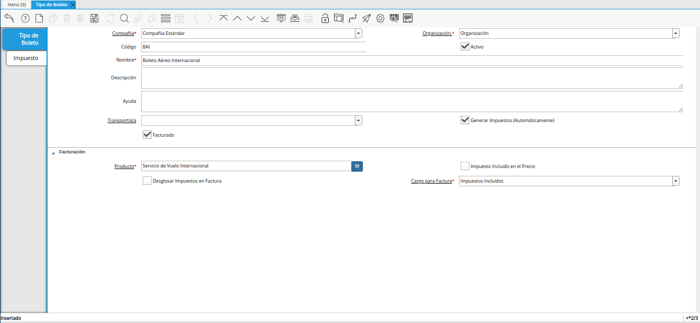
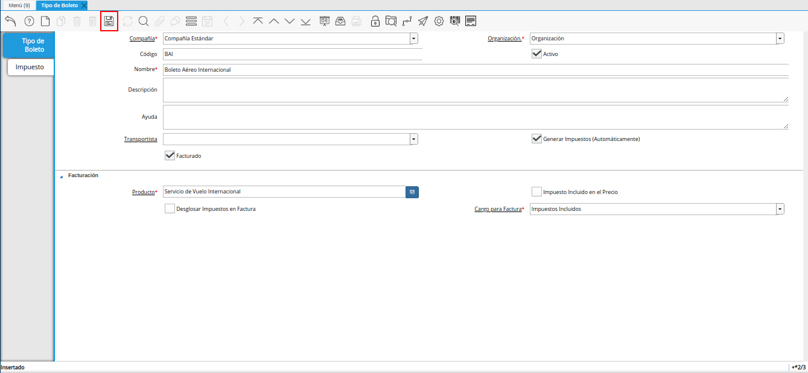
.. |pestaña impuesto de la ventana tipo de boleto| image:: resources/tax-tab-of-the-ticket-type-window.png
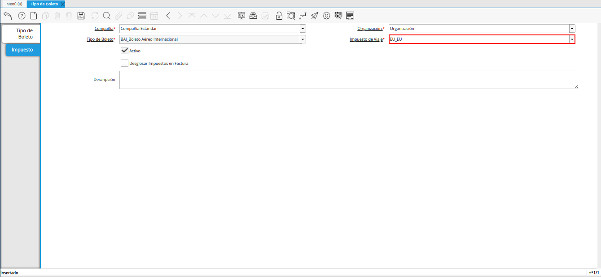
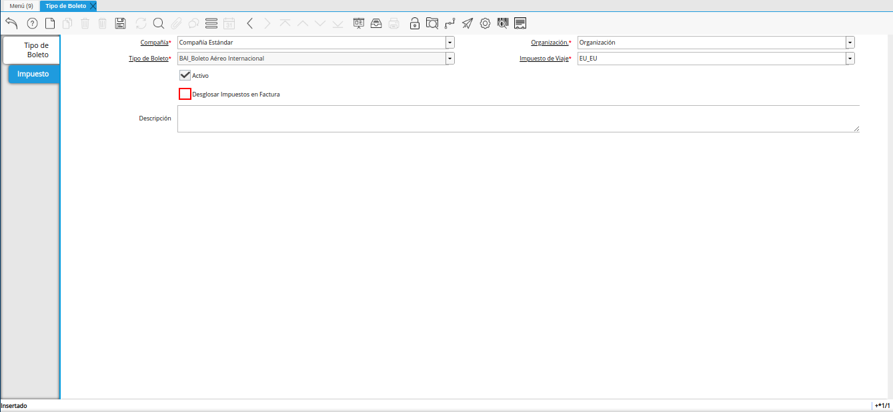
.. |campo descripción de la pestaña impuesto de la ventana tipo de boleto| image:: resources/description-field-of-the-tax-tab-of-the-ticket-type-window.png
.. |icono guardar cambios de la pestaña impuesto| image:: resources/save-changes-icon-of-the-tax-tab.png

.. _documento/tipo-de-boleto:

**Registro de Tipo de Boleto**
==============================

#. Ubique y seleccione en el menú de ADempiere, la carpeta "**Administración de Agencia de Viajes**", luego seleccione la carpeta "**Configuración de Viaje**", por último seleccione la ventana "**Tipo de Boleto**".

    |menú tipo de boleto|

    Imagen 1. Menú de ADempiere

#. Podrá visualizar la ventana "**Tipo de Boleto**", con todos los registros de tipos de boletos.

    |ventana tipo de boleto|

    Imagen 2. Ventana Tipo de Boleto

#. Seleccione el icono "**Registro Nuevo**", y proceda al llenado de los campos correspondientes.

    |icono registro nuevo de la ventana tipo de boleto|

    Imagen 3. Icono Registro Nuevo 

#. Seleccione en el campo "**Organización**", la organización para la cual se encuentra realizando el registro.

    |campo organización de la ventana tipo de boleto|

    Imagen 4. Campo Organización

#. Introduzca en el campo "**Código**", el código correspondiente al registro que se encuentra realizando.

    Si no es ingresado ningún valor en este campo, al guardar el registro ADempiere asigna el número de secuencia correspondiente, según la secuencia configurada para el registro.

    |campo código de la ventana tipo de boleto|

    Imagen 5. Campo Código

#. Introduzca en el campo "**Nombre**", el nombre correspondiente al registro que se encuentra realizando.

    |campo nombre de la ventana tipo de boleto|

    Imagen 6. Campo Nombre

#. Introduzca en el campo "**Descripción**", una breve descripción del registro que se encuentra realizando.

    |campo descripción de la ventana tipo de boleto|

    Imagen 7. Campo Descripción

#. Seleccione en el campo "**Transportista**", el transportista correspondiente al registro que se encuentra realizando.

    .. note::
    
        Puede consultar el material :ref:`documento/transportista`, para conocer dicho procedimiento.

    |campo transportista de la ventana tipo de boleto|

    Imagen 8. Campo Transportista

#. El check "**Generar Impuestos (Automáticamente)**", permite generar los impuestos del boleto de manera automática al guardar el registro de dicho boleto, basandose en los impuestos configurados en el tipo de boleto.

    |check generar impuestos automáticamente de la ventana tipo de boleto|

    Imagen 9. Check Generar Impuestos (Automáticamente)

#. El check "**Facturado**", permite crear facturas de los diferentes boletos realizados.

    |check facturado de la ventana tipo de boleto|

    Imagen 10. Check Facturado

#. Seleccione en el campo "**Producto**", el producto correspondiente al registro que se encuentra realizando.

    |campo producto de la ventana tipo de boleto|

    Imagen 11. Campo Producto

#. Tilde el check "**Impuesto Incluido en el Precio**", para incluir los totales de impuestos en el precio.

    |check impuesto incluido en el precio de la ventana tipo de boleto|

    Imagen 12. Check Impuesto Incluido en el Precio

#. Tilde el check "**Desglosar Impuestos en Factura**", para desglosar en la factura, todos los impuestos del boleto.

    |check desglosar impuestos en factura de la ventana tipo de boleto|

    Imagen 13. Check Desglosar Impuestos en Factura

#. Seleccione en el campo "**Cargo para Factura**", el cargo correspondiente al registro que se encuentra realizando.

    |campo cargo para factura de la ventana tipo de boleto|

    Imagen 14. Campo Cargo para Factura

#. Seleccione el icono "**Guardar Cambios**", para guardar el registro de los campos de la ventana "**Tipo de Boleto**".

    |icono guardar cambios de la ventana tipo de boleto|

    Imagen 15. Icono Guardar Cambios

#. Seleccione la pestaña "**Impuesto**" y proceda al llenado de los campos correspondientes.

    |pestaña impuesto de la ventana tipo de boleto|

    Imagen 16. Pestaña Impuesto

#. Seleccione en el campo "**Impuesto de Viaje**", el impuesto o tasa de viaje a aplicar.

    |campo impuesto de viaje de la ventana tipo de boleto|

    Imagen 17. Campo Impuesto de viaje

#. Tilde el check "**Desglosar Impuestos en Factura**", para desglosar en la factura el impuesto que se encuentra registrando en el tipo de boleto.

    |check desglosar impuestos en factura de la pestaña impuesto de la ventana tipo de boleto|

    Imagen 18. Check Desglosar Impuestos en Factura

#. Introduzca en el campo "**Descripción**", una breve descripción del registro que se encuentra realizando.

    |campo descripción de la pestaña impuesto de la ventana tipo de boleto|

    Imagen 19. Campo Descripción

#. Seleccione el icono "**Guardar Cambios**", ubicado en la barra de herramientas de ADempiere.

    |icono guardar cambios de la pestaña impuesto|

    Imagen 20. Icono Guardar Cambios