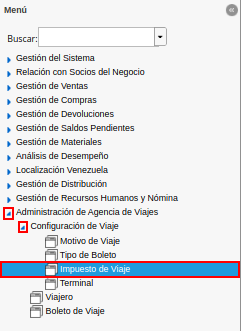
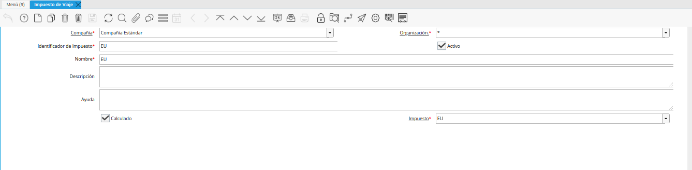

.. |icono registro nuevo de la ventana impuesto de viaje| image:: resources/travel-tax-window-new-registration-icon.png
.. |campo organización de la ventana impuesto de viaje| image:: resources/travel-tax-window-organization-field.png
.. |campo identificador de impuesto de la ventana impuesto de viaje| image:: resources/tax-id-field-of-the-travel-tax-window.png
.. |campo nombre de la ventana impuesto de viaje| image:: resources/window-name-field-travel-tax.png
.. |campo descripción de la ventana impuesto de viaje| image:: resources/travel-tax-window-description-field.png
.. |check calculado de la ventana impuesto de viaje| image:: resources/check-calculated-from-the-travel-tax-window.png
.. |campo impuesto de la ventana impuesto de viaje| image:: resources/tax-field-of-the-travel-tax-window.png
.. |icono guardar cambios de la ventana impuesto de viaje| image:: resources/icon-save-changes-of-the-travel-tax-window.png

.. _documento/impuesto-de-viaje:

**Registreo de Impuesto de Viaje**
==================================

#. Ubique y seleccione en el menú de ADempiere, la carpeta "**Administración de Agencia de Viajes**", luego seleccione la carpeta "**Configuración de Viaje**", por último seleccione la ventana "**Impuesto de Viaje**".

    |menú impuesto de viaje|

    Imagen 1. Menú de ADempiere

#. Podrá visualizar la ventana "**Impuesto de Viaje**" con todos los rgistro de impuestos.

    |ventana impuestos de viaje|

    Imagen 2. Ventana Impuestos de Viaje

#. Seleccione el icono "**Registro Nuevo**", ubicado en la barra de herramientas de ADempiere y proceda al llenado de los campos correspondientes.

    |icono registro nuevo de la ventana impuesto de viaje|

    Imagen 3. Icono Registro Nuevo

#. Seleccione en el campo "**Organización**", la organización para la cual se encuentra realizando el registro.

    |campo organización de la ventana impuesto de viaje|

    Imagen 4. Campo Organización

#. Introduzca en el campo "**Identificador de Impuesto**", el nombre corto que se imprimirá en un documento haciendo referencia a este impuesto.

    |campo identificador de impuesto de la ventana impuesto de viaje|

    Imagen 5. Campo Identificador de Impuestos

#. Introduzca en el campo "**Nombre**", el nombre del impuesto que se encuentra registrando.

    |campo nombre de la ventana impuesto de viaje|

    Imagen 6. Campo Nombre 

#. Introduzca en el campo "**Descripción**", una breve descripción referente al registro que se encuentra realizando.

    |campo descripción de la ventana impuesto de viaje|

    Imagen 7. Campo Descripción

#. Tilde el check "**Calculado**", para indicar que el impuesto será calculado por ADempiere

    |check calculado de la ventana impuesto de viaje|

    Imagen 8. Check Calculado

    #. Al tildar el check, se habilita el campo "**Impuesto**", donde se debe seleccionar el tipo de impuesto para calcular.

        |campo impuesto de la ventana impuesto de viaje|

        Imagen 9. Campo Impuesto

#. Seleccione el icono "**Guardar Cambios**", ubicado en la barra de herramientas de ADempiere para guardar el registro de los campos de la ventana "**Impuesto de Viaje**".

    |icono guardar cambios de la ventana impuesto de viaje|

    Imagen 10. Icono Guardar Cambios