.. |menú de ventana viajero| image:: resources/traveler-window-menu.png
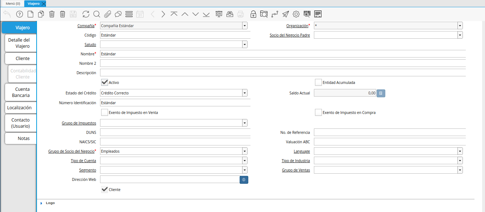
.. |icono registro nuevo de la ventana viajero| image:: resources/new-registration-icon-of-the-traveler-window.png
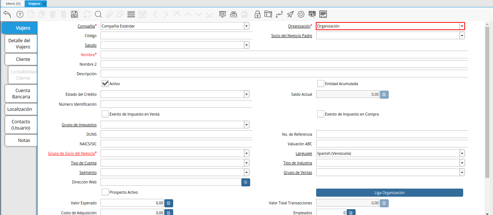
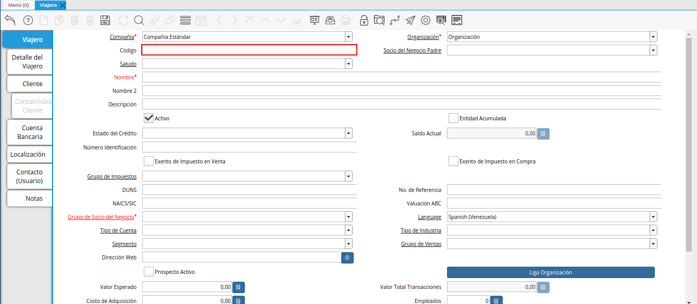
.. |campo socio del negocio padre de la ventana viajero| image:: resources/business-partner-field-parent-window-traveler.png
.. |campo nombre de la ventana viajero| image:: resources/traveler-window-name-field.png
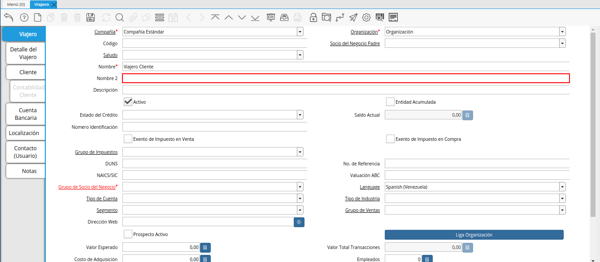
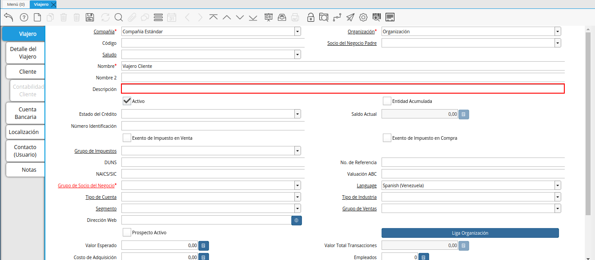
.. |check entidad acumulada de la ventana viajero| image:: resources/check-accumulated-entity-of-the-traveler-window.png
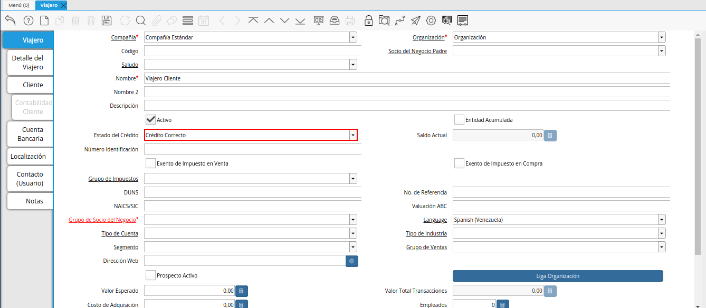
.. |campo saldo actual de la ventana viajero| image:: resources/current-balance-field-of-the-traveler-window.png
.. |campo número identificación de la ventana viajero| image:: resources/traveler-window-identification-number-field.png
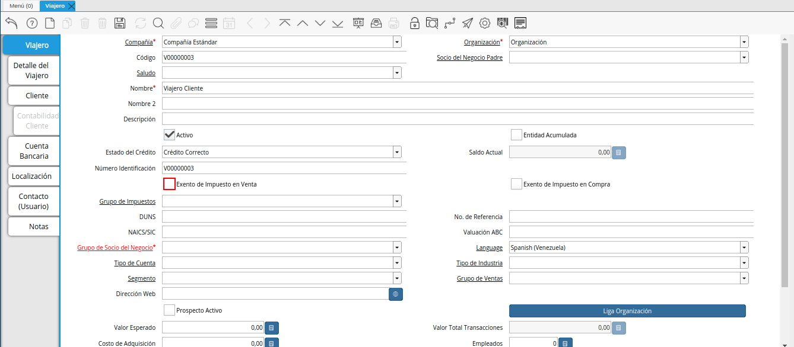
.. |check exento de impuesto en compra de la ventana viajero| image:: resources/check-tax-exempt-on-purchase-of-the-traveler-window.png
.. |campo grupo de impuestos de la ventana viajero| image:: resources/traveler-window-tax-group-field.png
.. |campo duns de la ventana viajero| image:: resources/duns-field-of-traveler-window.png
.. |campo número de referencia de la ventana viajero| image:: resources/traveler-window-reference-number-field.png
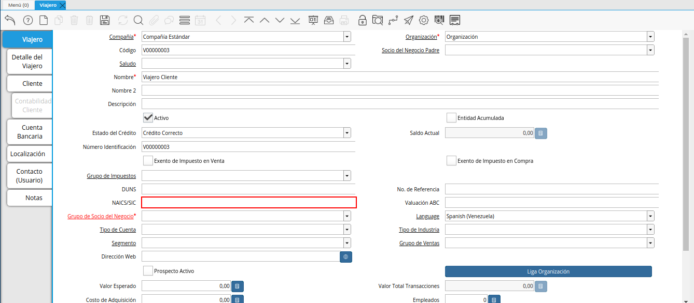
.. |campo valuación abc de la ventana viajero| image:: resources/abc-valuation-field-of-the-traveler-window.png
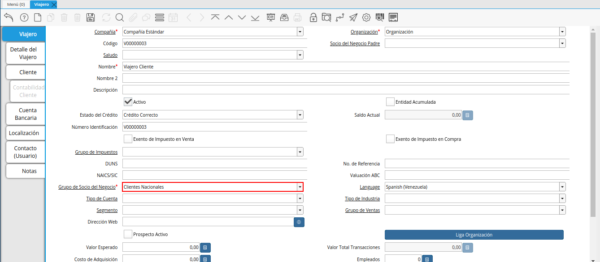
.. |campo idioma de la ventana viajero| image:: resources/language-field-of-the-traveler-window.png
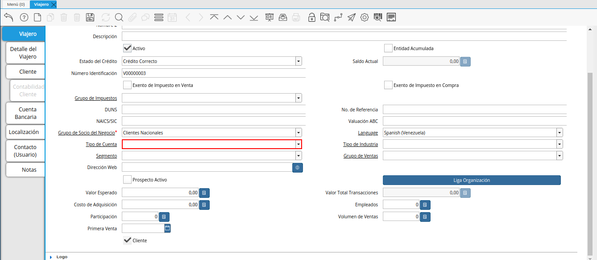
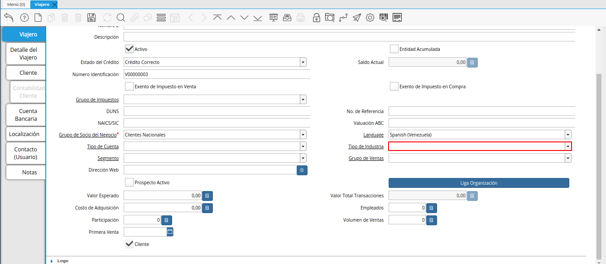
.. |campo segmento de la ventana viajero| image:: resources/traveler-window-segment-field.png
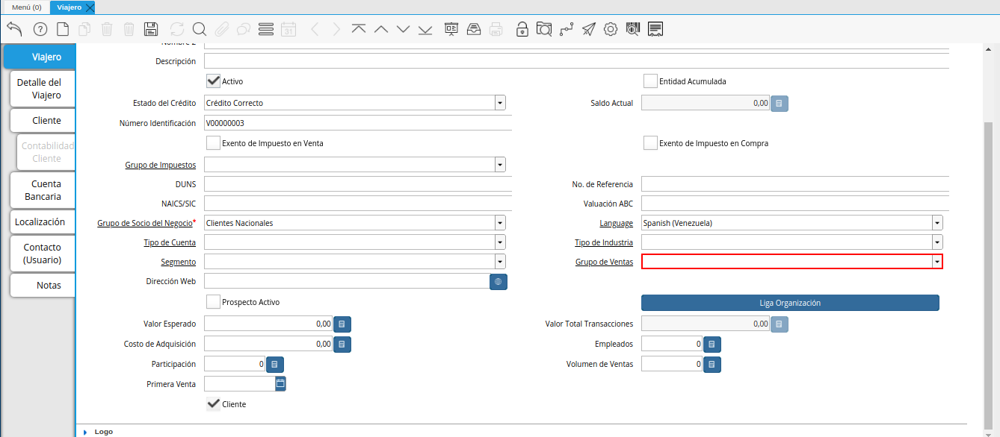
.. |campo dirección web de la ventana viajero| image:: resources/web-address-field-of-the-traveler-window.png
.. |check prospecto activo de la ventana viajero| image:: resources/check-active-prospect-of-the-traveler-window.png
.. |check cliente de la ventana viajero| image:: resources/check-traveler-window-client.png
.. |icono guardar cambios de la pestaña principal viajero| image:: resources/icon-save-changes-of-the-main-traveler-tab.png
.. |pestaña detalle del viajero de la ventana viajero| image:: resources/traveler-detail-tab-of-the-traveler-window.png
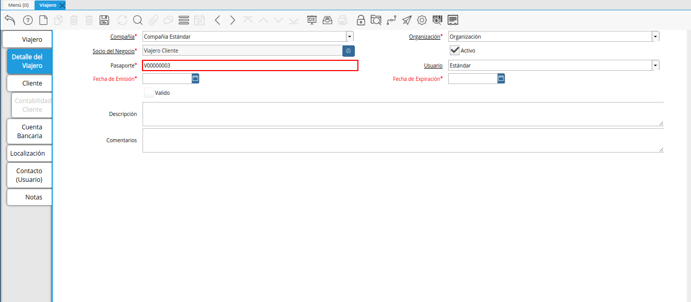
.. |campo usuario de la pestaña detalle del viajero| image:: resources/user-field-of-the-traveler-detail-tab.png
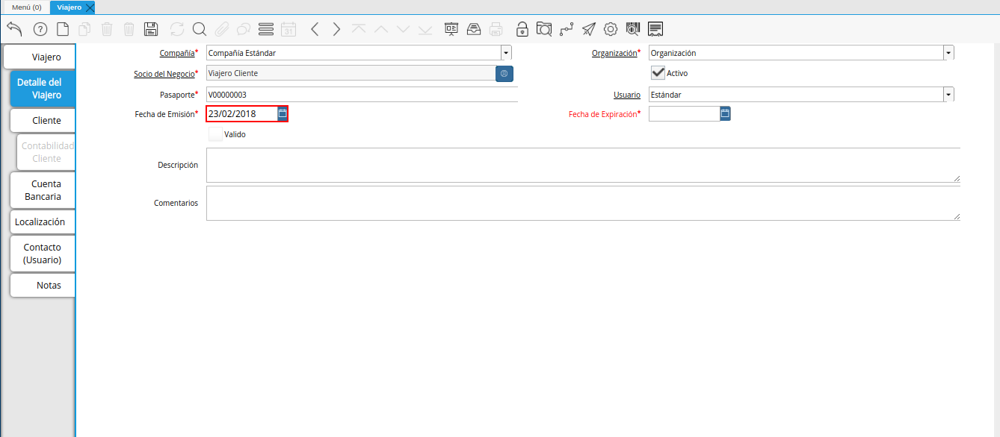
.. |campo fecha de expiración de la pestaña detalle del viajero| image:: resources/expiration-date-field-of-the-traveler-detail-tab.png
.. |campo descripción de la pestaña detalle del viajero| image:: resources/description-field-of-the-traveler-detail-tab.png
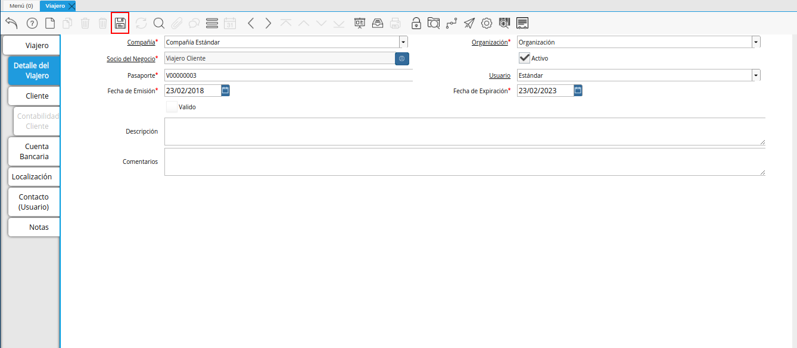
.. |pestaña cliente de la ventana viajero| image:: resources/customer-tab-of-the-traveler-window.png
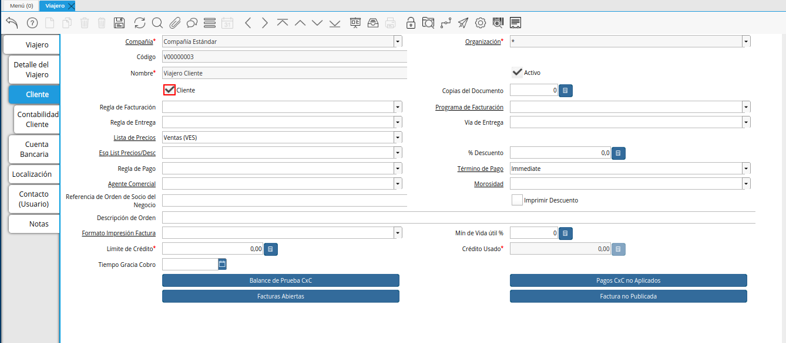
.. |campo copias del documento de la pestaña cliente| image:: resources/document-copies-field-of-the-customer-tab.png
.. |campo regla de facturación de la pestaña cliente| image:: resources/billing-rule-field-of-the-customer-tab.png
.. |campo programa de facturación de la pestaña cliente| image:: resources/billing-schedule-field-of-the-customer-tab.png
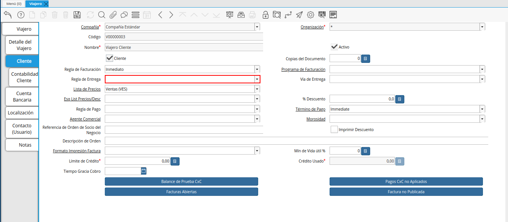
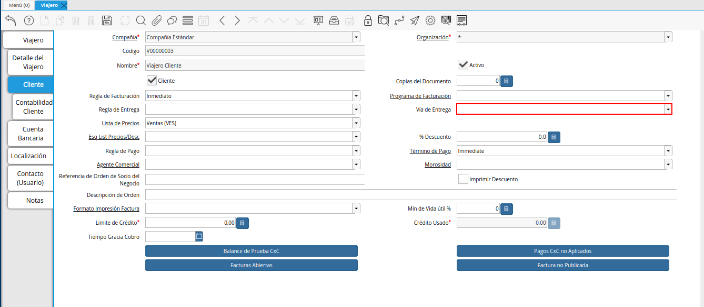
.. |campo lista de precios de la pestaña cliente| image:: resources/price-list-field-of-the-customer-tab.png
.. |campo esquema de lista de precios de descuento de la pestaña cliente| image:: resources/discount-price-list-schema-field-of-customer-tab.png
.. |campo porcentaje de descuento de la pestaña cliente| image:: resources/discount-percentage-field-of-the-customer-tab.png
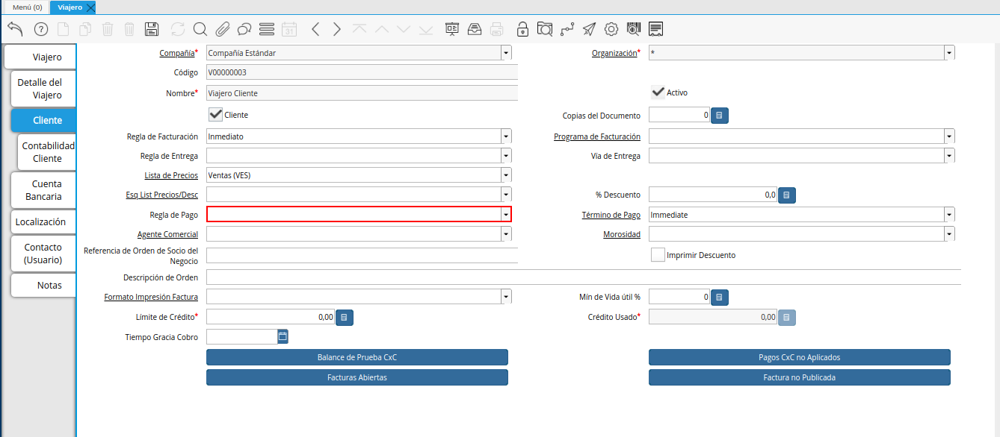
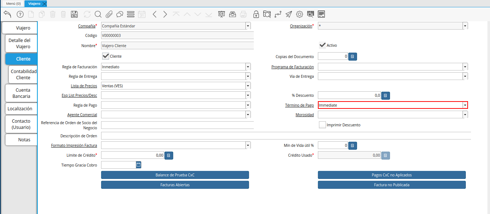
.. |campo agente comercial de la pestaña cliente| image:: resources/commercial-agent-field-of-the-customer-tab.png
.. |campo morosidad de la pestaña cliente| image:: resources/delinquency-field-of-the-customer-tab.png
.. |campo referencia de orden de socio del negocio de la pestaña cliente| image:: resources/business-partner-order-reference-field-of-the-customer-tab.png

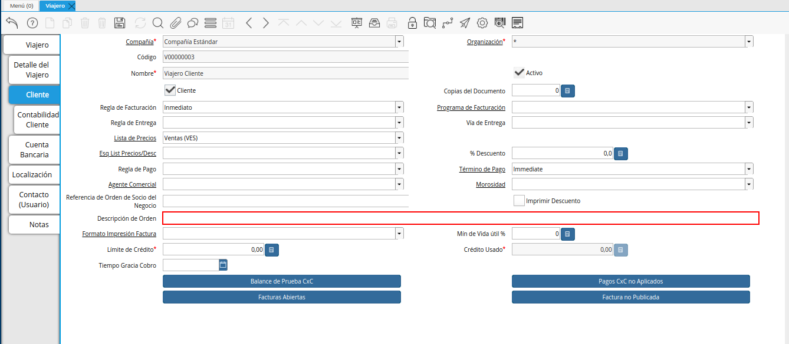
.. |campo formato de impresión factura de la pestaña cliente| image:: resources/invoice-print-format-field-of-the-customer-tab.png
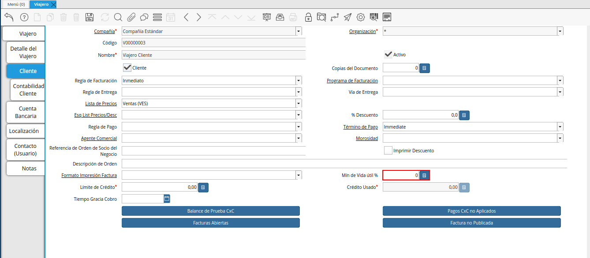
.. |campo límite de crédito de la pestaña cliente| image:: resources/credit-limit-field-of-the-customer-tab.png
.. |campo crédito usado de la pestaña cliente| image:: resources/credit-field-used-from-the-customer-tab.png

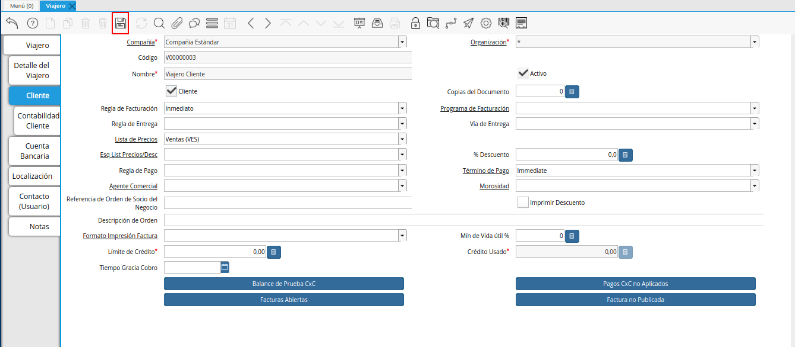

.. _documento/paso-registro-de-viajero:

**Registro de Viajero**
-----------------------

#. Ubique y seleccione en el menú de ADempiere, la carpeta "**Administración de Agencia de Viajes**", luego seleccione la ventana "**Viajero**".

    |menú de ventana viajero|

    Imagen 1. Menú de ADempiere

#. Podrá visualizar la ventana "**Viajero**", con todos los registros de los socios del negocio que cumplen con el rol de cliente viajero. La información ingresada en esta ventana es visualizada en la ventana "**Socio del Negocio**" y viceversa.

    |ventana viajero|

    Imagen 2. Ventana Viajero

#. Seleccione el icono "**Registro Nuevo**", ubicado en la barra de herramientas de ADempiere y proceda al llenado de los campos correspondientes. 

    |icono registro nuevo de la ventana viajero|

    Imagen 3. Icono Registro Nuevo

#. Seleccione en el campo "**Organización**", la organización para la cual se encuentra realizando el registro del socio del negocio cliente viajero.

    |campo organización de la ventana viajero|

    Imagen 4. Campo Organización

#. Introduzca en el campo "**Código**", el código del cliente viajero que se encuentra registrando. El mismo no debe contener guiones (-), ni puntos (.).

    .. note::

        Si no es ingresado ningún valor en este campo, al guardar el registro ADempiere asigna de manera automática un código según la secuencia de registros que se tenga en el momento. La información de este campo, es cargada de manera automática en el campo "**Número Identificación**" o viceversa.

    |campo código de la ventana viajero|

    Imagen 5. Campo Código

#. Seleccione en el campo "**Socio del Negocio Padre**", el socio del negocio padre del cliente viajero que se encuentra registrando. 

    |campo socio del negocio padre de la ventana viajero|

    Imagen 6. Campo Socio del Negocio Padre

#. Introduzca en el campo "**Nombre**", el nombre del cliente viajero que se encuentra registrando.

    |campo nombre de la ventana viajero|

    Imagen 7. Campo Nombre 

#. Introduzca en el campo "**Nombre 2**", el nombre dos (2) del cliente viajero que se encuentra registrando.

    |campo nombre dos de la ventana viajero|

    Imagen 8. Campo Nombre 2

#. Introduzca en el campo "**Descripción**", una breve descripción del registro que se encuentra registrando.

    |campo descripción de la ventana viajero|

    Imagen 9. Campo Descripción

#. Tilde el check "**Entidad Acumulada**", para indicar como entidad acumulada el registro que se encuentra realizando.

    |check entidad acumulada de la ventana viajero|

    Imagen 10. Check Entidad Acumulada

#. Seleccione en el campo "**Estado de Crédito**", el estado de crédito del registro que se encuentra realizando.

    |campo estado de crédito de la ventana viajero|

    Imagen 11. Campo Estado de Crédito

#. En el campo "**Saldo Actual**", podrá visualizar el saldo actual del registro que se encuentra realizando.

    |campo saldo actual de la ventana viajero|

    Imagen 12. Campo Saldo Actual 

#. En el campo "**Número Identificación**", podrá visualizar la información ingresada en el campo "**Código**" o viceversa. El mismo no debe contener guiones (-), ni puntos (.).

    |campo número identificación de la ventana viajero|

    Imagen 13. Campo Número Identificación

#. Tilde el check "**Exento de Impuesto en Venta**", para indicar como exento de impuesto en venta el registro que se encuentra realizando.

    |check exento de impuesto en venta de la ventana viajero|

    Imagen 14. Check Exento de Impuesto en Venta

#. Tilde el check "**Exento de Impuesto en Compra**", para indicar como exento de impuesto en compra el registro que se encuentra realizando.

    |check exento de impuesto en compra de la ventana viajero|

    Imagen 15. Check Exento de Impuesto en Compra

#. Seleccione en el campo "**Grupo de Impuestos**", el grupo de impuestos para el registro que se encuentra realizando.

    |campo grupo de impuestos de la ventana viajero|

    Imagen 16. Campo Grupo de Impuestos

#. Introduzca en el campo "**DUNS**", el DUNS del registro que se encuentra realizando.

    |campo duns de la ventana viajero|

    Imagen 17. Campo DUNS

#. Introduzca en el campo "**No. de Referencia**", el número de referencia para el registro que se encuentra realizando.

    |campo número de referencia de la ventana viajero|

    Imagen 18. Campo No. de Referencia

#. Introduzca en el campo "**NAICS/SIC**", el NAICS/SIC del registro que se encuentra realizando.

    |campo naics sic de la ventana viajero|

    Imagen 19. Campo NAICS/SIC

#. Introduzca en el campo "**Valuación ABC**", la valuación abc del registro que se encuentra realizando.

    |campo valuación abc de la ventana viajero|

    Imagen 20. Campo Valuación ABC

#. Seleccione en el campo "**Grupo de Socio del Negocio**", el grupo de socio del negocio al que pertene el cliente viajero que se encuentra registrando.

    |campo grupo de socio del negocio de la ventana viajero|

    Imagen 21. Campo Grupo de Socio del Negocio

#. Seleccione en el campo "**Idioma**", el idioma para el registro que se encuentra realizando.

    |campo idioma de la ventana viajero|

    Imagen 22. Campo Idioma 

#. Seleccione en el campo "**Tipo de Cuenta**", el tipo de cuenta para el registro que se encuentra realizando.

    |campo tipo de cuenta de la ventana viajero|

    Imagen 23. Campo Tipo de Cuenta

#. Seleccione en el campo "**Tipo de Industria**", el tipo de industria para el registro que se encuentra realizando.

    |campo tipo de industria de la ventana viajero|

    Imagen 24. Campo Tipo de Industria

#. Seleccione en el campo "**Segmento**", el segmento para el registro que se encuentra realizando.

    |campo segmento de la ventana viajero|

    Imagen 25. Campo Segmento

#. Seleccione en el campo "**Grupo de Ventas**", el grupo de ventas para el registro que se encuentra realizando.

    |campo grupo de ventas de la ventana viajero|

    Imagen 26. Campo Grupo de Ventas

#. Introduzca en el campo "**Dirección Web**", la dirección web del registro que se encuentra realizando.

    |campo dirección web de la ventana viajero|

    Imagen 27. Campo Dirección Web 

#. Tilde el check "**Prospecto Activo**", para indicar como prospecto activo el registro que se encuentra realizando.

    |check prospecto activo de la ventana viajero|

    Imagen 28. Check Prospecto Activo

#. El check "**Cliente**" se encuentra tildado por defecto, indicando como cliente el registro que se encuentra realizando.

    |check cliente de la ventana viajero|

    Imagen 29. Check Cliente

#. Seleccione el icono "**Guardar Cambios**", ubicado en la barra de herramientas de ADempiere para guardar el registro de los campos de la pestaña principal "**Viajero**".

    |icono guardar cambios de la pestaña principal viajero|

    Imagen 30. Icono Guardar

#. Seleccione la pestaña "**Detalle del Viajero**" y proceda al llenado de los campos correspondientes.

    |pestaña detalle del viajero de la ventana viajero|

    Imagen 31. Pestaña Detalle del Viajero

    .. note::

        En esta pestaña se agrega la información de referente al pasaporte del viajero y los datos fiscales del pasaporte.

#. Introduzca en el campo "**Pasaporte**", el pasaporte del cliente viajero que se encuentra registrando.

    |campo pasaporte de la pestaña detalle del viajero|

    Imagen 32. Campo Pasaporte

#. En el campo "**Usuario**", podrá visualizar el usuario que se encuentra realizando el registro del cliente viajero.

    |campo usuario de la pestaña detalle del viajero|

    Imagen 33. Campo Usuario

#. Seleccione en el campo "**Fecha de Emisión**", la fecha de emisión del pasaporte ingresado en el campo "**Pasaporte**".

    |campo fecha de emisión de la pestaña detalle del viajero|

    Imagen 34. Campo Fecha de Emisión

#. Seleccione en el campo "**Fecha de Expiración**", la fecha de expiración del pasaporte ingresado en el campo "**Pasaporte**".

    |campo fecha de expiración de la pestaña detalle del viajero|

    Imagen 35. Campo Fecha de Expiración 

#. Introduzca en el campo "**Descripción**", una breve descripción referente al registro que se encuentra realizando.

    |campo descripción de la pestaña detalle del viajero|

    Imagen 36. Campo Descripción

#. Seleccione el icono "**Guardar Cambios**", ubicado en la barra de herramientas de ADempiere para guardar el registro de los campos de la pestaña "**Detalle del Viajero**".

    |icono guardar cambios de la pestaña detalle del viajero|

    Imagen 37. Icono Guardar Cambios

#. Seleccione la pestaña "**Cliente**" y proceda al llenado de los campos correspondientes.

    |pestaña cliente de la ventana viajero|

    Imagen 38. Pestaña Cliente

#. Tilde el check "**Cliente**", para indicar que se esta realizando el registro de un cliente.

    |check cliente de la pestaña cliente|

    Imagen 39. Check Cliente

#. Introduzca en el campo "**Copias del Documento**", el número de copias a ser impresas.

    |campo copias del documento de la pestaña cliente|

    Imagen 40. Campo Copias del Documento

#. Seleccione en el campo "**Regla de Facturación**", la regla de facturación para el registro que se encuentra realizando.

    |campo regla de facturación de la pestaña cliente|

    Imagen 41. Campo Regla de Facturación

#. Seleccione en el campo "**Programa de Facturación**", el programa de facturación para el registro que se encuentra realizando.

    |campo programa de facturación de la pestaña cliente|

    Imagen 42. Campo Programa de Facturación

#. Seleccione en el campo "**Regla de Entrega**", la regla de entrega para el registro que se encuentra realizando.

    |campo regla de entrega de la pestaña cliente|

    Imagen 43. Campo Regla de Entrega

#. Seleccione en el campo "**Vía de Entrega**", la vía de entrega para el registro que se encuentra realizando.

    |campo vía de entrega de la pestaña cliente|

    Imagen 44. Campo Vía de Entrega

#. Seleccione en el campo "**Lista de Precios**", la lista de precios para el registro que se encuentra realizando.

    |campo lista de precios de la pestaña cliente|

    Imagen 45. Campo Lista de Precios

#. Seleccione en el campo "**Esq List Precios/Desc**", el esquema de lista de precios de descuento para el registro que se encuentra realizando.

    |campo esquema de lista de precios de descuento de la pestaña cliente|

    Imagen 46. Campo Esq List Precios/Desc

#. Introduzca en el campo "**% Descuento**", el porcentaje (%) de descuento para el registro que se encuentra realizando.

    |campo porcentaje de descuento de la pestaña cliente|

    Imagen 47. Campo Porcentaje de Descuento

#. Seleccione en el campo "**Regla de Pago**", la regla de pago para el registro que se encuentra realizando.

    |campo regla de pago de la pestaña cliente|

    Imagen 48. Campo Regla de Pago

#. Seleccione en el campo "**Término de Pago**", el término de pago para el registro que se encuentra realizando.

    |campo término de pago de la pestaña cliente|

    Imagen 49. Campo Término de Pago

#. Seleccione en el campo "**Agente Comercial**", el agente comercial para el registro que se encuentra realizando.

    |campo agente comercial de la pestaña cliente|

    Imagen 50. Campo Agente Comercial 

#. Seleccione en el campo "**Morosidad**", la morosidad para el registro que se encuentra realizando.

    |campo morosidad de la pestaña cliente|

    Imagen 51. Campo Morosidad

#. Introduzca en el campo "**Referencia de Orden de Socio del Negocio**", la referencia de orden de socio del negocio para el registro que se encuentra realizando.

    |campo referencia de orden de socio del negocio de la pestaña cliente|

    Imagen 52. Campo Referencia de Orden de Socio del Negocio

#. Tilde el check "**Imprimir Descuento**", para imprimir el descuento en la factura y la orden.

    |check imprimir descuento de la pestaña cliente|

    Imagen 53. Check Imprimir Descuento

#. Introduzca en el campo "**Descripción de Orden**", una breve descripción de orden del registro que se encuentra realizando.

    |campo descripción de orden de la pestaña cliente|

    Imagen 54. Campo Descripción de Orden

#. Seleccione en el campo "**Formato Impresión Factura**", el formato de impresión de factura para el registro que se encuentra realizando.

    |campo formato de impresión factura de la pestaña cliente|

    Imagen 55. Campo Formato Impresión Factura

#. Introduzca en el campo "**Mín de Vida útil %**", tiempo mínimo de vida útil que tienen los productos.

    |campo mínimo de vida útil porcentaje de la pestaña cliente|

    Imagen 56. Campo Mínimo de Vida útil %

#. Introduzca en el campo "**Límite de Crédito**", el límite de crédito establecido para el registro que se encuentra realizando.

    |campo límite de crédito de la pestaña cliente|

    Imagen 57. Campo Límite de Crédito

#. Podrá visualizar en el campo "**Crédito Usado**", el crédito usado por el registro que se encuentra realizando.

    |campo crédito usado de la pestaña cliente|

    Imagen 58. Campo Crédito Usado

#. Introduzca en el campo "**Tiempo Gracia Cobro**", los días de gracia que tiene el socio del negocio antes de que el agente comercial le realice el cobro.

    |campo tiempo gracia cobro de la pestaña cliente|

    Imagen 59. Campo Tiempo Gracia

#. Seleccione el icono "**Guardar Cambios**", ubicado en la barra de herramientas de ADempiere para guardar el registro de los campos de la pestaña "**Cliente**".

    |icono guardar cambios de la pestaña cliente|

    Imagen 60. Icono Guardar Cambios
