.. |menú de almacén y ubicaciones| image:: resources/warehouse-menu-and-locations.png

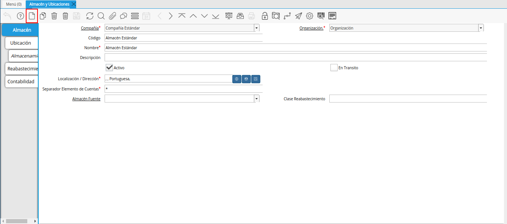
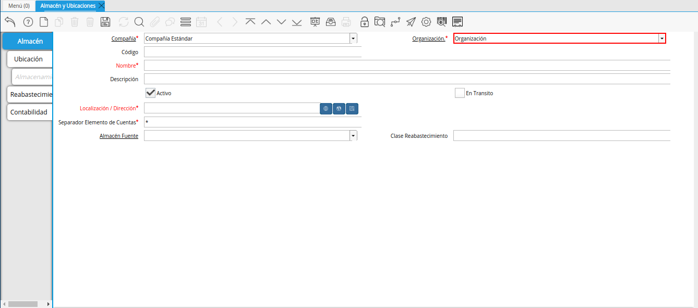
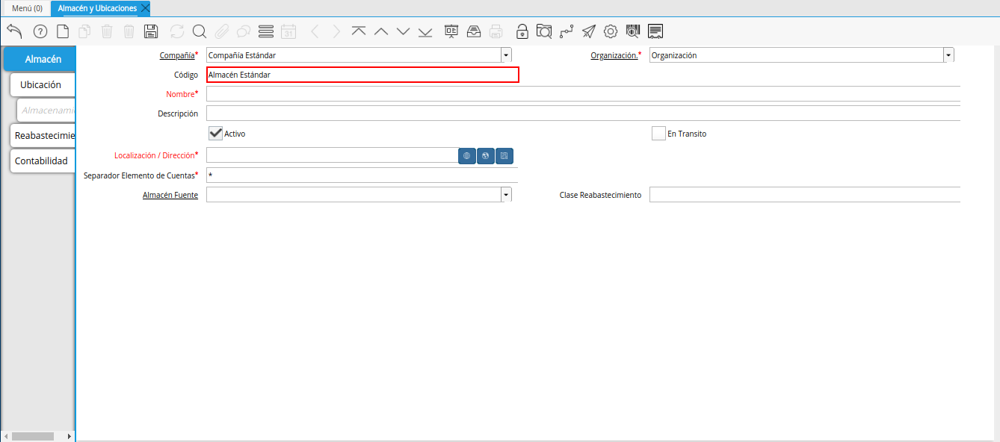
.. |campo nombre de la ventana almacén y ubicaciones| image:: resources/window-name-field-warehouse-and-locations.png
.. |campo descripción de la ventana almacén y ubicaciones| image:: resources/warehouse-and-locations-window-description-field.png
.. |campo localización dirección de la ventana almacén y ubicaciones| image:: resources/location-field-window-address-warehouse-and-locations.png
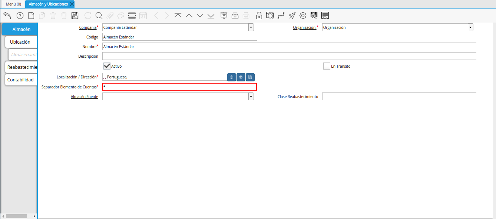
.. |campo almacén fuente de la ventana almacén y ubicaciones| image:: resources/warehouse-source-field-of-the-warehouse-and-locations-window.png
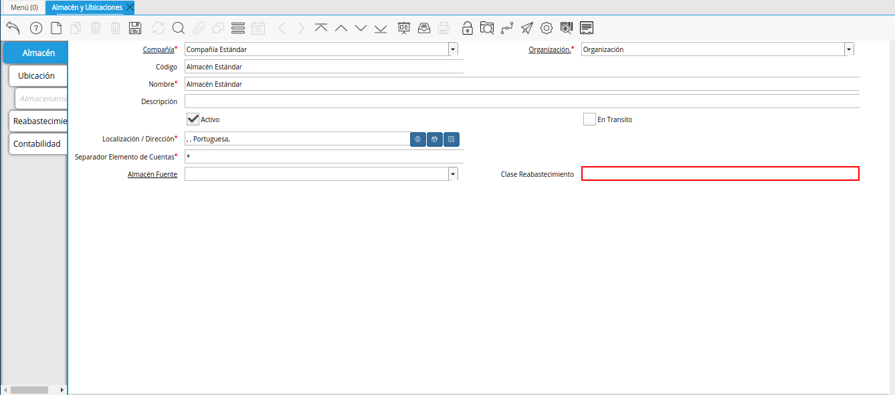
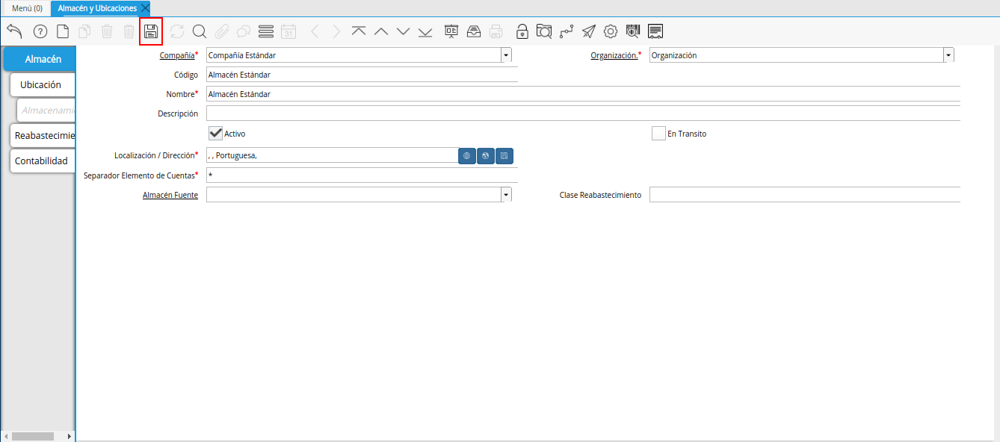
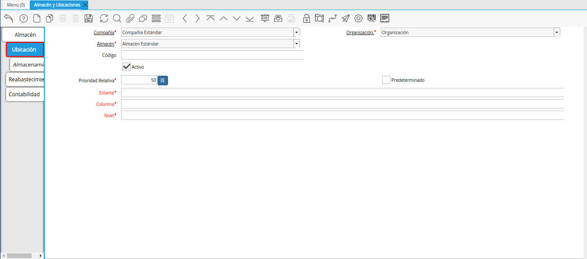
.. |campo código de la pestaña ubicación de la ventana almacén y ubicaciones| image:: resources/code-field-of-the-location-tab-of-the-warehouse-and-locations-window.png
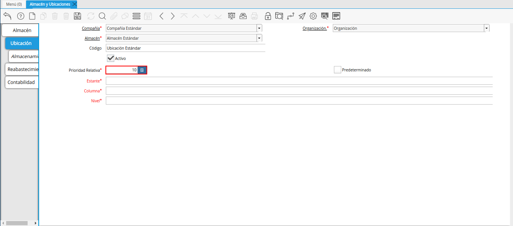
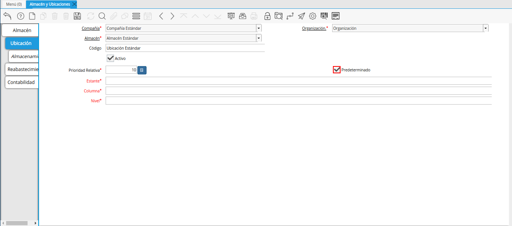
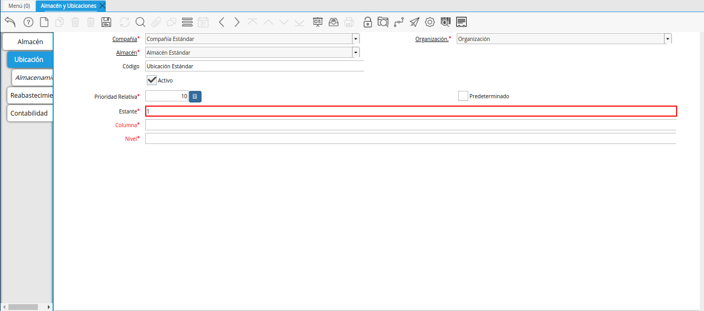
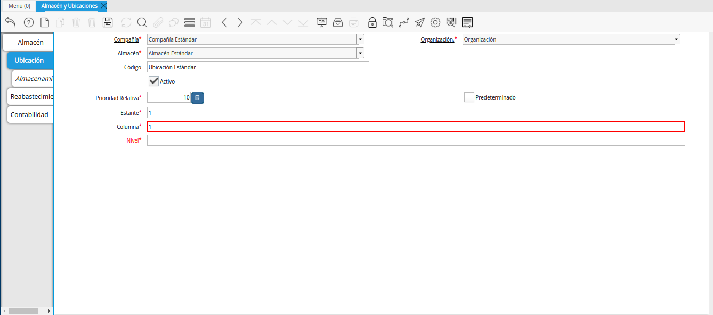
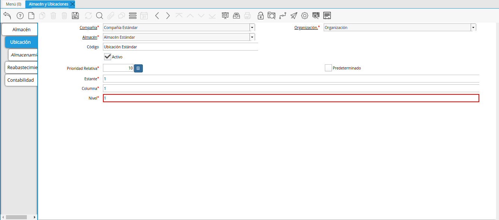
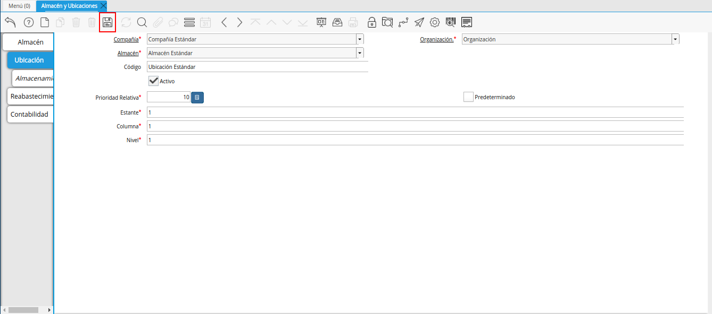

.. _documento/registro-almacén:

**Registro de Almacén**
=======================

- Ubique y seleccione en el menú de ADempiere, la carpeta "**Gestión de Materiales**", luego seleccione la carpeta "**Reglas de Gestión de Materiales**", por último seleccione la ventana "**Almacén y Ubicaciones**".

    |menú de almacén y ubicaciones|

    Imagen 1. Menú de ADempiere

- Podrá visualizar la ventana "**Almacén y Ubicaciones**", con los diferentes registros de almacenes creados en ADempiere con sus respectivas ubicaciones.

    |ventana almacén y ubicaciones|

    Imagen 2. Ventana Almacén y Ubicaciones

- Seleccione el icono "**Registro Nuevo**", ubicado en la barra de herramientas de ADempiere.

    Este icono permite crear un nuevo registro en la ventana, para proceder al llenado de los campos correspondientes.

    |icono registro nuevo de la ventana almacén y ubicaciones|

    Imagen 3. Icono Registro Nuevo

- En el campo "**Organización**", se debe seleccionar la organización para la cual se encuentra creando el registro del almacén.

    |campo organización de la ventana almacén y ubicaciones|

    Imagen 4. Campo Organización

- Introduzca en el campo "**Código**", el código del almacén que se encuentra registrando.

    |campo código de la ventana almacén y ubicaciones|

    Imagen 5. Campo Código

- Introduzca en el campo "**Nombre**", el nombre del almacén que se encuentra registrando.

    |campo nombre de la ventana almacén y ubicaciones|

    Imagen 6. Campo Nombre

- Introduzca en el campo "**Descripción**", una breve descripción del almacén que se encuentra registrando.

    |campo descripción de la ventana almacén y ubicaciones|

    Imagen 7. Campo Descripción

- Seleccione en el campo "**Localización / Dirección**", la dirección de localización del almacén que se encuentra registrando.

    |campo localización dirección de la ventana almacén y ubicaciones|

    Imagen 8. Campo Localización / Dirección

- El campo "**Separador Elemento de Cuentas**", indica el separador del elemento de las cuentas.

    |campo separador elemento de cuentas de la ventana almacén y ubicaciones|

    Imagen 9. Campo Separador Elemento de Cuentas

- Seleccione en el campo "**Almacén Fuente**", el almacén fuente al cual pertence el almacén que se encuentra registrando.

    Este campo no es obligatorio y se debe seleccionar solo cuando el almacén en cuestión, posea un almacén fuente.

    |campo almacén fuente de la ventana almacén y ubicaciones|

    Imagen 10. Campo Almacén Fuente

- Introduzca en el campo "**Clase Reabastecimiento**", la clase para el reabastecimiento del almacén que se encuentra registrando.

    |campo clase reabastecimiento de la ventana almacén y ubicaciones|

    Imagen 11. Campo Clase Reabastecimiento

- Seleccione el icono "**Guardar Cambios**", para guardar el registro de los campos de la ventana "**Almacén y Ubicaciones**".

    |icono guardar cambios de la ventana almacén y ubicaciones|

    Imagen 12. Icono Guardar Cambios

**Ubicación**
=============

- Seleccione del lado izquierdo de la ventana "**Almacén y Ubicaciones**", la pestaña "**Ubicación**" y proceda al llenado de los campos correspondientes.

    |pestaña ubicación de la pestaña ubicación de la ventana almacén y ubicaciones|

    Imagen 13. Pestaña Ubicación

#.Introduzca en el campo "**Código**", el código de la ubicación que se encuentra registrando.

    |campo código de la pestaña ubicación de la ventana almacén y ubicaciones|

    Imagen 14. Campo Código

- Introduzca en el campo "**Prioridad Relativa**", la prioridad relativa del producto.

    La prioridad relativa indica la ubicación desde la que se va a seleccionar primero un producto si se encuentra almacenado en más de una ubicación

    |campo prioridad relativa de la pestaña ubicación de la ventana almacén y ubicaciones|

    Imagen 15. Campo Prioridad Relativa

- Seleccione el check "**Predeterminado**", para indicar que el registro será usado como un valor predeterminado.

    |check predeterminado de la pestaña ubicación de la ventana almacén y ubicaciones|

    Imagen 16. Check Predeterminado

- Introduzca en el campo "**Rack**", el pasillo donde está localizado el producto.

    |campo rack de la pestaña ubicación de la ventana almacén y ubicaciones|

    Imagen 17. Campo Rack

- Introduzca en el campo "**Columna**", el anaquel donde está localizado el producto.

    |campo columna de la pestaña ubicación de la ventana almacén y ubicaciones|

    Imagen 18. Campo Columna

- Introduzca en el campo "**Nivel**", el nivel donde está localizado el producto.

    |campo nivel de la pestaña ubicación de la ventana almacén y ubicaciones|

    Imagen 19. Campo Nivel

- Seleccione el icono "**Guardar Cambios**", para guardar el registro de los campos de la pestaña "**Ubicación**", de la ventana "**Almacén y Ubicaciones**".

    |icono guardar cambios de la pestaña ubicación de la ventana almacén y ubicaciones|

    Imagen 20. Icono Guardar Cambios

