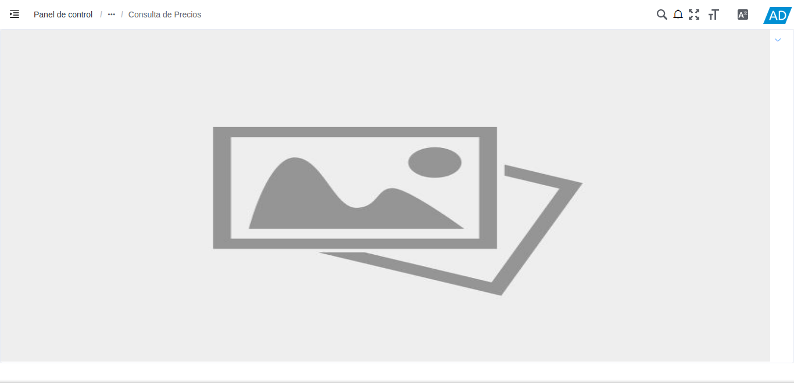
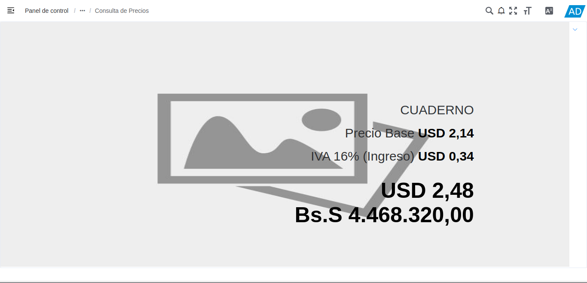

.. _ERPyA: http://erpya.com
.. |menú de consulta de producto| image:: resources/product-inquiry-menu.png

.. _documento/consulta-precios-productos:

**Consulta de Precios de Productos**
====================================

El presente material elaborado por `ERPyA`_, pretende ofrecerle una explicación eficiente a nuestros clientes del procedimiento a seguir para consultar los precios de los productos registrados en ADempiere.

ADempiere permite que sea realizada una búsqueda de precios de productos a través del código de barra del mismo, en la ventana "**Consulta de Precios**". A continuación se explica de manera detallada el procedimiento a seguir para el mismo.

#. Ubique en el menú de ADempiere, la carpeta "**Gestión de Ventas**", el formulario "**Consulta de Precios**".

    |menú de consulta de producto|

    Imagen 1. Menú de ADempiere

#. Podrá visualizar la ventana del formulario "**Consulta de Precios**".

    |ventana del formulario consulta de precios|

    Imagen 2. Ventana del Formulario Consulta de Precios

#. Haga clic sobre la imagen de la ventana y posteriormente ubique el código de barra del producto en el lector de código, para que el mismo pueda reflejar la información del producto.

    |consulta de precios|

    Imagen 4. Ventana Consulta de Precios

    .. note::

        Este formulario permite visualizar el nombre del producto, su precio sin impuesto y el total del impuesto del mismo, Adicional a ello, muestra el monto total del producto en la moneda base y su monto convertido según la lista de precios disponible para la organización.
