.. _ERPyA: http://erpya.com
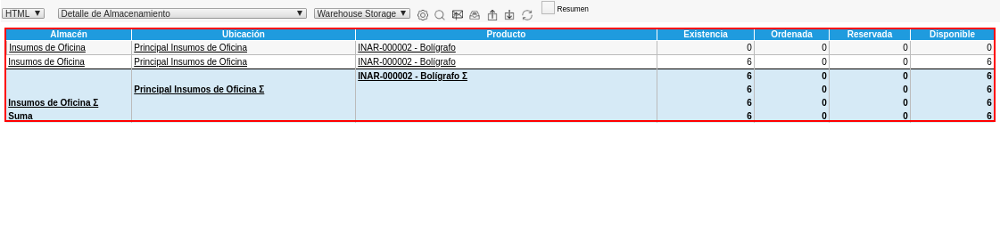
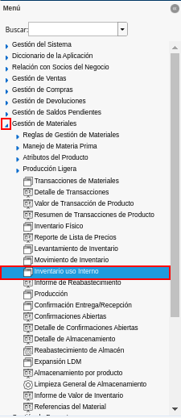

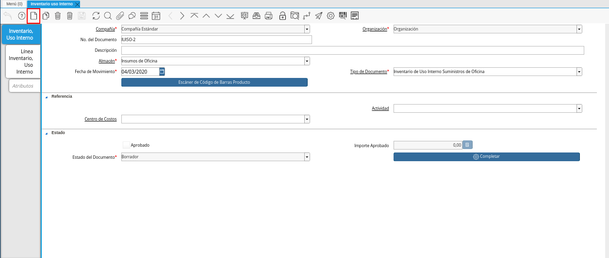
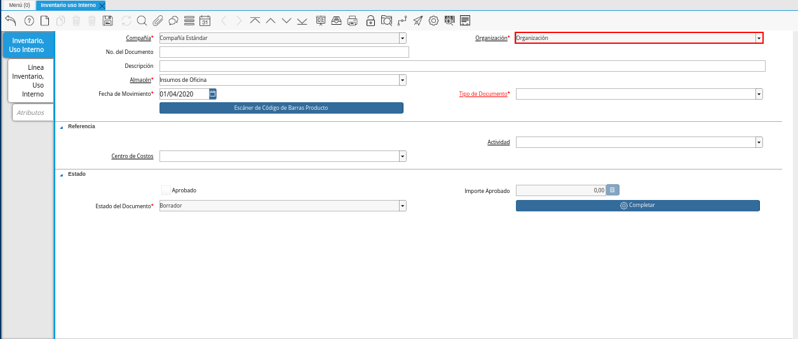
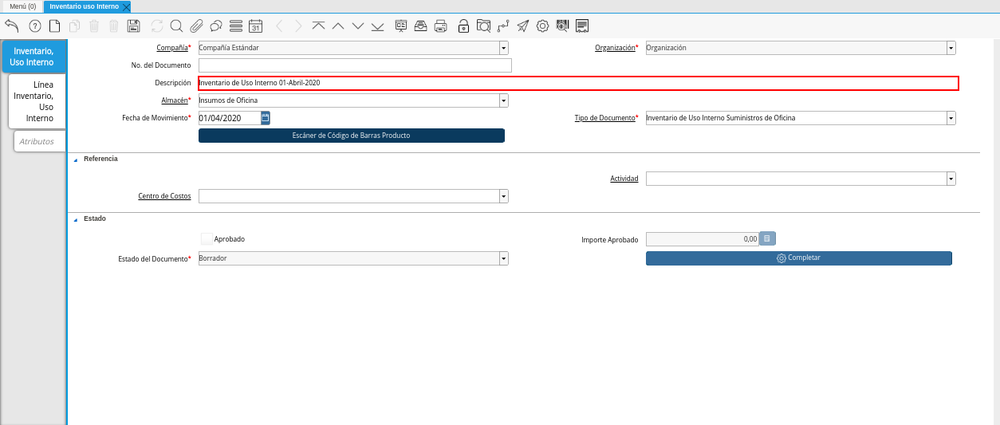
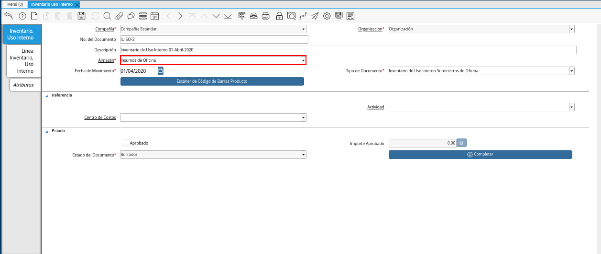
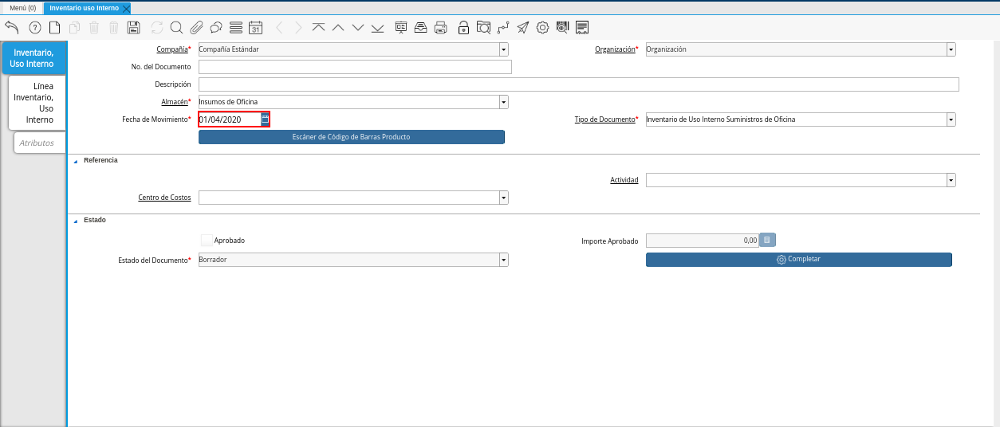
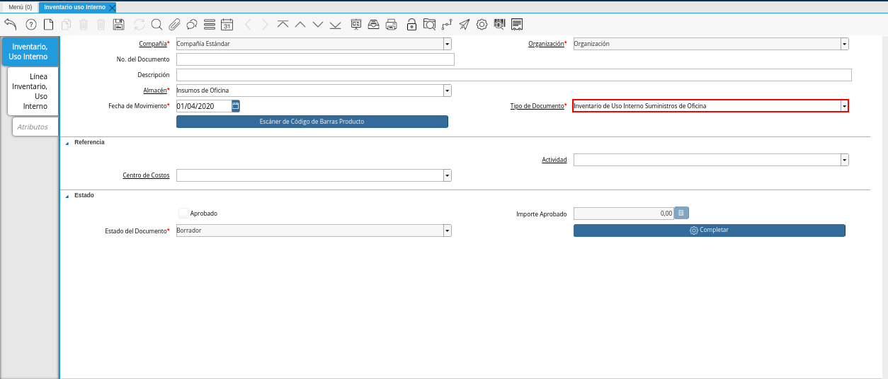
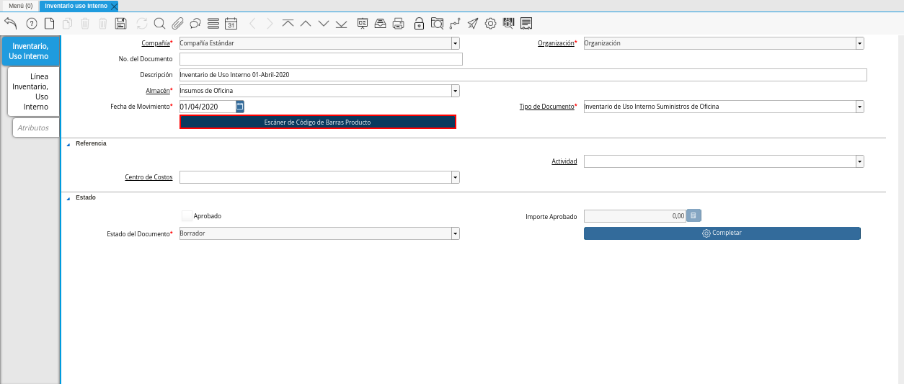
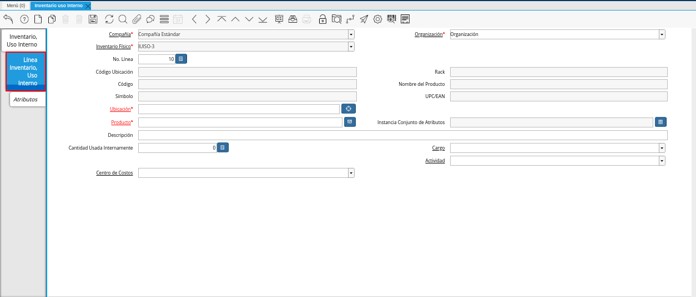
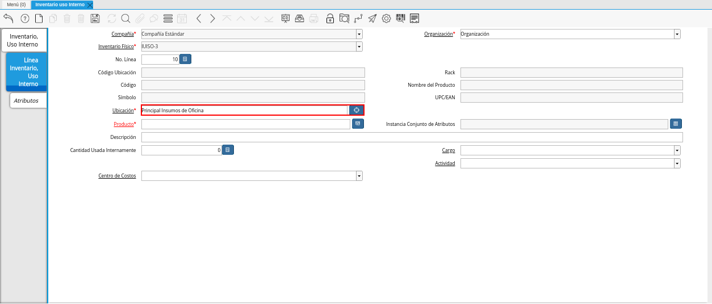
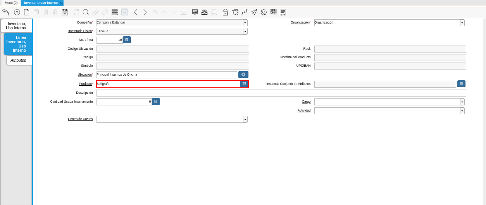
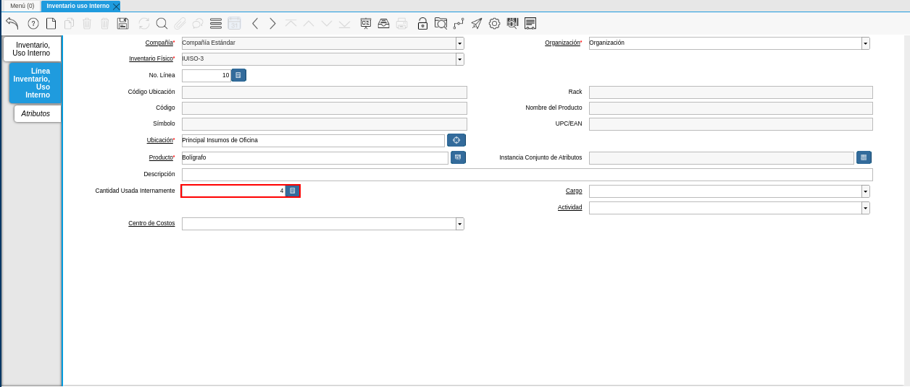
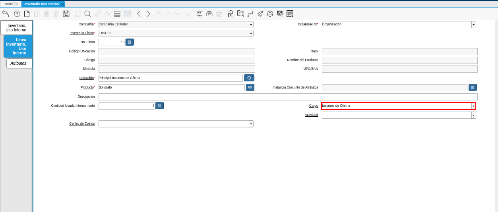
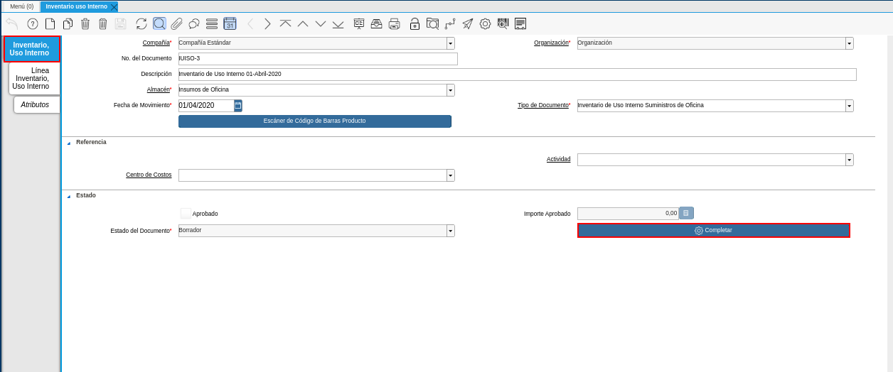
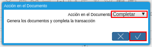
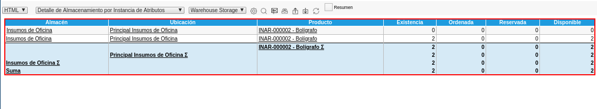

.. _documento/inventario-uso-interno:

**Registo de Inventario de Uso Interno**
========================================

Para ejemplificar el inventario de uso interno, es generado el reporte "**Detalle de Almacenamiento**" del producto "**Bolígrafo**" en el almacén "**Insumos de Oficina**", el mismo es visualizado de la siguiente manera.

    |Detalle de Almacenamiento Antes|

    Imagen 1. Detalle de Almacenamiento antes del Movimiento

#. Ubique y seleccione en el menú de ADempiere, la carpeta "**Gestión de Materiales**", luego seleccione la ventana "**Inventario Uso Interno**".

    |Menú de ADempiere|

    Imagen 2. Menú de ADempiere

#. Podrá visualizar la ventana "**Inventario Uso Interno**" donde se encuentran los registros de los diferentes inventarios realizados para el uso interno de la organización.

    |Ventana Inventario Uso Interno|

    Imagen 3. Ventana Inventario de Uso Interno

    #. Seleccione el icono "**Registro Nuevo**", ubicado en la barra de herramientas de ADempiere para crear un nuevo registro de inventario de uso interno.

        |Icono Registro Nuevo|

        Imagen 4. Icono Registro Nuevo

        #. Seleccione en el campo "**Organización**", la organización para la cual esta realizando el inventario de uso interno.

            |Campo Organización|

            Imagen 5. Campo Organización

        #. Introduzca en el campo "**Descripción**", una breve descripción referente al inventario que se esta realizando.

            |Campo Descripción|

            Imagen 6. Campo Descripción

        #. Seleccione en el campo "**Almacén**", el almacén de la organización en el cual se encuentra localizado el producto.

            |Campo Almacén|

            Imagen 7. Campo Almacén

        #. Introduzca en el campo "**Fecha de Movimiento**", la fecha en la cual es realizado el inventario de uso interno.

            |Fecha de Movimiento|

            Imagen 8. Campo Fecha de Movimiento

        #. Seleccione el tipo de documento a generar en el campo "**Tipo de Documento**", la selección de este define el comportamiento del documento que se esta elaborando, dicho comportamiento se encuentra explicado en el documento :ref:`documento/tipo-documento` elaborado por la empresa `ERPyA`_.

            |Tipo de Documento|

            Imagen 9. Campo Tipo de Documento

        #. La selección de la opción "**Escáner de Código de Barras Producto**", permite escanear el código de barras del producto e ingresar su información a la pestaña "**Línea Inventario, Uso Interno**" de forma automática.

            |Opción Escáner de Código de Barras Producto|

            Imagen 10. Opción Escáner de Código de Barras de Producto

        .. note:

            Recuerde guardar el registro de los campos seleccionando el icono "**Guardar Cambios**", ubicado en la barra de herramientas de ADempiere.

    #. Seleccione la pestaña "**Línea Inventario, Uso Interno**" y proceda al llenado de los campos correspondientes.

        |Pestaña Línea Inventario, Uso Interno|

        Imagen 11. Pestaña Línea de Inventario Uso Interno

        #. Seleccione en el campo "**Ubicación**", el lugar exacto donde será localizado el producto.

            |Ubicación|

            Imagen 12. Campo Ubicación

        #. Seleccione en el campo "**Producto**", el producto involucrado en el inventario de uso interno que esta realizando. Para ejemplificar el registro es utilizado el producto "**Bolígrafo**".

            |Producto|

            Imagen 13. Campo Producto

        #. Introduzca en el campo "**Cantidad Usada Internamente**", la cantidad que es utilizada internamente por el departamento de la organización que esta realizando el inventario de uso interno.

            |Cantidad Usada Internamente|

            Imagen 14. Campo Cantidad Usada Internamente

        #. Seleccione en el campo "**Cargo**", el cargo correspondiente al movimiento de material que esta realizando. Para ejemplificar el registro es utilizado el cargo "**Insumos de Oficina**".

            |Campo Cargo|

            Imagen 15. Campo Cargo

        .. note:

            Recuerde guardar el registro de los campos seleccionando el icono "**Guardar Cambios**", ubicado en la barra de herramientas de ADempiere.

    #. Seleccione la pestaña principal "**Inventario Uso Interno**", para luego seleccionar la opción "**Completar**", ubicada en la parte inferior derecha del documento.

        |Pestaña Inventario Uso Interno|

        Imagen 16. Pestaña Inventario de Uso Interno

        #. Seleccione la acción "**Completar**" y la opción "**OK**" para completar el documento.

            |Acción Completar y Opción OK|

            Imagen 17. Acción Completar y Opción OK

**Consultar Detalle de Almacenamiento**
=======================================

#. Al generar el reporte "**Detalle de Almacenamiento**" del producto "**Bolígrafo**" en el almacén "**Insumos de Oficina**" luego del proceso "**Inventario de Uso Interno**", se puede visualizar el mismo de la siguiente manera.

    |Detalle de Almacenamiento después del Movimiento|

    Imagen 18. Detalle de Almacenamiento después del Movimiento