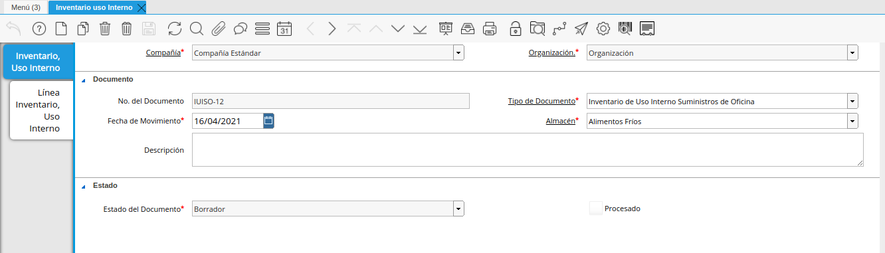
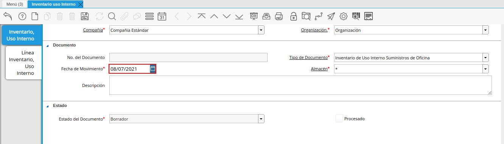
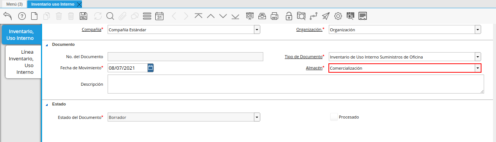
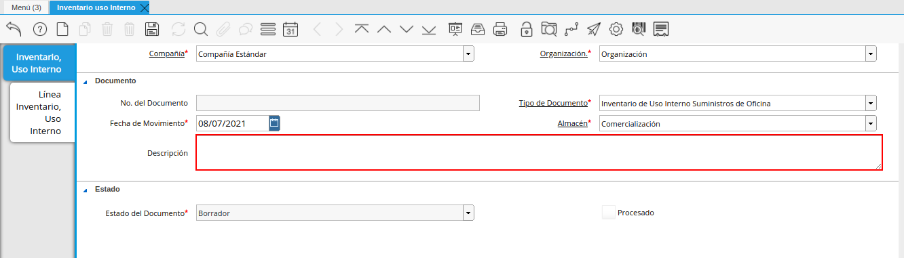
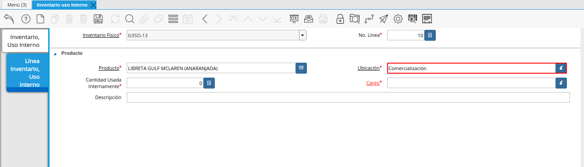
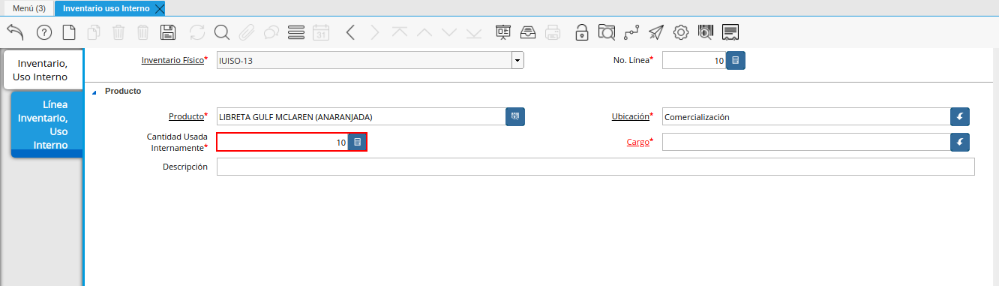
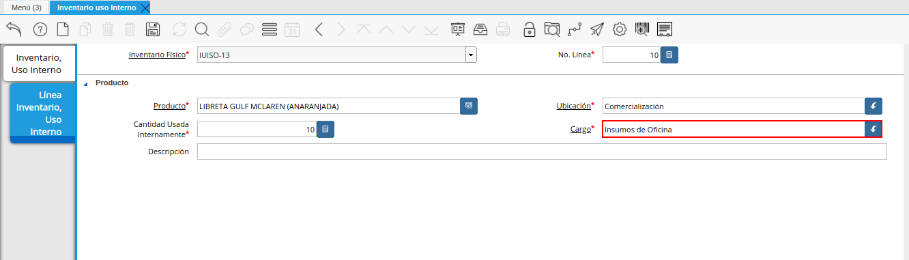

.. _ERPyA: http://erpya.com

.. |detalle de almacenamiento antes| image:: resources/storage-detail-before.png
.. |menú de inventario uso interno| image:: resources/inventory-menu-internal-use.png

.. |campo organización de la ventana inventario uso interno| image:: resources/window-organization-field-inventory-internal-use.png
.. |tipo de documento de la ventana inventario uso interno| image:: resources/internal-use-inventory-window-document-type.png

.. |pestaña línea inventario uso interno de la ventana inventario uso interno| image:: resources/inventory-line-tab-internal-use-of-the-inventory-window-internal-use.png
.. |campo producto de la pestaña línea inventario uso interno| image:: resources/product-field-of-the-inventory-line-tab-internal-use.png

.. |campo descripción de la pestaña línea inventario uso interno| image:: resources/tab-description-field-inventory-line-internal-use.png
.. |icono proceso en la pestaña principal inventario uso interno| image:: resources/process-icon-in-the-main-inventory-tab-internal-use.png
.. |acción completar y opción ok| image:: resources/action-complete-and-option-ok.png
.. |detalle de almacenamiento después del movimiento| image:: resources/storage-detail-after-move.png

.. _documento/inventario-uso-interno:

**Registo de Inventario de Uso Interno**
========================================

Para ejemplificar el inventario de uso interno, es generado el reporte "**Detalle de Almacenamiento**" del producto "**LIBRETA GULF MCLAREN (ANARANJADA)**" en el almacén "**Comercialización**", el mismo es visualizado de la siguiente manera.

    |detalle de almacenamiento antes|

    Imagen 1. Detalle de Almacenamiento antes del Movimiento

Ubique y seleccione en el menú de ADempiere, la carpeta "**Gestión de Materiales**", luego seleccione la ventana "**Inventario Uso Interno**".

    |menú de inventario uso interno|

    Imagen 2. Menú de ADempiere

Podrá visualizar la ventana "**Inventario Uso Interno**" donde se encuentran los registros de los diferentes inventarios realizados para el uso interno de la organización.

    |ventana inventario uso interno|

    Imagen 3. Ventana Inventario de Uso Interno

Seleccione el icono "**Registro Nuevo**", ubicado en la barra de herramientas de ADempiere para crear un nuevo registro de inventario de uso interno.

    |icono registro nuevo de la ventana inventario uso interno|

    Imagen 4. Icono Registro Nuevo

    Seleccione en el campo "**Organización**", la organización para la cual esta realizando el inventario de uso interno.

        |campo organización de la ventana inventario uso interno|

        Imagen 5. Campo Organización

    .. note::

        El valor en el campo "**No. del Documento**", lo predetermina ADempiere con un código compuesto por las iniciales del "**Tipo de Documento**" y la cantidad de documentos registrados bajo el "**Tipo de Documento**" seleccionado.

    Seleccione el tipo de documento a generar en el campo "**Tipo de Documento**", la selección de este define el comportamiento del documento que se esta elaborando, dicho comportamiento se encuentra explicado en el documento **Tipo de Documento** elaborado por la empresa `ERPyA`_.

        |tipo de documento de la ventana inventario uso interno|

        Imagen 6. Campo Tipo de Documento

    Introduzca en el campo "**Fecha de Movimiento**", la fecha en la cual es realizado el inventario de uso interno.

        |fecha de movimiento de la ventana inventario uso interno|

        Imagen 7. Campo Fecha de Movimiento

    Seleccione en el campo "**Almacén**", el almacén de la organización en el cual se encuentra localizado el producto.

        |campo almacén de la ventana inventario uso interno|

        Imagen 8. Campo Almacén

    Introduzca en el campo "**Descripción**", una breve descripción referente al inventario que se esta realizando.

        |campo descripción de la ventana inventario uso interno|

        Imagen 9. Campo Descripción

    .. note:

        Recuerde guardar el registro de los campos seleccionando el icono "**Guardar Cambios**", ubicado en la barra de herramientas de ADempiere.

Seleccione la pestaña "**Línea Inventario, Uso Interno**" y proceda al llenado de los campos correspondientes.

    |pestaña línea inventario uso interno de la ventana inventario uso interno|

    Imagen 10. Pestaña Línea de Inventario Uso Interno

    Seleccione en el campo "**Producto**", el producto involucrado en el inventario de uso interno que esta realizando. Para ejemplificar el registro es utilizado el producto "**LIBRETA GULF MCLAREN (ANARANJADA)**".

        |campo producto de la pestaña línea inventario uso interno|

        Imagen 11. Campo Producto

    Seleccione en el campo "**Ubicación**", el lugar exacto donde será localizado el producto.

        |campo ubicación de la pestaña línea inventario uso interno|

        Imagen 12. Campo Ubicación

    Introduzca en el campo "**Cantidad Usada Internamente**", la cantidad que es utilizada internamente por el departamento de la organización que esta realizando el inventario de uso interno.

        |cantidad usada internamente de la pestaña línea inventario uso interno|

        Imagen 13. Campo Cantidad Usada Internamente

    Seleccione en el campo "**Cargo**", el cargo correspondiente al movimiento de material que esta realizando. Para ejemplificar el registro es utilizado el cargo "**Insumos de Oficina**".

        |campo cargo de la pestaña línea inventario uso interno|

        Imagen 14. Campo Cargo

    Introduzca en el campo "**Descripción**", una breve descripción referente a la línea del inventario que se encuentra realizando.

        |campo descripción de la pestaña línea inventario uso interno|

        Imagen 15. Campo Descripción

    .. note:

        Recuerde guardar el registro de los campos seleccionando el icono "**Guardar Cambios**", ubicado en la barra de herramientas de ADempiere.

Seleccione la pestaña principal "**Inventario Uso Interno**", para luego seleccionar la opción "**Procesar Conteo Físico**", que se desplega al seleccionar el icono "**Proceso**", ubicado en la barra de herramientas de ADempiere.

    |icono proceso en la pestaña principal inventario uso interno|

    Imagen 16. Pestaña Inventario de Uso Interno

Podrá visualizar la ventana de acción del proceso, donde debe seleccionar la acción "**Completar**" y la opción "**OK**" para completar el documento.

    |acción completar y opción ok|

    Imagen 17. Acción Completar y Opción OK

.. note::

    Al completar el registro, se selecciona de manera automática el check "**Procesado**".

**Consultar Detalle de Almacenamiento**
=======================================

Al generar el reporte "**Detalle de Almacenamiento**" del producto "**LIBRETA GULF MCLAREN (ANARANJADA)**" en el almacén "**Comercialización**" luego del proceso "**Inventario de Uso Interno**", se puede visualizar el mismo de la siguiente manera.

    |detalle de almacenamiento después del movimiento|

    Imagen 18. Detalle de Almacenamiento después del Movimiento