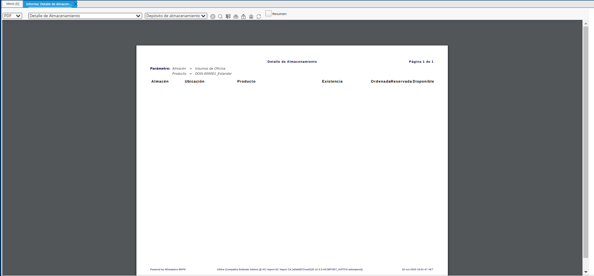
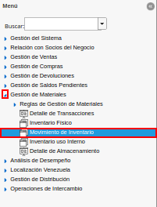
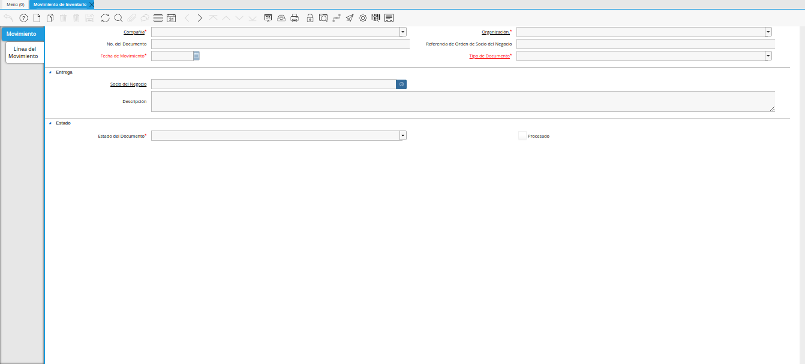
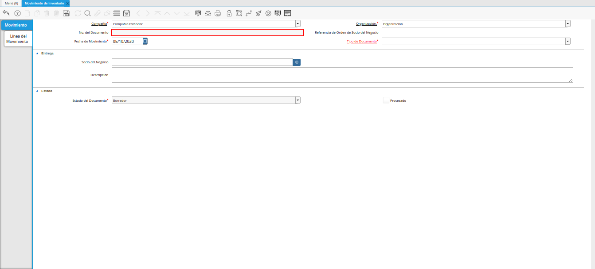
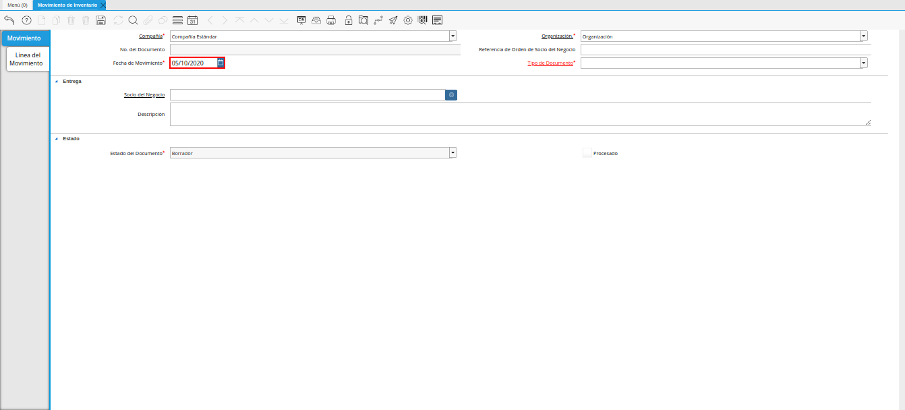
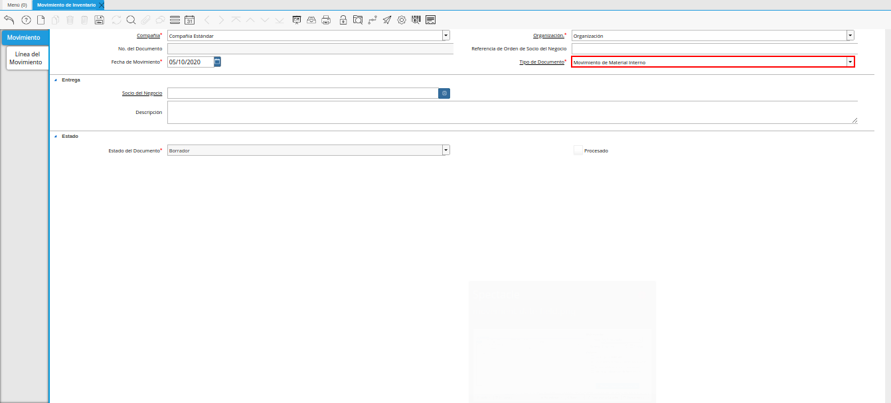
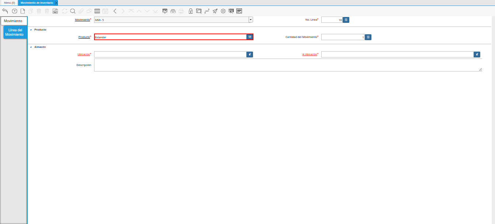
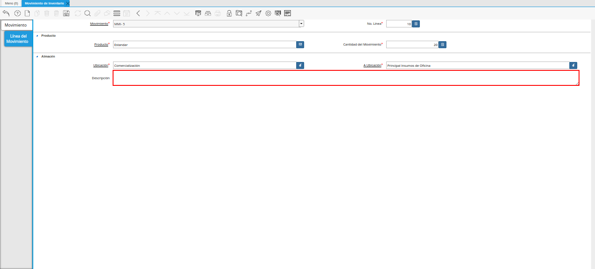

.. _ERPyA: http://erpya.com

.. |Icono Registro Nuevo| image:: resources/new-record-icon.png
.. |Campo Organización| image:: resources/organization-field.png

.. |campo referencia de orden de socio del negocio| image:: resources/business-partner-order-reference-field.png

.. |Campo Descripción| image:: resources/description-field.png
.. |Pestaña Línea de Movimiento| image:: resources/motion-line-tab.png
.. |campo movimiento| image:: resources/motion-field.png

.. |Campo Cantidad del Movimiento| image:: resources/momentum-field.png
.. |Campo Ubicación| image:: resources/location-field.png
.. |Campo A Ubicación| image:: resources/field-to-location.png

.. |Pestaña Movimiento| image:: resources/movement-tab.png
.. |Acción Completar y Opción OK| image:: resources/action-complete-and-option-ok.png
.. |Reporte Detalle Almacenamiento Después| image:: resources/storage-detail-report-after.png

.. _documento/movimiento-inventario:

**Registro de Movimiento de Inventario**
========================================

Para ejemplificar el procedimiento es generado el reporte "**Detalle de Almacenamiento**" del producto "**Estándar**" en el almacén "**Insumos de Oficina**", el mismo es visualizado de la siguiente manera antes del movimiento de inventario.

    |Reporte Detalle Almacenamiento Antes|

    Imagen 1. Reporte Detalle Almacenamiento Antes del Movimiento

#. Ubique y seleccione en el menú de ADempiere, la carpeta "**Gestión de Materiales**", luego seleccione la ventana "**Movimiento de Inventario**". 

    |Menú de ADempiere|

    Imagen 2. Menú de ADempiere

#. Podrá visualizar la ventana "**Movimiento de Inventario**" donde se encuentran los registros de los diferentes movimientos de inventarios realizados en la organización.

    |Ventana Movimiento de Inventario|

    Imagen 3. Ventana Movimiento de Inventario

#. Seleccione el icono "**Registro Nuevo**", ubicado en la barra de herramientas de ADempiere para crear un nuevo registro de movimiento inventario.

    |Icono Registro Nuevo|

    Imagen 4. Icono Registro Nuevo

    #. Seleccione en el campo "**Organización**", la organización desde la cual se esta realizando el movimiento de inventario.

        |Campo Organización|

        Imagen 5. Campo Organización

    #. En el campo "**No. de Documento**", no es necesario ingresarlo en forma manual, al momento de realizar un registro, ADempiere genera un número de secuencia automáticamente para el documento, al seleccionar la opción guardar del nuevo registro de movimiento de inventario.

        |Campo número de documento|

        Imagen 6. Campo No. del Documento

    #. Introduzca en el campo "**Referencia de Orden de Socio del Negocio**", la referencia de orden del socio del negocio.

        |campo referencia de orden de socio del negocio|

        Imagen 7. Campo Referencia de Orden de Socio del Negocio

    #. Introduzca en el campo "**Fecha de Movimiento**", la fecha en la cual se esta realizando el movimiento de productos.

        |Campo Fecha de Movimiento|

        Imagen 8. Campo Fecha de Movimiento

    #. Seleccione el tipo de documento a generar en el campo "**Tipo de Documento**", la selección de este define el comportamiento del documento que se esta elaborando, dicho comportamiento se encuentra explicado en el documento **Tipo de Documento** elaborado por la empresa `ERPyA`_.

        |Campo Tipo de Documento|

        Imagen 9. Campo Tipo de Documento

    #. Introduzca en el campo "**Descripción**", una breve descripción del movimiento de inventario que esta realizando.

        |Campo Descripción|

        Imagen 10. Campo Descripción

    .. note::

        Recuerde guardar los cambios realizados en los campos de la pestaña "**Movimiento**", seleccionando el icono "**Guardar Cambios**" ubicado en la barra de herramientas de ADempiere.

#. Seleccione la pestaña "**Línea del Movimiento**" y proceda al llenado de los campos correspondientes.

    |Pestaña Línea de Movimiento|

    Imagen 11. Pestaña Línea de Movimiento

    #. Podrá visualizar en el campo "**Movimiento**", el número de registro al que pertenece el registro de la línea en el que se encuentra.

        |campo movimiento|

        Imagen 12. Campo Movimiento

    #. Seleccione en el campo "**Producto**", el producto involucrado en el movimiento de inventario.

        |Campo Producto|

        Imagen 13. Campo Producto

    #. Seleccione en el campo "**Cantidad del Movimiento**", la cantidad de productos involucrados en el movimiento de inventario.

        |Campo Cantidad del Movimiento|

        Imagen 14. Campo Cantidad del Movimiento

    #. Seleccione en el campo "**Ubicación**", la ubicación exacta donde se encuentra localizado el producto.

        |Campo Ubicación|

        Imagen 15. Campo Ubicación

    #. Seleccione en el campo "**A Ubicación**", la ubicación exacta donde será almacenado o donde va dirigido el producto.

        |Campo A Ubicación|

        Imagen 16. Campo A Ubicación

    #. Introduzca en el campo "**Descripción**", una breve descripción del movimiento de inventario que esta realizando.

        |Campo Descripción línea|

        Imagen 17. Campo Descripción

    .. note::

        Recuerde guardar los cambios realizados en los campos de la pestaña "**Línea del Movimiento**", seleccionando el icono "**Guardar Cambios**" ubicado en la barra de herramientas de ADempiere.

#. Seleccione la pestaña principal "**Movimiento**", luego seleccione la opción "**Procesar Movimiento**" desplegada al seleccionar el icono "**Proceso**", ubicado en la barra de herramientas de ADempiere.

    |Pestaña Movimiento|

    Imagen 18. Pestaña Movimiento y Opción Procesar Movimiento

#. Seleccione la acción "**Completar**" y la opción "**OK**" para completar el documento "**Movimiento de Inventario**".

    |Acción Completar y Opción OK|

    Imagen 19. Acción Completar y Opción OK 

**Consultar Reporte de Almacenamiento**Completar
=======================================

#. Al generar el reporte "**Detalle de Almacenamiento**" del producto "**Estándar**" en el almacén "**Insumos de Oficina**", el mismo es visualizado de la siguiente manera después del movimiento de inventario.

    |Reporte Detalle Almacenamiento Después|

    Imagen 20. Reporte Detalle Almacenamiento Después del Movimiento

