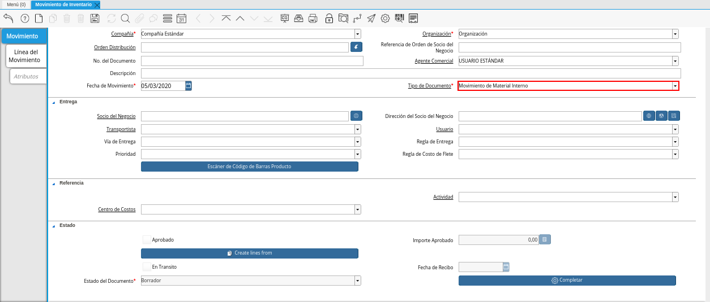

.. _ERPyA: http://erpya.com

.. |Reporte Detalle Almacenamiento Después| image:: resources/detalle-alamacenamiento-despues.png

.. _documento/movimiento-inventario:

**Procedimiento para Realizar un Movimiento de Inventario en ADempiere**
========================================================================

Para ejemplificar el procedimiento es generado el reporte "**Detalle de Almacenamiento**" del producto "**Bolígrafo**" en el almacén "**Insumos de Oficina**", el mismo es visualizado de la siguiente manera antes del movimiento de inventario.

    |Reporte Detalle Almacenamiento Antes|

    Imagen 1. Reporte Detalle Almacenamiento Antes del Movimiento

#. Ubique y seleccione en el menú de ADempiere, la carpeta "**Gestión de Materiales**", luego seleccione la ventana "**Movimiento de Inventario**". 

    |Menú de ADempiere|

    Imagen 2. Menú de ADempiere

#. Podrá visualizar la ventana "**Movimiento de Inventario**" donde se encuentran los registros de los diferentes movimientos de inventarios realizados en la organización.

    |Ventana Movimiento de Inventario|

    Imagen 3. Ventana Movimiento de Inventario

    #. Seleccione el icono "**Registro Nuevo**", ubicado en la barra de herramientas de ADempiere para crear un nuevo registro de movimiento inventario.

        |Icono Registro Nuevo|

        Imagen 4. Icono Registro Nuevo

        #. Seleccione en el campo "**Organización**", la organización desde la cual se esta realizando el movimiento de inventario.

            |Campo Organización|

            Imagen 5. Campo Organización

        #. Seleccione en el campo "**Orden de Distribución**", la orden de distribución asignada para el movimiento de los productos del inventario. 

            |Orden de Distribución|

            Imagen 6. Campo Orden de Distribución

            .. note::

                Este campo debe ser llenado si el movimiento de inventario es realizado a consecuencia de una orden de distribución.

        #. Seleccione en el campo "**Agente Comercial**", el usuario que gestiona el movimiento de inventario.

            |Campo Agente Comercial|

            Imagen 7. Campo Agente Comercial

        #. Introduzca en el campo "**Descripción**", una breve descripción del movimiento de inventario que esta realizando.

            |Campo Descripción|

            Imagen 8. Campo Descripción

        #. Seleccione el tipo de documento a generar en el campo "**Tipo de Documento**", la selección de este define el comportamiento del documento que se esta elaborando, dicho comportamiento se encuentra explicado en el documento :ref:`documento/tipo-documento` elaborado por la empresa `ERPyA`_.

            |Campo Tipo de Documento|

            Imagen 9. Campo Tipo de Documento

        #. Introduzca en el campo "**Fecha de Movimiento**", la fecha en la cual se esta realizando el movimiento de productos.

            |Campo Fecha de Movimiento|

            Imagen 10. Campo Fecha de Movimiento

            .. note::

                Recuerde guardar los cambios realizados en los campos de la pestaña "**Movimiento**", seleccionando el icono "**Guardar Cambios**" ubicado en la barra de herramientas de ADempiere.

    #. Seleccione la pestaña "**Línea del Movimiento**" y proceda al llenado de los campos correspondientes.

        |Pestaña Línea de Movimiento|

        Imagen 11. Pestaña Línea de Movimiento

        #. Seleccione en el campo "**Línea Orden Distribución**", la línea de la orden de distribución en la cual se encuentra el producto involucrado en el movimiento de inventario que esta realizando.

            |Campo Línea Orden Distribución|

            Imagen 12. Campo Línea Orden Distribución

            .. note::

                Este campo debe ser llenado si el movimiento de inventario es realizado a consecuencia de una orden de distribución.

        #. Seleccione en el campo "**Producto**", el producto involucrado en el movimiento de inventario.

            |Campo Producto|

            Imagen 13. Campo Producto

        #. Seleccione en el campo "**Ubicación**", la ubicación exacta donde se encuentra localizado el producto.

            |Campo Ubicación|

            Imagen 14. Campo Ubicación

        #. Seleccione en el campo "**A Ubicación**", la ubicación exacta donde será almacenado o donde va dirigido el producto.

            |Campo A Ubicación|

            Imagen 15. Campo A Ubicación

        #. Seleccione en el campo "**Cantidad del Movimiento**", la cantidad de productos involucrados en el movimiento de inventario.

            |Campo Cantidad del Movimiento|

            Imagen 16. Campo Cantidad del Movimiento

            .. note::

                Recuerde guardar los cambios realizados en los campos de la pestaña "**Línea del Movimiento**", seleccionando el icono "**Guardar Cambios**" ubicado en la barra de herramientas de ADempiere.

        #. Seleccione la pestaña principal "**Movimiento**", luego seleccione la opción "**Completar**" ubicada en la parte inferior derecha de la ventana "**Movimiento de Inventario**".

            |Pestaña Movimiento|

            Imagen 17. Pestaña Movimiento y Opción Completar

            #. Seleccione la acción "**Completar**" y la opción "**OK**" para completar el documento "**Movimiento de Inventario**".

                |Acción Completar y Opción OK|

                Imagen 18. Acción Completar y Opción OK 

**Consultar Reporte de Almacenamiento**
=======================================

#. Al generar el reporte "**Detalle de Almacenamiento**" del producto "**Bolígrafo**" en el almacén "**Insumos de Oficina**", el mismo es visualizado de la siguiente manera después del movimiento de inventario.

    |Reporte Detalle Almacenamiento Después|

    Imagen 19. Reporte Detalle Almacenamiento Después del Movimiento

