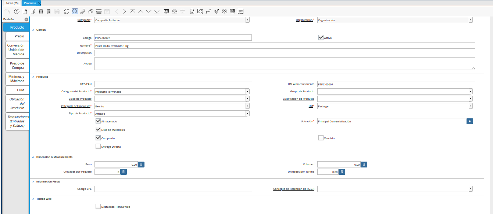
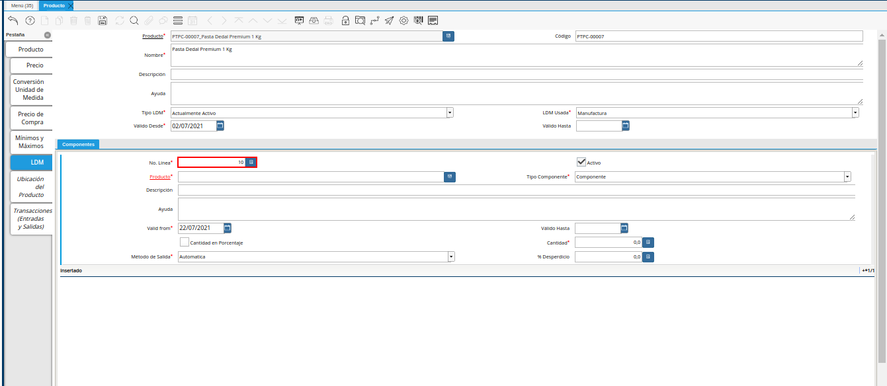
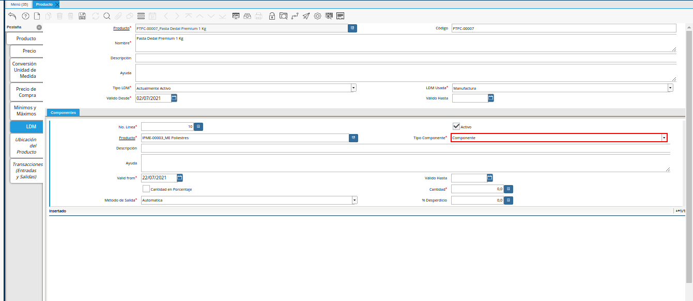

.. |Selección de la Pestaña ldm del Producto Estándar para Producción| image:: resources/selection-of-the-ldm-tab-of-the-standard-product-for-production.png
.. |Campo Código del Producto de la Pestaña LDM| image:: resources/product-code-field-from-the-ldm-tab.png
.. |Campo UM del Producto de la Pestaña LDM| image:: resources/um-field-of-the-ldm-tab-product.png

.. |Campo Descripción del Producto de la Pestaña LDM| image:: resources/ldm-tab-product-description-field.png
.. |Campo Aviso de Cambio del Producto de la Pestaña LDM| image:: resources/ldm-tab-product-change-notice-field.png
.. |Campo No del Documento del Producto de la Pestaña LDM| image:: resources/field-of-the-product-document-of-the-ldm-tab.png
.. |Campo Revisión del Producto de la Pestaña LDM| image:: resources/ldm-tab-product-review-field.png
.. |Campo Válido Desde del Producto de la Pestaña LDM| image:: resources/valid-field-from-the-product-of-the-ldm-tab.png

.. |Campo Tipo LDM del Producto de la Pestaña LDM| image:: resources/ldm-type-field-of-the-ldm-tab-product.png
.. |Campo LDM Usada del Producto de la Pestaña LDM| image:: resources/ldm-field-used-from-the-ldm-tab-product.png
.. |Icono Guardar Cambios de la Pestaña ldm del Producto Estándar para Producción| image:: resources/save-changes-icon-for-production-standard-product-ldm-tab.png
.. |Ubicar el Grupo de Campos Componentes de la Pestaña ldm del Producto Estándar para Producción| image:: resources/locate-the-component-field-group-on-the-ldm-tab-of-the-standard-product-for-production.png
.. |Icono Registro Nuevo de la Pestaña ldm del Producto Estándar para Producción| image:: resources/new-registration-icon-of-the-standard-product-production-ldm-tab.png

.. |Campo Producto de la Pestaña ldm del Producto Estándar para Producción| image:: resources/product-field-from-the-ldm-tab-of-the-standard-product-for-production.png

.. |Campo UM de la Pestaña ldm del Producto Estándar para Producción| image:: resources/um-field-of-the-ldm-tab-of-the-standard-product-for-production.png
.. |Campo Instancia Conjunto de Atributos de la Pestaña ldm del Producto Estándar para Producción| image:: resources/instance-field-attribute-set-of-the-ldm-tab-of-the-standard-product-for-production.png

.. |Campo Aviso de Cambio de la Pestaña ldm del Producto Estándar para Producción| image:: resources/change-notice-field-of-the-ldm-tab-of-the-standard-product-for-production.png
.. |Campo Válido Desde de la Pestaña ldm del Producto Estándar para Producción| image:: resources/field-valid-from-the-ldm-tab-of-the-standard-product-for-production.png
.. |Campo Válido Hasta de la Pestaña ldm del Producto Estándar para Producción| image:: resources/field-valid-up-to-the-ldm-tab-of-the-standard-product-for-production.png
.. |Checklist Es Porcentaje Cantidad de la Pestaña ldm del Producto Estándar para Producción| image:: resources/checklist-is-percentage-quantity-of-the-ldm-tab-of-the-standard-product-for-production.png
.. |Checklist Es Componente Crítico de la Pestaña ldm del Producto Estándar para Producción| image:: resources/checklist-is-a-critical-component-of-the-ldm-tab-of-the-standard-product-for-production.png

.. |Campo Porcentaje Desperdicio de la Pestaña ldm del Producto Estándar para Producción| image:: resources/waste-percentage-field-of-the-ldm-tab-of-the-standard-product-for-production.png
.. |Campo Ensayo de la Pestaña ldm del Producto Estándar para Producción| image:: resources/test-field-of-the-ldm-tab-of-the-standard-product-for-production.png
.. |Campo Método de Salida de la Pestaña ldm del Producto Estándar para Producción| image:: resources/output-method-field-of-the-standard-product-ldm-tab-for-production.png
.. |Campo Grupo Salida de Materiales de la Pestaña ldm del Producto Estándar para Producción| image:: resources/material-output-group-field-of-the-standard-product-ldm-tab-for-production.png
.. |Campo Compensación en Tiempo de Entrega de la Pestaña ldm del Producto Estándar para Producción| image:: resources/delivery-time-offset-field-of-the-standard-product-ldm-tab-for-production.png
.. |Pestaña Principal Producto| image:: resources/main-product-tab.png
.. |Opción Verificar ldm| image:: resources/option-check-ldm.png
.. |Ventana Verificar LDM| image:: resources/verify-ldm-window.png
.. |Checklist Verificado| image:: resources/verified-checklist.png

.. _documento/lista-de-materiales:

**Lista de Materiales**
=======================

Para registrar la lista de materiales de un producto en ADempiere, se tiene como requerimiento principal que el producto se encuentre previamente registrado. 

De no conocer el procedimiento para registrar un producto, puede consultar el documento :ref:`documento/producto` y seguir al pie de la letra cada uno de los procesos descritos en dicho documento. Ejemplificando el caso de lista de materiales es utilizado el producto "**Estándar**".

    |Producto Estándar para Producción|

    Imagen 1. Producto Estándar para Producción

Luego de registrar el producto, seleccione la pestaña "**LDM**", para cargar la lista de materiales de producción para el producto.

    |Selección de la Pestaña ldm del Producto Estándar para Producción|

    Imagen 2. Pestaña LDM del Producto Estándar para Producción

En esta pestaña se registran todos los materiales o ingredientes necesarios para producir o realizar el producto seleccionado, en este caso el producto "**Estándar**".

#. Introduzca en el campo "**Código**", el código del producto registrado en la pestaña "**Producto**".

    |Campo Código del Producto de la Pestaña LDM|

    Imagen 3. Campo Código del Producto de la Pestaña LDM

#. Seleccione en el campo "**UM**", la unidad de medida del producto registrado en la pestaña "**Producto**".

    |Campo UM del Producto de la Pestaña LDM|

    Imagen 4. Campo UM del Producto de la Pestaña LDM

#. Introduzca en el campo "**Nombre**", el nombre del producto registrado en la pestaña "**Producto**".

    |Campo Nombre del Producto de la Pestaña LDM|

    Imagen 5. Campo Nombre del Producto de la Pestaña LDM

#. Introduzca en el campo "**Descripción**", la descripción del producto registrado en la pestaña "**Descripción**".

    |Campo Descripción del Producto de la Pestaña LDM|

    Imagen 6. Campo Descripción del Producto de la Pestaña LDM

#. Seleccione en el campo "**Aviso de Cambio**", el aviso de cambio correspondiente al encabezado de la pestaña "**LDM**".

    |Campo Aviso de Cambio del Producto de la Pestaña LDM|

    Imagen 7. Campo Aviso de Cambio del Producto de la Pestaña LDM

#. Introduzca en el campo "**No. del Documento**", el número de documento correspondiente a la lista de materiales que esta realizando.

    |Campo No del Documento del Producto de la Pestaña LDM|

    Imagen 8. Campo No. del Documento del Producto de la Pestaña LDM

#. Introduzca en el campo "**Revisión**", la revisión correspondiente a la lista de materiales que esta realizando.

    |Campo Revisión del Producto de la Pestaña LDM|

    Imagen 9. Campo Revisión del Producto de la Pestaña LDM

#. Seleccione en el campo "**Válido Desde**", la fecha desde la cual es válida la lista de materiales que esta realizando.

    |Campo Válido Desde del Producto de la Pestaña LDM|

    Imagen 10. Campo Válido Desde del Producto de la Pestaña LDM

#. Seleccione en el campo "**Válido Hasta**", la fecha hasta la cual es válida la lista de materiales que esta realizando.

    |Campo Válido Hasta del Producto de la Pestaña LDM|

    Imagen 11. Campo Válido Hasta del Producto de la Pestaña LDM

#. Seleccione en el campo "**Tipo LDM**", el tipo de lista de materiales que esta realizando.

    |Campo Tipo LDM del Producto de la Pestaña LDM|

    Imagen 12. Campo Tipo LDM del Producto de la Pestaña LDM

#. Seleccione en el campo "**LDM Usada**", la lista de materiales utilizada para el registro que esta realizando.

    |Campo LDM Usada del Producto de la Pestaña LDM|

    Imagen 13. Campo LDM Usada del Producto de la Pestaña LDM

#. Seleccione el icono "**Guardar Cambios**", ubicado en la barra de herramientas de ADempiere.

    |Icono Guardar Cambios de la Pestaña ldm del Producto Estándar para Producción|

    Imagen 14. Icono Guardar Cambios de la Pestaña LDM del Producto Estándar para Producción

#. Baje el scroll de la ventana para ubicar el grupo de campos "**Componentes**".

    |Ubicar el Grupo de Campos Componentes de la Pestaña ldm del Producto Estándar para Producción|

    Imagen 15. Ubicar el Grupo de Campos Componentes

#. Seleccione el icono "**Registro Nuevo**", ubicado en la barra de herramientas de ADempiere, para crear un nuevo registro de materiales o componentes del producto.

    |Icono Registro Nuevo de la Pestaña ldm del Producto Estándar para Producción|

    Imagen 16. Icono Registro Nuevo de la Pestaña LDM del Producto Estándar para Producción

#. Podrá visualizar en el campo "**No. Línea**", el número de línea correspondiente al registro que esta realizando.

    |Campo No Línea de la Pestaña ldm del Producto Estándar para Producción|

    Imagen 17. Campo No Línea de la Pestaña ldm del Producto Estándar para Producción

#. Seleccione en el campo "**Producto**", el material o componente necesario para la producción del producto.

    |Campo Producto de la Pestaña ldm del Producto Estándar para Producción|

    Imagen 18. Campo Producto de la Pestaña LDM del Producto Estándar para Producción

#. Seleccione en el campo "**Tipo Componente**", el tipo de componente para la lista de materiales.

    |Campo Tipo Componente de la Pestaña ldm del Producto Estándar para Producción|

    Imagen 19. Campo Tipo de Componente de la Pestaña ldm del Producto Estándar para Producción

#. Seleccione en el campo "**UM**", la unidad de medida del producto seleccionado.

    |Campo UM de la Pestaña ldm del Producto Estándar para Producción|

    Imagen 20. Campo UM de la Pestaña ldm del Producto Estándar para Producción

#. Seleccione en el campo "**Instancia Conjunto de Atributos**", la instancia conjunto de atributos del producto seleccionado.

    |Campo Instancia Conjunto de Atributos de la Pestaña ldm del Producto Estándar para Producción|

    Imagen 21. Campo Instancia Conjunto de Atributos de la Pestaña ldm del Producto Estándar para Producción

#. Introduzca en el campo "**Descripción**", una breve descripción del producto que esta registrando.

    |Campo Descripción de la Pestaña ldm del Producto Estándar para Producción|

    Imagen 22. Campo Descripción de la Pestaña ldm del Producto Estándar para Producción

#. Seleccione en el campo "**Aviso de Cambio**", el aviso de cambio del producto seleccionado.

    |Campo Aviso de Cambio de la Pestaña ldm del Producto Estándar para Producción|

    Imagen 23. Campo Aviso de Cambio de la Pestaña ldm del Producto Estándar para Producción

#. Seleccione en el campo "**Válido Desde**", la fecha desde la cual es válido el registro que esta realizando.

    |Campo Válido Desde de la Pestaña ldm del Producto Estándar para Producción|

    Imagen 24. Campo Válido Desde de la Pestaña LDM del Producto Estándar para Producción

#. Seleccione en el campo "**Válido Hasta**", la fecha hasta la cual es válido el registro que esta realizando.

    |Campo Válido Hasta de la Pestaña ldm del Producto Estándar para Producción|

    Imagen 25. Campo Válido Hasta de la Pestaña ldm del Producto Estándar para Producción

#. Seleccione el checklist "**Es Porcentaje Cantidad**", para indicar que la cantidad del producto es basada en porcentaje.

    |Checklist Es Porcentaje Cantidad de la Pestaña ldm del Producto Estándar para Producción|

    Imagen 26. Checklist Es Porcentaje Cantidad de la Pestaña ldm del Producto Estándar para Producción

#. Seleccione el checklist "**Es Componente Crítico**", para indicar que la orden de manufactura no se puede iniciar sin el producto correspondiente a este registro.

    |Checklist Es Componente Crítico de la Pestaña ldm del Producto Estándar para Producción|

    Imagen 27. Checklist Es Componente Crítico de la Pestaña ldm del Producto Estándar para Producción 

#. Introduzca en el campo "**Cantidad**", la cantidad a utilizar del producto correspondiente al registro que esta realizando.

    |Campo Cantidad de la Pestaña ldm del Producto Estándar para Producción|

    Imagen 28. Campo Cantidad de la Pestaña ldm del Producto Estándar para Producción 

#. Introduzca en el campo "**% Desperdicio**", el porcentaje de desperdicio correspondiente al producto que esta realizando.

    |Campo Porcentaje Desperdicio de la Pestaña ldm del Producto Estándar para Producción|

    Imagen 29. Campo Porcentaje Desperdicio de la Pestaña ldm del Producto Estándar para Producción

#. Introduzca en el campo "**Ensayo**", la cantidad de ensayo para usar en la orden de calidad.

    |Campo Ensayo de la Pestaña ldm del Producto Estándar para Producción|

    Imagen 30. Campo Ensayo de la Pestaña ldm del Producto Estándar para Producción

#. Seleccione en el campo "**Método de Salida**", el método de salida para emitir los componenetes de una orden de manufactura.

    |Campo Método de Salida de la Pestaña ldm del Producto Estándar para Producción|

    Imagen 31. Campo Método de Salida de la Pestaña ldm del Producto Estándar para Producción

#. Introduzca en el campo "**Grupo Salida de Materiales**", los componentes que se agrupan en la salida de materiales.

    |Campo Grupo Salida de Materiales de la Pestaña ldm del Producto Estándar para Producción|

    Imagen 32. Campo Grupo Salida de Materiales de la Pestaña ldm del Producto Estándar para Producción

#. Introduzca en el campo "**Compensación en Tiempo de Entrega**", el tiempo de entrega opcional antes de que comience la producción.

    |Campo Compensación en Tiempo de Entrega de la Pestaña ldm del Producto Estándar para Producción|

    Imagen 33. Campo Compensación en Tiempo de Entrega de la Pestaña ldm del Producto Estándar para Producción

    .. note::

        Seleccione el icono "**Guardar Cambios**", ubicado en la barra de herramientas de ADempiere para guardar el registro de los campos de la pestaña "**LDM**". 
        
        Si es necesario cargar otro material o componente para la producción del producto, repita las veces que sea necesario, el procedimiento anteriormente explicado desde el proceso de selección del icono "**Registro Nuevo**".

#. Seleccione la pestaña principal "**Producto**", para realizar la verificación de la lista de materiales previamente cargada.

    |Pestaña Principal Producto|

    Imagen 34. Pestaña Principal Producto

#. Baje el scroll de la ventana para ubicar y seleccionar la opción "**Verificar LDM**".

    |Opción Verificar ldm|

    Imagen 35. Opción Verificar LDM

#. Podrá visualizar la siguiente ventana de confirmación para la verificación de la lista de materiales del producto, donde debe seleccionar la opción "**OK**" para verificar la misma.

    |Ventana Verificar LDM|

    Imagen 36. Ventana de Confirmación para Verificar LDM

#. Luego de culminado el proceso de verificación, podrá visualizar que el checklist "**Verificado**" es atiltado automáticamente.

    |Checklist Verificado|

    Imagen 37. Checklist Verificado