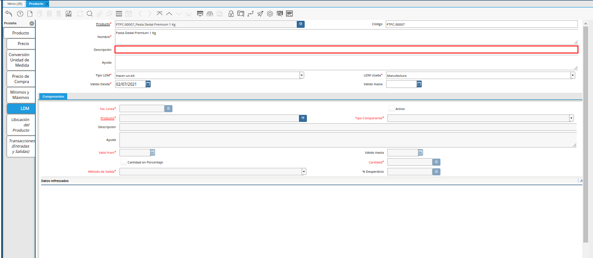
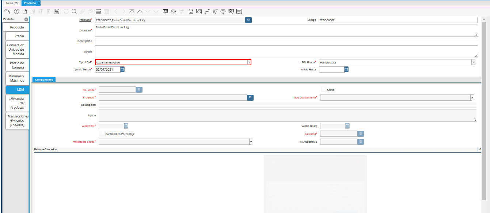

.. |Producto Estándar para Producción| image:: resources/standard-product-for-production.png
.. |Selección de la Pestaña ldm del Producto Estándar para Producción| image:: resources/selection-of-the-ldm-tab-of-the-standard-product-for-production.png

.. |Campo Nombre del Producto de la Pestaña LDM| image:: resources/ldm-tab-product-name-field.png

.. |Campo Válido Desde del Producto de la Pestaña LDM| image:: resources/valid-field-from-the-product-of-the-ldm-tab.png

.. |Campo Válido Hasta del Producto de la Pestaña LDM| image:: resources/field-valid-up-to-the-product-of-the-ldm-tab.png
.. |selección del grupo de campos componentes de la pestaña ldm| image:: resources/selection-of-the-component-field-group-of-the-ldm-tab.png
.. |icono mono-multi vista de la pestaña ldm| image:: resources/mono-multi-view-icon-of-ldm-tab.png

.. |Campo No Línea de la Pestaña ldm del Producto Estándar para Producción| image:: resources/field-not-line-of-standard-product-ldm-tab-for-production.png
.. |check activo de la pestaña ldm del Producto Estándar para Producción| image:: resources/active-check-of-the-ldm-tab-of-the-standard-product-for-production.png

.. |Campo Tipo Componente de la Pestaña ldm del Producto Estándar para Producción| image:: resources/component-type-field-of-the-standard-product-ldm-tab-for-production.png
.. |Campo Descripción de la Pestaña ldm del Producto Estándar para Producción| image:: resources/description-field-of-the-ldm-tab-of-the-standard-product-for-production.png

.. |Campo Válido Hasta de la Pestaña ldm del Producto Estándar para Producción| image:: resources/field-valid-up-to-the-ldm-tab-of-the-standard-product-for-production.png
.. |Checklist Cantidad en Porcentaje de la Pestaña ldm del Producto Estándar para Producción| image:: resources/checklist-quantity-in-percentage-of-the-ldm-tab-of-the-standard-product-for-production.png
.. |Campo Cantidad de la Pestaña ldm del Producto Estándar para Producción| image:: resources/quantity-field-of-the-ldm-tab-of-the-standard-product-for-production.png

.. |Campo Porcentaje Desperdicio de la Pestaña ldm del Producto Estándar para Producción| image:: resources/waste-percentage-field-of-the-ldm-tab-of-the-standard-product-for-production.png
.. |Pestaña Principal Producto| image:: resources/standard-product-for-production.png

.. |Ventana Verificar LDM| image:: resources/verify-ldm-window.png

.. _documento/lista-de-materiales:

**Lista de Materiales**
=======================

Para registrar en ADempiere la lista de materiales de un producto, se tiene como requerimiento principal que se encuentren previamente registrados en ADempiere el registro del producto que representa el producto terminado, los diferentes registros de productos que representan la materia prima del producto terminado. Adicional a ello, deben estar registrados los productos de  

De no conocer el procedimiento para registrar un producto, puede consultar el documento :ref:`documento/producto` y seguir al pie de la letra cada uno de los procesos descritos en dicho documento.

Ubique y seleccione en el menú de ADempiere, la carpeta "**Gestión de Materiales**", luego seleccione la carpeta "**Reglas de Gestión de Materiales**", por último seleccione la ventana "**Producto**".

    |menú de la ventana producto|

    Imagen 1. Menú de ADempiere

Podrá visualizar la ventana "**Producto**", con los diferentes registros de productos que se encuentran en ADempiere. Debe ubicar el registro del producto que representa el producto terminado, al cual requiere agregar la lista de materiales para su producción. Ejemplificando el caso de lista de materiales es utilizado el producto "**Pasta Dedal Premium 1 Kg**".

    |Producto Estándar para Producción|

    Imagen 2. Producto Estándar para Producción

Seleccione la pestaña "**LDM**", para cargar la lista de materiales de producción para el producto.

    |Selección de la Pestaña ldm del Producto Estándar para Producción|

    Imagen 3. Pestaña LDM del Producto Estándar para Producción

En esta pestaña se registran todos los materiales o ingredientes necesarios para producir o realizar el producto seleccionado, en este caso el producto "**Pasta Dedal Premium 1 Kg**". Para explicar de manera detallada el registro de la lista de materiales se presenta el siguiente ejemplo:

    La empresa "**ABC Estándar C.A**", requiere producir el día de hoy "**50 unidades**" del producto "**Pasta Dedal Premium 1 Kg**", para su producción se requiere la siguiente materia prima:

    ================================    ========    ================
    Producto                            Cantidad    Unidad de Medida
    ================================    ========    ================
    ME Poliestres                       0,00032     Kilogramo
    ME Dedal Premium 1 Kg               0,008       Kilogramo
    Cinta para Impresión de Empaque     1           Kilogramo
    PSE  Dedal Rayado Premium           1,008       Kilogramo
    ME Termoencogible Pasta Corta       0,004       Kilogramo
    ================================    ========    ================

Para crear una lista de materiales en la pestaña "**LDM**" se debe seleccionar el icono "**Registro Nuevo**" ubicado en la barra de herramientas de ADempiere y se procede al llenado de los siguientes datos, dicho registro se divide en dos partes:

El encabezado de la lista de materiales, que corresponde al registro del producto terminado, en el mismo se detalla el nombre de la lista de materiales, la descripción y el tiempo de duración el cual puede tener la lista de materiales.

    En el campo "**Producto**", se muestra el código y el nombre del producto terminado. Es decir, el producto al cual se le esta asociando la lista de materiales para poder ser producido. Continuando con el ejemplo anteriormente planteado, se tiene el producto terminado "**PTPC-00007_Pasta Dedal Premium 1 Kg**".

        .. note::

            Este campo es un campo muy importante ya que es un campo de ayuda, el mismo permite validar que aun se encuentre el registro del producto correcto para que los datos a crear o signar sean agregados al producto que se desee.
            
        |Producto Estándar para Producción|

        Imagen 4. Campo Producto

    En el campo "**Código**", se agregá el código de la lista de materiales. En tal caso de que esta no posea un código, ADempiere automáticamente coloca el código del producto al cual se le está asociando la lista de materiales. Siguiendo el escenario de la documentación, el valor a mostrar en este campo es "**PTPC-00007**".

        |Campo Código del Producto de la Pestaña LDM|

        Imagen 5. Campo Código

    En el campo "**Nombre**", se agrega el nombre de la lista de materiales a crear. ADempiere automáticamente toma el nombre del producto como valor de este campo, sin embargo este puede ser modificado para ingresar el nombre que posea la lista de materiales.

        |Campo Nombre del Producto de la Pestaña LDM|

        Imagen 6. Campo Nombre del Producto

    En el campo "**Descripción**", se puede agregar una descripción de la lista de materiales que se esta creando, este es un campo opcional y queda a criterio de cada usuario si desea agregar información, de lo contrario puede se puede obviar.

        |Campo Descripción del Producto de la Pestaña LDM|

        Imagen 7. Campo Descripción

    En el campo "**Ayuda**", se puede agregar una descripción más detallada de la lista de materiales que se está creando, este es un campo opcional y queda a criterio de cada usuario si desea agregar información, de lo contrario puede se puede obviar.

        |Campo Ayuda del Producto de la Pestaña LDM|

        Imagen 8. Campo Ayuda 

    En el campo "**Tipo LDM**", se debe indicar el tipo de lista de materiales que se esta creando. Continuando con el ejemplo expuesto anteriormente, la opción a seleccionar en este campo es "**Actualmente Activo**", para indicar que el tipo de lista de materiales es una lista que se encuentra activa.

        |Campo Tipo LDM del Producto de la Pestaña LDM|

        Imagen 9. Campo Tipo LDM

    Seleccione en el campo "**Válio Desde**", la fecha desde la cual es válida la lista de materiales que está realizando

        |Campo Válido Desde del Producto de la Pestaña LDM|

        Imagen 10. Campo Válido Desde

    Seleccione en el campo "**LDM Usada**", la lista de materiales utilizada para el registro que está realizando. Siguiendo el escenario planteado en esta documentación, se seleccionara "**Manufactura**".

        |Campo LDM Usada del Producto de la Pestaña LDM|

        Imagen 11. Campo LDM Usada

    Seleccione en el campo "**Válido Hasta**", la fecha hasta la cual es válida la lista de materiales. Este campo no es obligatorio, así que si la lista de materiales no posee una fecha el cual indique hasta donde será válida se puede dejar en blanco

        |Campo Válido Hasta del Producto de la Pestaña LDM| 

        Imagen 12. Campo Válido Hasta

    Hasta este punto se agrega toda la información necesaria y útil para el encabezado de la lista de materiales, estos datos deben ser guardados seleccionando el icono "**Guardar Cambios**" ubicado en la barra herramientas de ADempiere

    .. note::

        Si los datos del encabezado de la lista de materiales no son guardados, no se podrán guardar los datos del detalle de la lista de materiales que en este caso sería el detalle de los componentes o ingredientes.

El detalle de la lista de materiales, que corresponde a los registros de la materia prima que se requiere para la producción del producto terminado, en el mismo se asocian los componentes que integrarán la lista de materiales teniendo en cuenta que dichos ingredientes ya deben estar registrados en ADempiere.

    Seleccione el grupo de campo "**Componentes**", el cual se encuentra como un recuadro o una subventana dentro de la pestaña "**LDM**".

        |selección del grupo de campos componentes de la pestaña ldm|

        Imagen 13. Selección del Grupo de Componentes

    Al seleccionar el recuadro "**Componentes**", la vista del grupo de campo puede estar en modo "**Multi Registros**". Para cambiar la vista a modo "**Mono Registro**", se debe seleccionar el icono "**Cambiar Mono/Multi Registro**".

        |icono mono-multi vista de la pestaña ldm|

        Imagen 14. Icono Mono/Multi Registro

    Una vez cambiada la vista a modo "**Mono Registro**", seleccione el icono "**Registro Nuevo**" ubicado en la barra de herramientas de ADempiere para poder asociar al primer componente de la "**LDM**".

        |Icono Registro Nuevo de la Pestaña ldm del Producto Estándar para Producción|

        Imagen 15. Icono Registro Nuevo

        .. note::

            Al seleccionar el icono "**Registro Nuevo**", se procede a asociar los datos del componente o ingrediente

    El campo "**No. Línea**", indica el número de línea correspondiente al registro que está realizando en este caso como es el primer registro, el número registro a observar es el "**10**" ya que ADempiere trabaja la enumeración de registro de 10 en 10.

        |Campo No Línea de la Pestaña ldm del Producto Estándar para Producción|

        Imagen 16. Campo No. Línea

    El check "**Activo**", indica si el registro a realizar o componente estará activo en la lista de materiales.

        |check activo de la pestaña ldm del Producto Estándar para Producción|

        Imagen 17. Check Activo

    Seleccione en el campo "**Producto**", el material o componente necesario para la producción del producto. Siguiendo el escenario de esta documentación se selecciona el componente "**ME Poliestres**".

        .. note::

            Para que el componente pueda ser agregado en ese campo debe existir el registro del mismo en la ventana "**Producto**". 

        |Campo Producto de la Pestaña ldm del Producto Estándar para Producción|

        Imagen 18. Campo Producto

    Seleccione en el campo "**Tipo Componente**", el tipo de componente que va representar dicho componente en la lista de materiales. Continuando con el ejemplo, el tipo de componente seleccionado es "**Componente**".

        |Campo Tipo Componente de la Pestaña ldm del Producto Estándar para Producción|

        Imagen 19. Campo Tipo de Componente

    Introduzca en el campo "**Descripción**", una breve descripción del producto que esta registrando si el componente posee alguna descripción o información el cual sea necesaria agregar, de lo contrario se puede dejar en blanco ya que este campo no es obligatorio.

        |Campo Descripción de la Pestaña ldm del Producto Estándar para Producción|

        Imagen 22. Campo Descripción

    Si el componente a agregar posee alguna información relevante el cual sea necesaria agregar, esta se puede agregar a traves del campo "**Ayuda**", de lo contrario se puede dejar en blanco ya que este campo no es obligatorio

        |Campo ayuda de la Pestaña ldm del Producto Estándar para Producción|

        Imagen 23. Campo Ayuda

    Seleccione en el campo "**Válido Desde**", la fecha desde la cual es válido el componente.

        |Campo Válido Desde de la Pestaña ldm del Producto Estándar para Producción|

        Imagen 24. Campo Válido Desde

    Seleccione en el campo "**Válido Hasta**", la fecha hasta la cual es válido el componente. Si el componente no posee una fecha tope, este campo puede quedar en blanco, indicado así que siempre va hacer válido el componente.

        |Campo Válido Hasta de la Pestaña ldm del Producto Estándar para Producción|

        Imagen 25. Campo Válido Hasta

    El check "**Cantidad en Porcentaje**", indica que la cantidad a necesitar de este componente será utilizada en porcentaje. Al tildar este check ADempiere mostrará automáticamente otro campo con el nombre de "**Cantidad en %**", donde se agregará la cantidad en porcentaje.

        |Checklist Cantidad en Porcentaje de la Pestaña ldm del Producto Estándar para Producción|

        Imagen 26. Check Cantidad en Porcentaje

    Introduzca en el campo "**Cantidad**", la cantidad a utilizar del producto correspondiente al registro que esta realizando. Continuando con el ejemplo, se tiene que para producir una unidad del producto "**Pasta Dedal Premium 1 Kg**", se requiere "**0,00032 KG**" del componente "**ME Poliestres**". Es decir, que la cantidad a colocar en el campo es "**0,00032**"

        |Campo Cantidad de la Pestaña ldm del Producto Estándar para Producción|

        Imagen 27. Campo Cantidad

    Seleccione en el campo "**Método de Salida**", el método de salida que indica cómo será la salida del componente al momento realizar la producción del producto terminado.

        |Campo Método de Salida de la Pestaña ldm del Producto Estándar para Producción|

        Imagen 28. Campo Método de Salida

    Introduzca en el campo "**% Desperdicio**", el porcentaje de desperdicio que se obtendrá de este componente al momento de hacer la producción, este campo no es un dato obligatorio así que de no poseer el porcentaje de desperdicio este campo se puede obviar.

        |Campo Porcentaje Desperdicio de la Pestaña ldm del Producto Estándar para Producción|

        Imagen 29. Campo Porcentaje Desperdicio

    Una vez agregada la información y el detalle de este primer componente se procede a guardar el registro seleccionando el icono "**Guardar Cambios**" ubicado en la barra de herramientas de ADempiere.

    .. note::

        Si es necesario cargar otro material o componente para la producción del producto, repita las veces que sea necesario el procedimiento para agregar componentes "**Detalle de Lista de Materiales**".

Al crear todo el detalle de lista de materiales esta debe validarse. Para ello, se debe posicionar en la pestaña principal "**Producto**". Teniendo en cuenta que aún debe estar ubicado en el registro del producto "**PTPC-00007_Pasta Dedal Premium 1 Kg**".

    |Pestaña Principal Producto|

    Imagen 30. Pestaña Principal Producto 

Seleccione la opción "**Verificar LDM**", ubicada en el menú desplegado al seleccionar el icono "**Proceso**", ubicado en la barra de herramientas de ADempiere.

    |Opción Verificar ldm|

    Imagen 31. Opción Verificar LDM

Podrá visualizar la siguiente ventana de confirmación para la verificación de la lista de materiales del producto, donde debe seleccionar la opción "**OK**" para verificar la misma.

    |Ventana Verificar LDM|

    Imagen 32. Ventana de Confirmación para Verificar LDM