.. _ERPyA: http://erpya.com

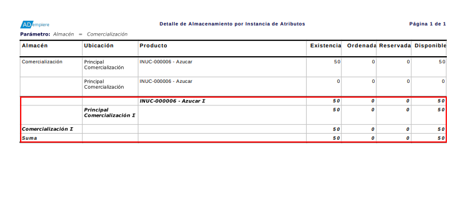
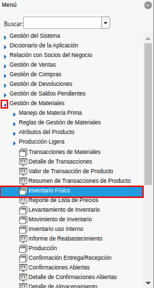
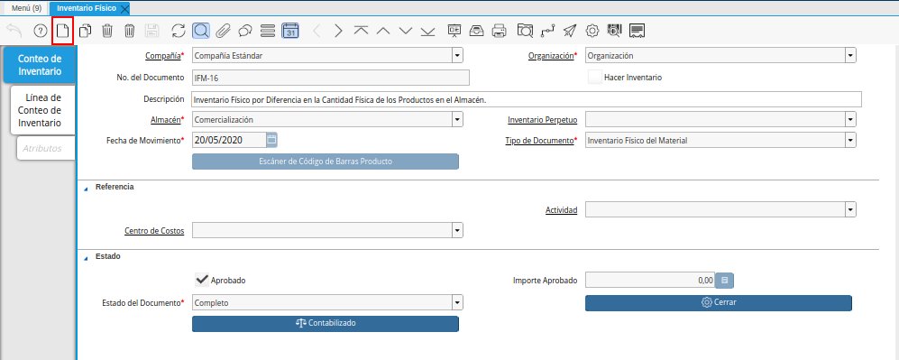
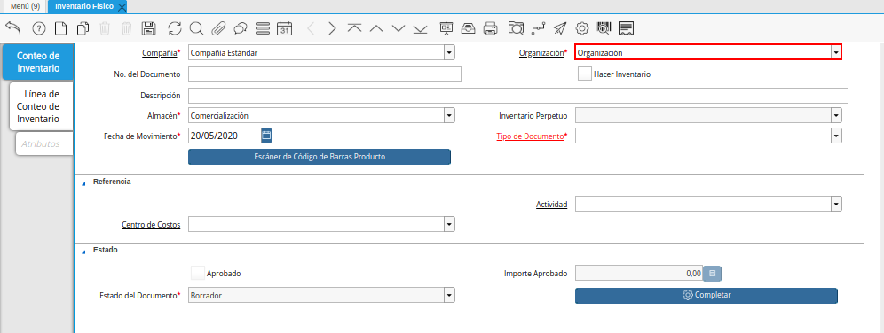
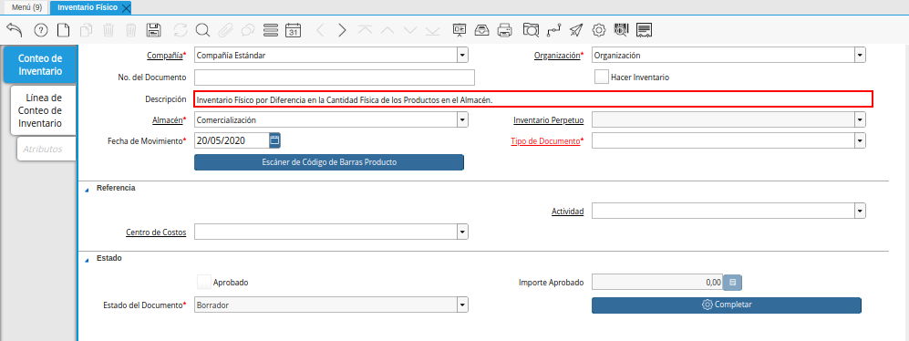
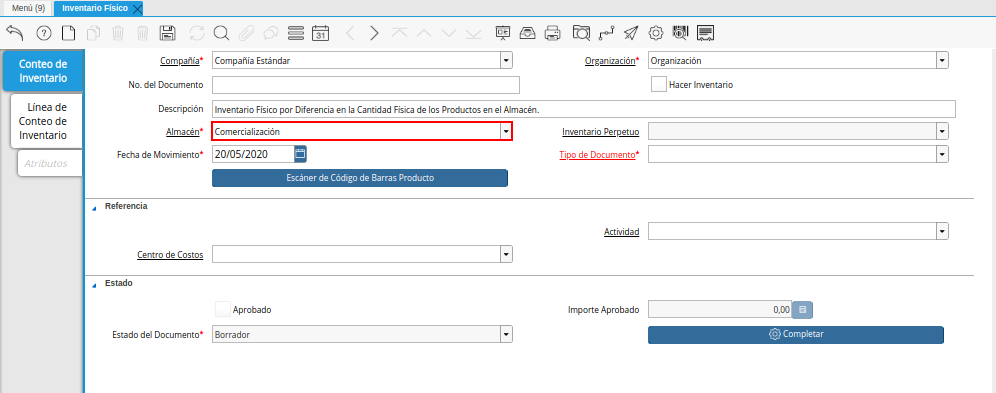
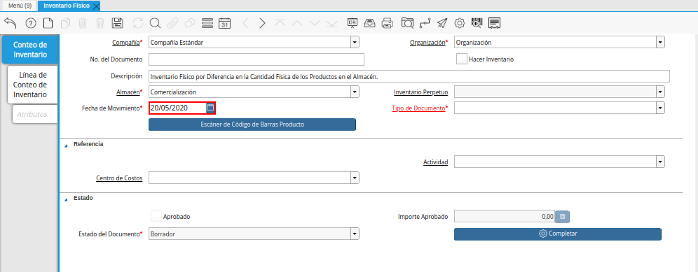
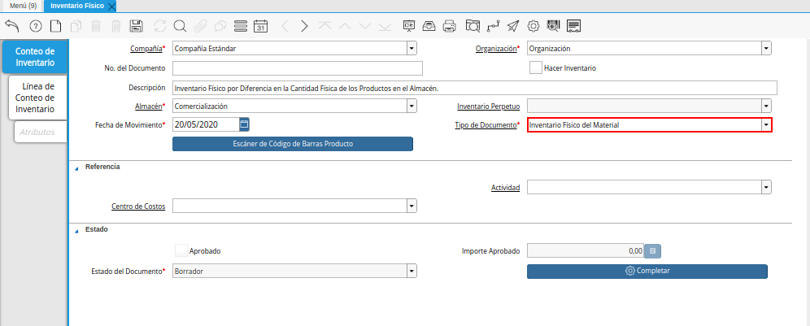
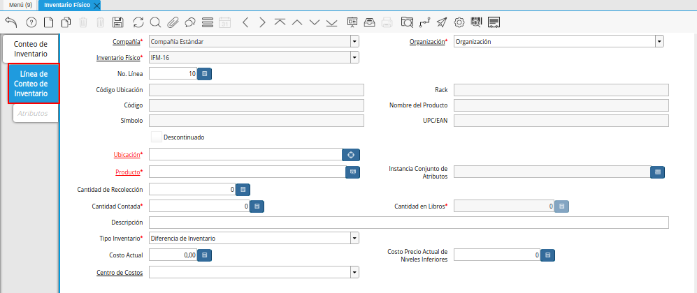
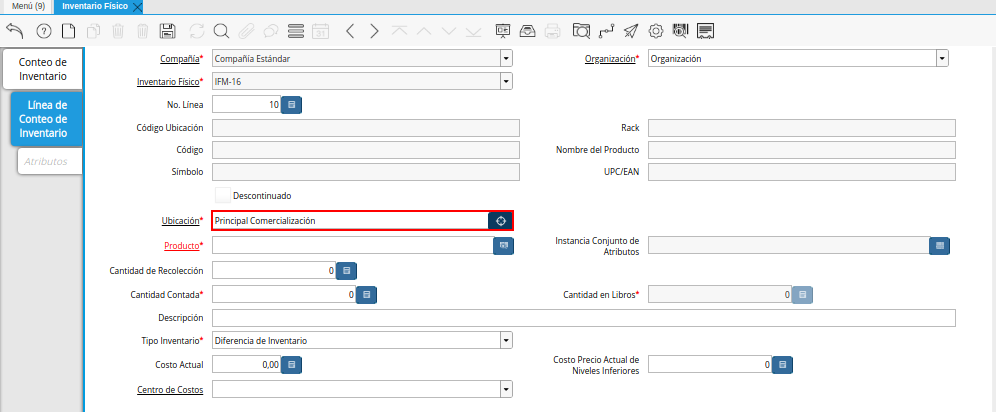

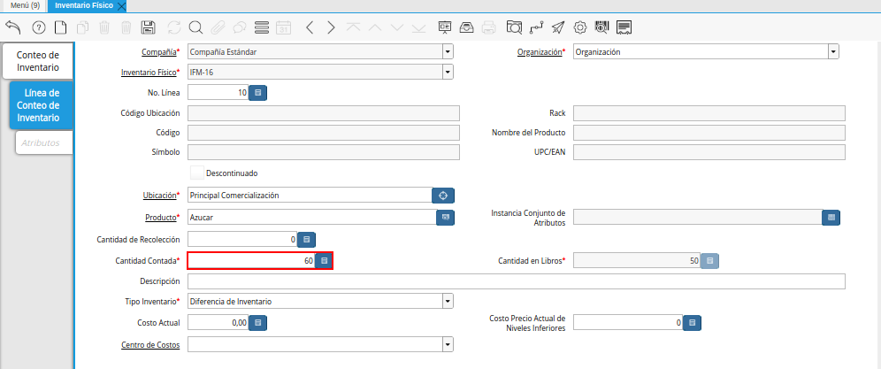
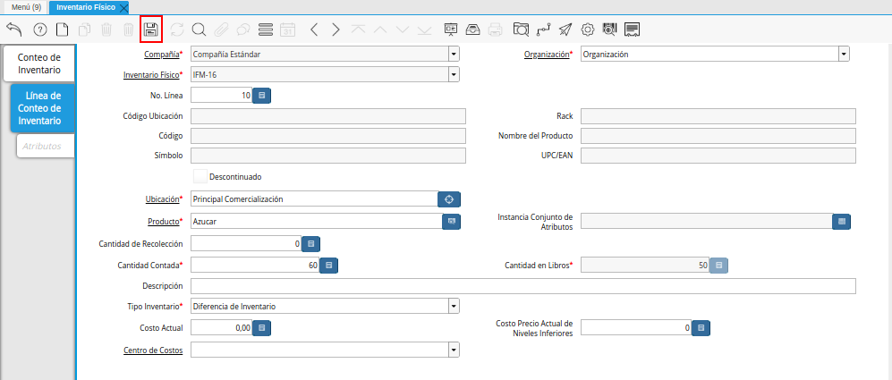
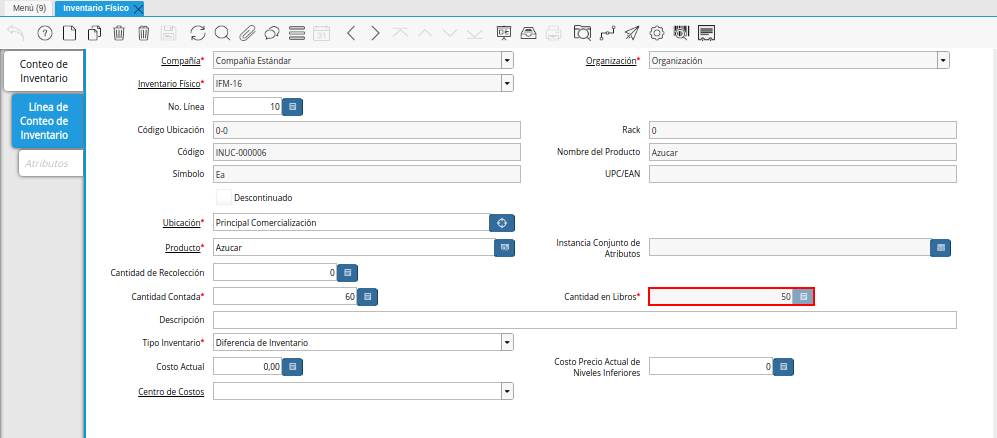
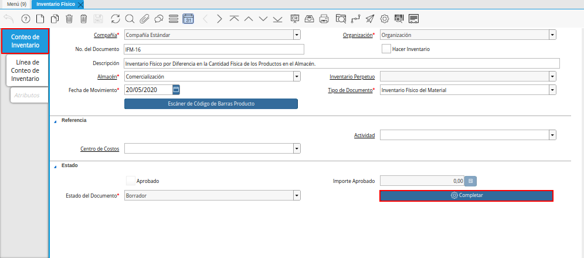
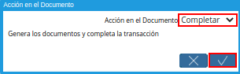
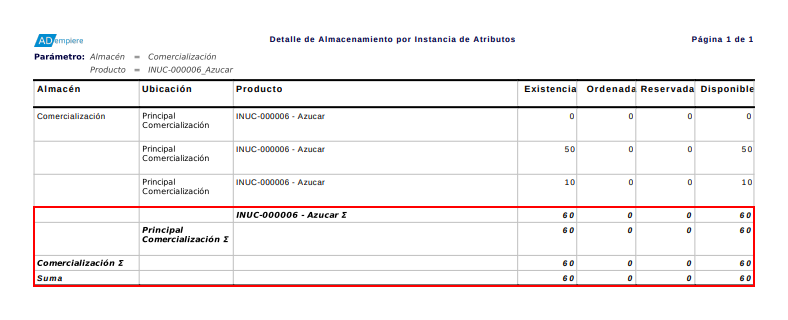

.. _documento/inventario-físico:

**Registro de Inventario Físico**
=================================

Para visualizar completamente el procedimiento del inventario físico, es generado el reporte "**Detalle de Almacenamiento**" seleccionando la ubicación donde será realizado el inventario físico y el producto por el cual es realizado dicho inventario. Ejemplificando el caso, el reporte puede ser visualizado de la siguiente manera.

    |Primer Reporte de Detalle de Almacenamiento|

    Imagen 1. Primer Reporte de Detalle de Almacenamiento

- Ubique y seleccione en el menú de ADempiere, la carpeta "**Gestión de Materiales**", luego seleccione la ventana "**Inventario Físico**".

    |Menú de ADempiere|

    Imagen 2. Menú de ADempiere

- Podrá visualizar la ventana "**Inventario Físico**", donde debe seleccionar el icono "**Registro Nuevo**" para crear un nuevo registro de inventario físico.

    |Ventana Inventario Físico y Icono Registro Nuevo|

    Imagen 3. Ventana Inventario Físico y Icono Registro Nuevo

- Seleccione en el campo "**Organización**", la organización para la cual esta realizando el documento de inventario físico.

    |Campo Organización|

    Imagen 4. Campo Organización

- Introduzca en el campo "**Descripción**", una breve descripción referente al documento de inventario físico que esta realizando en la organización seleccionada.

    |Campo Descripción|

    Imagen 5. Campo Descripción|

- Seleccione en el campo "**Almacén**", el lugar donde es almacenado el producto por el cual se esta realizando el inventario físico.

    |Campo Almacén|

    Imagen 6. Campo Almacén

- Introduzca en el campo "**Fecha del Movimiento**", la fecha en la cual es realizado en el almacén el conteo real del producto por el cual se esta realizando el inventario físico.

    |Campo Fecha de Movimiento|

    Imagen 7. Campo Fecha de Movimiento

- Seleccione el tipo de documento a generar en el campo "**Tipo de Documento**", la selección de este define el comportamiento del documento que se esta elaborando, dicho comportamiento se encuentra explicado en el documento **Tipo de Documento** elaborado por `ERPyA`_. 

    |Campo Tipo de Documento|

    Imagen 8. Campo Tipo de Documento

    .. note::

        Recuerde guardar el registro de los campos de la pestaña seleccionando el icono "**Guardar Registros**" ubicado en la barra de herramientas de ADempiere.

- Seleccione la pestaña "**Línea de Conteo de Inventario**" y proceda al llenado de los campos correspondientes.

    |Pestaña Línea de Conteo de Inventario|

    Imagen 9. Pestaña Línea de Conteo de Inventario

- Seleccione en el campo "**Ubicación**", la ubicación exacta donde se encuentra localizado el producto dentro del almacén seleccionado. El mismo se puede seleccionar con ayuda del identificador ubicado del lado derecho del campo.

    |Campo Ubicación|

    Imagen 10. Campo Ubicación

- Seleccione en el campo "**Producto**", el producto por el cual se esta realizando el inventario físico.

    |Campo Producto|

    Imagen 11. Campo Producto

- Introduzca en el campo "**Cantidad Contada**", la cantidad real en existencia del producto seleccionado.

    |Campo Cantidad Contada|

    Imagen 12. Campo Cantidad Contada

    .. note::

        Debe ser ingresada la cantidad real que existe físicamente en el almacén seleccionado.

- Seleccione el icono "**Guardar Cambios**", ubicado en la barra de herramientas de ADempiere, para guardar el registro de los campos de la pestaña.

    |Icono Guardar Cambios|

    Imagen 13. Icono Guardar Cambios

- Podrá visualizar que es cargada automáticamente la cantidad de productos en existencia que se encuentran registrados en ADempiere.

    |Campo Cantidad en Libros|

    Imagen 14. Campo Cantidad en Libros

- Seleccione la pestaña principal "**Conteo de Inventario**" y luego la opción "**Completar**", ubicada en la parte inferior derecha de la ventana.

    |Pestaña Conteo de Inventario|

    Imagen 15. Pestaña Conteo de Inventario

- Seleccione la acción "**Completar**" y la opción "**OK**", para completar el documento "**Inventario Físico**" que esta realizando.

    |Acción Completar y Opción OK|

    Imagen 16. Acción Completar y Opción OK

**Consultar Detalle de Almacenamiento**
=======================================

- Al generar el reporte "**Detalle de Almacenamiento**" seleccionando la ubicación donde fue realizado el inventario físico y el producto por el cual fue realizado dicho inventario, se puede visualizar el reporte de la siguiente manera.

    |Segundo Reporte de Detalle de Almacenamiento|

    Imagen 17. Segundo Reporte de Detalle de Almacenamiento
