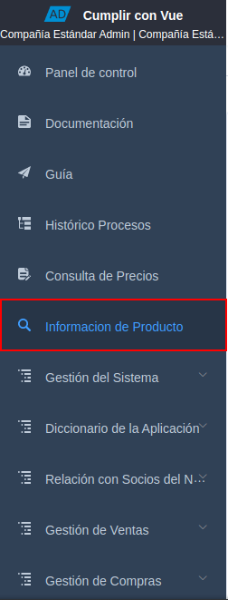
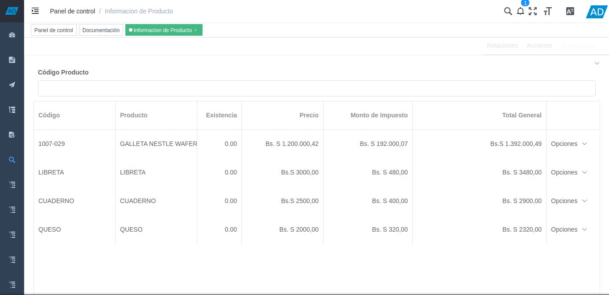
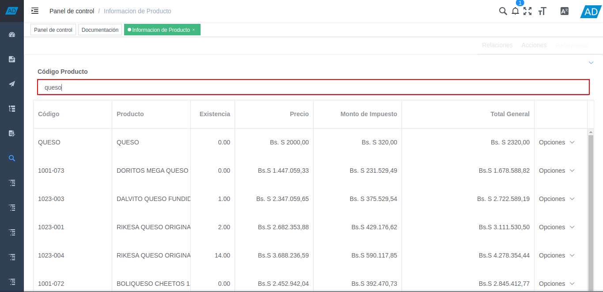
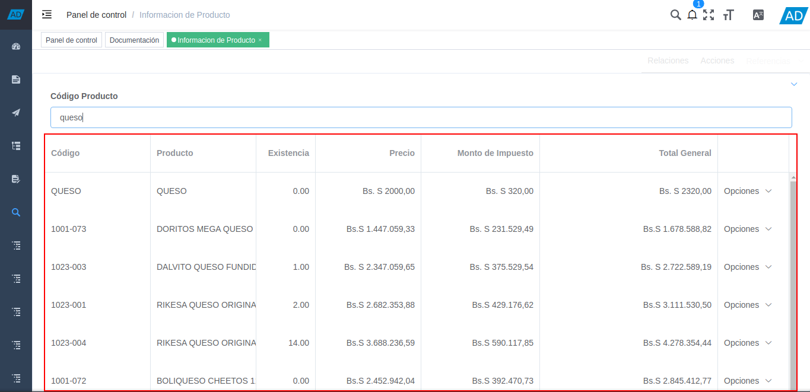

.. _documento/consulta-de-productos:

**Información de Productos**
============================

ADempiere permite realizar una búsqueda avanzada de productos a través del código o nombre del mismo, en la ventana de consulta "**Información de Productos**". Para ello, fue realizada la creación y configuración del usuario "**consulta**", con la finalidad de que el mismo pueda realizar una consulta detallada de los productos con sus respectivos precios y cantidades en existencia.

El presente material elaborado por `ERPyA`_, pretende ofrecerle una explicación eficiente a nuestros clientes del procedimiento a seguir para consultar la información de los productos registrados en ADempiere.

#. Ubique en el menú de ADempiere, la ventana de consulta "**Información de Productos**".

    |menú de información de productos|

    Imagen 1. Menú de ADempiere

#. Podrá visualizar la ventana de consulta de productos que permite realizar una búsqueda rápida de todos los productos para la venta registrados en ADempiere, que tengan coincidencia con lo que se introduzca en el campo o filtro de búsqueda "**Código Producto**". 

    |ventana de información de productos|

    Imagen 2. Ventana de Información de Productos

#. Introduzca en el campo "**Código Producto**", el código o nombre del producto que requiere buscar.

    |campo código producto|

    Imagen 3. Campo Código Producto

#. La información resultante de la búsqueda puede visualizarla en la tabla que se ubica debajo del campo "**Código Producto**". Dicha tabla contempla las siguientes columnas:

    - **Código:** Indica el código del producto.
    - **Producto:** Indica el nombre del producto.
    - **Existencia:** Indica la cantidad de existencia del producto en inventario.
    - **Precio:** Precio del producto, sin impuestos.
    - **Monto de Impuesto:** Monto del impuesto en base al precio del producto.
    - **Total General:** Monto total del producto, con impuesto.

    |resultado de búsqueda|

    Imagen 4. Resultado de Búsqueda 
